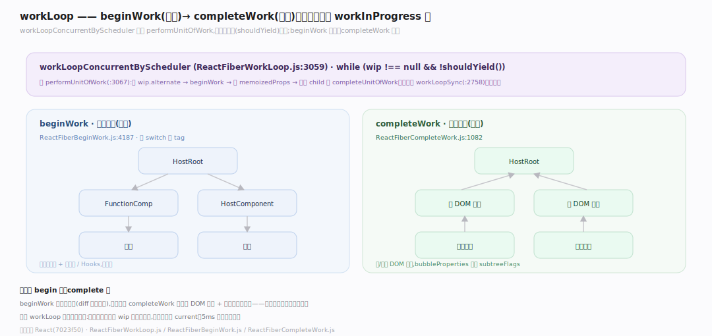
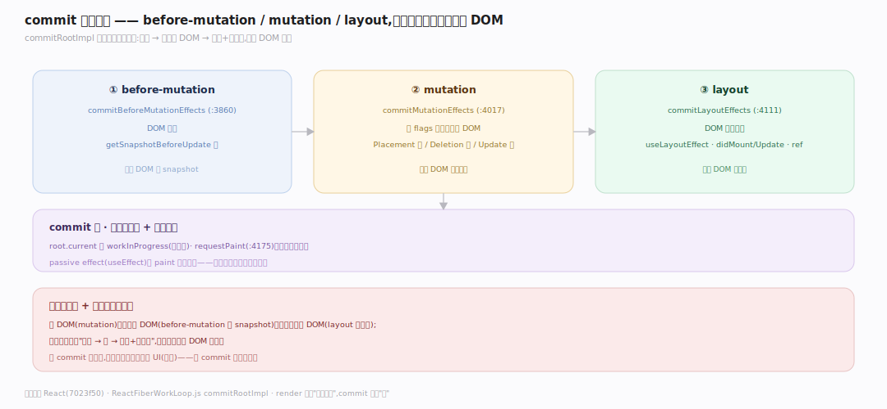
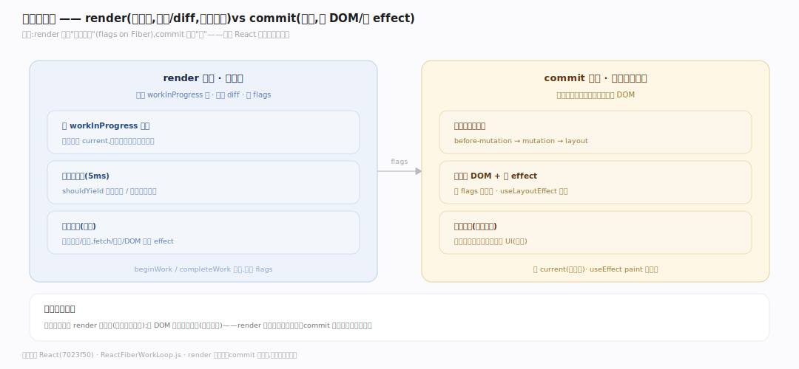

# React 原理 · 支撑主线 · render 与提交

> **定位**：属"渲染能力域"。管两大阶段:render(可中断:beginWork/completeWork 构建 workInProgress)、commit(不可中断:三相改 DOM)。是把 Fiber 树变成屏幕的执行主干。依赖【协调与 Diff】、【Fiber 架构】。源码基准 **React(7023f50)**(`ReactFiberWorkLoop.js`)。

React 更新分两阶段:**render**(可中断)——遍历 Fiber 树、协调 diff、构建 workInProgress、标 flags;可被高优先级打断重来(此时不碰 DOM)。**commit**(不可中断)——把 render 算好的变更三相同步提交到真实 DOM。理解 workLoop + beginWork/completeWork + commit 三相,就懂了 React 渲染主干。

---

## 一、render 阶段:workLoop + beginWork/completeWork

- **workLoop**:`workLoopConcurrentByScheduler`(`ReactFiberWorkLoop.js:3059`)`while (wip !== null && !shouldYield())` 调 performUnitOfWork——可被时间片打断(shouldYield)。同步版 `workLoopSync`(:2758)不让出。
- **performUnitOfWork**(:3067):读 `current = wip.alternate`、`beginWork(current, wip, lanes)`、设 memoizedProps、下探 child 或 completeUnitOfWork。
- **beginWork**(`ReactFiberBeginWork.js:4187`)大 switch 按 tag:updateFunctionComponent/ClassComponent/HostComponent/HostRoot/SuspenseComponent——**自顶向下**协调子节点、跑组件/Hooks。
- **completeWork**(`ReactFiberCompleteWork.js:1082`)**自底向上**:HostComponent 建/更新 DOM 实例,`bubbleProperties` 上冒 subtreeFlags/lanes。

**为什么 begin 下 complete 上**:beginWork 下探展开树(diff 出子节点),到叶子后 completeWork 上溯建 DOM 实例 + 冒泡副作用标记——一下一上遍历完整棵树,可在 workLoop 里按单元中断。

---

## 二、commit 三相

render 完得 workInProgress 树,commit **三相有序**(`commitRootImpl`)同步执行:

1. **before-mutation**:`commitBeforeMutationEffects`(`:3860`)——DOM 改前(getSnapshotBeforeUpdate 等)。
2. **mutation**:`commitMutationEffects`(`:4017`)——按 flags 增删改**真实 DOM**(Placement 插入/Deletion 删/Update 改属性);此后 DOM 已是新的。
3. **layout**:`commitLayoutEffects`(`:4111`)——DOM 改后同步(useLayoutEffect、componentDidMount/Update、ref 赋值)。

commit 后 root.current 切 workInProgress(双缓冲),`requestPaint`(:4175)让浏览器绘制。passive effect(useEffect)paint 后异步跑。

**为什么三相**:改 DOM(mutation)前要读旧 DOM(before-mutation 的 snapshot)、改后要读新 DOM(layout 的测量);三相顺序保证"读旧→改→读新+副作用"——且全同步(不可中断)确保 DOM 一致。

---

## 三、两阶段分工:可中断 vs 不可中断

- **render 可中断**:在 workInProgress 上做(不碰屏上 current),被高优先级打断则丢弃重来、不影响显示;时间片(5ms)让出给浏览器/高优更新。
- **commit 不可中断**:一次性同步提交到真实 DOM——若可中断,用户会看到半更新的 UI(撕裂);故 commit 必须原子。
- 分界:render 输出"要改什么"(flags on Fiber),commit 执行"改"。

**为什么这么分**:并发渲染要求 render 可打断(响应高优输入);但 DOM 提交必须原子(不能半途)——render 慢工出细活可中断、commit 快刀斩乱麻不可断。这是 React 并发的核心权衡。

---

## 拓展 · render 与提交关键结构一览

| 结构 | 定义 | 职责 |
|---|---|---|
| workLoopConcurrentByScheduler | `ReactFiberWorkLoop.js:3059` | 可中断 workLoop |
| performUnitOfWork | `ReactFiberWorkLoop.js:3067` | 单元:beginWork + 下探/上溯 |
| beginWork | `ReactFiberBeginWork.js:4187` | 自顶向下协调(按 tag) |
| completeWork | `ReactFiberCompleteWork.js:1082` | 自底向上建 DOM + 冒泡 flags |
| commitMutationEffects | `ReactFiberWorkLoop.js:4017` | mutation 相改真实 DOM |

## 调优要点（理解要点）

- **render 纯**:组件 render 应纯(无副作用)——render 可能被中断/重跑,有副作用会重复执行。
- **副作用放 effect**:DOM 操作/订阅放 useEffect(commit 后)/useLayoutEffect,不放 render 体。
- **重渲染范围**:memo/useMemo 缩 beginWork 范围;大树用 startTransition 让可中断。
- **layout effect 慎用**:useLayoutEffect 同步阻塞 paint;仅 DOM 测量必需时用,否则 useEffect。

## 常见误区与工程要点

- **误区:render 就是渲染到屏幕。** render 阶段只构建 Fiber 树 + 标 flags(不碰 DOM);commit 阶段才改 DOM;两阶段。
- **误区:render 不可中断。** 并发下 render 可被高优打断重来(在 wip 上做不影响 current);commit 才不可中断。
- **误区:组件 render 可有副作用。** render 可能中断/重跑;副作用(fetch/订阅/DOM 改)放 effect,render 保纯。
- **误区:useEffect 在 commit 同步跑。** useEffect(passive)paint 后异步;useLayoutEffect(layout 相)commit 中同步。
- **归属提醒**:render 遍历的树在【Fiber 架构】;协调 diff 在【协调与 Diff】;可中断靠【Lanes 与调度】的 shouldYield;Hooks 求值在 beginWork(【Hooks】)。

## 一句话总纲

**React 更新分两阶段:render(可中断)——workLoopConcurrentByScheduler 循环 performUnitOfWork(beginWork 自顶向下按 tag 协调+跑 Hooks、completeWork 自底向上建 DOM 实例+冒泡 flags),在 workInProgress 上做、被高优打断可丢弃重来、5ms 时间片让出;commit(不可中断)——三相有序(before-mutation 读旧→mutation 按 flags 改真实 DOM→layout 读新+useLayoutEffect),后切 current(双缓冲)+requestPaint,useEffect paint 后异步;render 慢可断、commit 快原子是并发核心权衡。**
