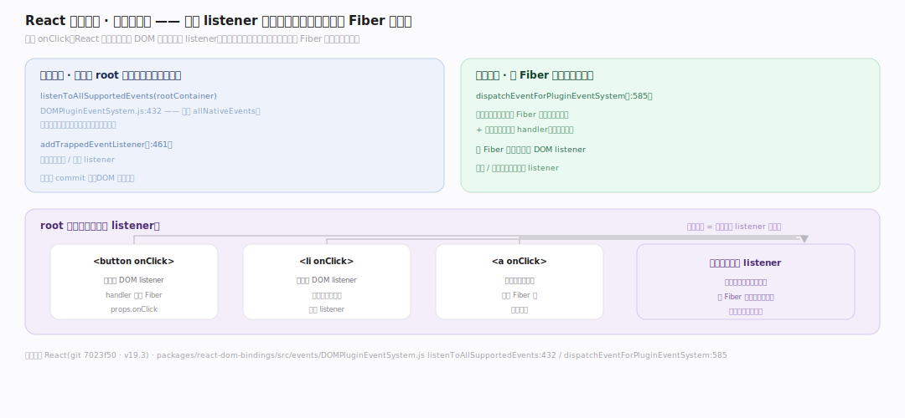
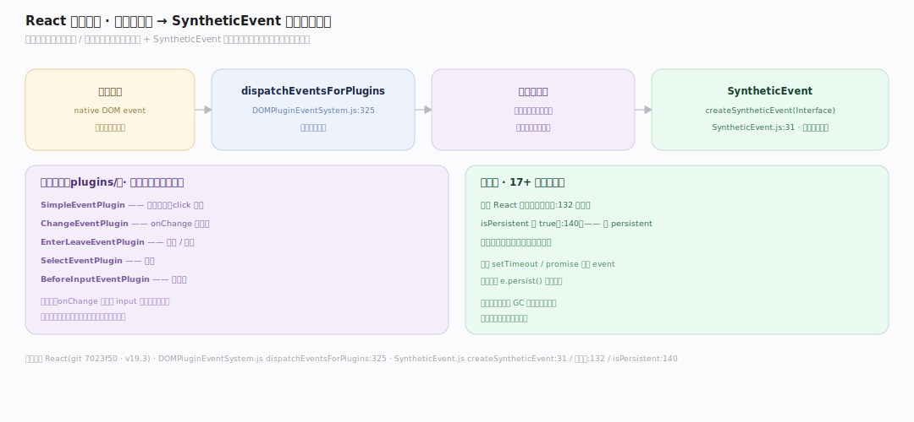
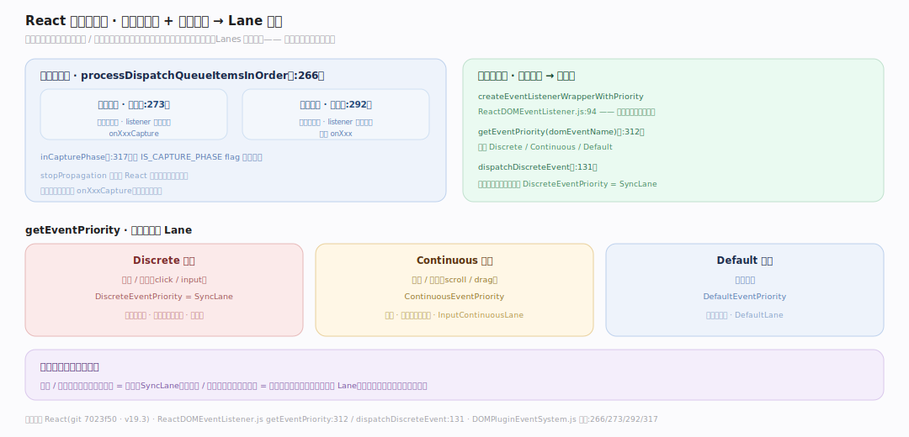

# React 原理 · 支撑主线 · 事件系统

> **定位**：属"接触面支撑能力域"——React 的合成事件层。管 DOM 事件:事件委托到根容器、插件模型归一化、合成事件(SyntheticEvent)跨浏览器一致、事件优先级映射到 Lane。是用户交互进入 React 的入口。事件优先级喂给【Lanes 与调度】。源码基准 **React(git 7023f50)**(`packages/react-dom-bindings/src/events/`)。

你写 `onClick`,React 并没有在那个 DOM 节点上真的绑 listener——而是把所有事件**委托到根容器**,一个 listener 处理所有同类事件,再按 Fiber 树派发。合成事件(SyntheticEvent)抹平浏览器差异。事件还按类型定优先级(点击=离散最急)映射到 Lane。理解"委托到根 + 插件归一 + 合成事件 + 优先级映射",就懂了 React 怎么处理交互。

---

## 一、事件委托:绑到根容器

React 把事件**委托到 root 容器**(不是每个节点):

- `listenToAllSupportedEvents(rootContainer)`(`DOMPluginEventSystem.js:432`):遍历 `allNativeEvents`,在根容器上一次性绑所有支持的原生事件。
- `addTrappedEventListener`(:461):实际添加捕获/冒泡 listener。
- 事件在根触发时 `dispatchEventForPluginEventSystem`(:585)按 Fiber 树找到目标 + 路径上的所有 handler。

**为什么委托到根**:页面可能有上万个 `onClick`,若每个都绑真实 listener 耗内存/耗时;委托到根后,一类事件只一个原生 listener,新增/删除节点无需增删 listener——React 靠 Fiber 树重建事件传播路径,更省更灵活。

---

## 二、插件模型 + 合成事件

事件经**插件**归一化成**合成事件**:

- `dispatchEventsForPlugins`(`DOMPluginEventSystem.js:325`):派发给各插件。
- **插件**:SimpleEventPlugin(常规)、ChangeEventPlugin(onChange 归一)、EnterLeaveEventPlugin、SelectEventPlugin、BeforeInputEventPlugin…每个把原生事件转成对应合成事件。
- **SyntheticEvent**:`createSyntheticEvent(Interface)`(`SyntheticEvent.js:31`)——包装原生事件,跨浏览器一致的接口(stopPropagation/preventDefault)。
- **无池化**:现代 React 移除了事件池(:132 注释),`isPersistent` 恒 true(:140)——事件对象可异步访问,不再复用。

**为什么合成事件**:各浏览器原生事件字段/行为有差异(onChange 在不同 input 触发时机不同);插件归一化 + SyntheticEvent 统一接口,你写一套代码跨浏览器一致;React 17+ 去掉事件池(原来复用对象省 GC,但要求同步读)让心智更简单。

---

## 三、捕获/冒泡 + 优先级映射

事件按相位传播,并映射优先级:

- **两相位**:`processDispatchQueueItemsInOrder`(:266)——捕获阶段**逆序**遍历 listener(:273)、冒泡阶段**正序**(:292);`inCapturePhase`(:317)由 `IS_CAPTURE_PHASE` flag 判。
- **优先级映射**:`createEventListenerWrapperWithPriority`(`ReactDOMEventListener.js:94`)按事件类型定优先级;`getEventPriority(domEventName)`(:312)返回 Discrete/Continuous/Default。
- `dispatchDiscreteEvent`(:131)对离散事件(点击)设 `DiscreteEventPriority`(=SyncLane)——所以点击是最高优先级更新。

**为什么按类型定优先级**:点击/输入(离散)用户要立即反馈=最高优先级(SyncLane);滚动/拖拽(连续)频繁触发=次高(可稍缓);事件类型映射到 Lane,把交互紧急度接进【Lanes 与调度】——这是"交互驱动优先级"的入口。

---

## 拓展 · 事件系统关键一览

| 项 | 定义 | 职责 |
|---|---|---|
| listenToAllSupportedEvents | `DOMPluginEventSystem.js:432` | 委托绑根容器 |
| dispatchEventForPluginEventSystem | `:585` | 按 Fiber 树派发 |
| SimpleEventPlugin 等 | `plugins/` | 归一化插件 |
| SyntheticEvent | `SyntheticEvent.js:31` | 跨浏览器合成事件 |
| getEventPriority | `ReactDOMEventListener.js:312` | 事件→优先级 |

## 调优要点（理解要点）

- **委托无需手动解绑**:节点增删不影响事件(委托在根);别在组件里手动 addEventListener 除非必要。
- **合成事件可异步读**:无池化(17+),可在 setTimeout/promise 里读 event;老代码的 `e.persist()` 不再需要。
- **捕获相 onClickCapture**:需捕获阶段处理用 `onXxxCapture`;默认冒泡阶段。
- **离散事件同步刷**:点击等离散事件走 SyncLane 同步渲染,保即时反馈。

## 常见误区与工程要点

- **误区:onClick 绑在该 DOM 节点。** 委托到 root 容器一个 listener;按 Fiber 树重建传播路径。
- **误区:合成事件要 e.persist() 才能异步读。** 现代 React 无事件池,恒 persistent,可直接异步访问。
- **误区:所有事件同优先级。** 按类型分离散(SyncLane)/连续/默认;映射到 Lane。
- **误区:React 事件=原生事件。** 是 SyntheticEvent(插件归一化的包装);stopPropagation 停的是 React 传播,与原生略有别。
- **归属提醒**:事件优先级喂给【Lanes 与调度】的 lane;离散事件同步渲染在【render 与提交】;事件触发的 setState 入队在【Hooks】;绑定发生在【render 与提交】的 commit 后(DOM 已挂载)。

## 一句话总纲

**React 事件系统:委托到 root 容器(listenToAllSupportedEvents:432 一次性绑所有原生事件,dispatchEventForPluginEventSystem:585 按 Fiber 树重建传播路径,新增删节点无需增删 listener 省内存)；插件模型(SimpleEventPlugin/ChangeEventPlugin 等归一化)转成 SyntheticEvent(:31 跨浏览器一致接口,17+ 移除事件池恒 persistent 可异步读)；两相位传播(捕获逆序:273/冒泡正序:292)；事件按类型定优先级(getEventPriority:312→Discrete/Continuous/Default,离散事件 dispatchDiscreteEvent:131 设 DiscreteEventPriority=SyncLane)映射到 Lane——把交互紧急度接进优先级调度。**
