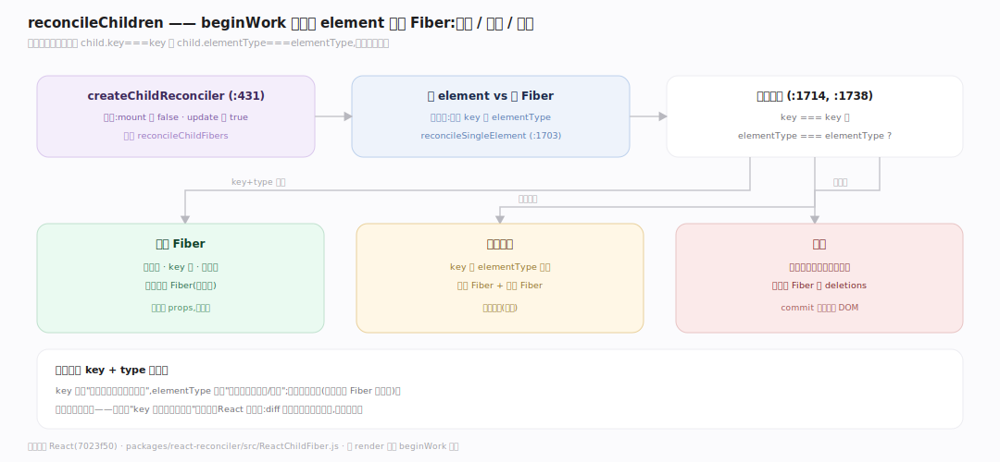
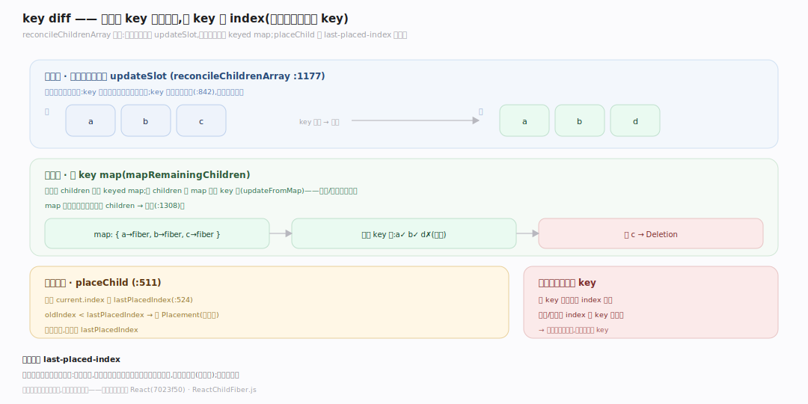
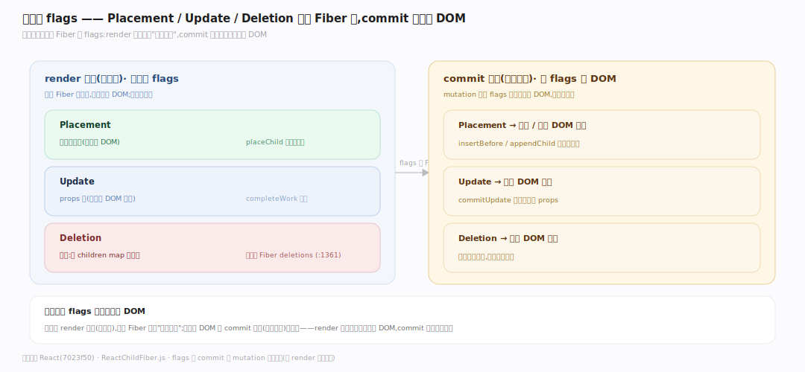

# React 原理 · 支撑主线 · 协调与 Diff

> **定位**：属"协调能力域"。管新旧 UI 树的差异计算:reconcileChildFibers、key+type 比对、列表 diff(last-placed-index 判移动)。算出最小 DOM 变更。依赖【Fiber 架构】的树、被【render 与提交】的 beginWork 调。源码基准 **React(7023f50)**(`packages/react-reconciler/src/ReactChildFiber.js`)。

React 声明式的核心:改 state 后你返回新 UI 树,React **diff** 新旧树、只改变化的部分(不是全重建)。协调(reconciliation)按 **key + elementType** 判断节点能否复用;列表用 **last-placed-index** 启发式判移动。理解单节点复用条件 + 列表两趟 diff,就懂了 React 怎么最小化 DOM 变更。

---

## 一、协调入口与复用条件

- **入口**:`createChildReconciler(shouldTrackSideEffects)`(`ReactChildFiber.js:431`)工厂——mount 传 false、update 传 true,产 `reconcileChildFibers`。
- **单节点复用条件**:`reconcileSingleElement`(:1703)——child 可复用**当且仅当** `child.key === key` **且** `child.elementType === elementType`(:1714,:1738);否则删旧建新。
- 即:同位置、key 同、类型同 → 复用 Fiber(保状态);任一不同 → 销毁重建。

**为什么 key+type**:key 标识"是不是同一个逻辑节点",elementType 标识"是不是同种组件/元素";两者同才能复用(接着用旧 Fiber 的状态)、否则重建(状态丢)——这是"key 变导致组件重挂"的原因。

---

## 二、列表 diff:两趟 + last-placed-index

`reconcileChildrenArray`(`:1177`)两趟:

- **第一趟(按位置)**:并行遍历新旧列表(`updateSlot`),key 对得上就按位置匹配;key 不匹配则断出(:842)。
- **第二趟(按 key map)**:剩余旧 children 放进 keyed map(`mapRemainingChildren`),新 children 从 map 里按 key 取(`updateFromMap`,这是移动/复原怎么工作的)、剩下的删(:1308)。
- **移动检测**:`placeChild`(:511)比 `current.index` 与 `lastPlacedIndex`——`oldIndex < lastPlacedIndex` 标 `Placement`(移动),否则留下并推进 lastPlacedIndex(:524)。

**为什么 last-placed-index**:它是"贪心判最少移动"的启发式——从左到右,若某节点的旧位置比已放置的最大位置小,说明它需前移(标移动);否则原地。这让顺序不变的列表零移动、只有真移动的才标——高效。

---

## 三、diff 结果:标 flags

协调的产物是给 Fiber 标 **flags**(副作用标记):

- **Placement**:新增或移动(需插入 DOM)。
- **Deletion**:删除(旧 children map 里剩的,加到父 Fiber 的 deletions 列表,:1361)。
- **Update**:props 变(需更新 DOM 属性)——completeWork 时标。
- 这些 flags 在 commit 阶段被消费:mutation 相按 flags 增删改真实 DOM(见 render 与提交篇)。

**为什么标 flags 而非立即改 DOM**:协调在 render 阶段(可中断),此时只在 Fiber 上标"要做什么"(flags);真正改 DOM 在 commit 阶段(不可中断)统一做——render 可打断重来不影响 DOM,commit 一次性提交。

---

## 拓展 · 协调与 Diff 关键结构一览

| 结构 | 定义 | 职责 |
|---|---|---|
| createChildReconciler | `ReactChildFiber.js:431` | 协调工厂(mount/update) |
| reconcileSingleElement | `ReactChildFiber.js:1703` | 单节点 key+type 复用判断 |
| reconcileChildrenArray | `ReactChildFiber.js:1177` | 列表两趟 diff |
| placeChild | `ReactChildFiber.js:511` | last-placed-index 判移动 |
| mapRemainingChildren | `ReactChildFiber.js` | 第二趟 keyed map |

## 调优要点（理解要点）

- **稳定 key**:列表项用稳定唯一 key(非数组 index)——index 做 key 在增删/排序时导致误复用、状态错乱。
- **避免包裹层变动**:条件渲染时保持元素类型稳定(别一会 div 一会 span),否则 type 变触发重建。
- **列表顺序**:顺序不变的列表 diff 零移动;频繁重排考虑虚拟化。
- **Fragment 减层**:用 `<></>` 减 DOM 层级,diff 更浅。

## 常见误区与工程要点

- **误区:diff 是 O(n³) 树比较。** React 用启发式 O(n):同层比较 + key/type 判复用 + last-placed-index 判移动——非通用树 diff。
- **误区:index 做 key 没问题。** 增删/排序时 index 做 key 导致 Fiber 误复用(状态串到别的项);用稳定业务 key。
- **误区:key 只为消警告。** key 是协调复用/移动的依据;错的 key 导致重建丢状态或状态错位。
- **误区:diff 立即改 DOM。** diff(render 阶段)只标 flags;改 DOM 在 commit 阶段——分离让 render 可中断。
- **归属提醒**:diff 在【Fiber 架构】的树上做;由【render 与提交】beginWork 触发;标的 flags 在 commit 消费;可中断靠【Lanes 与调度】。

## 一句话总纲

**React 协调 diff 新旧 UI 树只改变化部分:reconcileSingleElement 单节点复用当且仅当 key===key 且 elementType===elementType(否则删旧建新,故 key/type 变导致重挂);列表 reconcileChildrenArray 两趟(第一趟按位置 updateSlot、第二趟剩余入 keyed map 按 key 取 updateFromMap),placeChild 用 last-placed-index 贪心判移动(oldIndex<lastPlacedIndex 标 Placement);协调只在 Fiber 标 flags(Placement/Deletion/Update),commit 阶段才消费改 DOM——启发式 O(n)、render 可中断。**
