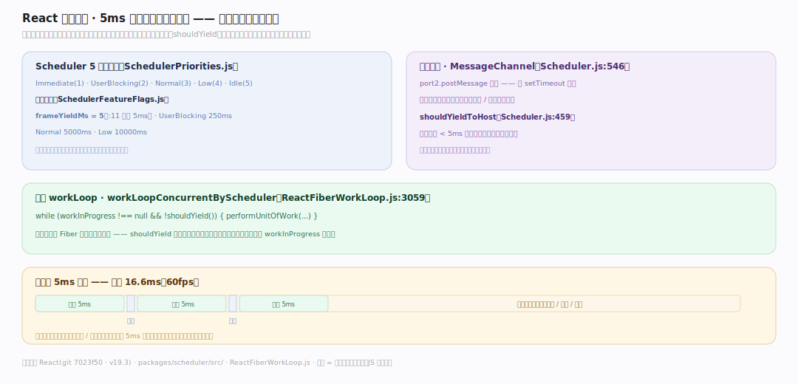
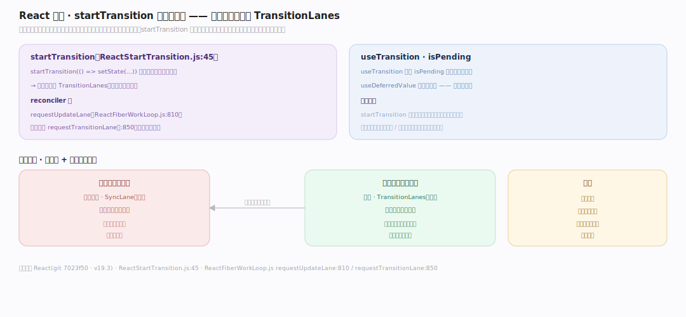
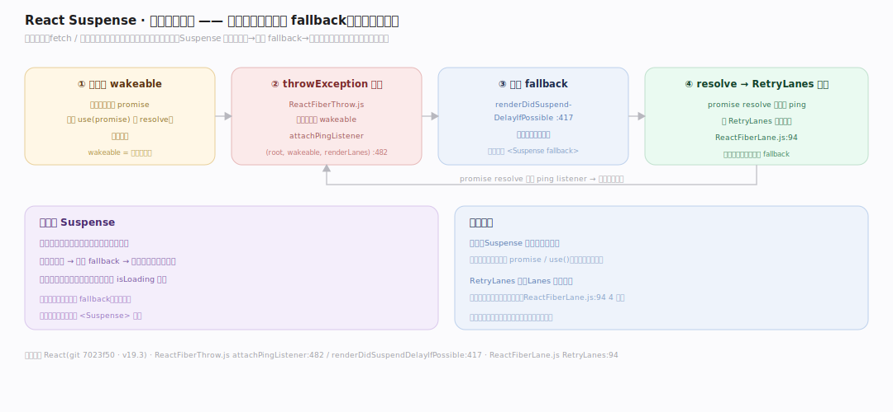

# React 原理 · 支撑主线 · 并发特性

> **定位**：属"调度能力域"——React 18+ 的招牌能力。管可中断渲染的三大特性:时间切片(不阻塞主线程)、过渡(startTransition 降优先级)、Suspense(挂起等待)。建在【Lanes 与调度】+ Scheduler 之上。被【render 与提交】的并发 workLoop 兑现。源码基准 **React(git 7023f50)**(`packages/scheduler/src/`、`ReactFiberWorkLoop.js`)。

React 18 的"并发"不是多线程,而是**可中断渲染**:把渲染切成小片(时间切片)、每片检查该不该让路(shouldYield),高优先级更新(点击)能打断进行中的低优先级渲染(大列表)。三大特性:**时间切片**(5ms 一片不卡顿)、**过渡**(startTransition 标记非紧急)、**Suspense**(等异步数据时挂起)。理解这三点,就懂了 React 怎么"又快又不卡"。

---

## 一、时间切片:5ms 一片,该让路就让路

Scheduler(`packages/scheduler/src/`)把渲染切片:

- **5 级优先级**(`SchedulerPriorities.js`):Immediate(1)/UserBlocking(2)/Normal(3)/Low(4)/Idle(5)。
- **超时常量**(`SchedulerFeatureFlags.js`):`frameYieldMs = 5`(:11,每片 5ms)、UserBlocking 250ms、Normal 5000ms、Low 10000ms。
- **让路检查**:`shouldYieldToHost`(`Scheduler.js:459`)——已用时间 < 5ms 则继续、超了就让出主线程。
- **并发 workLoop**:`workLoopConcurrentByScheduler`(`ReactFiberWorkLoop.js:3059`)= `while (workInProgress !== null && !shouldYield())`——每处理一个 Fiber 检查该不该停。
- **调度媒介**:`MessageChannel`(`Scheduler.js:546` port2.postMessage)——比 setTimeout 更快地把控制权还给浏览器再取回。

**为什么 5ms 切片**:一帧 16.6ms(60fps),渲染若一口气跑完长任务会阻塞输入/动画造成卡顿;切成 5ms 片、片间让浏览器处理事件/绘制,渲染就"见缝插针"不卡主线程。

---

## 二、过渡:startTransition 标记非紧急

**startTransition**(`ReactStartTransition.js:45`)标记"这个更新不急":

- 包在 `startTransition(() => setState(...))` 里的更新走 **TransitionLanes**(低优先级)。
- reconciler 侧:`requestUpdateLane`(`ReactFiberWorkLoop.js:810`)对过渡调 `requestTransitionLane`(:850)返回过渡车道。
- 典型:输入框即时更新(高优先级 SyncLane)+ 搜索结果列表渲染(过渡,低优先级)——打字流畅,列表渲染可被下次打字打断重来。
- `useTransition` 还给出 `isPending` 状态显示加载中。

**为什么要过渡**:某些更新用户要立即看到(输入框字符),某些可以慢一点(重型列表);startTransition 把后者降优先级,让紧急更新优先,避免重渲染阻塞交互——这是"响应优先"的显式表达。

---

## 三、Suspense:等异步时挂起

**Suspense** 让组件"等数据时挂起显示 fallback":

- 组件抛出一个 promise(或 `use(promise)` 未 resolve)——渲染中断。
- reconciler 捕获:`throwException`(`ReactFiberThrow.js`)识别抛出的 wakeable(可唤醒对象),调 `attachPingListener(root, wakeable, renderLanes)`(:482)挂监听。
- `renderDidSuspendDelayIfPossible`(:417):标记本次渲染挂起,显示最近的 `<Suspense fallback>`。
- promise resolve 后触发 ping,用 **RetryLanes**(`ReactFiberLane.js:94`)重试渲染。

**为什么 Suspense**:异步数据(fetch/懒加载组件)到达前,组件无法渲染真实内容;Suspense 统一"挂起→显示 fallback→数据到了重试"的模式——声明式地处理加载态,不用每处手写 isLoading 判断。

---

## 拓展 · 并发特性关键一览

| 特性 | 入口 | 机制 |
|---|---|---|
| 时间切片 | `Scheduler.js` workLoop | 5ms 片 + shouldYieldToHost |
| shouldYieldToHost | `Scheduler.js:459` | 已用 < 5ms 继续,超则让路 |
| 并发 workLoop | `ReactFiberWorkLoop.js:3059` | `!shouldYield()` 每 Fiber 查 |
| startTransition | `ReactStartTransition.js:45` | 更新走 TransitionLanes |
| Suspense | `ReactFiberThrow.js` | 抛 wakeable → RetryLanes 重试 |

## 调优要点（理解要点）

- **过渡包重更新**:大列表/图表渲染用 startTransition,保输入/点击流畅。
- **Suspense 边界粒度**:合理放 `<Suspense>` 边界——太粗整页 fallback、太细闪烁;按数据加载单元划分。
- **useDeferredValue**:延迟派生值(如搜索词)让昂贵渲染滞后于输入,同过渡思路。
- **不是多线程**:并发=单线程可中断切片;别期望真正并行(JS 仍单线程)。

## 常见误区与工程要点

- **误区:并发是多线程。** 是单线程可中断渲染(时间切片 + shouldYield 让路);JS 仍单线程。
- **误区:startTransition 让更新更快。** 是降优先级(让别的先),被标记的更新可能更慢/被打断;目的是保紧急更新响应。
- **误区:Suspense 只用于代码分割。** 也用于数据获取(抛 promise / use());统一挂起模式。
- **误区:切片是固定帧。** shouldYieldToHost 按已用时间(5ms)判,不是绑定帧率;超时才让路。
- **归属提醒**:优先级车道在【Lanes 与调度】;并发 workLoop 的中断/恢复在【render 与提交】;事件优先级映射在【事件系统】;挂起重试的车道 RetryLanes 属【Lanes 与调度】。

## 一句话总纲

**React 并发=单线程可中断渲染(非多线程):① 时间切片(Scheduler 5 级优先级+frameYieldMs=5ms 一片,shouldYieldToHost:459 已用<5ms 则继续超则让路,workLoopConcurrentByScheduler:3059 每 Fiber 查 !shouldYield,MessageChannel 调度)见缝插针不卡主线程;② 过渡(startTransition:45 把更新放 TransitionLanes 低优先级,requestTransitionLane 返车道,保输入流畅列表可被打断);③ Suspense(组件抛 wakeable→throwException 捕获+attachPingListener:482→显示 fallback→resolve 后 RetryLanes 重试)声明式处理加载态。**
