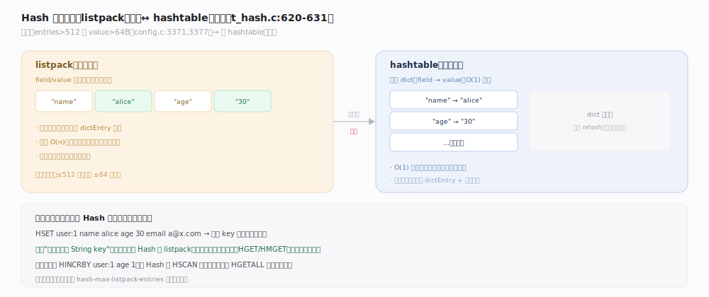
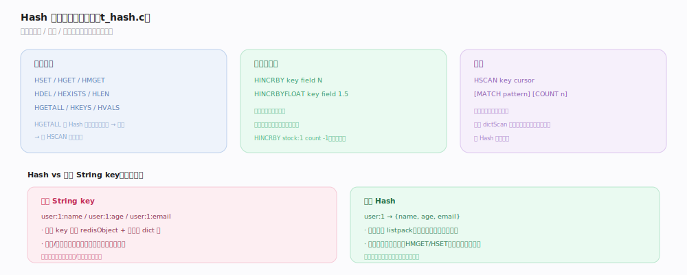

# Redis 原理 · Hash 哈希

> **定位**：Hash 是"key → 字段-值映射"的类型，适合表示对象（如一个用户的多个属性）。它依赖对象系统的两种编码（listpack / hashtable），小规模紧凑、大规模标准。近年新增字段级 TTL（HEXPIRE）。
>
> 源码：`~/workdir/redis` unstable @9e5614d（`t_hash.c`）。

## 一、两种编码：listpack ↔ hashtable

- **listpack**（小规模）：字段和值按 `field1, value1, field2, value2…` 交替存在一段连续内存里。省内存（无指针/dictEntry 开销），但查找是 O(n) 遍历。
- **hashtable**（大规模）：底层 dict，字段→值，O(1) 查找。
- **转换阈值**（`t_hash.c:620-631`）：字段数 > `hash-max-listpack-entries`（默认 512）或任一字段/值字节数 > `hash-max-listpack-value`（默认 64）→ 转 hashtable。单向不可逆。

## 二、命令与对象存储模式

- **字段操作**：`HSET`/`HGET`/`HMGET`/`HDEL`/`HGETALL`/`HKEYS`/`HVALS`/`HLEN`/`HEXISTS`。
- **原子计数**：`HINCRBY`/`HINCRBYFLOAT`（字段级计数，如商品库存）。
- **对象存储**：把一个对象的多个属性存一个 Hash（`user:1` → `{name, age, email}`），比"每属性一个 String key"省内存、支持部分字段读写。
- **扫描**：`HSCAN` 游标增量遍历大 Hash，不阻塞。

## 深化 · 字段级 TTL（HEXPIRE）

传统 Redis 过期是 **key 级**（整个 Hash 一起过期）。较新版本支持**字段级 TTL**——单独给 Hash 的某个字段设过期。

- `HEXPIRE key seconds FIELDS n field...`：给指定字段设过期，到点只删该字段而非整个 Hash。
- 用途：会话中不同属性不同有效期、缓存对象的部分字段刷新。
- 底层用 `listpackex` 编码（listpack 的带过期扩展）或 hashtable + 字段过期元数据。

## 调优要点与误区

- `hash-max-listpack-entries`（默认 512）/ `-value`（默认 64）：大量小对象场景可调大阈值省内存。
- **误区："HGETALL 总是安全"**：大 Hash 的 HGETALL 会一次返回全部字段，可能阻塞——用 HSCAN。
- **误区："Hash 比多个 String key 慢"**：小 Hash（listpack）反而更省内存，且对象语义更清晰。
- **误区："字段级 TTL 一直有"**：这是较新特性，老版本只有 key 级过期。

## 一句话总纲

**Hash 是字段-值映射，小规模用 listpack（连续内存、省指针开销、O(n)）、超阈值转 hashtable（O(1)）；适合把一个对象的多属性存一起支持部分读写与字段级计数，较新版本还支持字段级 TTL。**
