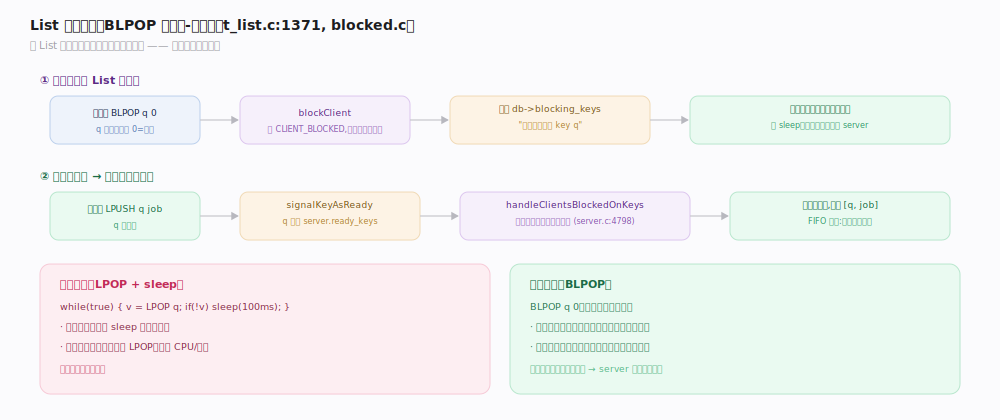

# Redis 原理 · List 列表

> **定位**：List 是有序、可重复的元素序列，双端可推可弹，适合队列/栈/消息缓冲。它依赖对象系统的 quicklist 编码（listpack 节点组成的双向链表），并与阻塞命令主线深度结合（BLPOP 等）。
>
> 源码：`~/workdir/redis` unstable @9e5614d（`t_list.c` / `quicklist.c`）。

## 一、编码：listpack → quicklist

- **listpack**（小 List）：整个 List 存一段连续内存。
- **quicklist**（大 List）：**listpack 节点组成的双向链表**——既有链表的两端 O(1) 增删，又用 listpack 节点减少指针开销和内存碎片。
- **节点大小**：`list-max-listpack-size`（默认 -2 = 每节点 8KB）控制单个 listpack 节点的上限；超过则拆新节点。
- 节点可 LZF 压缩（`compress` 深度留头尾若干节点不压，因两端最常访问）。

## 二、命令：双端队列 / 栈

- **两端操作**：`LPUSH`/`RPUSH`（左/右推）、`LPOP`/`RPOP`（左/右弹）——O(1)。
- **组合语义**：`LPUSH`+`RPOP` = 队列（FIFO）；`LPUSH`+`LPOP` = 栈（LIFO）。
- **按索引/范围**：`LINDEX`/`LRANGE`/`LSET`/`LLEN`——注意 `LINDEX`/`LRANGE` 中间位置是 O(n)。
- **移动**：`LMOVE`/`RPOPLPUSH`（原子地从一个 List 尾弹出、推入另一个头）——可靠队列的基础。

## 深化 · 阻塞消费：BLPOP

`BLPOP`/`BRPOP`/`BLMOVE` 让消费者在 List 为空时阻塞等待，有元素时被唤醒——生产者-消费者队列的核心。

- 空 List 上 `BLPOP` → 客户端被 `blockClient` 挂起（从事件循环摘下），登记到 `db->blocking_keys`（`t_list.c:1371`）。
- 生产者 `LPUSH` 使 List 非空 → `signalKeyAsReady` → `handleClientsBlockedOnKeys` 唤醒等待的消费者（FIFO 公平）。
- 相比"轮询 `LPOP` + sleep"，阻塞方式零延迟、零空轮询开销。

## 调优要点与误区

- `list-max-listpack-size`（默认 -2 = 8KB/节点）：调节点大小平衡内存与操作粒度。
- **误区："List 随机访问快"**：`LINDEX`/`LRANGE` 中间位置 O(n)，List 是为两端操作优化的，随机访问用别的结构。
- **误区："用 List 做可靠队列很简单"**：`RPOPLPUSH`/`LMOVE` + 备份队列 + 确认才是可靠模式；但更推荐 Stream（有消费组+确认）。
- **误区："BLPOP 会拖慢 server"**：不会，阻塞的是客户端不是线程（见事务脚本主线的阻塞命令）。

## 一句话总纲

**List 是有序可重复序列，大规模用 quicklist（listpack 节点的双向链表，兼顾两端 O(1) 与低指针开销）；LPUSH/RPOP 组合成队列或栈，BLPOP 让消费者阻塞等待由生产者推入时精准唤醒——零延迟零空轮询的生产者-消费者模式。**
