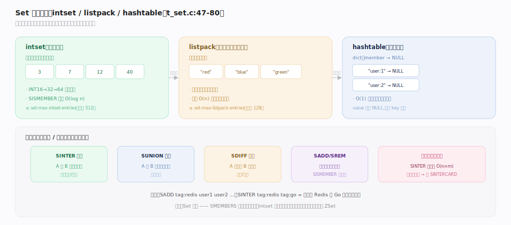
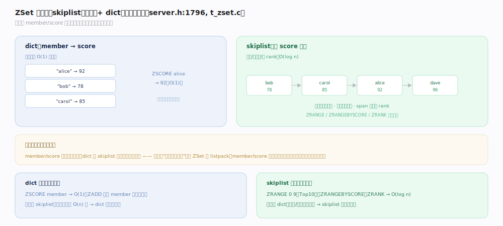
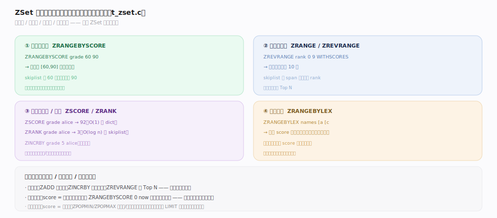

# Redis 原理 · Set / ZSet 集合

> **定位**：Set 是无序、去重的元素集合；ZSet（有序集合）在 Set 基础上给每个成员绑一个分数（score），按分数有序。二者依赖对象系统的多档编码（Set: intset/listpack/hashtable；ZSet: listpack/skiplist+dict），是标签、去重、排行榜、延迟队列的核心载体。
>
> 源码：`~/workdir/redis` unstable @9e5614d（`t_set.c` / `t_zset.c`）。

## 一、Set 三档编码：intset / listpack / hashtable

- **intset**（纯整数小集合）：有序整数数组，`SADD` 保持有序、`SISMEMBER` 二分查找。INT16→32→64 单向升级。
- **listpack**（含非整数的小集合）：连续内存存元素。
- **hashtable**（大集合）：dict（member→NULL），O(1) 增删查。
- **转换阈值**（`t_set.c:47-80`）：纯整数且 ≤ `set-max-intset-entries`（默认 512）→ intset；否则 ≤ `set-max-listpack-entries`（默认 128）且元素 ≤ `set-max-listpack-value`（默认 64B）→ listpack；再大 → hashtable。
- **命令**：`SADD`/`SREM`/`SISMEMBER`/`SMEMBERS`/`SCARD`/`SPOP`/`SRANDMEMBER`；集合运算 `SINTER`/`SUNION`/`SDIFF`（交/并/差，标签系统的基础）。

## 二、ZSet：skiplist + dict 双结构

大 ZSet 用 **skiplist + dict 组合**（`server.h:1796`）：
- **dict**：`member → score`，`ZSCORE` 查分 O(1)。
- **skiplist**：按 score 有序的跳表，支持范围查询、按 rank 定位（用 span 累加，见对象编码主线）。
- 小 ZSet 用 **listpack**（member/score 交替存），超 `zset-max-listpack-entries`（默认 128）或 value > 64B 转 skiplist（`t_zset.c:1655`）。
- **为何两个结构**：dict 提供 O(1) 按名查分，skiplist 提供 O(log n) 按序/按范围访问——各取所长，互补覆盖 ZSet 的两类访问模式。

## 深化 · ZSet 的三种查询维度

ZSet 强大在于同一份数据支持三种正交的查询维度：
- **按分数范围**：`ZRANGEBYSCORE key min max`（如"分数 60~90 的学生"）——skiplist 从 min 起点顺序扫。
- **按排名范围**：`ZRANGE key 0 9`（如"前 10 名"）、`ZREVRANGE`（倒序）——skiplist 用 span 定位 rank。
- **按成员查分/排名**：`ZSCORE`（O(1) 走 dict）、`ZRANK`（O(log n) 走 skiplist span）。
- **原子增分**：`ZINCRBY key delta member`——排行榜实时更新的核心。
- **按字典序**：`ZRANGEBYLEX`（所有 score 相同时按成员字典序范围查）。

## 拓展 · 典型应用

| 场景 | 结构 | 关键命令 |
|---|---|---|
| 标签/关注关系 | Set | `SADD`/`SINTER`（共同关注）/`SISMEMBER` |
| 去重统计 | Set | `SADD`/`SCARD` |
| 排行榜 | ZSet | `ZADD`/`ZINCRBY`/`ZREVRANGE`（Top N） |
| 延迟队列 | ZSet | score=执行时间戳，`ZRANGEBYSCORE` 取到期任务 |
| 优先级队列 | ZSet | score=优先级，`ZPOPMIN`/`ZPOPMAX` |

## 常见误区与工程要点

- **误区："Set 有序"**：Set 无序，`SMEMBERS` 返回顺序不保证（intset 恰好有序是实现细节，别依赖）。要有序用 ZSet。
- **误区："ZRANGEBYSCORE 大范围很快"**：范围内元素多时仍要逐个返回 O(n+log n)，配 `LIMIT` 分页。
- **误区："SINTER 任意大集合都行"**：大集合求交是 O(n×m) 级开销，可能长时间阻塞单线程；大集合运算用 `SINTERCARD`（只要基数）或预计算。
- **工程点**：延迟队列用 ZSet + `ZRANGEBYSCORE now` 轮询到期项，比精确定时器简单可靠；排行榜用 `ZINCRBY` 实时更新 + `ZREVRANGE` 取榜。

## 一句话总纲

**Set 是去重集合（纯整数用 intset、小集合 listpack、大集合 hashtable），支持交并差做标签/共同关注；ZSet 用 skiplist（按序/按范围/按 rank，O(log n)）+ dict（按名查分，O(1)）双结构，同一份数据支持按分数/排名/成员/字典序多维查询，是排行榜、延迟队列、优先级队列的核心。**
