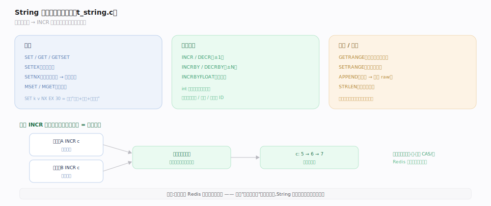
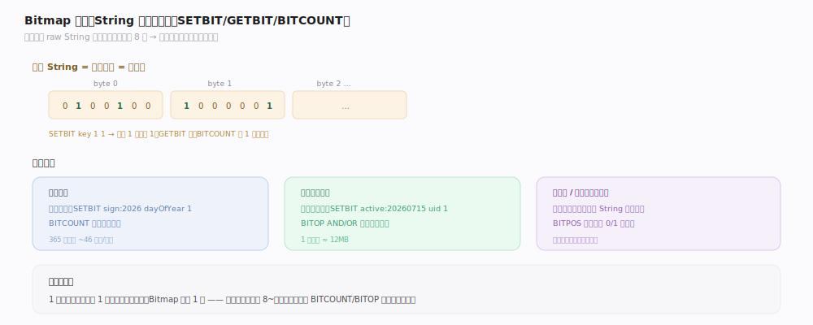

# Redis 原理 · String 字符串

> **定位**：String 是 Redis 最基础的数据类型——一个 key 对应一个二进制安全的值（最大 512MB）。它依赖对象系统的三种编码（int/embstr/raw），是计数器、缓存、位图、分布式锁等模式的载体。
>
> 源码：`~/workdir/redis` unstable @9e5614d（`t_string.c` / `object.c`）。

## 一、三种编码：int / embstr / raw

String 的 value 按内容与长度选编码（`object.c`）：
- **int**：值能被 `string2l` 解析成长整数（≤20 字符）→ 存整数本身，省内存且 `INCR` 直接算。0–9999 的小整数用**共享对象**（`server.h:126`），全库复用免分配。
- **embstr**：≤44 字节（`OBJ_ENCODING_EMBSTR_SIZE_LIMIT=44`，`object.c:337`）→ 对象头与 sds 一次性分配在连续内存（贴合 jemalloc 64 字节 arena），分配/释放各一次、缓存友好。
- **raw**：>44 字节 → 对象头与 sds 分两次分配，sds 可独立扩容。
- **升级**：对 embstr 做修改（如 `APPEND`）会转为 raw（embstr 视为只读优化）。

## 二、核心命令与原子计数

- **读写**：`SET`/`GET`/`GETSET`/`SETEX`（带过期）/`SETNX`（不存在才设，锁的基础）/`MSET`/`MGET`。
- **原子计数**：`INCR`/`DECR`/`INCRBY`/`INCRBYFLOAT`——单线程保证无竞争，是计数器、限流、ID 生成的基础。int 编码下直接算术运算。
- **子串**：`GETRANGE`/`SETRANGE`（按字节偏移读写）、`APPEND`（追加，触发 raw）、`STRLEN`。

## 深化 · Bitmap 位操作

String 可当**位数组**用（每字节 8 位），`SETBIT`/`GETBIT`/`BITCOUNT`/`BITOP`/`BITPOS`——用极少内存表示海量布尔状态（如 1 亿用户签到只需 ~12MB）。

- 底层仍是 String（raw 编码的字节数组），位操作直接改字节的某一位。
- 典型场景：用户签到（每天一位）、活跃统计（`BITCOUNT`）、布隆过滤器基座、权限位。

## 调优要点与误区

- `SETNX` + 过期是简易分布式锁基础，但需注意锁误删（用带唯一值的 `SET k v NX EX` + Lua 校验删除）。
- **误区："String 只能存文本"**：二进制安全，可存图片/序列化对象，但大 value（>10KB）建议评估。
- **误区："INCR 需要加锁"**：单线程天然原子，不需要。
- **误区："频繁 APPEND 高效"**：会把 embstr 转 raw 且可能反复扩容；大量拼接考虑别的结构。

## 一句话总纲

**String 是二进制安全的单值类型，按内容自动选 int（可算术，小整数共享）/embstr（≤44B 连续分配）/raw（长串）编码；单线程让 INCR 等计数天然原子，还能当 Bitmap 用极少内存表示海量布尔状态。**
