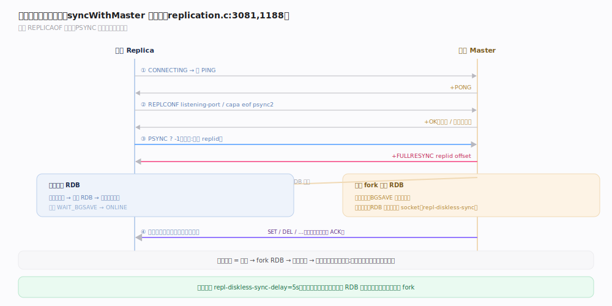
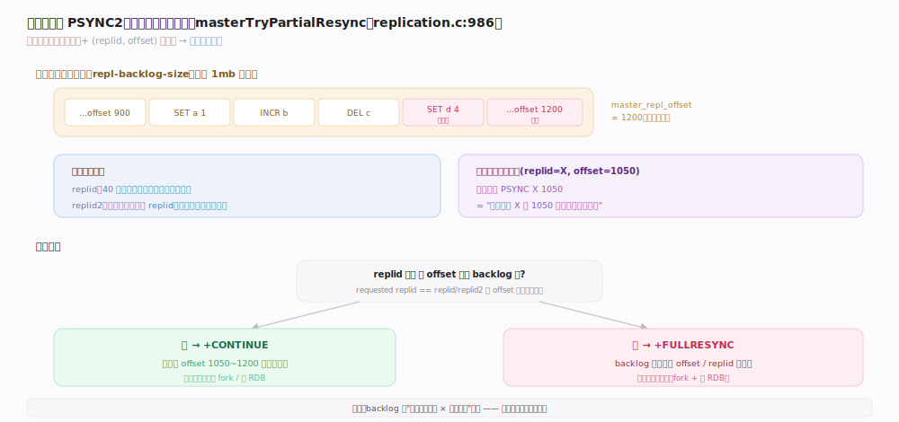
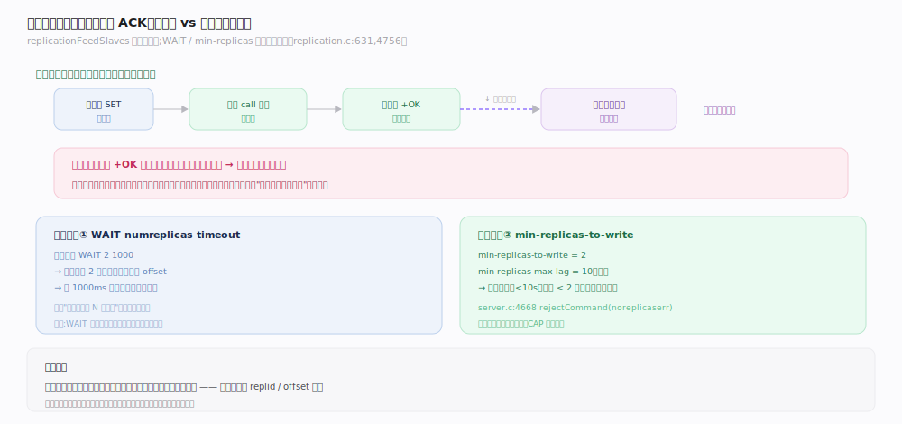

# Redis 原理 · 复制

> **定位**：复制是 Redis 高可用与读扩展的基础——从库异步复制主库的写命令流，保持数据副本。它复用 `call()` 的命令传播机制（主库把写效果发给从库），依赖 RDB（全量同步发快照）。复制是**异步**的：写命令不等从库确认即返回，故主从间有秒级延迟。
>
> 源码：`~/workdir/redis` unstable @9e5614d。

## 一、复制握手与两种同步

从库通过 `REPLICAOF <master>` 发起复制，走一套握手状态机后进入持续的命令流复制。

- **握手**（`replication.c:3081` `syncWithMaster` 状态机）：`CONNECTING → 发 PING → 认证 → 发 REPLCONF（宣告端口/能力 eof/psync2）→ 发 PSYNC → CONNECTED`。
- **PSYNC**：从库发 `PSYNC <replid|?> <offset|-1>`，主库据此决定全量还是部分同步。
- **全量同步**（`replication.c:1188` `syncCommand`）：主库回 `+FULLRESYNC <replid> <offset>`，fork 生成 RDB：
  - **磁盘方式**：BGSAVE 写 RDB 文件再发给从库。
  - **无盘方式**（`repl-diskless-sync`，默认 yes）：直接把 RDB 流写进从库 socket，省一次落盘。
- **部分重同步**（PSYNC2）：见下节。

## 二、部分重同步（PSYNC2）：断线重连不必全量

网络抖动导致从库短暂断连时，若能只补发断连期间的命令，就不必再来一次昂贵的全量同步。

- **复制积压缓冲**（`repl-backlog-size`，默认 1mb）：主库维护一个环形缓冲，存最近发出的命令流。
- **复制 ID + offset**：主库有 `replid`（40 位十六进制）和 `master_repl_offset`（已发送字节数）。从库记住断连时的 replid 与 offset。
- **重连判定**（`replication.c:986` `masterTryPartialResynchronization`）：从库请求的 replid 匹配主库当前 replid（或 replid2）、且请求的 offset 仍在 backlog 范围内 → 回 `+CONTINUE`，只补发缺失字节；否则 `+FULLRESYNC` 全量。
- **replid2**：主库晋升时保留旧主的 replid，让"级联从库/换主"场景也能部分重同步。

> **一句话**：backlog 环形缓冲 + (replid, offset) 二元组，让"短暂断连"只补发缺口而非重来全量——这是 PSYNC2 的核心。

## 深化 · 命令传播与一致性模型

- **异步传播**（`replication.c:631` `replicationFeedSlaves`）：主库 `call()` 执行写命令后，把命令追加进复制流发给所有从库。**不等从库 ACK 即返回客户端**——这是 Redis 高吞吐的关键，也意味着主库宕机可能丢失尚未传播的写。
- **级联复制**：子从库（从库的从库）直接转发上游主库的流，不重新生成，保证 replid/offset 一致。
- **WAIT 命令**（`replication.c:4756`）：`WAIT <numreplicas> <timeout>` 阻塞到指定数量的从库确认了当前 offset——提供**按需的同步语义**，但不是默认行为。
- **min-replicas-to-write**（默认 0）：设为 N 后，健康从库少于 N 时主库**拒绝写入**（`server.c:4668`），牺牲可用性换数据安全。

## 拓展 · 复制关键配置

| 配置 | 默认 | 作用 |
|---|---|---|
| `repl-diskless-sync` | yes | 全量同步是否走无盘（直接 socket 传 RDB） |
| `repl-diskless-sync-delay` | 5s | 无盘同步前等待，攒多个从库一起发 |
| `repl-backlog-size` | 1mb | 复制积压缓冲大小，决定断连多久内可部分重同步 |
| `repl-ping-replica-period` | 10s | 主库向从库发 PING 的周期（保活+探测） |
| `min-replicas-to-write` | 0 | 健康从库不足时拒写的阈值 |
| `min-replicas-max-lag` | 10s | 判定从库"健康"的最大延迟 |

## 常见误区与工程要点

- **误区："复制是同步的，写完从库就有"**：默认异步，主库写完立即返回，从库稍后才收到。强一致需 `WAIT`。
- **误区："主库宕机不丢数据"**：异步复制下，已回复客户端但未传播到从库的写，主库宕机后会丢——用 `WAIT` 或 `min-replicas-to-write` 收紧。
- **误区："断线必然全量同步"**：只要 backlog 没被覆盖、replid 匹配，断线重连走部分重同步。backlog 太小 + 断线久 → 退化为全量。
- **工程点**：backlog 按"断连时长 × 写入速率"估算；无盘同步适合磁盘慢、网络快的环境；从库只读（`replica-read-only`，默认 yes）。

## 一句话总纲

**从库经 PSYNC 握手后异步复制主库的写命令流——首次或缺口过大走 fork RDB 的全量同步，短暂断连靠"复制积压缓冲 + (replid, offset)"部分重同步只补缺口；主库写命令不等从库 ACK 即返回（高吞吐但主库宕机可能丢未传播的写），需要强一致时用 WAIT 或 min-replicas-to-write。**
