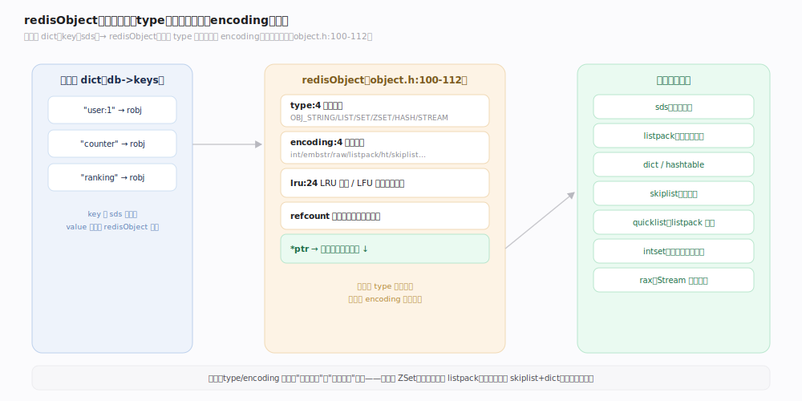
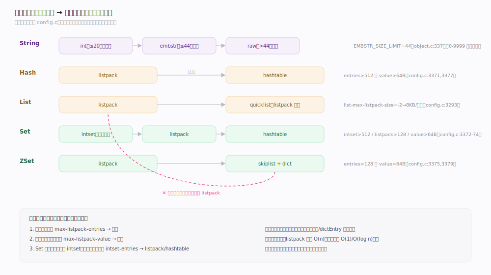
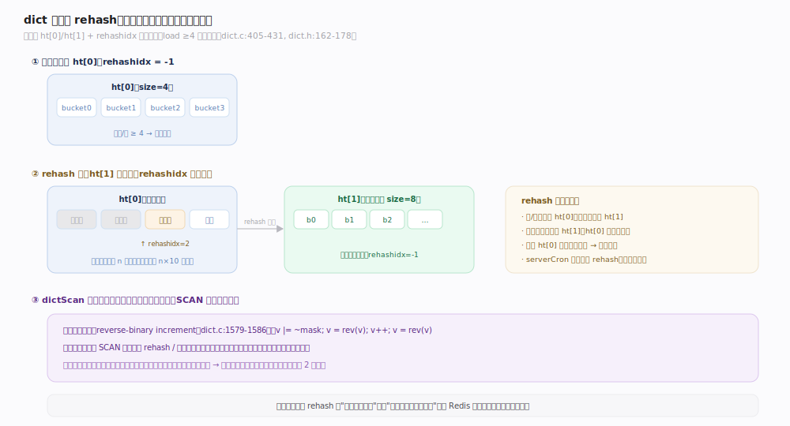
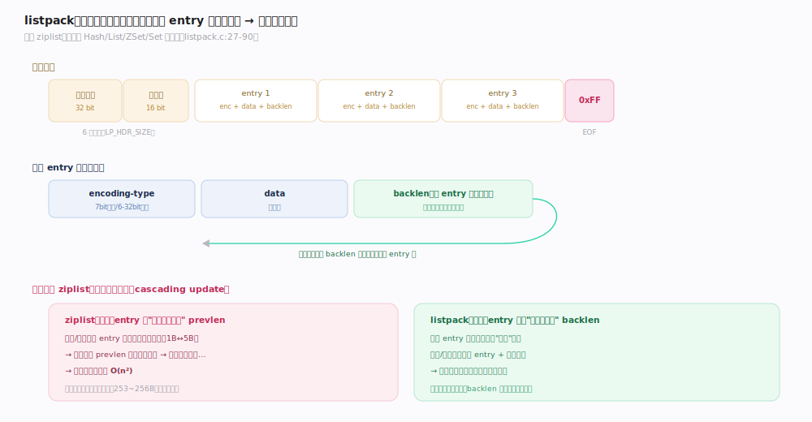
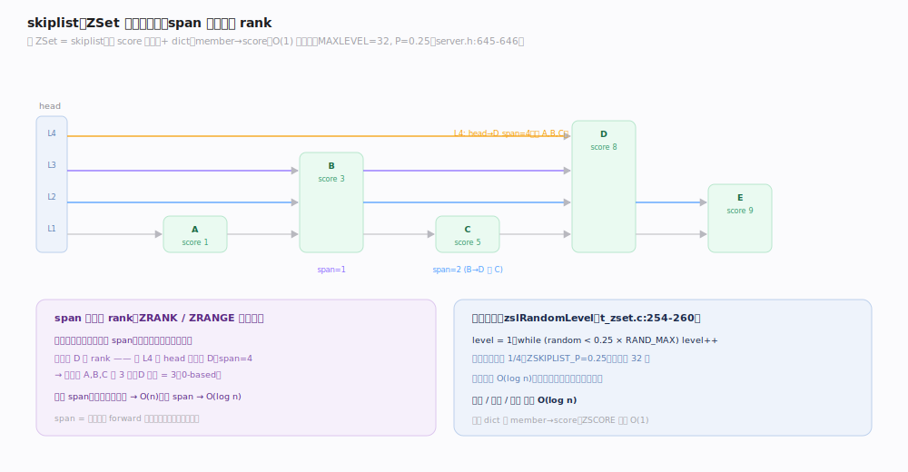

# Redis 原理 · 对象系统与底层编码

> **定位**：本主线是 Redis 数据层的**地基**——所有数据类型命令族（String/Hash/List/Set/ZSet/Stream）的 value 都是一个 `redisObject`，其 `ptr` 指向按规模自动选择的底层编码。它被全部接触面主线依赖，向下依赖内存分配器；编码的"小规模紧凑、大规模标准"策略是 Redis 省内存的核心手段。
>
> 源码：`~/workdir/redis` unstable @9e5614d。

## 一、redisObject：类型与编码分离

Redis 的键空间是一张 dict：`key（sds 字符串）→ redisObject`。每个 value 都被 `redisObject` 包裹，它把**逻辑类型**（用户看到的 String/Hash/…）与**底层编码**（内存里真实的表示）解耦：同一种类型可以有多种编码，随数据规模切换。

`redisObject` 的字段（`object.h:100-112`）：
- `type:4` — 逻辑类型，`OBJ_STRING/LIST/SET/ZSET/HASH/STREAM`（`server.h:862-891`）。
- `encoding:4` — 底层编码，`OBJ_ENCODING_*`（`object.h:75-88`）。
- `lru:24` — LRU 时钟或 LFU 计数（复用同一字段，见内存淘汰主线）。
- `refcount` — 引用计数（共享对象如小整数用）。
- `ptr` — 指向真正的数据结构。

> **一句话**：type 是"用户要什么语义"，encoding 是"引擎当前用什么内存布局装它"——命令看 type 分派，内存看 encoding 决定。

## 二、八种编码与自动升级阈值

每种类型都有"小规模用紧凑连续内存、大规模用标准结构"两档（或多档）编码，超过阈值**单向升级**（不会降回，因为降级收益低且抖动大）。

| 类型 | 小规模编码 | 大规模编码 | 升级阈值（默认值，`config.c`） |
|---|---|---|---|
| String | `int`（≤20 位可解析整数）/ `embstr`（≤44 字节） | `raw` | `EMBSTR_SIZE_LIMIT=44`（`object.c:337`） |
| Hash | `listpack` | `hashtable` | entries>512 或 value>64B（`config.c:3371,3377`） |
| List | `listpack` | `quicklist` | `list-max-listpack-size=-2`→8KB/节点（`config.c:3293`） |
| Set | `intset`（纯整数）/ `listpack` | `hashtable` | intset>512、listpack>128、value>64B（`config.c:3372-3374`） |
| ZSet | `listpack` | `skiplist` | entries>128 或 value>64B（`config.c:3375,3379`） |

String 三档的细节：内容能被 `string2l` 解析成长整数（≤20 字符）→ `int` 编码，且 0–9999 的小整数用**共享对象**免分配（`server.h:126`）；否则按长度，≤44 字节用 `embstr`（对象头与 sds 一次分配、贴合 jemalloc 64 字节 arena），更长用 `raw`（对象头与 sds 分两次分配）。

## 深化 · dict 与渐进式 rehash

Redis 的键空间、Hash 的 hashtable 编码、Set 的 hashtable 编码底层都是同一个 `dict`。它的两个关键设计是**渐进式 rehash**（避免大表扩容时的长时间停顿）与 **dictScan 反向二进制迭代**（在 rehash 中也能安全遍历）。

- **两张表 ht[0]/ht[1]**（`dict.h:162-178`）：平时只用 ht[0]；扩容时分配 ht[1]，`rehashidx` 从 0 开始标记迁移进度，`rehashidx==-1` 表示未在 rehash。
- **渐进迁移**（`dict.c:405-431`）：每次 `dictRehash(d, n)` 只迁移 n 个非空桶（最多扫 n×10 个空桶就返回），迁移分摊到后续每次增删查改和 serverCron；ht[0] 迁空后两表交换、`rehashidx=-1`。
- **负载因子**：`dict_force_resize_ratio=4`（`dict.c:45`）——元素/桶 ≥4 强制扩容，≤1/32 收缩。
- **dictScan 反向二进制**（`dict.c:1579-1586`）：游标高位递增（reverse-binary），保证在两次 SCAN 之间即使发生 rehash/扩缩容，也不漏、不重（可能少量重复但不遗漏已存在的键），这是 SCAN 命令 O(1) 增量遍历的基础。

## 深化 · listpack：解决 ziplist 级联更新

小规模的 Hash/List/ZSet/Set 都用 **listpack**（`listpack.c`）——一段连续内存里紧凑排列多个元素，省去指针开销。它取代了老的 ziplist。

- **布局**（`listpack.c:27-90`）：6 字节头（32 位总字节数 + 16 位元素数）+ 若干 entry + `0xFF` 结束符。
- **每个 entry** = `encoding-type + data + backlen`。`backlen` 存的是**本 entry 自己的长度**，用于**反向遍历**（从尾往头）。
- **为何取代 ziplist**：ziplist 的每个 entry 存的是"前一个 entry 的长度"，插入/删除时若某 entry 长度跨过编码边界，会引发后续 entry 的 `prevlen` 字段连锁变长——**级联更新**（最坏 O(n²)）。listpack 每个 entry 只存自己的长度，从根本上消除了级联。

## 深化 · skiplist：ZSet 的按序结构

大规模 ZSet 用 **skiplist + dict** 组合（`server.h:1796`）：dict 存 `member→score` 支持 O(1) 按名查分；skiplist 存按 score 有序的节点，支持范围查询与按 rank 定位。

- **节点**（`server.h:1777-1787`）：`score` + `backward` 指针 + 变长 `level[]` 数组，每层含 `forward` 指针和 **`span`**（到下一节点跨越的节点数）。
- **span 算 rank**：从头节点沿路径累加 span，即得某成员的排名——这是 `ZRANK`/`ZRANGE` 的基础。
- **随机层高**（`t_zset.c:254-260`）：`zslRandomLevel` 用 `while(random() < 0.25*RAND_MAX) level++`，即每升一层概率 1/4（`ZSKIPLIST_P=0.25`），上限 `ZSKIPLIST_MAXLEVEL=32`（`server.h:645-646`）。期望层高 O(log n)，查询/插入/删除均摊 O(log n)。

## 拓展 · quicklist / intset / sds

| 结构 | 用途 | 关键设计（源码） |
|---|---|---|
| **quicklist** | 大 List | listpack 节点的双向链表；节点可 LZF 压缩，`compress` 深度留头尾若干节点不压（`quicklist.h:47-117`） |
| **intset** | 纯整数小 Set | 有序整数数组，INT16→32→64 单向升级；新值超范围则整数组加宽（`intset.c`） |
| **sds** | 所有字符串 | `sdshdr5/8/16/32/64` 五种头，按长度选最窄头省内存；`len`+`alloc`+`flags`+`buf`，`packed` 无填充（`sds.h:57-62`） |

## 调优要点（关键开关）

- `hash-max-listpack-entries` / `-value`（默认 512 / 64）：调大让小 Hash 更省内存但操作变慢（listpack 是 O(n)）。
- `set-max-intset-entries`（默认 512）/ `set-max-listpack-entries`（默认 128）：控制 Set 三档编码切换点。
- `zset-max-listpack-entries` / `-value`（默认 128 / 64）：ZSet listpack↔skiplist 切换点。
- `list-max-listpack-size`（默认 -2 = 8KB/节点）：quicklist 每个 listpack 节点的大小上限。
- `activedefrag`（默认 no）：jemalloc 下开启主动碎片整理。

## 常见误区与工程要点

- **误区："encoding 会随数据变小降回紧凑编码"**：不会。编码升级单向，删元素也不降级——避免在阈值附近反复抖动。
- **误区："listpack 一定比 hashtable 省"**：只在元素少时成立；元素多时 listpack 的 O(n) 操作和整体重分配反而更贵，故有阈值。
- **误区："SCAN 能拿到一致快照"**：SCAN 只保证"全程存在的键不漏"，不保证快照一致——遍历期间新增/删除的键行为未定义，可能重复返回。
- **工程点**：大量小 Hash/ZSet 存储场景，适当调大 listpack 阈值可显著省内存（连续内存 vs 每元素一个 dictEntry+robj 的指针开销）。

## 一句话总纲

**每个 value 都是 type/encoding 分离的 redisObject——小规模用 listpack/intset/embstr 等紧凑连续内存、超阈值单向升级为 hashtable/skiplist/quicklist/raw；dict 靠双表渐进式 rehash 把扩容停顿摊平，靠反向二进制游标让 SCAN 在扩缩容中不漏键。**
