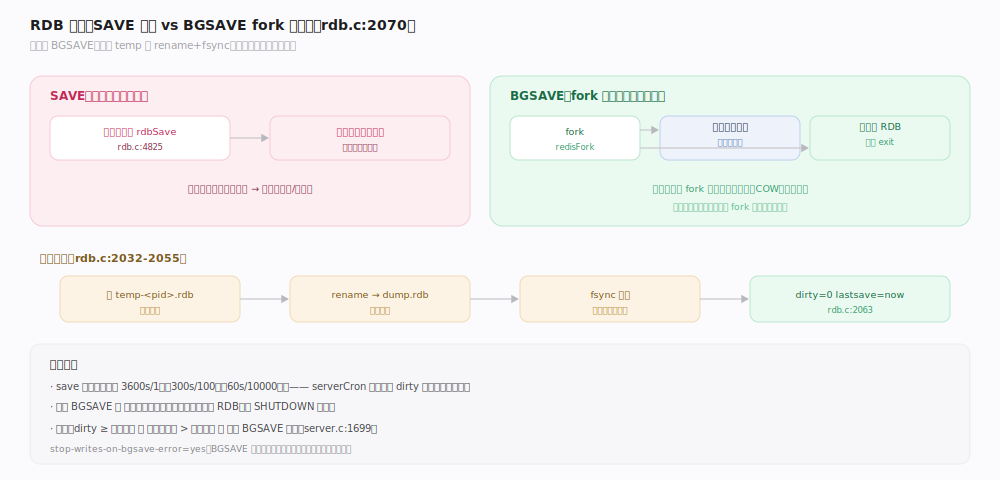
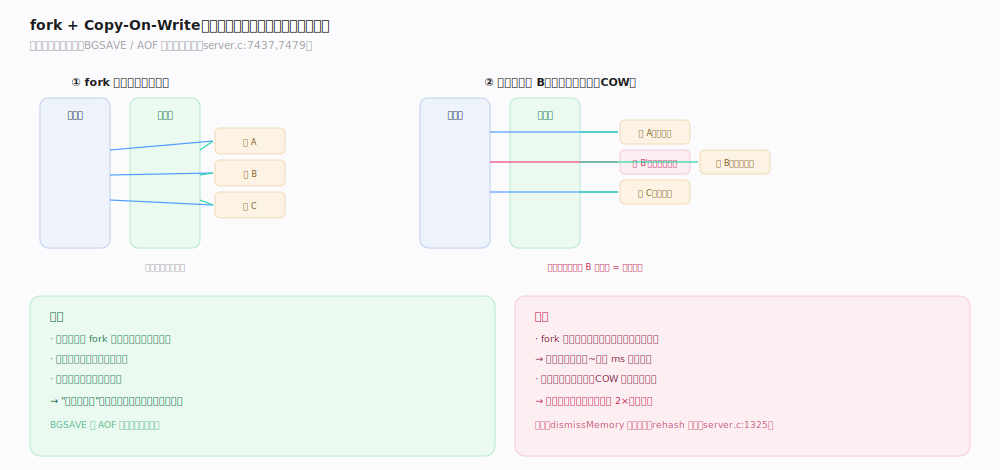
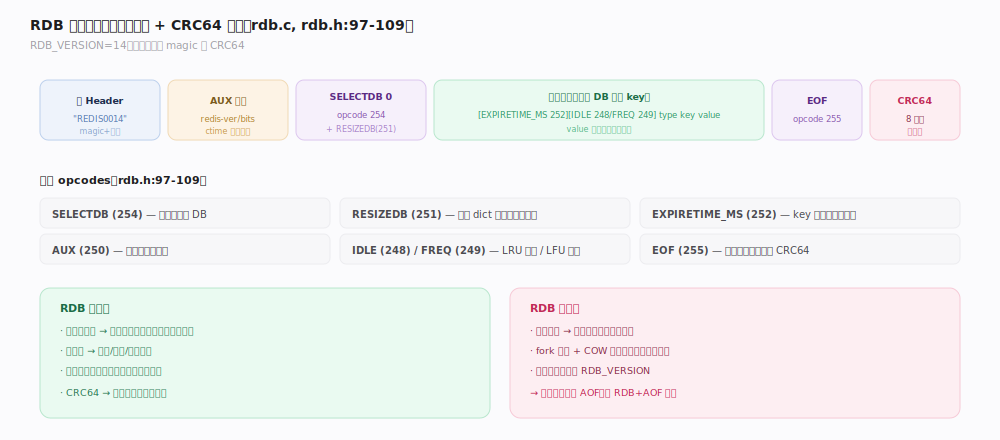

# Redis 原理 · 持久化 · RDB

> **定位**：RDB 是 Redis 的**时点快照**持久化——把某一刻的全量内存 dump 成一个紧凑二进制文件。它依赖 fork 子进程 + COW（不阻塞主线程），被复制主线复用（全量同步就是发 RDB）。与 AOF（操作日志）互补：RDB 恢复快、文件小，但两次快照间的数据会丢。
>
> 源码：`~/workdir/redis` unstable @9e5614d。

## 一、SAVE vs BGSAVE：阻塞 vs fork 子进程

- **SAVE**（`rdb.c:4825`）：主线程直接 `rdbSave`，全程阻塞——生产禁用。
- **BGSAVE**（`rdb.c:2070` `rdbSaveBackground`）：`fork()` 出子进程，子进程用父进程的内存快照写 RDB 后 `exit`，父进程继续服务命令。这是常规路径。
- **写盘原子性**（`rdb.c:2032-2055`）：先写 `temp-<pid>.rdb`，成功后 `rename` 覆盖正式文件 + `fsync` 目录，保证不会留下半个损坏的 RDB。
- 完成后重置 `server.dirty=0`、`server.lastsave=now`（`rdb.c:2063`）。

## 二、fork 与 Copy-On-Write

BGSAVE 不阻塞的关键是 `fork()` + 操作系统的 **Copy-On-Write**：子进程与父进程初始共享同一份物理内存页，只有当父进程**写**某页时，内核才复制那一页。

- 子进程看到的是 fork 那一刻的**内存快照**（一致的时点视图），无需加锁。
- **代价**：`fork()` 本身耗时随数据集增大（要复制页表，`server.c:7479` 统计 fork 耗时）；BGSAVE 期间父进程写入越多，COW 复制的页越多，内存占用可能显著上涨（最坏接近 2×）。
- 为减少 COW，子进程 dump 时 `dismissMemory` 提示内核可回收，父进程 rehash 也尽量避让（`server.c:1325`）。

> **一句话**：fork + COW 用"写时才复制"换来"子进程持有一致快照且父进程不停服"——但写密集期的内存膨胀是它的固有代价。

## 深化 · RDB 文件格式

RDB 是紧凑的二进制格式（`rdb.c`）：
- **头**：`REDIS` + 4 位版本号（`RDB_VERSION=14`，`rdb.h:21`）。
- **AUX 字段**：元信息（redis 版本、位数、创建时间等）。
- **每个 DB**：`SELECTDB` opcode + `RESIZEDB`（预告 dict 大小，加速加载）+ 键值对。
- **每个键**：可选 `EXPIRETIME_MS`（过期时间）/ `IDLE`（LRU）/ `FREQ`（LFU）前缀 + type + key + value（按编码序列化）。
- **opcodes**（`rdb.h:97-109`）：`SELECTDB=254` / `EXPIRETIME_MS=252` / `AUX=250` / `RESIZEDB=251` / `EOF=255` / `FREQ=249` / `IDLE=248`。
- **尾**：`EOF` opcode + 8 字节 **CRC64 校验和**（`rdb.c:1915`），加载时校验完整性。

## 拓展 · 触发时机

| 触发方式 | 说明 | 源码 |
|---|---|---|
| `save` 配置点 | 默认 `3600s/1改` `300s/100改` `60s/10000改` 任一满足即 BGSAVE | `server.c:2462`（默认）/ `1699`（检查） |
| 手动 SAVE/BGSAVE | 运维手动触发 | `rdb.c:4815,4833` |
| 复制全量同步 | 主库为新从库生成 RDB | 见复制主线 |
| SHUTDOWN | 关机前默认存一次 RDB | server 关闭流程 |

serverCron 每轮检查：`dirty >= 改动阈值 && 距上次保存 > 秒数阈值 && 上次 BGSAVE 成功`（`server.c:1699`）。

## 调优要点（关键开关）

- `save`（默认三档）：改动频繁又能容忍丢几分钟 → 保留；要 RDB 完全关掉写 `save ""`。
- `rdbcompression`（默认 yes）：LZF 压缩字符串，省盘但略耗 CPU。
- `rdbchecksum`（默认 yes）：CRC64 校验，关掉可略快但失去完整性检测。
- `rdb-del-sync-files` / `repl-diskless-sync`：复制场景下是否走磁盘。
- `stop-writes-on-bgsave-error`（默认 yes）：BGSAVE 失败时拒绝写入，防止数据无保护地继续堆积。

## 常见误区与工程要点

- **误区："BGSAVE 不占内存"**：fork + COW 下，写密集期父进程会因 COW 复制大量页，内存可能接近翻倍——需为此预留内存。
- **误区："RDB 是实时的"**：RDB 是时点快照，两次快照之间宕机会丢失这段数据；要低丢失用 AOF。
- **误区："fork 很快"**：大内存实例 fork 要复制页表，可能有几十~几百毫秒延迟尖刺（`latency` 里能看到 fork 事件）。
- **工程点**：RDB 适合灾备/冷备/主从全量同步；对丢失敏感的场景用 AOF 或 RDB+AOF 混合。

## 一句话总纲

**RDB 是通过 fork 子进程 + Copy-On-Write 拿到一份一致时点内存快照、序列化成带 CRC64 校验的紧凑二进制文件——恢复快、文件小、主库全量同步复用它，代价是写密集期的 COW 内存膨胀与两次快照间的数据丢失窗口。**
