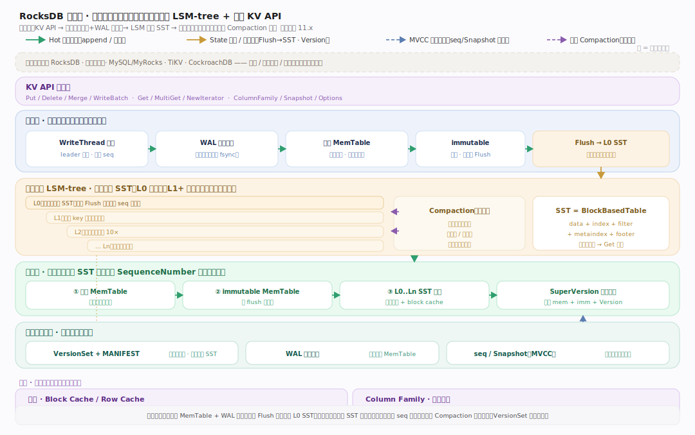
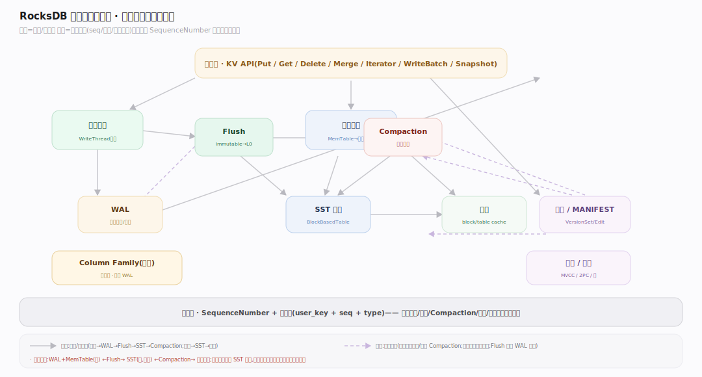

# RocksDB 原理 · 全景主线框架

> **定位**：本篇是全库地图与总纲。用"双维模型"把所有主线归位（能力域 × 执行时机），给出总架构图、`接触面 × 能力域` 依赖矩阵，并声明 RocksDB 区别于分布式数据库的三条贯穿性事实。**读全库从这里开始，遇到"某能力属于哪条主线"回这里查依赖矩阵。** 源码基准 **RocksDB 11.7.0**（`~/workdir/rocksdb`）。

RocksDB 是**嵌入式、持久化的 LSM-tree 键值存储库**（原型：嵌入式存储引擎 / KV 库）——它不是一个独立进程或服务器，而是一个**链接进宿主进程的 C++ 库**：宿主直接调 `Put/Get/Delete/Iterator` 等 KV API，RocksDB 在本地磁盘上以**日志结构合并树（LSM-tree）**组织数据。这一句决定了它的全部主线取法：没有 SQL/网络/分布式协调，取而代之的是**写入路径、读取路径、SST 存储、Flush、Compaction、版本、缓存、事务、WAL 恢复、列族**这些"单机存储引擎"的能力域。

---

## 一、核心事实：RocksDB 不是什么（三条贯穿声明）

理解 RocksDB 前，先立三条"它不做什么"——它们贯穿每条主线，是与分布式数据库/SQL 引擎的根本分野：

1. **嵌入式库，非独立服务。** RocksDB 无 server 进程、无网络协议、无 SQL。它以静态/动态库链接进宿主（MySQL/MyRocks、TiKV、CockroachDB、Kafka Streams…），宿主直接调用其 C++（或 Java/C）API。并发、事务边界、分布式复制都由**宿主**负责，RocksDB 只管"单机上把 KV 高效存好读好"。
2. **LSM-tree，非原地更新（in-place）。** 写入永不原地改磁盘：先追加 WAL + 写内存 MemTable，满了 flush 成不可变的 L0 SST 文件，再由 Compaction 在后台逐层归并。删除是写"墓碑（tombstone）"，更新是写新版本——旧数据靠 Compaction 惰性回收。这是**写放大换写吞吐**的经典取舍。
3. **多版本靠 SequenceNumber，非锁。** 每次写获得一个全局递增的 SequenceNumber；内部键 = `用户键 + 序列号 + 类型`。读在某个序列号的快照下，天然看到该时刻的一致视图（MVCC）。这让读写不互斥、快照零成本。

> 记忆锚点：**RocksDB = "一棵磁盘上的 LSM-tree" + "一套 KV API"**。写只管往内存和 WAL 追加，读要跨内存与多层 SST 归并，后台 Compaction 默默整理——三者的张力就是 LSM 的全部工程。

---

## 二、双维模型：能力域 × 执行时机

RocksDB 的主线按"归属能力域"归位，再按"执行时机"分前台调用期 / 后台守护线程：

- **接触面（用户调用）**：KV 操作 API（Put/Get/Delete/Merge/Iterator/WriteBatch/列族/Options/Snapshot）。
- **写侧能力域**：写入路径（WriteThread 分组 → WAL → MemTable）· Flush（immutable MemTable → L0 SST）。
- **读侧能力域**：读取路径（MemTable → SST 逐层，布隆短路）· SST 存储格式（BlockBasedTable）· 缓存（block cache / table cache）。
- **整理能力域**：Compaction（Leveled/Universal/FIFO，写读空间放大权衡）。
- **状态与一致性能力域**：版本与 MANIFEST（VersionSet/VersionEdit）· 事务与快照（MVCC/2PC/悲观乐观锁）· WAL 与崩溃恢复。
- **组织能力域**：Column Family（共享 WAL、独立 MemTable/SST/Version）。
- **贯穿**：SequenceNumber 与内部键（多版本的基础），横切读写与整理。

---

## 三、总架构图（位置即语义）

一次调用在库内的位置即语义：宿主进程调 `Put` → WriteThread 分组 → 写 WAL（顺序追加，崩溃可恢复）+ 插入内存 MemTable（跳表）→ MemTable 满转 immutable → 后台 Flush 成 L0 SST → 后台 Compaction 逐层归并成有序的 L1…LN；调 `Get` → 查活跃 MemTable → immutable MemTable → 逐层 SST（布隆过滤器短路 + block cache）→ 按 SequenceNumber 取正确版本。WAL、MemTable、SST 三态构成 LSM 的读写全景。

---

## 四、接触面 × 能力域 依赖矩阵

矩阵是三角一致性的仲裁表：每条能力域声称的依赖，必须能在此矩阵与被依赖主线正文同时对上。

---

## 五、能力域依赖关系

---

## 一句话总纲

**RocksDB 是一个嵌入宿主进程的持久化 LSM-tree 键值库：写入经 WriteThread 分组后先追加 WAL 再写内存 MemTable（跳表），满了 Flush 成不可变 L0 SST，Compaction 在后台逐层归并成有序的 L1…LN；读取跨活跃/不可变 MemTable 与多层 SST 归并、用布隆过滤器与 block cache 短路、按 SequenceNumber 取一致版本（MVCC）；版本与 MANIFEST 记录活跃 SST 集合、WAL 保崩溃恢复、Column Family 共享 WAL 而各自成树——用"永不原地更新 + 后台整理"的写放大代价，换来了极高的写吞吐与顺序 IO。**
