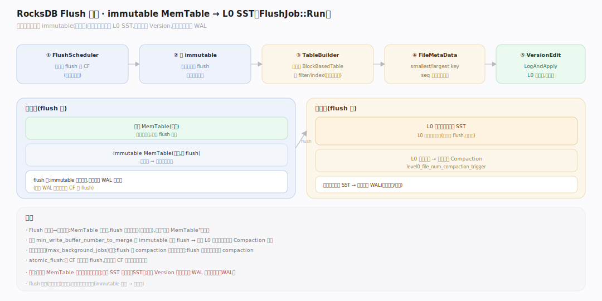
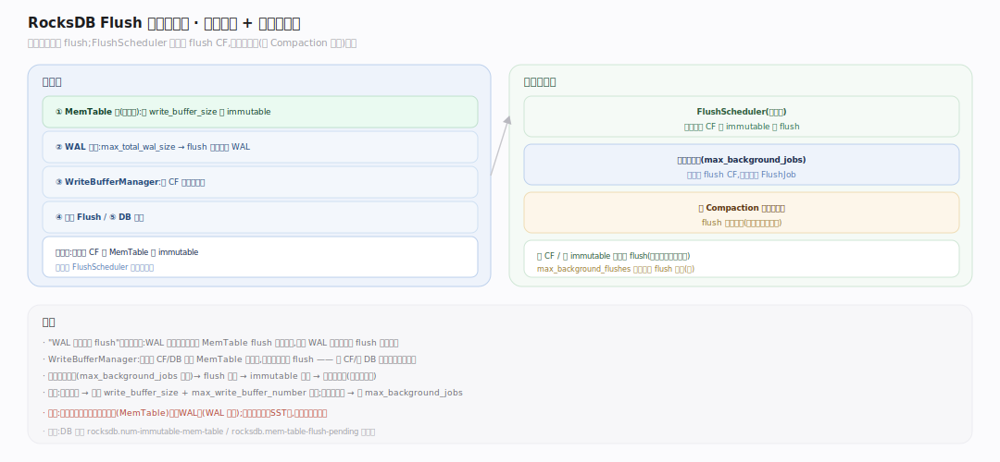
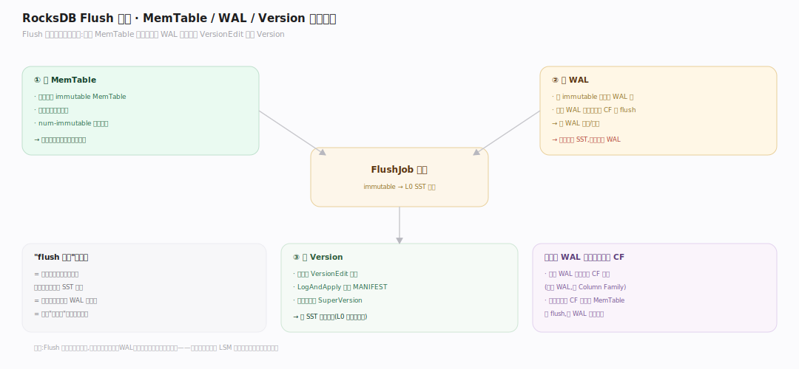

# RocksDB 原理 · 支撑主线 · Flush

> **定位**：属"写侧能力域"、后台守护线程。管把只读的 immutable MemTable 写成 L0 SST 文件的过程——连接内存与磁盘的桥。被【写入路径】的 MemTable 轮转触发，产出交给【版本】登记、【Compaction】接力整理。源码基准 **RocksDB 11.x**（`db/flush_job.cc`；正文行号锚点基于可克隆的 `v11.1.2` tag 逐一核实）。

Flush 是 LSM 从内存到磁盘的第一次落地：MemTable 写满转 immutable 后，后台线程把它整块序列化成一个不可变的 L0 SST。因为 MemTable 已是有序的（跳表按内部键），Flush 只需顺序遍历写出，无需排序。

---

## 一、Flush 全景：immutable MemTable → L0 SST

后台流程（`FlushJob::Run`，`db/flush_job.cc:217`）：① `FlushScheduler::TakeNextColumnFamily`（`db/flush_scheduler.cc:36`）给出待 flush 的 CF；② 拿该 CF 的 immutable MemTable（可能多个一起）建一个有序迭代器；③ 核心落盘在 `FlushJob::WriteLevel0Table`（`db/flush_job.cc:853`）：经 `TableBuilder` 把归并出的有序 KV 写成一个 BlockBasedTable（L0 SST），同时建 filter/index；④ 生成 `FileMetaData`（记 smallest/largest key、seq 范围、文件号）；⑤ 经 `VersionEdit` + `LogAndApply` 原子装进新 Version（该 SST 加入 L0）；⑥ 释放 immutable MemTable，对应的 WAL 段变为可删。注意 Flush 只做"MemTable→L0"这一步，不做跨层归并（那是 Compaction 的事），所以 L0 文件间 key 仍可重叠。

---

## 二、Flush 触发与调度

触发 flush 的情形：MemTable 写满 `write_buffer_size`（最常见，由 `MemTable::ShouldFlushNow`，`db/memtable.cc:197` 判定后在 `SwitchMemtable`，`db/db_impl/db_impl_write.cc:2490` 里轮转）；WAL 总大小超 `max_total_wal_size`（逼迫 flush 以释放老 WAL）；手动 `Flush`；DB 关闭；`WriteBufferManager` 跨 CF 总内存超限。`FlushScheduler::ScheduleWork`（`db/flush_scheduler.cc:14`，无锁栈，用 CAS 头插）记录需 flush 的 CF，`TakeNextColumnFamily`（`db/flush_scheduler.cc:36`）依次弹出；后台线程池（`max_background_jobs`，与 Compaction 共享）取出执行。多个 CF 或多个 immutable 可并发 flush。

## 深化 · Flush 与 WAL、Version 的联动

Flush 是三个子系统的交汇点：**与 MemTable**——消费 immutable，释放其内存；**与 WAL**——一个 WAL 段覆盖的所有 CF 的 MemTable 都 flush 后，该 WAL 才可删（`DBImpl::FindObsoleteFiles`，`db/db_impl/db_impl_files.cc:124` 计算可删 WAL，否则崩溃恢复还需要它）；**与 Version**——flush 产物经 `VersionEdit`（`db/version_edit.h:693`）记录"L0 加一个文件"，`VersionSet::LogAndApply`（`db/version_set.cc:6469`）写进 MANIFEST 并原子换 SuperVersion。开 `atomic_flush`（`include/rocksdb/options.h:1504`）时，多个 CF 的 flush 会作为一个原子单元一起装进 Version，保证跨 CF 的一致点。Flush 完成即意味着"这批数据已持久到 SST，不再依赖 WAL"。

## 拓展 · Flush 关键开关

| 开关 | 作用 |
|---|---|
| `write_buffer_size`（CF） | MemTable 满则转 immutable 触发 flush（默认 64MB） |
| `min_write_buffer_number_to_merge`（CF） | 攒几个 immutable 一起 flush（减少 L0 文件数） |
| `max_total_wal_size`（DB） | WAL 总量超限逼迫 flush 释放老 WAL |
| `max_background_jobs`（DB） | 后台 flush+compaction 线程数 |
| `atomic_flush`（DB） | 多 CF 原子一起 flush（跨 CF 一致性场景） |

## 常见误区与工程要点

- **误区：Flush 要排序。** 不。MemTable 已按内部键有序（跳表），flush 只需顺序遍历写出。
- **误区：Flush 后 WAL 立即删。** 不。要等该 WAL 覆盖的**所有 CF** 的相关 MemTable 都 flush 了才可删（共享 WAL）。
- **误区：每个 immutable 都单独 flush。** 可攒 `min_write_buffer_number_to_merge` 个一起 flush，减少 L0 小文件、降后续 Compaction 压力。
- **归属提醒**：触发源之一的 MemTable 轮转在【写入路径】；产物 SST 格式在【SST 存储格式】；登记进 Version 在【版本】；WAL 生命周期在【WAL 与恢复】。

## 一句话总纲

**Flush 是 LSM 从内存到磁盘的第一次落地：后台 FlushJob 把写满转为只读的 immutable MemTable（已按内部键有序）经 TableBuilder 顺序写成不可变 L0 SST，生成 FileMetaData 并经 VersionEdit+LogAndApply 原子装进新 Version；触发源有 MemTable 满、WAL 超限、手动、关库等，可攒多个 immutable 一起 flush 减少 L0 文件——flush 完成即数据持久化、对应 WAL 可删,是写入路径与 Compaction 之间的桥。**
