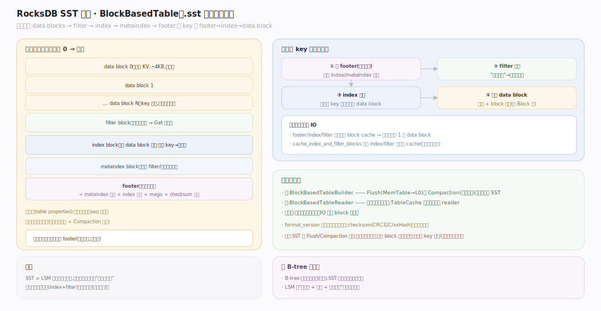
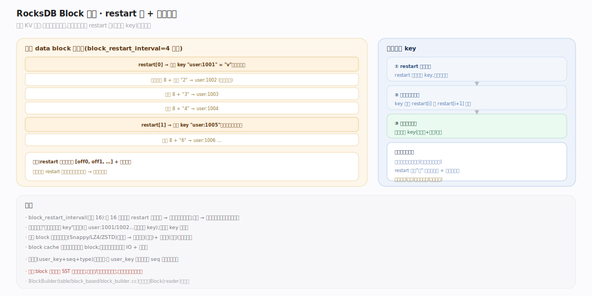
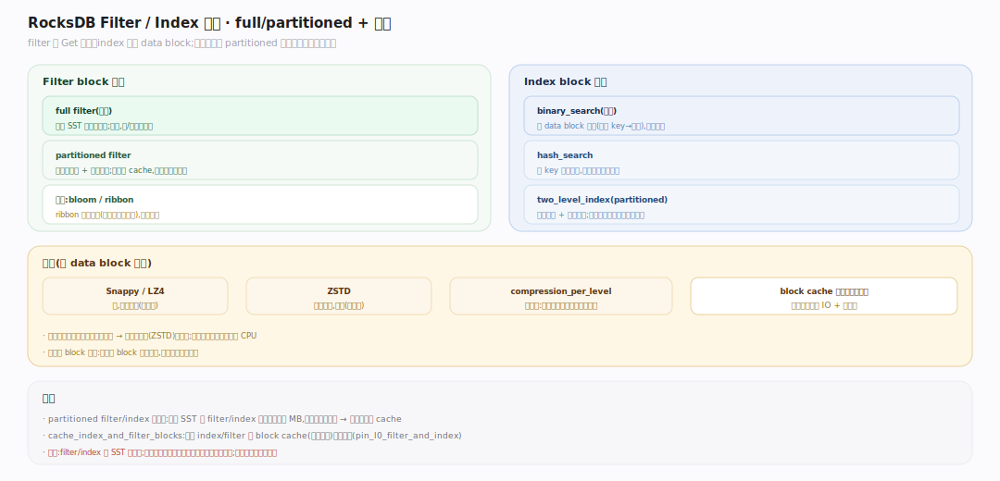

# RocksDB 原理 · 支撑主线 · SST 存储格式

> **定位**：属"读侧能力域"、后台产物。管数据在磁盘上的物理格式：BlockBasedTable（.sst 文件）的块布局。被【Flush】/【Compaction】写出、被【读取路径】读入、块由【缓存】缓存。它是 LSM 落盘数据的最终形态。源码基准 **RocksDB 11.x**（`table/block_based/`；正文行号锚点基于可克隆的 `v11.1.2` tag 逐一核实）。

SST（Sorted String Table）是不可变、内部有序的磁盘文件。RocksDB 默认用 **BlockBasedTable**：把有序 KV 切成一个个 **data block**，配 **index block** 定位、**filter block** 短路，末尾 **footer** 指路。读一个 key 的路径是 footer → index → 目标 data block，通常一两次 IO。

---

## 一、BlockBasedTable 物理布局

一个 .sst 文件从头到尾（写端 `BlockBasedTableBuilder::Add`/`Finish`，`table/block_based/block_based_table_builder.cc:1520`）：**data blocks**（有序 KV，每块默认 4KB，可压缩）→ **filter block**（布隆过滤器）→ **index block**（每个 data block 一条索引：该块最大 key → 块偏移）→ **metaindex block**（指向 filter/属性等元块）→ **footer**（固定尾部：指向 metaindex 与 index 的 BlockHandle 偏移 + magic number + 校验类型）。读取先读固定 footer（`Footer::DecodeFrom`，`table/format.cc:330`，靠 `kBlockBasedTableMagicNumber` 识别表类型，见 `table/format.cc:176`），拿到 index 位置，二分 index 找到目标 data block，再（经 filter 短路后）读该 block。

---

## 二、Block 内部：restart 点与前缀压缩

data block 内的 KV 也是有序的（写端 `BlockBuilder::Add`，`table/block_based/block_builder.cc:220`），用**前缀压缩**省空间：相邻 key 常有公共前缀（如 `user:1001`、`user:1002`），只存"与上一条的公共前缀长度 `shared` + 剩余后缀"（`shared` 计算在 `table/block_based/block_builder.cc:279` 一带）。但全靠前缀压缩就无法二分，于是每隔 `block_restart_interval`（默认 16）条设一个 **restart point**（存完整 key、记偏移；restart 数组初始化见 `block_builder.cc:105`），块尾存 restart 点数组。查找时先在 restart 点上二分定位到区间，再在区间内顺序解前缀扫。这样兼得空间与查找效率。

---

## 三、Filter 与 Index 的类型

- **Filter block**：full filter（整文件一个布隆，默认 `FullFilterBlockReader`，读端 `KeyMayMatch` 在 `table/block_based/full_filter_block.cc:94`）或 **partitioned filter**（分块，`PartitionedFilterBlockReader`，`table/block_based/partitioned_filter_block.h:150`，按需入 cache，大文件省内存）；算法 bloom（默认 `FastLocalBloomBitsBuilder`，`table/block_based/filter_policy.cc`）或更省的 ribbon。让 Get 在读 data block 前就判"一定不在"。
- **Index block**：binary search（默认，每 data block 一条）、hash index（点查前缀加速）、或 **partitioned index**（索引分块，`PartitionIndexReader`，`table/block_based/partitioned_index_reader.h:15`，超大文件避免索引本身过大常驻）。
- **压缩**：每个 data block 独立压缩（Snappy/LZ4/ZSTD…），`compression_per_level` 可分层设（上层快压、底层重压省空间）。读时按块解压，配合 block cache 缓存解压后的块。

## 拓展 · SST 关键开关

| 开关（table factory / CF Options） | 作用 |
|---|---|
| `block_size` | data block 目标大小（默认 4KB，大块省索引/元数据、小块读放大低） |
| `filter_policy` | 布隆/ribbon、`bits_per_key`、full/partitioned |
| `index_type` | binary_search / hash_search / two_level_index（partitioned） |
| `compression` / `compression_per_level` | 块压缩算法，可分层 |
| `block_restart_interval` | 每几条 KV 一个 restart 点（默认 16） |
| `format_version` | SST 格式版本（新版支持新特性） |
| `checksum` | 块校验算法（CRC32C/xxHash，检测损坏） |

## 常见误区与工程要点

- **误区：SST 可被修改。** 不。SST 一旦写出即不可变，更新只能靠写新文件 + Compaction 淘汰旧的——这是 LSM 的地基。
- **误区：一个 block 存一个 key。** 不。一个 data block（默认 4KB）存许多有序 KV；block 是压缩、缓存、IO 的基本单位。
- **误区：读一个 key 要扫全文件。** 不。footer → index 二分 → filter 短路 → 一个 data block，通常一两次 IO。
- **误区：block_size 越小越好。** 小块读放大低但索引/元数据开销大、压缩率差；需按读模式权衡（点查偏小、扫描偏大）。
- **归属提醒**：SST 由【Flush】/【Compaction】产出；读它在【读取路径】；block 缓存在【缓存】；文件的层归属与元信息（smallest/largest key）在【版本】的 FileMetaData。

## 一句话总纲

**SST 是不可变、内部有序的磁盘文件，默认 BlockBasedTable 格式：有序 KV 切成 data block（前缀压缩 + restart 点兼顾省空间与二分、每块独立压缩），配 index block（每块一条索引，可 partitioned）定位、filter block（布隆，可 partitioned）短路、footer 指路；读一个 key 走 footer→index 二分→filter 判→读一个 data block，通常一两次 IO——这套块结构是 LSM 落盘数据被高效读取的物理基础。**
