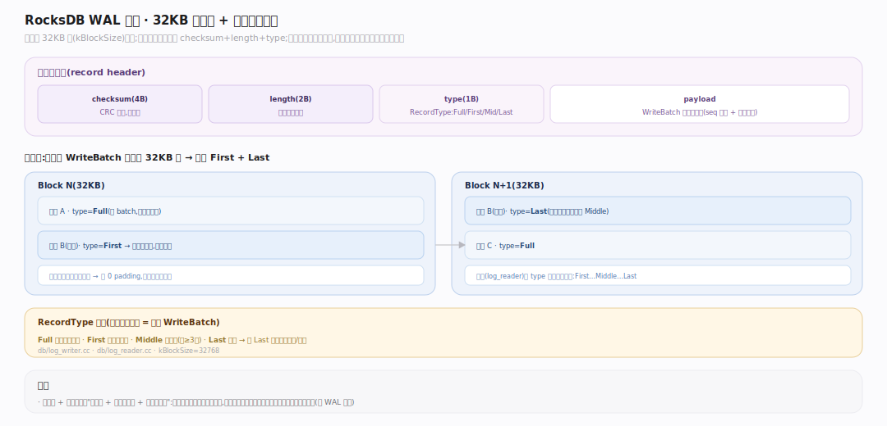
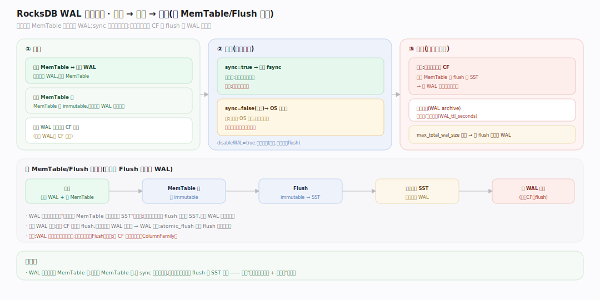
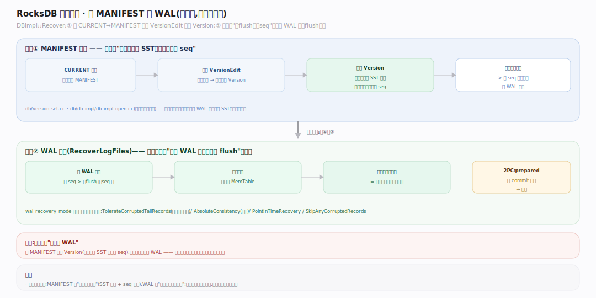

# RocksDB 原理 · 支撑主线 · WAL 与崩溃恢复

> **定位**：属"状态与一致性能力域"。管写前日志（Write-Ahead Log）的格式、生命周期，以及崩溃后如何恢复到一致状态。被【写入路径】追加、【Flush】决定其可删时机、开库时驱动恢复。是 RocksDB 持久性保证的根基。源码基准 **RocksDB 11.7.0**（`db/log_writer.cc`, `db/db_impl/db_impl_open.cc`）。

MemTable 是易失内存，进程崩了就没。**WAL** 让每条写在进 MemTable 前先顺序追加到磁盘日志——崩溃后重放 WAL 即可重建丢失的 MemTable。WAL 的顺序写远快于随机写，是"高写吞吐 + 持久"的关键。

---

## 一、WAL 记录格式：块对齐 + 分片

WAL（`db/log_writer.cc`）按 **32KB 块**（`kBlockSize`）组织。每条物理记录头含 checksum + length + **type**（`RecordType`）：一条逻辑记录（一个 WriteBatch）若跨块，会被切成 First/Middle/Last 片段；不跨块则是 Full。这样读端（`log_reader`）能识别记录边界、跳过损坏块。每条 WriteBatch 序列化后作为一条逻辑记录追加，含其 seq 基准与所有写操作。

---

## 二、WAL 生命周期：创建 → 同步 → 删除

WAL 的一生：**创建**——每个活跃 MemTable 对应一个 WAL（切换 MemTable 时可能建新 WAL）；**同步**——`WriteOptions::sync=true` 则每次写 fsync（最持久最慢），否则靠 OS 异步刷（快但崩溃可能丢最后几条）；**删除**——一个 WAL 覆盖的**所有 CF** 的相关 MemTable 都 flush 成 SST 后，该 WAL 不再被恢复需要，可删（或先归档 `WAL archive`）。`max_total_wal_size` 超限会逼迫 flush 以释放老 WAL。

## 深化 · 崩溃恢复：先 MANIFEST 后 WAL

开库恢复（`DBImpl::Recover`）严格两阶段：① **MANIFEST 恢复**——从 CURRENT 找当前 MANIFEST，重放 VersionEdit 重建最新 Version（知道有哪些 SST、数据到哪个 seq，见【版本】）；② **WAL 重放**（`RecoverLogFiles`）——找出比"已 flush 的最大 seq"更新的 WAL 记录，逐条重放进新 MemTable，补上崩溃前未 flush 的写。重放完成即恢复到崩溃前的一致状态。`wal_recovery_mode` 控制遇损坏记录的策略（容忍尾部损坏/严格一致/…）。

## 拓展 · WAL 关键开关

| 开关 | 作用 |
|---|---|
| `WriteOptions::sync` | 每次写是否 fsync WAL（true 持久、慢；false 快、崩溃可能丢尾部） |
| `WriteOptions::disableWAL` | 完全跳过 WAL（最快，崩溃丢未 flush 数据） |
| `max_total_wal_size`（DB） | WAL 总量超限逼迫 flush 释放老 WAL |
| `wal_recovery_mode`（DB） | 恢复时遇损坏记录的策略（TolerateCorruptedTailRecords 等） |
| `WAL_ttl_seconds` / `WAL_size_limit_MB` | WAL 归档保留策略（用于复制/增量备份） |
| `manual_wal_flush` | 手动控制 WAL flush 时机（攒批 fsync） |

## 常见误区与工程要点

- **误区：写完 MemTable 才写 WAL。** 顺序相反——先追加 WAL（持久）再插 MemTable（易失），这样崩溃能重放。
- **误区：sync=false 就不持久。** 数据仍写了 WAL（在 OS 缓冲），只是没强制 fsync；进程崩不丢（OS 还在），整机断电才可能丢最后几条。要绝对持久用 sync=true。
- **误区：恢复先重放 WAL。** 先 MANIFEST 重建 Version（知道已有 SST 到哪），再 WAL 重放补未 flush 的——顺序不能反。
- **误区：Flush 后 WAL 立刻删。** 要等该 WAL 覆盖的所有 CF 的 MemTable 都 flush（共享 WAL），且可能先归档。
- **归属提醒**：WAL 由【写入路径】追加；可删时机由【Flush】决定；恢复紧接【版本】的 MANIFEST 恢复；2PC 的 prepare 标记也写在 WAL（【事务与快照】）。

## 一句话总纲

**WAL 是 RocksDB 持久性的根基:每条写进易失 MemTable 前先顺序追加到 32KB 块对齐、可跨块分片的磁盘日志(可 fsync),崩溃后靠重放它重建丢失的 MemTable;一个 WAL 覆盖的所有 CF 都 flush 后才可删;开库恢复严格两阶段——先从 MANIFEST 重建 Version(已有哪些 SST、到哪个 seq)、再重放比该 seq 更新的 WAL 补未 flush 的写——用顺序日志换来了"高写吞吐 + 崩溃可恢复"的兼得。**
