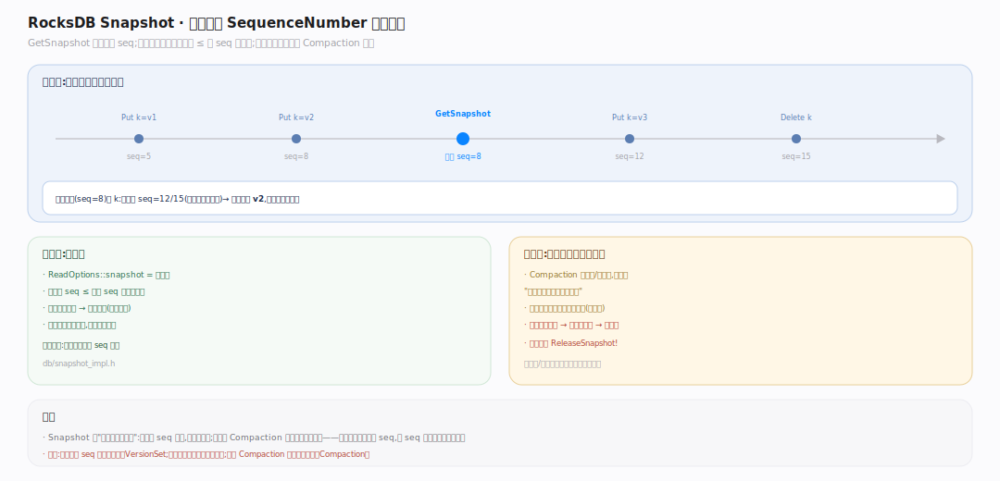

# RocksDB 原理 · 支撑主线 · 事务与快照（MVCC）

> **定位**：属"状态与一致性能力域"。管多版本并发控制的基础（SequenceNumber + 内部键）、一致性快照（Snapshot）、以及可选的事务层（悲观/乐观 + 2PC）。被【读取路径】用于取一致版本、被【接触面】的 Snapshot/事务 API 依赖。是 RocksDB 提供隔离与原子性的核心。源码基准 **RocksDB 11.x**（`db/dbformat.h`, `utilities/transactions/`；正文行号锚点基于可克隆的 `v11.1.2` tag 逐一核实）。

RocksDB 的多版本不是靠锁，而是靠**每次写获得的全局递增 SequenceNumber**：内部键 = 用户键 + seq + 类型。读在某个 seq 快照下天然看到该时刻的一致视图。在此之上，事务层（可选）提供加锁/冲突检测/2PC。

---

## 一、MVCC 基础：SequenceNumber 与内部键

每条写从 `VersionSet` 拿一个全局递增的 **SequenceNumber**（`using SequenceNumber = uint64_t`，`include/rocksdb/types.h:22`）。存储的**内部键** = `用户键 + seq(7字节) + 类型(1字节)`（尾部固定 8 字节，`kNumInternalBytes = 8`，`db/dbformat.h:134`；seq 与类型由 `PackSequenceAndType`，`db/dbformat.h:181` 打包进一个 uint64），同一用户键的多版本按 seq 降序相邻排列。读时给定一个 seq 上界（快照），归并时只取"seq ≤ 快照且最大"的那个版本——这就是 MVCC：读看到写发生时刻的一致视图，读写不互斥。类型（`enum ValueType`，`db/dbformat.h:41`：`kTypeValue=0x1`、`kTypeDeletion=0x0`、`kTypeMerge=0x2`…）区分这是值、墓碑还是合并操作数。

---

## 二、Snapshot：钉住一个 SequenceNumber

`GetSnapshot`（`DBImpl::GetSnapshot`，`db/db_impl/db_impl.cc:4277`）返回一个 **Snapshot**（`class SnapshotImpl`，`db/snapshot_impl.h:23`），本质是钉住当前的 SequenceNumber（并挂进 `SnapshotList` 双向链）。之后带 `ReadOptions::snapshot` 的读都以该 seq 为上界——无论期间有多少新写，都看不到 seq 更大的版本，得到一致视图。Snapshot 的另一作用：**保护旧版本不被 Compaction 提前回收**——Compaction 丢墓碑/旧值时要检查"是否还有存活 Snapshot 需要它"（取 `SnapshotList` 里最老 seq），最老 Snapshot 之后的版本都得留。用完必须 `ReleaseSnapshot`，否则拖住旧版本回收、涨空间。

## 三、事务：悲观、乐观与 2PC

可选事务层（`TransactionDB`）构建在 WriteBatch + Snapshot 之上：

- **悲观事务**（`PessimisticTransaction`，`utilities/transactions/pessimistic_transaction.h:36`）：写前加行锁（`TryLock`，`utilities/transactions/pessimistic_transaction.cc:1138`，point lock，冲突则等待/超时），Commit 时释放。锁管理器维护 key→事务的锁表。适合高冲突。
- **乐观事务**（`OptimisticTransactionDB`）：不加锁，事务内写缓存进 WriteBatch，Commit 时 `CheckTransactionForConflicts`（`utilities/transactions/optimistic_transaction.cc:192`）检查"读过/写过的 key 自事务开始有没有被别人改"（比较 seq），冲突则整体失败重试。适合低冲突。
- **2PC**（Prepare/Commit）：`PessimisticTransaction::Prepare`（`utilities/transactions/pessimistic_transaction.cc:590`，内部 `WriteCommittedTxn::PrepareInternal` `:640`）把 batch 写 WAL（带 prepare 标记）但延后落 MemTable，Commit 再落——支持跨系统协调（如 MyRocks 与 binlog）。WritePrepared/WriteUnprepared 是不同的 2PC 策略。

## 拓展 · 事务相关要点

| 概念 | 说明 |
|---|---|
| SequenceNumber | 全局递增写序号，MVCC 的时钟（VersionSet 维护） |
| 内部键 | 用户键 + seq + 类型；多版本与归并的基础 |
| Snapshot | 钉住一个 seq；一致读 + 保护旧版本不被回收 |
| PessimisticTransaction | 加锁 + 冲突等待；TransactionDB |
| OptimisticTransaction | 无锁 + Commit 时冲突检测重试 |
| 2PC | Prepare（写 WAL）/ Commit（落 MemTable）；跨系统协调 |
| WriteBatchWithIndex | 带索引的 batch，支持事务内"读己之写" |

## 常见误区与工程要点

- **误区：MVCC 靠锁。** 不。多版本靠 SequenceNumber + 内部键；读写不互斥。锁只在（可选的）悲观事务层才有。
- **误区：Snapshot 是数据拷贝。** 不。它只是钉一个 seq 数字；代价极小，但会阻止旧版本被 Compaction 回收——久留不放会涨空间。
- **误区：RocksDB 默认有事务。** 默认只有单次 Write 的原子性（WriteBatch）；隔离/加锁/冲突检测需显式用 TransactionDB。
- **误区：乐观事务无开销。** 它省了锁但 Commit 要冲突检测、失败要重试；高冲突场景比悲观还慢。
- **归属提醒**：seq 在【版本】的 VersionSet 维护；一致读的应用在【读取路径】；事务底层的 batch 在【接触面】WriteBatch；2PC 的 WAL 标记在【WAL 与恢复】。

## 一句话总纲

**RocksDB 的多版本靠 SequenceNumber 而非锁:每写取一个全局递增 seq、内部键=用户键+seq+类型、同键多版本按 seq 降序,读在某 seq 快照下只取可见的最新版本(MVCC);Snapshot 钉住一个 seq 做一致读并保护旧版本不被 Compaction 提前回收;可选事务层在 WriteBatch+Snapshot 上提供悲观锁/乐观冲突检测/2PC——隔离与原子性是分层叠加的,底座永远是那个递增的 seq。**
