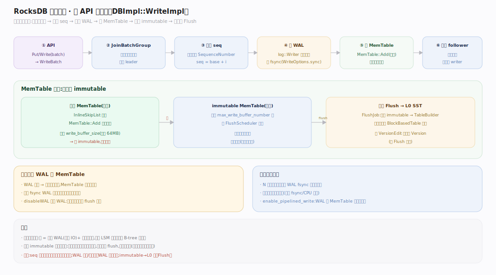
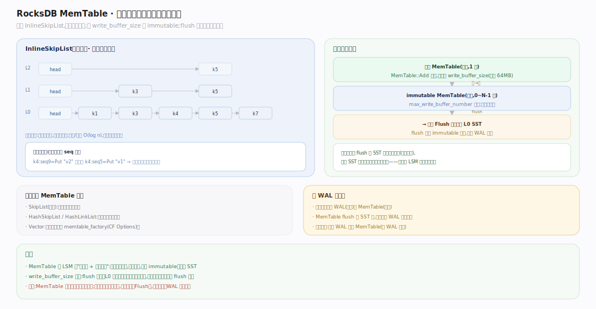

# RocksDB 原理 · 支撑主线 · 写入路径

> **定位**：属"写侧能力域"、前台调用期。管一次写从 API 到落定内存的全过程：WriteThread 分组 → WAL 追加 → MemTable 插入 → 满转 immutable。被【接触面】的所有写类 API 依赖，向下交给【Flush】落盘、依赖【WAL 与恢复】保久、依赖【版本】换 SuperVersion。源码基准 **RocksDB 11.7.0**（`~/workdir/rocksdb`）。

RocksDB 写入的第一原则是**永不原地更新**：不去磁盘上找旧值改，而是往内存 MemTable 和 WAL 顺序追加。这换来极高写吞吐（全顺序 IO），代价是同一 key 留下多版本、靠后台 Compaction 回收。写路径的工程重点是**如何让高并发写高效地共享 WAL 与 MemTable**。

---

## 一、写入全景：从 API 到内存

一次 `Put`/`Write(batch)` 的路径（`DBImpl::WriteImpl`）：① 写线程调 `WriteThread::JoinBatchGroup` 加入写组；② 一个 leader 被选出，把同时到达的多个 writer 的 WriteBatch 合并成一个"写组"；③ leader 分配连续 SequenceNumber，把整组一次性追加进 WAL（`log::Writer`，可 fsync）；④ 把各 WriteBatch 插入活跃 MemTable（`MemTable::Add`）；⑤ MemTable 写满 `write_buffer_size` 则转为 immutable、建新的活跃 MemTable，并通知后台 Flush。

---

## 二、WriteThread：leader-follower 组提交

高并发下，每个写线程各自 fsync WAL 会极慢。RocksDB 用 **WriteThread**（`db/write_thread.h`）把同时到达的写攒成一组：先到者成 leader（`STATE_GROUP_LEADER`），后到者成 follower 挂在链上等待。leader 代表整组：一次分配 seq、一次写 WAL、（可选并发）写 MemTable，完成后唤醒 followers。这样 **N 个并发写只付一次 WAL fsync 的固定开销**，吞吐随并发线性上升。可开 `enable_pipelined_write`（WAL 与 MemTable 写流水线化）或 `unordered_write`。

---

## 三、MemTable：内存中的有序写缓冲

活跃 MemTable 是内存里的**有序**写缓冲，默认实现是 **InlineSkipList**（跳表，`memtable/inlineskiplist.h`）：按内部键（用户键 + seq + 类型）排序，插入 O(log n)、并发插入友好。`MemTable::Add` 把每条写编码进跳表。写满 `write_buffer_size`（默认 64MB）后，活跃 MemTable **转为只读 immutable**、创建新的活跃 MemTable 继续接写；immutable 进 `FlushScheduler` 队列等后台落盘。可配多个 immutable（`max_write_buffer_number`）缓冲突发写。

---

## 深化 · 写停顿与写限速（write stall）

若写入速度持续超过 Flush/Compaction 的消化速度，MemTable 会堆积、L0 文件会暴涨，最终读性能崩溃。RocksDB 用 **WriteController** 施加背压：当未 flush 的 immutable 数逼近 `max_write_buffer_number`、或 L0 文件数超 `level0_slowdown_writes_trigger` 时**减速**写（delay），超 `level0_stop_writes_trigger` 时**完全停写**直到后台追上。这是保护 LSM 形状不崩坏的负反馈闸门——观测量=积压深度，动作=限速/停写，缩误差=等后台消化。

## 拓展 · 写路径关键开关

| 开关（所属 Options） | 作用 |
|---|---|
| `write_buffer_size`（CF） | 单个 MemTable 大小，满则转 immutable（默认 64MB） |
| `max_write_buffer_number`（CF） | 最多几个 MemTable（1 活跃 + N-1 immutable 缓冲） |
| `WriteOptions::sync` | 每次写是否 fsync WAL（true 更持久、更慢） |
| `WriteOptions::disableWAL` | 跳过 WAL（快但崩溃丢数据，适合可重建数据） |
| `enable_pipelined_write`（DB） | WAL 写与 MemTable 写流水线化，提并发写吞吐 |
| `level0_slowdown/stop_writes_trigger`（CF） | 写停顿触发阈值 |

## 常见误区与工程要点

- **误区：写要先读旧值。** 不。写是纯追加，不读磁盘；覆盖 = 写更高 seq 的新版本，旧版本靠 Compaction 回收。
- **误区：每个写各自 fsync。** 不。WriteThread 组提交让一组写共享一次 fsync，这是高并发写吞吐的关键。
- **误区：MemTable 无序。** 它是**有序**跳表（按内部键），这样 flush 成 SST 时天然有序、读时可二分。
- **误区：disableWAL 更安全。** 相反——省了 WAL 就没了崩溃恢复，进程崩了未 flush 的写全丢。
- **归属提醒**：immutable → L0 SST 的落盘在【Flush】；WAL 记录格式与恢复在【WAL 与恢复】；seq 的多版本语义在【事务与快照】。

## 一句话总纲

**RocksDB 写入永不原地更新：DBImpl::WriteImpl 经 WriteThread 把并发写攒成 leader-follower 写组，一次分配连续 SequenceNumber、一次追加 WAL（组提交摊薄 fsync）、再插入有序的跳表 MemTable；MemTable 写满 write_buffer_size 转 immutable 并交后台 Flush，WriteController 在积压时限速/停写以保护 LSM 形状——用顺序 IO 与组提交换来极高写吞吐，多版本代价交给 Compaction 偿还。**
