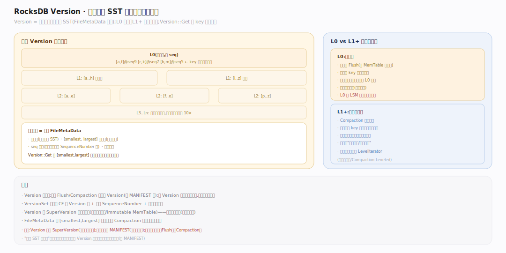
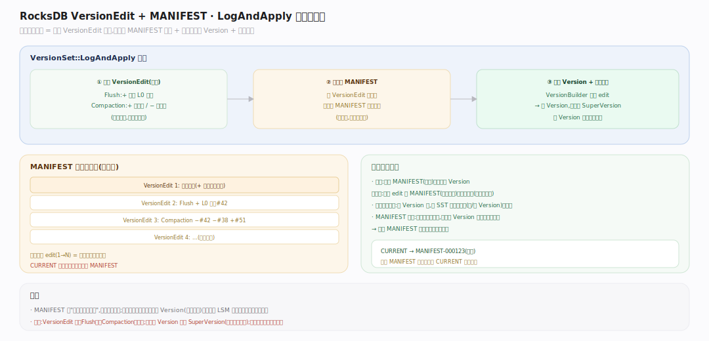
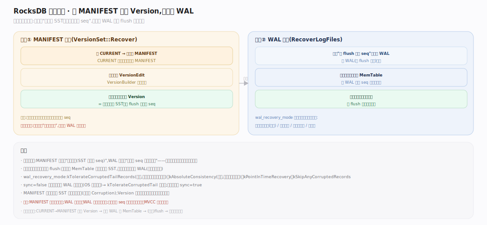

# RocksDB 原理 · 支撑主线 · 版本与 MANIFEST

> **定位**：属"状态与一致性能力域"。管 LSM 的元数据：当前每层有哪些 SST 文件（Version）、文件变更如何原子记录（VersionEdit + MANIFEST）。是【读取路径】SuperVersion 的组成、【Flush】/【Compaction】产物的落点。它让"哪些文件是活的"这件事崩溃可恢复、并发可一致。源码基准 **RocksDB 11.7.0**（`db/version_set.cc`）。

RocksDB 的数据在 SST 文件里，但"当前有效的 SST 集合是哪些、各在哪层"是一份需要持久化且原子更新的元数据。Version 描述某一时刻的文件集合快照；每次 Flush/Compaction 产生一个 VersionEdit（差量）；MANIFEST 是 VersionEdit 的日志，崩溃后靠它重建最新 Version。

---

## 一、Version 与 LSM 层结构

**Version** 是"某一时刻该 CF 每层有哪些 SST 文件"的不可变快照：每层一个 `FileMetaData` 列表，每个 `FileMetaData` 记文件号、smallest/largest 内部键、seq 范围、文件大小。**层结构**：L0 文件可重叠（按 seq 新旧，读要查每个）；L1+ 层内非重叠、全局有序（读可二分至多一个文件）。`Version::Get` 就靠 FileMetaData 的 key 范围逐层定位。多个 Version 由 `VersionSet` 串成链（老 Version 被读引用时不释放）。

---

## 二、VersionEdit 与 MANIFEST：原子记录文件变更

每次 Flush/Compaction 改变文件集合，产生一个 **VersionEdit**（差量：加了哪些文件、删了哪些）。`VersionSet::LogAndApply`：① 把 VersionEdit 追加写进 **MANIFEST**（一个日志文件，`db/version_set.cc`）；② `VersionBuilder` 把 edit 应用到当前 Version 生成新 Version；③ 原子安装新 Version（换 SuperVersion）。MANIFEST 记录的是**变更序列**，不是全量——重放所有 edit 即得最新文件集合。CURRENT 文件指向当前生效的 MANIFEST。

## 深化 · 开库恢复：从 MANIFEST 重建 Version

开库时（`VersionSet::Recover`）先读 CURRENT 找到当前 MANIFEST，从头重放所有 VersionEdit，`VersionBuilder` 逐个应用，重建出崩溃前最后的 Version（每层文件集合）。这一步在 WAL 重放**之前**——先知道"有哪些 SST 文件、数据到哪了"，再重放 WAL 补上未 flush 的最新写。MANIFEST 太大时会滚动新建（把当前 Version 全量写进新 MANIFEST 作为基准）。

## 拓展 · 版本相关要点

| 概念 | 说明 |
|---|---|
| `FileMetaData` | 单 SST 元信息：文件号、[smallest,largest] 内部键、seq 范围、大小 |
| `Version` | 某时刻每层 SST 集合的不可变快照 |
| `VersionEdit` | 一次变更的差量（+文件/-文件/层信息） |
| `VersionSet` | 管理所有 CF 的 Version 链 + 全局 SequenceNumber + 下一个文件号 |
| `MANIFEST` | VersionEdit 的持久日志；CURRENT 指向当前 MANIFEST |
| `LogAndApply` | 写 edit 到 MANIFEST + 建新 Version + 原子安装 |

## 常见误区与工程要点

- **误区：MANIFEST 存数据。** 不。它只存"文件集合的变更日志"（元数据），数据在 SST 里。
- **误区：Version 是可变的。** 不。Version 不可变，每次变更生成新 Version；旧 Version 被读引用时保留，无人引用才回收。
- **误区：恢复先重放 WAL。** 顺序相反——先从 MANIFEST 重建 Version（知道有哪些 SST），再重放 WAL 补未 flush 的写。
- **误区：全局 SequenceNumber 在别处。** 它在 `VersionSet` 里维护，随每次写递增，也随 MANIFEST 持久化——是 MVCC 的全局时钟。
- **归属提醒**：Flush/Compaction 产生 VersionEdit（那两个主线）；Version 组成 SuperVersion（【读取路径】）；WAL 重放在【WAL 与恢复】，紧接 Version 恢复之后。

## 一句话总纲

**版本与 MANIFEST 管 LSM 的元数据：Version 是某时刻每层 SST 集合的不可变快照（FileMetaData 记每文件 key/seq 范围，L0 重叠、L1+ 非重叠有序），每次 Flush/Compaction 产生 VersionEdit 差量、经 LogAndApply 追加进 MANIFEST 日志并原子换出新 Version；开库时从 CURRENT→MANIFEST 重放所有 edit 重建最新 Version（在 WAL 重放之前），全局 SequenceNumber 也在 VersionSet 维护——让"哪些文件是活的"崩溃可恢复、并发可一致。**
