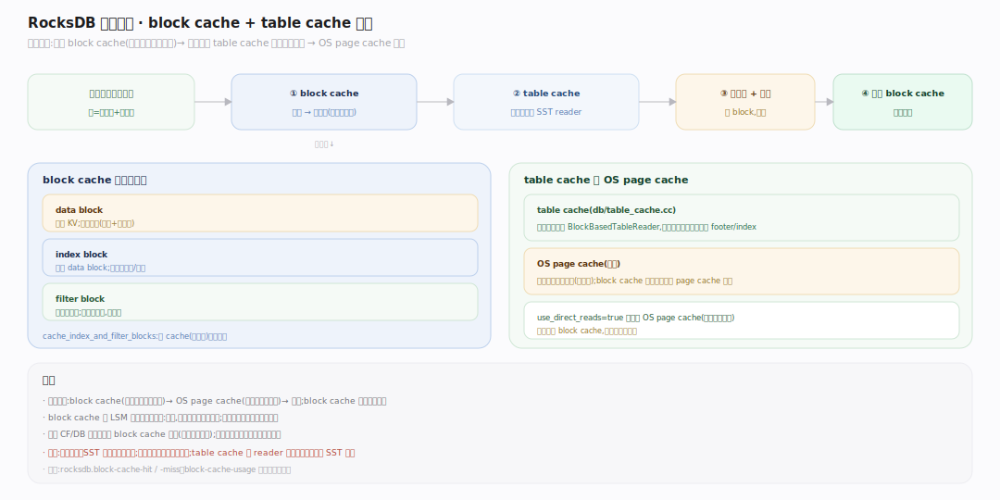

# RocksDB 原理 · 支撑主线 · 缓存

> **定位**：属"读侧能力域"。管把热数据留在内存以避免重复磁盘 IO：block cache（缓存 SST 的 data/index/filter block）与 table cache（缓存打开的 SST reader）。被【读取路径】命中查询，缓存的是【SST 存储格式】的块。是读性能的关键放大器。源码基准 **RocksDB 11.7.0**（`cache/`, `db/table_cache.cc`）。

LSM 读要跨多层 SST，若每次都读磁盘会很慢。RocksDB 用两层缓存：**block cache** 缓存解压后的 SST 块（data/index/filter），**table cache** 缓存已打开的 SST 文件句柄（含元信息）。加上操作系统的 page cache，构成读路径的多级缓存。

---

## 一、缓存全景：block cache + table cache

读一个 block 的路径：先查 **block cache**（键=文件号+块偏移）→ 命中直接用（免磁盘、免解压）；未命中则经 **table cache**（缓存打开的 `BlockBasedTableReader`，免重复打开文件解析 footer）读磁盘、解压、填入 block cache。block cache 缓存三类块：**data block**（真实 KV）、**index block**（定位）、**filter block**（布隆）。`cache_index_and_filter_blocks` 决定 index/filter 是进 block cache（可淘汰）还是常驻。

---

## 二、LRUCache 与 HyperClockCache

两种 block cache 实现：**LRUCache**（`cache/lru_cache.cc`，默认）——分片（sharded，减锁竞争）的 LRU，每片一把锁；**HyperClockCache**（`cache/clock_cache.cc`）——无锁的 clock 近似 LRU，高并发下吞吐更好但要求可估 key 大小。两者都**分片**：cache 切成 N 片，key 哈希到某片，各片独立锁/淘汰，降低多核锁竞争。容量满时按 LRU/clock 淘汰最久未用的块。

## 深化 · 缓存的内容与淘汰策略

block cache 里不只 data block：index/filter block 也占位（超大文件的它们很大）。RocksDB 支持**缓存优先级**（high/low）：index/filter 可设高优先级更不易被淘汰（读它们的收益大）。`pin_l0_filter_and_index_blocks_in_cache` 把 L0 的 filter/index 钉住（L0 最常查）。读大表扫描时设 `fill_cache=false` 避免一次性大扫污染缓存（把热点挤出）。还有可选的 compressed block cache（缓存压缩块，二级）。

## 拓展 · 缓存关键开关

| 开关 | 作用 |
|---|---|
| `block_cache`（table） | 设置 block cache 实例与容量（多 CF/DB 可共享一个） |
| `cache_index_and_filter_blocks` | index/filter 进 block cache（省内存）还是常驻 |
| `pin_l0_filter_and_index_blocks_in_cache` | 钉住 L0 的 filter/index（最常查） |
| `cache_index_and_filter_blocks_with_high_priority` | index/filter 高优先级，不易淘汰 |
| `ReadOptions::fill_cache` | 本次读是否填缓存（大扫描时关，防污染） |
| HyperClockCache vs LRUCache | 高并发选前者，通用选后者 |

## 常见误区与工程要点

- **误区：block cache 缓存整个文件。** 不。缓存的是**块**（block 粒度），且是**解压后**的块；命中免磁盘 IO + 免解压。
- **误区：只缓存 data block。** index/filter block 也在（除非设为常驻）；超大文件它们很占空间，故有 partitioned 变体 + 优先级。
- **误区：block cache = OS page cache。** 是两层：block cache 存解压后的块（应用层）、OS page cache 存文件原始字节（含压缩）。可 `use_direct_reads` 绕过 OS cache。
- **误区：大扫描该缓存。** 大范围扫描设 `fill_cache=false`，否则把一次性数据灌进缓存、挤出真正的热点。
- **归属提醒**：缓存的内容是【SST 存储格式】的块；命中查询在【读取路径】；table cache 缓存的 reader 对应 SST 文件（其元信息在【版本】的 FileMetaData）。

## 一句话总纲

**缓存是 LSM 读性能的放大器：block cache（LRUCache 默认或高并发的 HyperClockCache,均分片降锁竞争）缓存解压后的 data/index/filter 块、table cache 缓存打开的 SST reader,读一个块先查 block cache 命中则免磁盘免解压、未命中经 table cache 读盘解压回填；支持缓存优先级、钉住 L0 的 filter/index、大扫描不填缓存防污染——用内存换掉 LSM 跨多层 SST 的重复 IO。**
