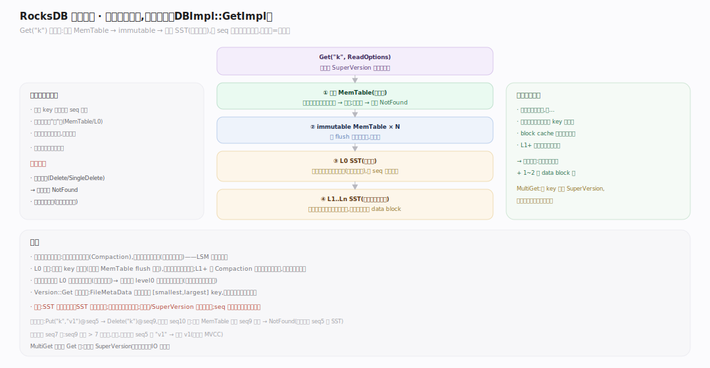
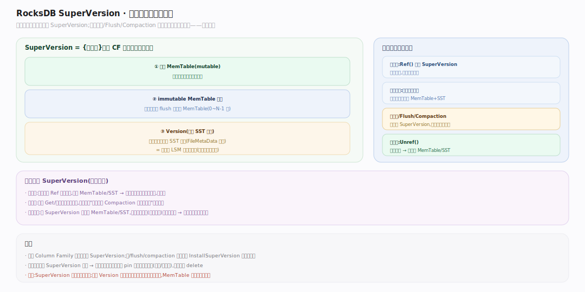
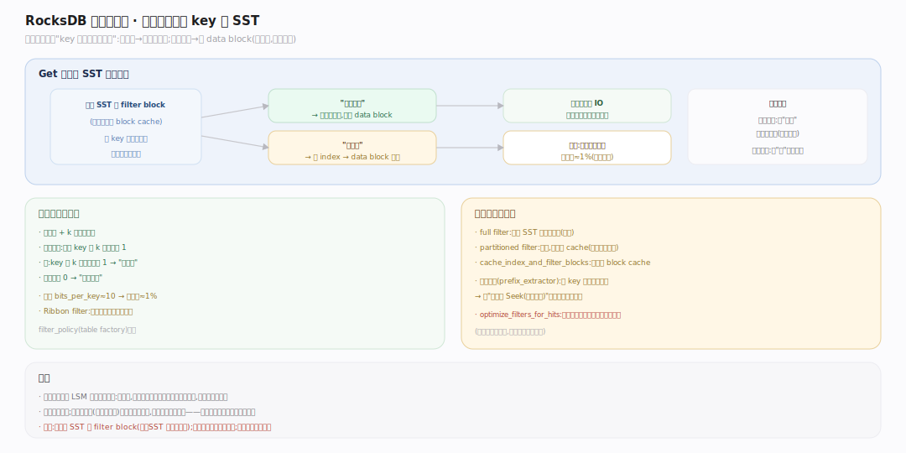
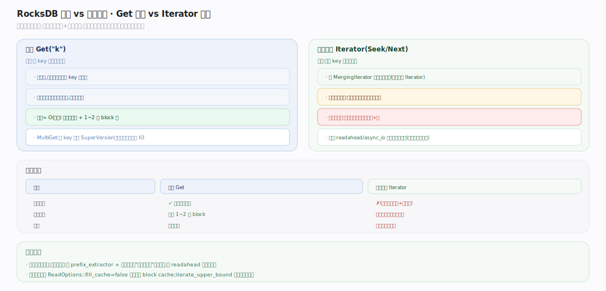

# RocksDB 原理 · 支撑主线 · 读取路径

> **定位**：属"读侧能力域"、前台调用期。管一次 `Get`/`MultiGet`/迭代从 API 到取值的全过程：查活跃 MemTable → immutable MemTable → 逐层 SST，用布隆过滤器短路、block cache 加速、按 SequenceNumber 取一致版本。被【接触面】读类 API 依赖，依赖【SST 存储格式】读文件、【缓存】命中、【版本】提供层结构与 SuperVersion。源码基准 **RocksDB 11.x**（正文行号锚点基于可克隆的 `v11.1.2` tag 逐一核实）。

LSM 的读是"用读放大换写吞吐"的另一面：同一 key 的版本散落在内存与多层 SST，读必须**由新到旧**查、找到第一个可见版本即停。工程重点是**如何用布隆过滤器和 block cache 把"查很多文件"的代价压下来**。

---

## 一、读取全景：由新到旧的查找顺序

`DBImpl::GetImpl`（`db/db_impl/db_impl.cc:2483`）的查找顺序（由新到旧，找到即停）：① 活跃 MemTable（`MemTable::Get`）；② 各 immutable MemTable；③ 逐层 SST（`Version::Get`，`db/version_set.cc:2710`，内部用 `FilePicker` 按 key 范围逐层挑候选文件）——L0 因文件可重叠要查每个可能命中的文件，L1+ 每层有序、二分定位至多一个文件。每步用**内部键**比较、按 SequenceNumber 取快照下最新可见版本，命中回调 `GetContext::SaveValue`（`table/get_context.cc:222`）判定该版本是值/墓碑/Merge 操作数，遇墓碑即返回"不存在"。整个查找先取一次 SuperVersion（`GetImpl` 开头 `GetAndRefSuperVersion`）作为一致快照。`MultiGet`（`db/db_impl/db_impl.cc:2964` → `MultiGetImpl` `:3338`）则共享一次 SuperVersion、把落到同一 SST 的多个 key 批量、（可 `async_io`）并行读，摊薄每 key 的定位开销。

---

## 二、SuperVersion：一致读的快照

**SuperVersion**（`struct SuperVersion`，`db/column_family.h:206`）是"某一时刻该 Column Family 的完整可读状态"三元组：`{活跃 MemTable, immutable MemTable 列表, Version(即活跃 SST 集合)}`。读操作开始时原子地引用当前 SuperVersion——热路径走 `ColumnFamilyData::GetThreadLocalSuperVersion`（`db/column_family.cc:1366`，线程本地缓存 + 一次 CAS 拿走，避免全局锁），慢路径 `GetReferencedSuperVersion`（`db/column_family.cc:1353`）加锁 Ref。整个 Get/迭代都基于它——即使期间发生写入、Flush、Compaction 换了新 SuperVersion（`InstallSuperVersion`），本次读仍看旧快照，结束才 `ReturnThreadLocalSuperVersion` 释放引用。这让读**无锁且一致**：读不阻塞写、写不影响进行中的读。SuperVersion 引用计数归零时回收旧的 MemTable/SST。

---

## 三、布隆过滤器：跳过不可能命中的 SST

若每次 Get 都读每层每个 SST，读放大巨大。**布隆过滤器**（每个 SST 的 filter block）用极小空间回答"这个 key **一定不在**本文件"——`Version::Get` 逐层挑到候选 SST 后，先经 `FullFilterBlockReader::KeyMayMatch`（`table/block_based/full_filter_block.cc:94`，内部 `MayMatch` 在 `:139`）判定：若过滤器说"不在"，直接跳过该文件不读 data block；说"可能在"才去读（可能假阳性但绝无假阴性）。默认策略 `FastLocalBloomBitsBuilder`（`table/block_based/filter_policy.cc`）每 key 约 10 bit、假阳性率约 1%，用双重哈希 + 缓存行局部化布位。配合"L1+ 每层二分至多一个文件"，一次点查通常只需读 1~2 个 data block。前缀布隆（prefix bloom）还能加速范围 Seek。

---

## 深化 · 点查 vs 范围扫描

- **点查 Get**：目标是"某 key 的最新可见值"。逐层查、布隆短路、找到即停——不需要全序，代价约 O(层数) 次布隆判断 + 1~2 次 block 读。
- **范围扫描 Iterator**：目标是"一段 key 的有序序列"。`NewIteratorImpl`（`db/db_impl/db_impl.cc:4073`）建一个 `DBIter`（`db/db_iter.h:57`）包住底层 `MergingIterator`（`table/merging_iterator.cc:53`），把活跃/immutable MemTable 与各层 SST 的子迭代器用**最小堆**（`minHeap_`）归并出全局有序序列；`DBIter` 再在其上做同 key 多版本去重、跳墓碑、按快照 seq 过滤。无法靠布隆短路（要真读每个可能相交的文件），代价更高。
- 优化：`ReadOptions::readahead`、`async_io` 预读；`prefix_extractor` + 前缀布隆让"同前缀扫描"也能短路无关文件。

## 拓展 · 读路径关键开关

| 开关（所属 Options） | 作用 |
|---|---|
| `block_cache`（CF/table） | 缓存 data/index/filter block，命中免磁盘读（见【缓存】） |
| `bloom_filter`（table factory） | 每 SST 布隆过滤器，控制 `bits_per_key`、full/partitioned |
| `ReadOptions::fill_cache` | 本次读是否把 block 填进缓存（扫描大表时可关，避免污染） |
| `ReadOptions::snapshot` | 指定读的 SequenceNumber 上界，做一致快照读 |
| `optimize_filters_for_hits`（CF） | 大量命中场景下省最底层布隆内存 |
| `cache_index_and_filter_blocks`（table） | index/filter 是否进 block cache（否则常驻） |

## 常见误区与工程要点

- **误区：读只查一个地方。** 不。读要跨活跃 MemTable、immutable、多层 SST 由新到旧查，直到找到可见版本或墓碑。
- **误区：布隆过滤器能确认 key 存在。** 不。它只能确认"一定不在"（无假阴性），"可能在"仍需读文件验证。
- **误区：读会阻塞写。** 不。读基于 SuperVersion 快照、无锁；写、Flush、Compaction 换新 SuperVersion 不影响进行中的读。
- **误区：范围扫描和点查一样快。** 不。扫描要归并所有相交文件、无法布隆短路，比点查贵得多。
- **归属提醒**：SST 内部怎么读在【SST 存储格式】；block 缓存命中在【缓存】；层结构与 Version 在【版本】；多版本语义在【事务与快照】。

## 一句话总纲

**RocksDB 读取由新到旧查找：DBImpl::GetImpl 在一个 SuperVersion 快照（活跃 MemTable + immutable + 活跃 SST 集合）下，依次查活跃/不可变 MemTable 与逐层 SST（L0 查每个相交文件、L1+ 每层二分至多一个），用布隆过滤器跳过一定不含该 key 的文件、block cache 免重复磁盘读、按 SequenceNumber 取快照下最新可见版本、遇墓碑返回不存在；读全程无锁且一致——用读放大（跨多来源查找）换来了写侧的极致吞吐。**
