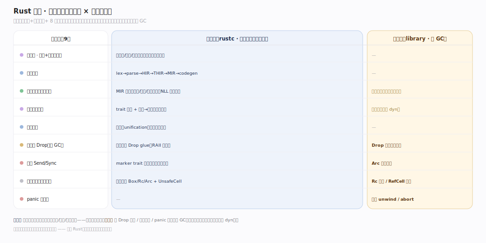
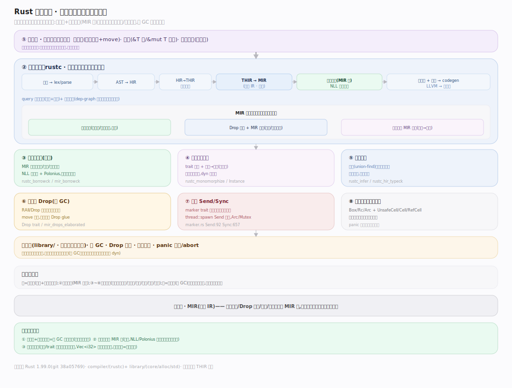
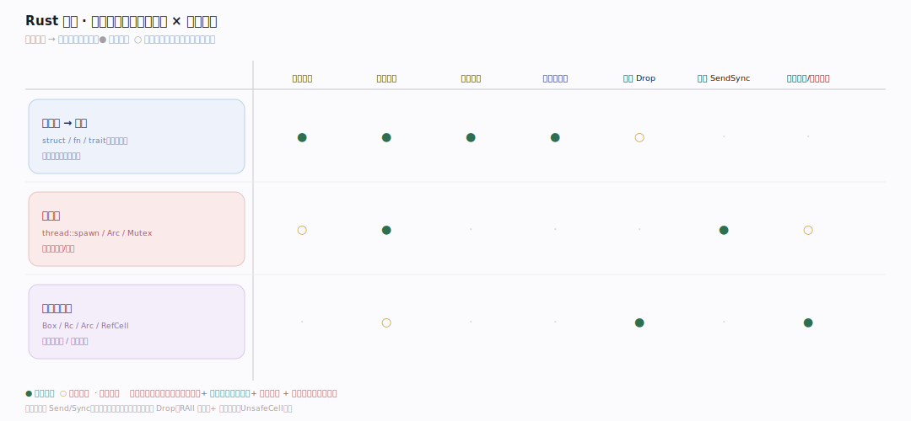

# Rust 原理 · 全景主线框架

> 统领全部原理文档:Rust 是**编译期保证内存安全的系统语言**(新家族:语言运行时/编译器——不是数据库、不是服务,而是一套编译器 rustc + 标准库,靠所有权/借用在**编译期**杜绝内存错误和数据竞争,无 GC、零成本抽象)。源码基准 **Rust 1.99.0**(`~/workdir/rust`,git 38a05769;compiler/ + library/)。

Rust 的世界观:**所有权 + 编译期检查 = 内存安全无 GC**。别的语言要么手动管内存(C,易错)要么运行时 GC(Java/Go,有开销);Rust 用所有权规则(每值一主、借用有规矩、生命周期),在**编译期**由借用检查器(borrow checker,在 MIR 上跑)证明无悬垂/无数据竞争——运行时零开销。编译管线 AST→HIR→THIR→MIR→LLVM,借用检查在 MIR。理解"所有权 + 借用检查(灵魂)+ 零成本抽象"三点,就懂了 Rust。

> **结构提示(写文档必看)**:① 编译管线有 **THIR** 阶段:AST→HIR→**THIR**→MIR→codegen(LLVM);② 借用检查在 **MIR** 上(rustc_borrowck,NLL 非词法生命周期 + Polonius 已在树);③ 查询系统 rustc_query_system **已不存在**(改 rustc_query_impl + rustc_middle/dep_graph);④ 单态化 = 泛型→具体(zero-cost);⑤ Send/Sync 是 auto trait(marker.rs),无 GC 靠 RAII/Drop;⑥ 智能指针 Box/Rc/Arc + UnsafeCell 内部可变;⑦ panic 展开 vs abort 两运行时。

---

## 一、双维模型:能力域 × 执行时机

- **能力域**:接触面(语言语法 + 所有权规则)面向开发者;支撑侧——编译管线、借用检查器、特质与单态化、类型推断、内存与 Drop、并发 Send/Sync、智能指针与内部可变、panic 展开。
- **执行时机**:编译期(rustc:lex→parse→类型推断→借用检查→单态化→codegen——所有安全检查在此)vs 运行期(std 库:Drop 析构、Arc 原子计数、panic 展开——极少运行时机制,无 GC)。

---

## 二、总架构图

**编译期(rustc)**:源码 → lex(rustc_lexer)→ parse 成 AST(rustc_parse)→ 降为 HIR(rustc_ast_lowering)→ 类型推断(rustc_hir_typeck + rustc_infer 合一)→ THIR → 构建 **MIR**(rustc_mir_build)→ **借用检查**(rustc_borrowck,在 MIR 上验所有权/生命周期,NLL)→ 特质求解 + **单态化**(泛型→具体,rustc_monomorphize)→ MIR 优化 → **codegen**(rustc_codegen_llvm→LLVM→机器码)。全程 query 系统 + 增量编译驱动。**运行期(library/)**:core/alloc/std——Drop 析构(RAII)、Send/Sync 保并发、智能指针、panic 展开。安全全在编译期证明,运行时几乎零额外机制。

---

## 三、主线的分层归位(接触面 + 8 支撑域)

| 层 | 主线 | 一句话职责 |
|---|---|---|
| 接触面 | **语法与所有权规则** | 开发者写的代码 + 所有权/借用/生命周期规则 |
| 编译 | **编译管线** | AST→HIR→THIR→MIR→LLVM + query/增量 |
| 灵魂 | **借用检查器** | MIR 上验所有权/借用/生命周期(NLL/Polonius) |
| 泛型 | **特质与单态化** | trait 求解 + 泛型→具体(zero-cost) |
| 类型 | **类型推断** | 合一(unification)推类型 |
| 内存 | **内存与 Drop** | 无 GC:RAII/Drop 析构、move 语义 |
| 并发 | **Send/Sync** | marker trait 编译期保无数据竞争 |
| 抽象 | **智能指针与内部可变** | Box/Rc/Arc + UnsafeCell/Cell/RefCell |

---

## 四、接触面 × 能力域 依赖矩阵

写代码(编译)依赖编译管线(全流程)+ 借用检查(安全)+ 类型推断 + 特质单态化(泛型);用并发依赖 Send/Sync(编译保);用智能指针依赖内存 Drop(RAII 回收)+ 内部可变(UnsafeCell)。安全检查全在编译期。

---

## 五、能力域依赖关系图

实线=数据流/编译阶段,虚线=约束。贯穿层:**MIR(中层 IR)** 横切借用检查/单态化/优化——借用检查在 MIR 跑、Drop 在 MIR 精化、优化在 MIR 做、单态化产 MIR 实例;MIR 是安全检查与优化的公共舞台。

---

## 六、三条贯穿声明(Rust 区别于 C/GC 语言)

1. **所有权 + 编译期检查 = 无 GC 的内存安全**:每个值有唯一 owner,move 转移所有权,借用(&)有规矩(可变借用唯一、不可变借用可多但不与可变并存),生命周期防悬垂。这些由借用检查器**编译期**证明——运行时无 GC、无引用计数(除非显式 Rc/Arc)、零开销。

2. **借用检查在 MIR 上(灵魂)**:所有权/借用/生命周期不是运行时检查,而是编译期在 **MIR**(中层 IR)上由 rustc_borrowck 用区域推断(NLL 非词法生命周期,Polonius 更精确)证明。过不了不编译——把内存错误挡在编译期,不进运行时。

3. **零成本抽象**:泛型/trait 靠**单态化**(monomorphization)编译成具体代码——`Vec<i32>` 和手写 i32 数组一样快,trait 静态分发无虚表开销(除非显式 dyn)。迭代器链编译后 = 手写循环。"你不用的不花钱,你用的没法手写更快"。

---

**一句话定位**:Rust 是编译期保证内存安全的系统语言——所有权(每值一主 + move)+ 借用规则 + 生命周期,由借用检查器在 MIR 上(NLL/Polonius 区域推断)编译期证明无悬垂无数据竞争,无 GC 零运行时开销;编译管线 AST→HIR→THIR→MIR→LLVM,泛型靠单态化实现零成本抽象,Send/Sync marker trait 编译期保并发安全,无 GC 靠 RAII/Drop 析构 + 智能指针(Box/Rc/Arc)+ UnsafeCell 内部可变;安全检查全在编译期,运行时几乎零额外机制。
