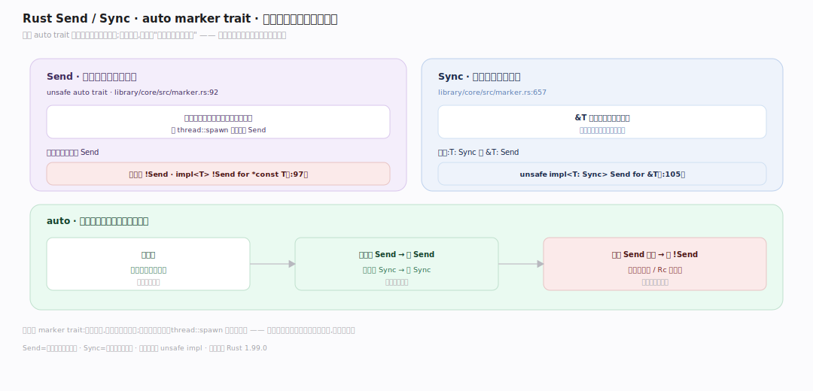
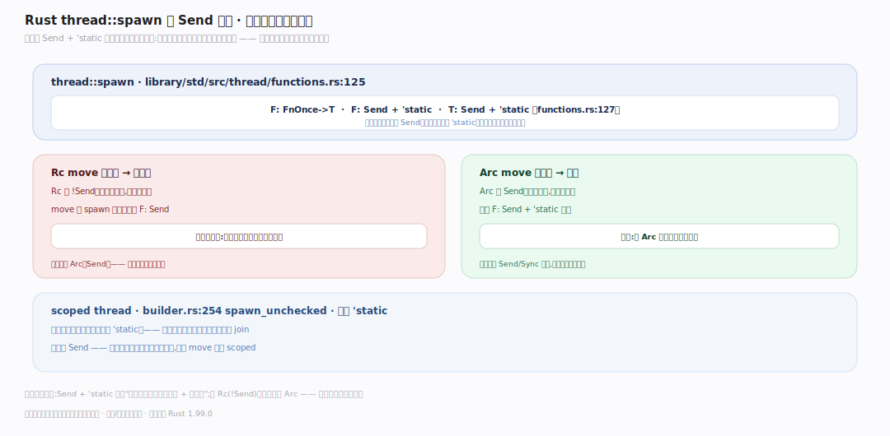
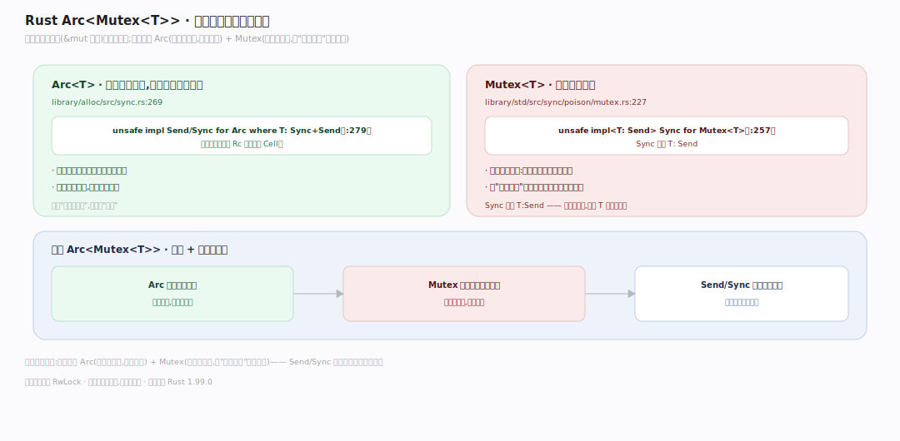

# Rust 原理 · 支撑主线 · 并发（Send / Sync）

> **定位**：属"并发能力域"。管无畏并发(fearless concurrency):Send/Sync marker trait 编译期保无数据竞争、std::thread、std::sync(Mutex/Arc)。数据竞争在编译期被挡。依赖【借用检查器】的借用规则扩展到多线程。源码基准 **Rust 1.99.0**(`library/core/src/marker.rs`、`library/std/src/`)。

Rust "无畏并发":多线程代码的数据竞争在**编译期**被挡,不用运行时调试竞态。核心是两个 **auto marker trait**:`Send`(可跨线程移动所有权)、`Sync`(可跨线程共享引用)。编译器自动为类型推导 Send/Sync;`thread::spawn` 要求闭包 `Send`——非线程安全的数据(如 Rc)自动 `!Send`,想跨线程用会编译错。理解 Send/Sync + 借用规则扩展,就懂了无畏并发。

---

## 一、Send / Sync marker trait

两个 **auto trait**(`library/core/src/marker.rs`)自动为大多数类型实现:

- **`Send`**(`marker.rs:92`,`unsafe auto trait`):类型可**跨线程移动所有权**。裸指针 `!Send`(`impl<T> !Send for *const T`,`:97`)。
- **`Sync`**(`marker.rs:657`):类型可**跨线程共享引用**(`&T` 可发给别的线程);`unsafe impl<T: Sync> Send for &T`(`:105`)——T Sync 则 &T Send。
- **auto**:编译器自动推导——若类型所有字段都 Send/Sync,则它 Send/Sync;有非 Send 字段则否。无需手写。

**为什么 marker trait**:Send/Sync 不含方法,纯标记"这类型线程安全吗";编译器自动推、`thread::spawn` 的边界检查它——把线程安全变成类型系统的一部分,编译期验证。

---

## 二、thread::spawn 的 Send 边界

`thread::spawn`(`library/std/src/thread/functions.rs:125`)的签名是无畏并发的关键:

- 边界 `F: FnOnce()->T`, `F: Send + 'static`, `T: Send + 'static`(`functions.rs:127`)——闭包和返回值必须 **Send**(可跨线程)且 `'static`(不借用短生命周期数据)。
- 想把非 Send 数据(如 `Rc`)move 进 spawn 的闭包 → 编译错(Rc 是 !Send)——**编译期挡住**跨线程共享非线程安全数据。
- scoped thread(`builder.rs:254` spawn_unchecked)放松 `'static`(可借用作用域内数据),但仍要 Send。

**为什么这边界**:`Send + 'static` 保证"进线程的东西线程安全 + 不悬垂"——用 Rc(!Send)会编译错、逼你用 Arc(Send);借用短生命周期数据会编译错、逼你 move 或用 scoped。数据竞争编译期消除。

---

## 三、Mutex / Arc:共享可变的正道

多线程共享可变数据的标准组合 **Arc<Mutex<T>>**:

- **`Arc<T>`**(原子引用计数,`library/alloc/src/sync.rs:269`):`unsafe impl Send/Sync for Arc where T: Sync+Send`(`:279`)——原子计数(区别 Rc 的非原子 Cell),可跨线程共享所有权。
- **`Mutex<T>`**(`library/std/src/sync/poison/mutex.rs:227`):`unsafe impl<T: Send> Sync for Mutex<T>`(`:257`)——**Sync 只需 T: Send**,因为锁序列化访问(同一时刻一个线程持锁),把"可变唯一"从编译期借用扩到运行时锁。
- 组合:`Arc<Mutex<T>>`——Arc 让多线程共享、Mutex 让共享的可变安全(锁保证互斥)。

**为什么这组合**:编译期借用规则(&mut 唯一)在单线程够用;跨线程要 Arc(共享所有权,原子计数)+ Mutex(运行时互斥,把"可变唯一"用锁保证)——Send/Sync 保证这套组合类型安全可跨线程。

---

## 拓展 · 并发关键结构一览

| 结构 | 定义 | 职责 |
|---|---|---|
| Send auto trait | `library/core/src/marker.rs:92` | 可跨线程移动所有权 |
| Sync auto trait | `library/core/src/marker.rs:657` | 可跨线程共享引用 |
| thread::spawn | `library/std/src/thread/functions.rs:125` | F/T: Send + 'static 边界 |
| Arc<T> | `library/alloc/src/sync.rs:269` | 原子引用计数(跨线程共享) |
| Mutex<T> | `library/std/src/sync/poison/mutex.rs:227` | 运行时互斥(T: Send 即 Sync) |

## 调优要点（理解要点）

- **Rc vs Arc**:单线程共享用 Rc(非原子,快);跨线程用 Arc(原子计数,略慢但线程安全)。
- **Mutex vs RwLock**:读多写少用 RwLock(多读者并发);一般用 Mutex(简单)。
- **锁粒度**:细粒度锁(锁小范围)减竞争;粗锁简单但争用。
- **避免死锁**:多锁固定顺序获取;Rust 编译期不查死锁(只查数据竞争)——逻辑死锁靠设计避免。

## 常见误区与工程要点

- **误区:Rust 编译期消除所有并发 bug。** 消除**数据竞争**(靠 Send/Sync + 借用);死锁/逻辑竞态不查——那是逻辑问题。
- **误区:Send/Sync 要手动实现。** auto trait,编译器自动推(字段都 Send 则 Send);极少需手写(unsafe impl)。
- **误区:Rc 能跨线程。** Rc 是 !Send(非原子计数),spawn 进闭包编译错;跨线程用 Arc。
- **误区:Mutex 的 Sync 需 T: Sync。** 只需 T: Send——锁序列化访问,同一时刻一线程持有,不需 T 本身可共享。
- **归属提醒**:Send/Sync 是【特质与单态化】的 auto trait 特例;单线程借用规则在【借用检查器】;Arc/Mutex 是【智能指针】;跨线程 move 靠【内存与 Drop】的 move 语义。

## 一句话总纲

**Rust 无畏并发靠 Send/Sync marker trait 编译期消除数据竞争:Send(可跨线程移动所有权,裸指针!Send)、Sync(可跨线程共享引用)是 auto trait 编译器自动推(字段都 Send 则 Send);thread::spawn 要求闭包 F: Send+'static——想把 Rc(!Send)跨线程会编译错、逼用 Arc;共享可变的正道 Arc<Mutex<T>>(Arc 原子计数跨线程共享、Mutex 运行时互斥把"可变唯一"用锁保证,Mutex 的 Sync 只需 T: Send 因锁序列化);编译期挡数据竞争(死锁/逻辑竞态不查)。**
