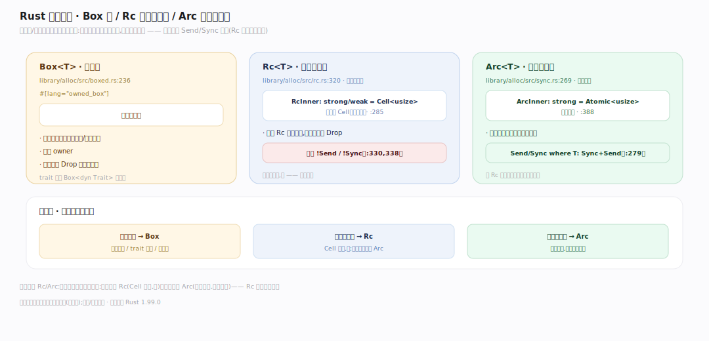
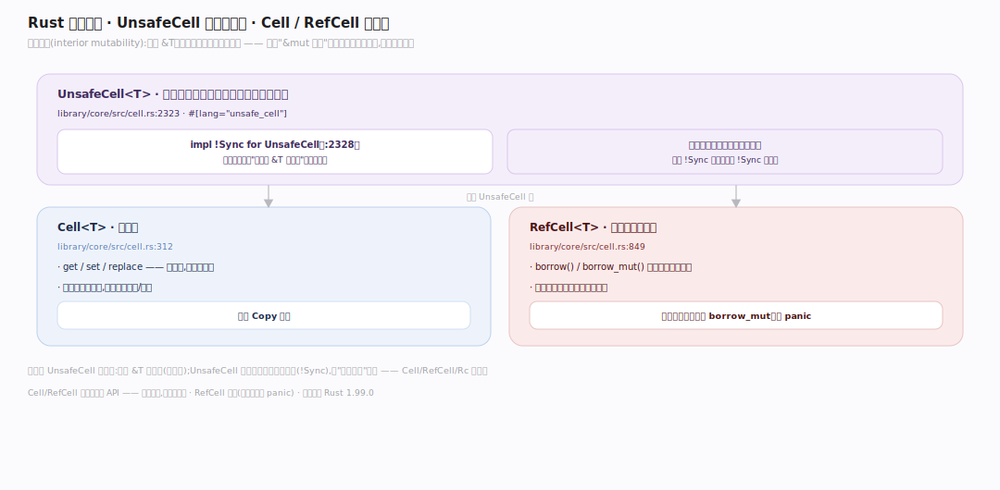
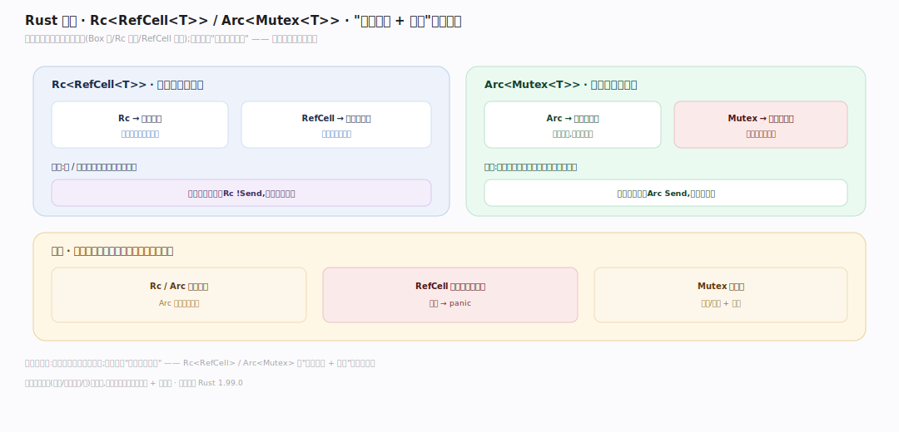

# Rust 原理 · 支撑主线 · 智能指针与内部可变

> **定位**：属"抽象能力域"。管堆分配与共享/可变的逃生舱:Box(堆)/Rc(共享,单线程)/Arc(共享,跨线程)+ UnsafeCell/Cell/RefCell(内部可变)。当所有权/借用规则太死时的受控绕过。依赖【内存与 Drop】的 Drop、【并发】的 Send/Sync。源码基准 **Rust 1.99.0**(`library/alloc/`、`library/core/src/cell.rs`)。

Rust 默认所有权 + 借用规则严格(每值一主、&mut 唯一);但链表、图、共享状态需要"多所有者"或"共享可变"——**智能指针**提供受控逃生:Box(堆分配)、Rc/Arc(共享所有权,引用计数)、UnsafeCell/Cell/RefCell(内部可变,绕过 &mut 唯一)。理解各智能指针职责 + 内部可变原理,就懂了 Rust 怎么在安全前提下实现灵活数据结构。

---

## 一、Box / Rc / Arc:堆与共享

- **`Box<T>`**(`library/alloc/src/boxed.rs:236`,`#[lang="owned_box"]`):堆分配单一所有权——把值放堆上(如递归类型、大对象);唯一 owner,出作用域 Drop 释放堆内存。
- **`Rc<T>`**(非原子引用计数,`library/alloc/src/rc.rs:320`):**单线程**共享所有权——多个 Rc 指同一值,`RcInner{strong:Cell<usize>, weak:Cell<usize>}`(`:285`,计数是 Cell 非原子);计数归零才 Drop。**显式 !Send/!Sync**(`:330,338`)——只单线程。
- **`Arc<T>`**(原子引用计数,`library/alloc/src/sync.rs:269`):**跨线程**共享——`ArcInner{strong:Atomic<usize>...}`(`:388`,原子计数);`Send/Sync where T: Sync+Send`(`:279`)。比 Rc 慢(原子操作)但线程安全。

**为什么分 Rc/Arc**:共享所有权要引用计数;单线程用 Rc(Cell 计数,快)、跨线程用 Arc(原子计数,慢但安全)——按线程场景选,编译器用 Send/Sync 强制(Rc 跨线程编译错)。

---

## 二、内部可变:UnsafeCell 根基

**内部可变(interior mutability)**:通过 `&T`(不可变引用)也能改内部——绕过"&mut 唯一"的编译期规则(`library/core/src/cell.rs:1` "Shareable mutable containers"):

- **`UnsafeCell<T>`**(`cell.rs:2323`,`#[lang="unsafe_cell"]`):**唯一的根基**——`impl !Sync for UnsafeCell`(`:2328`)。它是编译器认可的"可通过 &T 改内容"的唯一原语;所有内部可变类型都建在它上。
- **`Cell<T>`**(`cell.rs:312`):值进出(get/set/replace),无引用借用——适合 Copy 小值。
- **`RefCell<T>`**(`cell.rs:849`):**运行时借用检查**——borrow/borrow_mut 运行时记借用状态,违反(如同时两个 borrow_mut)则 panic。把编译期借用检查挪到运行时。

**为什么 UnsafeCell 是根基**:正常 `&T` 不能改(编译期);UnsafeCell 是编译器唯一开的口子(!Sync 标记),让"共享可变"可能;Cell/RefCell/Rc 都用它——它的 !Sync 是这些类型 !Sync 的根源。

---

## 三、组合:共享可变数据结构

实际数据结构常组合智能指针:

- **`Rc<RefCell<T>>`**(单线程共享可变):Rc 让多所有者、RefCell 让共享的可变(运行时借用检查)——如图/链表节点被多处引用且需改。
- **`Arc<Mutex<T>>`**(跨线程共享可变):Arc 跨线程共享、Mutex 运行时互斥(见并发篇)——多线程共享状态的标准。
- **代价**:Rc/Arc 有计数开销;RefCell 运行时借用检查(违反 panic)、Mutex 有锁开销——比编译期检查有运行时成本,但换灵活。

**为什么组合**:单个智能指针解决一维问题(Box 堆、Rc 共享、RefCell 可变);组合解决"既共享又可变"——`Rc<RefCell>`/`Arc<Mutex>` 是"多所有者 + 可变"的标准配方。

---

## 拓展 · 智能指针关键结构一览

| 结构 | 定义 | 职责 |
|---|---|---|
| Box<T> | `library/alloc/src/boxed.rs:236` | 堆分配单一所有权 |
| Rc<T> | `library/alloc/src/rc.rs:320` | 单线程共享(Cell 计数,!Send) |
| Arc<T> | `library/alloc/src/sync.rs:269` | 跨线程共享(原子计数) |
| UnsafeCell<T> | `library/core/src/cell.rs:2323` | 内部可变根基(!Sync) |
| Cell<T> / RefCell<T> | `cell.rs:312 / 849` | 值进出 / 运行时借用检查 |

## 调优要点（理解要点）

- **优先栈/所有权**:能用普通所有权就不用智能指针(零开销);需堆/共享/可变才用。
- **Box**:递归类型(链表/树节点)、trait 对象(`Box<dyn Trait>`)、大对象上堆。
- **Rc vs Arc**:单线程 Rc(快);跨线程 Arc(原子,慢但安全)——别在单线程用 Arc(白付原子开销)。
- **RefCell 慎用**:运行时借用检查违反会 panic;能编译期借用就别用 RefCell。

## 常见误区与工程要点

- **误区:智能指针总用(像 Java 对象都在堆)。** Rust 默认栈 + 所有权(零开销);智能指针是特定需求(堆/共享/可变)的工具,不默认用。
- **误区:RefCell 是编译期检查。** 运行时借用检查——违反(重叠 borrow_mut)运行时 panic,不是编译错;把编译期检查挪运行时。
- **误区:Rc 能跨线程。** !Send(Cell 非原子计数),跨线程编译错;用 Arc。
- **误区:内部可变不安全。** 建在 UnsafeCell(编译器认可的唯一口子)上,Cell/RefCell 封装成安全 API——受控绕过,非破坏安全。
- **归属提醒**:智能指针的 Drop(计数归零释放)在【内存与 Drop】;Arc/Mutex 跨线程靠【并发 Send/Sync】;RefCell 运行时借用是编译期【借用检查器】的运行时版;Box 堆分配用 alloc。

## 一句话总纲

**Rust 智能指针是所有权/借用太死时的受控逃生舱:Box(堆分配单一所有权,递归类型/trait 对象)、Rc(单线程共享所有权,Cell 非原子计数,!Send)、Arc(跨线程共享,原子计数,慢但安全);内部可变(通过 &T 也能改)根基是 UnsafeCell(#[lang=unsafe_cell],!Sync,编译器唯一认可的口子),Cell(值进出)/RefCell(运行时借用检查,违反 panic)建在其上;组合 Rc<RefCell>(单线程共享可变)/Arc<Mutex>(跨线程共享可变)是"多所有者+可变"标准配方——有运行时成本(计数/借用检查/锁)换灵活,默认仍优先零开销的栈+所有权。**
