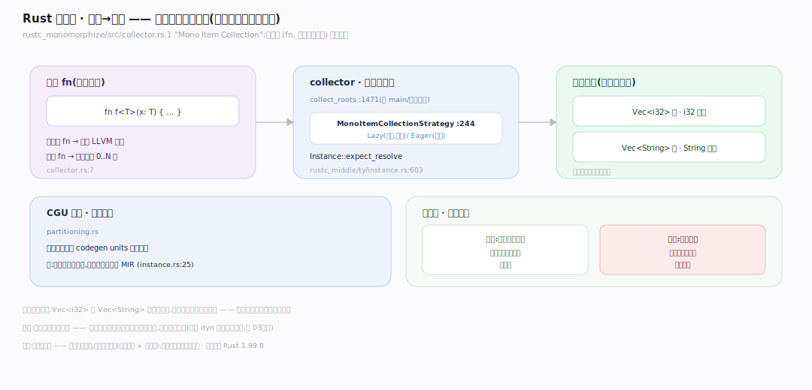
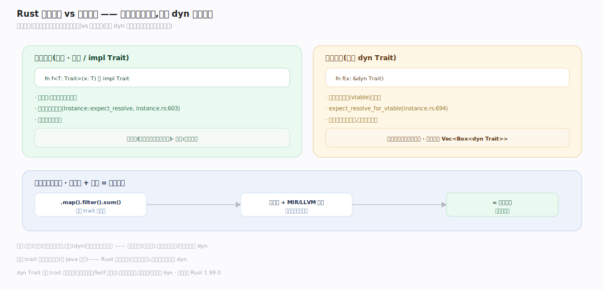

# Rust 原理 · 支撑主线 · 特质与单态化

> **定位**：属"泛型能力域"。管 trait 求解 + 泛型→具体代码的单态化,是零成本抽象的实现。trait 是接口/多态,单态化把泛型编译成每个具体类型的专版。依赖【编译管线】的类型系统。源码基准 **Rust 1.99.0**(`compiler/rustc_trait_selection/`、`rustc_monomorphize/`)。

Rust 的泛型/trait **零成本**——秘密在**单态化**:泛型函数 `fn f<T>(x:T)` 不是运行时泛型,而是编译期为每个用到的具体 T 生成一份专版代码。trait 提供接口抽象(多态);trait 求解在编译期定 impl;单态化把泛型和 trait 静态分发全展开成具体代码,运行时无虚表、无装箱。理解 trait 求解 + 单态化,就懂了"零成本抽象"。

---

## 一、trait 系统:接口与求解

**trait** = 接口/共享行为,编译期求解 impl:

- **trait 求解**:`rustc_trait_selection`(`lib.rs:1` "trait resolution method")——老 solver `SelectionContext`(`traits/select/mod.rs:102`);新 solver `rustc_next_trait_solver`(泛型于 interner)。给 `T: Display`,求解器找 T 的 Display impl。
- **coherence(一致性)/orphan 规则**:`coherence.rs` `InCrate{Local,Remote}`(`:12`)、`orphan_check_trait_ref`(`:57`)——防重复/冲突 impl(同一类型同一 trait 只一个 impl,且 impl 要 local)。
- **interner 抽象**:`rustc_type_ir` 提供编译器无关的类型 IR,让 solver 泛型化。

**为什么 coherence**:全局唯一 impl 保证 `T: Trait` 解析无歧义;orphan 规则(impl 的 trait 或类型至少一个是本 crate)防两个 crate 给同类型同 trait 各写 impl 冲突。

---

## 二、单态化:泛型→具体

**单态化(monomorphization)**是零成本的核心:

- `rustc_monomorphize/src/collector.rs`(`:1` "Mono Item Collection"):非泛型 fn → 一份 LLVM 代码;泛型 fn → 每个实例化 0..N 份(`:7`)。
- **策略** `MonoItemCollectionStrategy{Eager,Lazy}`(`collector.rs:244`):Lazy(默认,按需)/Eager(增量);`collect_roots`(`:1471`)从根(main/导出)出发收集所有需实例化的。
- **实例解析** `Instance::expect_resolve`(`rustc_middle/ty/instance.rs:603`);注释"单态化即时发生,从不创建单态化 MIR"(`:25`)——为每个 `(fn, 具体类型参数)` 生成代码。
- **CGU 分区**:`partitioning.rs` 把单态项分到 codegen units 并行编译。

**为什么零成本**:`Vec<i32>` 和 `Vec<String>` 各生成专版(i32 版、String 版),各自像手写的一样紧凑——无运行时类型参数、无装箱。代价:代码膨胀(多份专版)+ 编译慢。

---

## 三、静态分发 vs 动态分发

trait 调用两种分发:

- **静态分发(默认,泛型/impl Trait)**:`fn f<T: Trait>(x:T)` 单态化——编译期知具体类型,直接调具体方法,**无虚表、可内联**。零开销。`Instance::expect_resolve`(`instance.rs:603`)解析到具体 Instance。
- **动态分发(显式 `dyn Trait`)**:`fn f(x: &dyn Trait)`——运行时经**虚表(vtable)**查方法(`expect_resolve_for_vtable`,`:694`)。有一次间接调用开销,但代码不膨胀(一份代码处理所有类型)。

**取舍**:静态(泛型)快但代码膨胀;动态(dyn)省代码但有虚表开销。默认静态(零成本);需运行时多态/异构集合(如 `Vec<Box<dyn Trait>>`)用 dyn。

**迭代器零成本**:迭代器链(`.map.filter.sum`)是泛型 trait 方法,单态化 + MIR/LLVM 内联后 = 手写循环,无中间分配。

---

## 拓展 · 特质单态化关键结构一览

| 结构 | 定义 | 职责 |
|---|---|---|
| rustc_trait_selection | `rustc_trait_selection/src/lib.rs:1` | trait 求解 |
| SelectionContext | `traits/select/mod.rs:102` | 老 solver 选择 impl |
| coherence orphan | `rustc_next_trait_solver/src/coherence.rs:57` | 一致性/orphan 规则 |
| Mono collector | `rustc_monomorphize/src/collector.rs:1` | 收集单态项 |
| Instance::expect_resolve | `rustc_middle/ty/instance.rs:603` | 解析具体实例 |
| vtable resolve | `instance.rs:694` | dyn 动态分发虚表 |

## 调优要点（理解要点）

- **静态 vs dyn**:热路径/性能敏感用泛型(静态,可内联);异构集合/减代码膨胀用 `dyn`。
- **代码膨胀**:泛型实例化多(如 `Vec<T>` 用了很多 T)增二进制体积 + 编译时间;必要时用 dyn 收敛。
- **trait 对象限制**:`dyn Trait` 要求 trait "对象安全"(方法不含泛型/Self 返回等)。
- **单态化 + 内联**:泛型 + `#[inline]` 让跨 crate 也能内联,零成本抽象跨模块生效。

## 常见误区与工程要点

- **误区:泛型有运行时开销。** 静态分发的泛型单态化成具体代码,零运行时开销(无类型参数、无装箱);只有 dyn 才有虚表开销。
- **误区:trait 都是动态分发(像 Java 接口)。** Rust 默认静态(泛型单态化);动态分发要显式 `dyn`。
- **误区:单态化免费。** 零运行时成本,但编译期成本(代码膨胀 + 编译慢)——泛型用太多会胖二进制。
- **误区:迭代器链慢(多次遍历)。** 单态化 + 内联后编译成单次手写循环,无中间分配——零成本。
- **归属提醒**:单态化产的 MIR 实例在【编译管线】codegen;trait 求解用类型信息来自【类型推断】;Send/Sync 也是 trait(auto trait)在【并发】;impl 的方法体经借用检查(【借用检查器】)。

## 一句话总纲

**Rust 的 trait + 单态化实现零成本抽象:trait 是接口/多态,编译期由 rustc_trait_selection 求解 impl(coherence/orphan 规则保全局唯一 impl 无歧义);单态化(rustc_monomorphize collector)把泛型 fn 为每个具体类型参数生成专版代码(Vec<i32>/Vec<String> 各一份,像手写一样紧凑,无运行时类型参数/装箱);默认静态分发(泛型单态化可内联零开销),显式 dyn Trait 才走虚表动态分发(省代码但一次间接调用);迭代器链单态化+内联后=手写循环——你用的没法手写更快,代价是代码膨胀+编译慢。**
