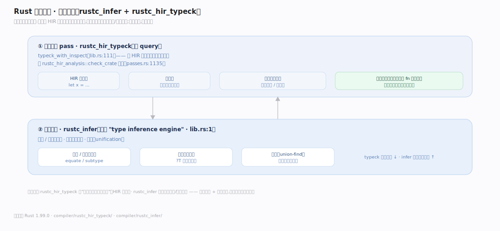
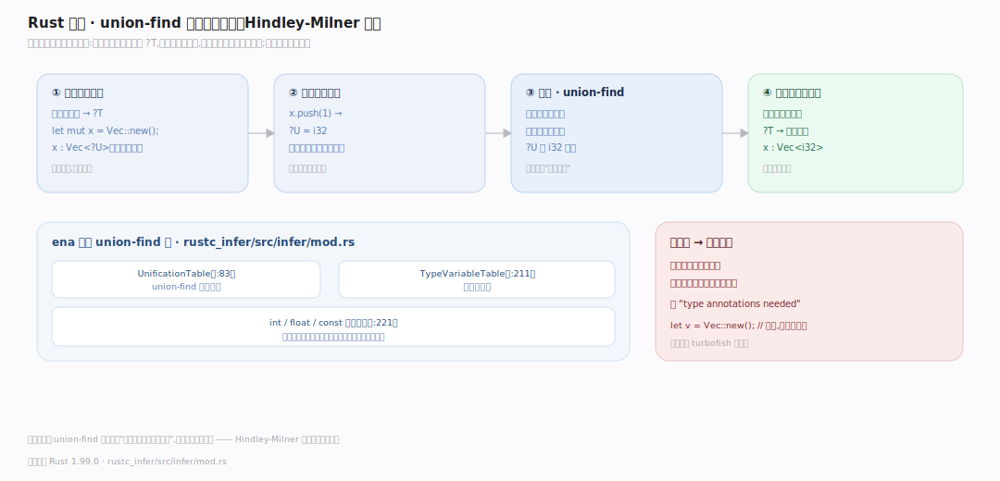
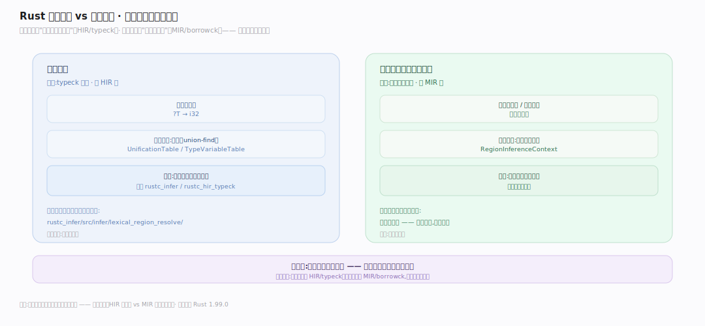

# Rust 原理 · 支撑主线 · 类型推断

> **定位**：属"类型能力域"。管在少标注下推出类型:合一(unification)算法、union-find 类型变量表。让 `let x = vec![]; x.push(1)` 推出 `Vec<i32>` 无需标注。产出的类型喂给借用检查/单态化。源码基准 **Rust 1.99.0**(`compiler/rustc_hir_typeck/`、`rustc_infer/`)。

Rust 类型静态但少标注——靠**类型推断**:从上下文(初始化值、后续使用)推出变量类型。核心是**合一(unification)**:把"未知类型变量"和"已知约束"用 union-find 求解成具体类型。类型检查(typeck)在 HIR 上跑,推断引擎(infer)提供合一。理解合一 + 类型变量表,就懂了 Rust 怎么少写类型还类型安全。

---

## 一、类型推断引擎与类型检查

两层分工:

- **推断引擎** `rustc_infer`(`lib.rs:1` "type inference engine")——低层的相等/子类型判定、类型变量管理。
- **类型检查 pass** `rustc_hir_typeck`——主 query `typeck_with_inspect`(`lib.rs:111`),在 HIR 上给每个表达式定类型;从 `rustc_hir_analysis::check_crate` 驱动(`passes.rs:1135`)。

推断在**函数体内**局部做(每个 fn 独立推);函数签名要显式标类型(边界清晰)——签名标注 + 体内推断,平衡"少写"和"接口明确"。

---

## 二、合一:union-find 求解

**合一(unification)**是推断核心,用 union-find(并查集):

- `rustc_infer/src/infer/mod.rs` 用 ena 风格 union-find 表:`UnificationTable`(`:83`)、`TypeVariableTable`(`:211`)、int/float/const 各自的表(`:221`)。
- **过程**:遇未知类型引入类型变量 `?T`;从约束(如 `x.push(1)` → x 是 `Vec<?U>` 且 `?U=i32`)合一 `?T` 和已知类型;union-find 把同一类型的变量归并到一个代表。
- 全部约束合一后,每个类型变量解析成具体类型;解不出(冲突/信息不足)则报类型错误、要求标注。

**为什么合一**:类型推断本质是解约束方程组;union-find 高效维护"哪些类型变量必须相等"、逐步求出具体类型——这是 Hindley-Milner 系推断的经典手法。

---

## 三、区域(生命周期)推断的关系

类型推断和**区域(生命周期)推断**是两套但相关:

- **类型推断**(本篇):推具体类型(`?T`→`i32`),在 typeck 阶段(HIR)。
- **区域推断**:推生命周期/借用区域,在借用检查阶段(MIR,见借用检查篇的 RegionInferenceContext)。
- 非借用检查的词法区域解析在 `rustc_infer/src/infer/lexical_region_resolve/`。

**分工**:类型推断管"这变量是什么类型",区域推断管"这借用活多久";前者 HIR/typeck、后者 MIR/borrowck——两阶段、两套推断,但都靠约束求解。

---

## 拓展 · 类型推断关键结构一览

| 结构 | 定义 | 职责 |
|---|---|---|
| rustc_infer | `rustc_infer/src/lib.rs:1` | 推断引擎(合一/相等) |
| typeck_with_inspect | `rustc_hir_typeck/src/lib.rs:111` | 类型检查主 query |
| UnificationTable | `rustc_infer/src/infer/mod.rs:83` | union-find 类型变量 |
| TypeVariableTable | `rustc_infer/src/infer/mod.rs:211` | 类型变量表 |
| lexical_region_resolve | `rustc_infer/src/infer/lexical_region_resolve/` | 词法区域解析 |

## 调优要点（理解要点）

- **少标注**:函数体内多数类型可推(`let x = ...`);签名/复杂泛型需标注帮推断。
- **turbofish**:歧义时 `collect::<Vec<_>>` 显式指定类型参数帮推断。
- **推断失败**:报"type annotations needed"时加标注——推断信息不足(如空集合无元素类型线索)。
- **签名边界**:函数签名必须标类型(不跨函数推)——保接口稳定 + 推断局部化(编译快)。

## 常见误区与工程要点

- **误区:Rust 是动态类型(不用写类型)。** 静态类型 + 强推断——体内少写但编译期全定类型;签名必标。
- **误区:推断是全局的。** 局部于函数体(每 fn 独立推);跨函数靠显式签名——推断不跨函数边界。
- **误区:类型推断和生命周期推断一回事。** 两套:类型推断(HIR/typeck 推具体类型)vs 区域推断(MIR/borrowck 推生命周期)。
- **误区:推不出是编译器弱。** 常是信息真不足(如 `let v = Vec::new` 后没用,无元素类型线索)——加标注是正常。
- **归属提醒**:推出的类型喂给【借用检查器】(MIR 上)和【特质与单态化】(定 impl/实例);类型检查在【编译管线】的 HIR 阶段;区域推断在借用检查篇。

## 一句话总纲

**Rust 类型推断让静态类型少标注:两层——rustc_infer 推断引擎(合一/相等判定)+ rustc_hir_typeck 类型检查 pass(typeck_with_inspect 在 HIR 上给每表达式定类型);核心是合一(unification)用 union-find(UnificationTable)——遇未知引入类型变量 ?T、从使用约束(x.push(1)→x 是 Vec<i32>)合一求解、归并相等变量到具体类型,解不出则要求标注;推断局部于函数体(签名必标保接口稳定),与区域(生命周期)推断(MIR/borrowck)是两套但都靠约束求解。**
