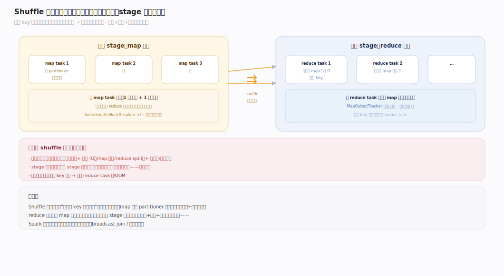
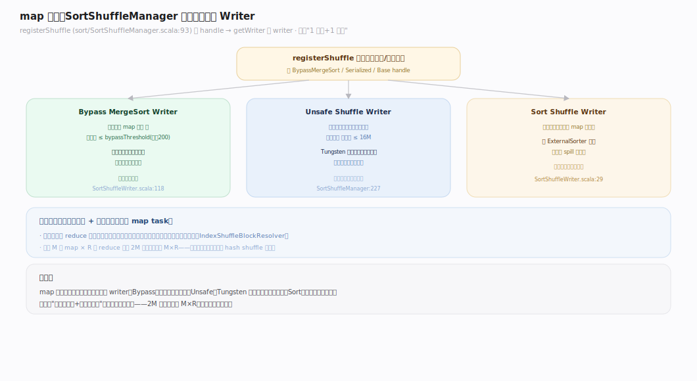
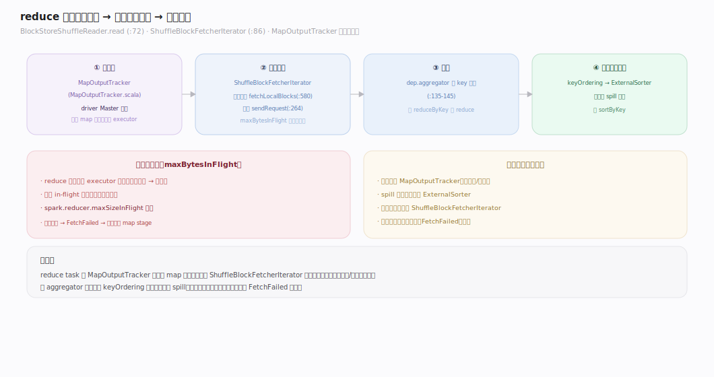
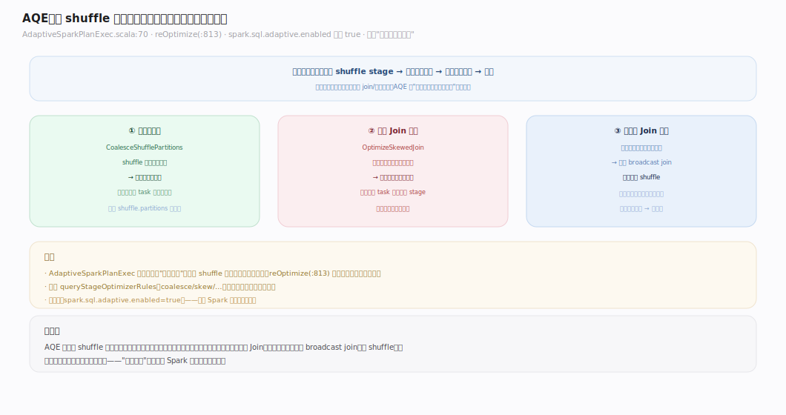
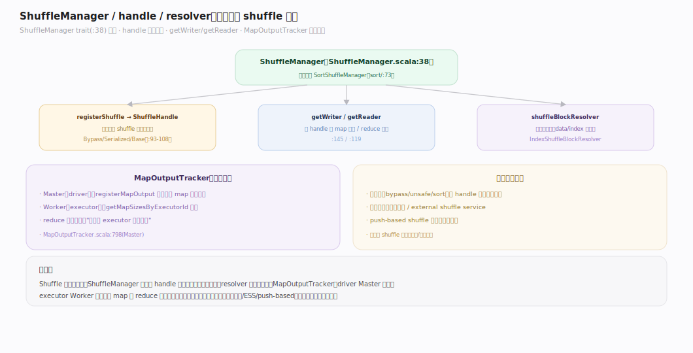

# Spark 原理 · 支撑主线 · Shuffle

> **定位**：Shuffle 是计算·执行能力域，宽依赖处的数据重分布——stage 之间的物化边界；骨架 = `map 端 write → 落盘/索引 → reduce 端 fetch/read`。上承 **执行模型**（宽依赖切 stage），与 **内存管理**（spill）、**存储与缓存**（block）、**容错**（FetchFailed）深交叠。核实基准：`~/workdir/spark/core/.../shuffle`（master，post-4.0）。

## 一、Shuffle 全景：为什么宽依赖要 shuffle

宽依赖（reduceByKey/join/groupBy）需要"把相同 key 的数据聚到一起"，而它们分散在上游各分区——这就要**跨节点重分布数据**，即 shuffle。流程：map 端每个 task 按目标分区（partitioner）把输出**分桶写盘**（`ShuffleWriter`），reduce 端每个 task 从所有 map 输出**拉取属于自己的桶**（`ShuffleReader`）并聚合。shuffle 是 stage 边界的物化点——上游 stage 必须全部完成、输出落盘，下游才能开始拉。**shuffle 是 Spark 性能与稳定性的头号变量**（网络 + 磁盘 + 序列化）。

---

## 二、map 端写：三种 ShuffleWriter 择优

`SortShuffleManager`（`sort/SortShuffleManager.scala:73`）在 `registerShuffle`（`:93`）按条件选 handle → writer：

| Writer | 触发条件 | 特点 |
|---|---|---|
| `BypassMergeSortShuffleWriter` | 无 map 端聚合 且 分区数 ≤ `bypassMergeThreshold`（默认 200） | 每分区一个临时文件直写，最后合并，免排序 |
| `UnsafeShuffleWriter` | 序列化器支持重定位 且 无聚合 且 分区数 ≤ 16777216 | Tungsten 二进制、序列化态排序，最快 |
| `SortShuffleWriter` | 其余（如需 map 端聚合） | 通用，用 `ExternalSorter` 排序 + spill |

三者都最终产出：**每个 map task 一个数据文件 + 一个索引文件**（`IndexShuffleBlockResolver.scala:57`，`.data` + `.index`）——索引记录每个 reduce 分区在数据文件里的偏移，避免海量小文件。

---

## 三、reduce 端读：fetch 与聚合

reduce task 通过 `BlockStoreShuffleReader`（`read()`，`BlockStoreShuffleReader.scala:72`）读数据：`ShuffleBlockFetcherIterator`（`storage/ShuffleBlockFetcherIterator.scala:86`）**并发拉取** map 输出块——本地块直读（`fetchLocalBlocks:580`）、远程块发请求（`sendRequest:264`），受 `maxBytesInFlight` 限流（防拉爆内存）。拉到的数据按需 `aggregator` 聚合、`keyOrdering` 排序（`ExternalSorter`，超内存 spill）。map 输出位置由 `MapOutputTracker`（`MapOutputTracker.scala`，driver 侧 Master 记录）告诉 reduce 端去哪拉。

---

## 四、AQE：运行期自适应重优化

**AQE（Adaptive Query Execution）** 在每个 shuffle 边界用**运行期真实统计**重优化后续计划（`AdaptiveSparkPlanExec.scala:70`，`reOptimize:813`）：
- **合并小分区**（`CoalesceShufflePartitions`）：shuffle 后很多小分区 → 合并成合理数量，避免过多小 task。
- **倾斜 Join 处理**（`OptimizeSkewedJoin`）：检测到某分区数据倾斜 → 拆分成多个子分区并行。
- **动态选 Join 策略**：运行期发现某侧实际很小 → 改成 broadcast join。

开关 `spark.sql.adaptive.enabled`（**默认 true**）。AQE 弥补了"规划期统计不准"——用真实数据边跑边调。

---

## 深化 · ShuffleManager / handle / resolver 机制

Shuffle 的可插拔框架：`ShuffleManager`（`ShuffleManager.scala:38`）是入口 trait，`registerShuffle` 返回一个 `ShuffleHandle` 标识本次 shuffle 的策略，`getWriter`（map 端）/`getReader`（reduce 端）据 handle 造读写器，`shuffleBlockResolver` 定位物理块。唯一实现 `SortShuffleManager`。`MapOutputTracker` 分 Master（driver，记录所有 map 输出位置）/Worker（executor，查询），是 map 端与 reduce 端的"位置目录"。这套抽象让 shuffle 的写策略（bypass/unsafe/sort）与存储（本地/external shuffle service）可替换。

---

## 拓展 · Shuffle 边界

| 类别 | 项 | 说明 |
|---|---|---|
| 触发算子 | reduceByKey/join/groupBy/repartition/distinct | 宽依赖 → shuffle |
| external shuffle service | 独立进程存 shuffle 数据 | executor 挂了 shuffle 数据仍在（动态分配必需） |
| push-based shuffle | map 主动推给 reduce 端预聚合 | 减少小块拉取（较新） |
| 倾斜诊断 | 某 task 远慢/OOM | 数据倾斜，AQE 或加盐处理 |

---

## 调优要点（关键开关）

- `spark.sql.shuffle.partitions`：SQL/DataFrame shuffle 后分区数（默认 200）——最常调，按数据量设。
- `spark.sql.adaptive.enabled`：AQE（默认 true）——通常保持开。
- `spark.shuffle.sort.bypassMergeThreshold`：bypass writer 阈值（默认 200）。
- `spark.reducer.maxSizeInFlight`：reduce 拉取的 in-flight 上限（防拉爆内存）。
- **external shuffle service**：生产 + 动态资源分配下建议开，解耦 shuffle 数据与 executor 生命周期。

---

## 常见误区与工程要点

- **忽视 shuffle 是头号性能变量**：宽依赖 = shuffle = 网络+磁盘+序列化；能减 shuffle（如 broadcast join 代替 shuffle join、预分区）就减。
- **shuffle 分区数不调**：默认 200 对大数据太少（单分区过大 OOM）、对小数据太多（碎 task）；AQE 的 coalesce 缓解但初始值仍要合理。
- **数据倾斜不处理**：某 key 数据量远超其他 → 该 reduce task 慢/OOM；开 AQE 的 skew join 或手动加盐。
- **动态分配不开 external shuffle service**：executor 被回收后其 shuffle 数据丢失、下游 FetchFailed；动态分配必须配 ESS。

---

## 一句话总纲

**Shuffle 是宽依赖处的跨节点数据重分布、stage 之间的物化边界：map 端按 partitioner 分桶写盘（三种 writer 择优：bypass/unsafe/sort，都产"一数据文件+一索引"），reduce 端经 MapOutputTracker 找位置、并发限流拉取再聚合排序；AQE 在 shuffle 边界用运行期统计合并小分区、拆倾斜、改 Join 策略。它是网络+磁盘+序列化的集中点，Spark 性能与稳定性的头号变量。**
