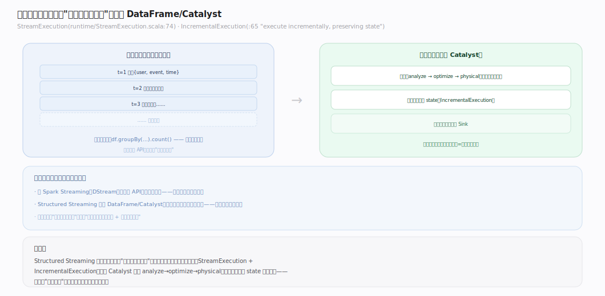
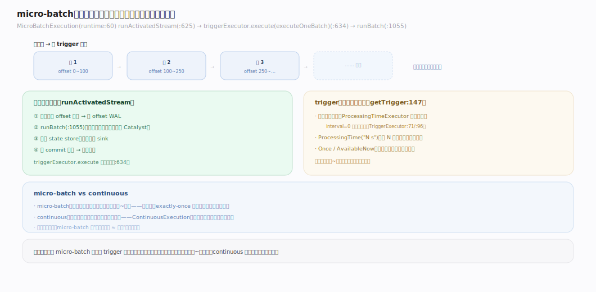
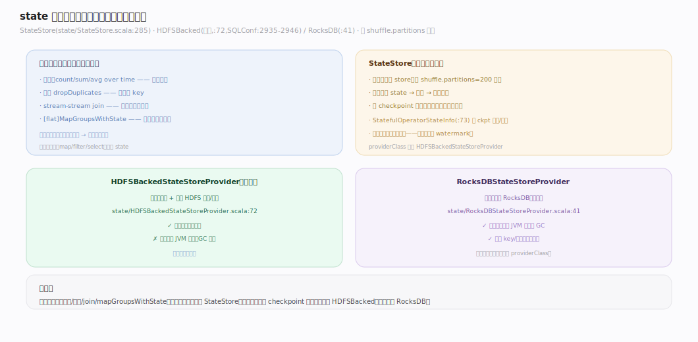
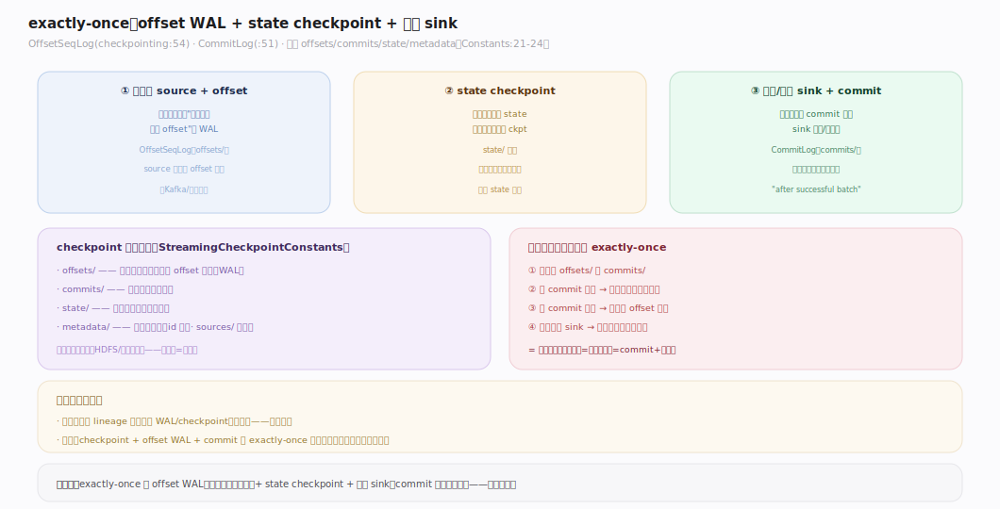

# Spark 原理 · 支撑主线 · Structured Streaming

> **定位**：Structured Streaming 是流式能力域，把无界流建模为"不断增长的表"，复用 DataFrame/Catalyst；骨架 = `micro-batch(默认)/continuous → 增量执行 → state 管理 → checkpoint+WAL 保 exactly-once`。上承 **编程接口层**（DataFrame 流式扩展）、**Catalyst**，下依 **容错**（checkpoint）。核实基准：`~/workdir/spark/sql/core/.../execution/streaming/`（master，post-4.0，已重构为 runtime/checkpointing/continuous/state 等子目录）。

## 一、流即无界表：与批统一

Structured Streaming 的核心抽象：**把流当成一张不断有新行追加的无界表**，你写的查询和批一模一样（`select/groupBy/join`），引擎负责把它变成增量执行。`StreamExecution`（`streaming/runtime/StreamExecution.scala:74`，`:63-67`："a streaming query executes repeatedly each time new data arrives...results committed transactionally to the given Sink"）是流查询的执行骨架；`IncrementalExecution`（`streaming/runtime/IncrementalExecution.scala:65`，`:54-55`："allows the execution of the given LogicalPlan incrementally...preserving state between executions"）是 `QueryExecution` 的流式变体——**每个批次复用 Catalyst 那套 analyze→optimize→physical**，只是带上上一批的 state。这就是"流批一体"：同一套 DataFrame/Catalyst，流只是"分批增量地跑"。

---

## 二、micro-batch 执行模型

默认引擎是 **micro-batch（微批）**：把流切成一小批一小批，每批当一次小的批处理跑。`MicroBatchExecution`（`streaming/runtime/MicroBatchExecution.scala:60`）的 `runActivatedStream`（`:625`）驱动循环：`triggerExecutor.execute(executeOneBatch)`（`:634`）——每次 trigger 触发一批，`runBatch`（`:1055`）执行。trigger 由 `getTrigger` 映射（`:147`）：默认（不设 trigger）用 `ProcessingTimeExecutor`（`streaming/runtime/TriggerExecutor.scala:71`）**尽快连续跑**（interval=0 时无等待循环 `:96`）；也可设固定间隔（每 N 秒一批）或 `Trigger.Once`（跑一批就停）。micro-batch 延迟在**百毫秒到秒级**——不是真正逐条，而是"小批足够小就近似实时"。

---

## 三、state 管理与有状态算子

**有状态算子**（跨批次累积：聚合、去重、stream-stream join、`[flat]MapGroupsWithState`）需要在批次间保存中间状态。`StateStore`（`streaming/state/StateStore.scala:285`，`object` `:1229`）是状态存储抽象，键值对形式存每个分区的状态。两种实现：`HDFSBackedStateStoreProvider`（`state/HDFSBackedStateStoreProvider.scala:72`，**默认**，`SQLConf.scala:2935-2946` 的 `stateStore.providerClass`）——状态存内存 + HDFS 快照；`RocksDBStateStoreProvider`（`state/RocksDBStateStoreProvider.scala:41`）——大状态用 RocksDB 落本地盘、减内存压力。状态按 `spark.sql.shuffle.partitions`（默认 200）分区，每分区一个 store。`StatefulOperatorStateInfo`（`operators/stateful/statefulOperators.scala:73`）记录 checkpoint 位置/版本。**状态是流式的关键负担**——它必须随 checkpoint 持久化才能故障恢复。

---

## 四、exactly-once：checkpoint + WAL + 幂等 sink

Structured Streaming 保证 **exactly-once**（每条数据恰好处理一次，不丢不重），靠三件套：

1. **可重放的 source + offset 追踪**：`OffsetSeqLog`（`streaming/checkpointing/OffsetSeqLog.scala:54`，`:31`："log offsets to persistent files in HDFS"）是 offset 的 WAL——每批开始前先把"这批要处理哪段 offset"写盘。
2. **state checkpoint**：有状态算子的 state 随批次持久化到 checkpoint 目录。
3. **幂等/事务 sink + commit 日志**：`CommitLog`（`streaming/checkpointing/CommitLog.scala:51`，`:34-35`："written immediately after successful completion of a batch"）在批成功后写提交记录。

checkpoint 目录结构：四个命名常量 `offsets/`（预写 offset）、`commits/`（已提交批）、`state/`（算子状态）、`metadata/`（查询元数据）（`StreamingCheckpointConstants.scala:21-24`），另有 `sources/`（源进度，运行期按 `<root>/sources/<id>` 生成，不在该常量对象里）。**故障恢复**：重启时读 offsets/ 与 commits/——已 commit 的批跳过，未 commit 的**从上次 offset 重放**，配合幂等 sink 达成 exactly-once。这与批处理的纯 lineage 重算是**两套机制**（见 [[容错]]）。

---

## 深化 · watermark 与迟到数据

流式聚合面临一个问题：**窗口的状态要留多久？** 数据可能迟到（event time 乱序）。**watermark（水位线）**解决它：`EventTimeWatermark`（`catalyst/.../plans/logical/EventTimeWatermark.scala:72`）是逻辑节点，`WatermarkTracker`（`streaming/runtime/WatermarkTracker.scala:85`）追踪——`watermark = 已见最大 event time − delayThreshold`（`updateWatermark:106`，`newWatermarkMs = max - delayMs :123`）。语义：**比 watermark 更旧的数据视为"太迟"，丢弃**；watermark 之前的窗口状态可安全清理（否则状态无限膨胀）。API：`df.withWatermark("eventTime", "10 minutes")`（`Dataset.scala:597`）。它是**有界状态的关键**——没 watermark，windowed 聚合的 state 会永久累积。

**输出模式**（`OutputMode`，`sql/api/.../OutputMode.java:30`）：Append（只输出确定不再变的行，`:39`）、Update（输出有变化的行，`:61`）、Complete（每次输出全量结果表，`:50` 需聚合）——不同有状态算子要求不同模式。

---

## 拓展 · 流式边界

| 类别 | 项 | 说明 |
|---|---|---|
| 执行引擎 | micro-batch（默认）/ continuous | 后者实验性、低延迟 |
| 有状态算子 | 聚合/去重/join/mapGroupsWithState | 需 StateStore |
| 状态后端 | HDFSBacked（默认）/ RocksDB | 大状态用 RocksDB |
| 一致性 | exactly-once | offset WAL + state ckpt + 幂等 sink |
| 时间语义 | event time + watermark | 处理乱序/迟到，界定状态清理 |
| 输出模式 | Append / Update / Complete | 依算子而定 |
| trigger | ProcessingTime / Once / Continuous | 批触发节奏 |

---

## 调优要点（关键开关）

- `spark.sql.shuffle.partitions`：流式 state 也按它分区（默认 200）——**流式启动后改它会破坏 state 恢复**，须谨慎、最好一开始定好。
- `spark.sql.streaming.stateStore.providerClass`：状态后端（默认 HDFSBacked）——大状态换 RocksDB。
- `withWatermark`：设水位线容忍迟到多久——权衡"接受迟到数据" vs "状态大小/延迟"。
- Trigger：`ProcessingTime("N seconds")` 定批间隔；`Once`/`AvailableNow` 跑一次；不设=尽快。
- checkpointLocation：必设且**稳定持久**（HDFS/对象存储）——换目录 = 丢状态。

---

## 常见误区与工程要点

- **不设 checkpointLocation 或用临时目录**：故障无法恢复、无法 exactly-once；必须设稳定持久目录。
- **有状态查询不设 watermark**：windowed 聚合/去重的 state 无限增长 → 最终 OOM；设 watermark 界定状态清理。
- **流式运行中改 shuffle.partitions**：state 按分区存，改分区数破坏恢复；一开始定好。
- **以为 continuous 是默认**：默认是 micro-batch（百毫秒~秒级）；continuous 实验性、限制多，多数场景 micro-batch 足够。
- **把批的 checkpoint 概念套到流**：批 checkpoint 是截断 lineage（可选）；流 checkpoint 是 exactly-once 的必需基础设施，两回事。

---

## 一句话总纲

**Structured Streaming 把无界流建模为"不断增长的表"、复用 DataFrame/Catalyst：默认 micro-batch 把流切成小批增量执行（百毫秒~秒级），有状态算子的中间态存 StateStore（HDFSBacked 默认 / RocksDB 大状态）；exactly-once 靠 offset WAL（OffsetSeqLog）+ state checkpoint + 幂等 sink（CommitLog）三件套；watermark 用 event time 界定迟到数据丢弃与状态清理，让 windowed 聚合的 state 有界。它是"流批一体"的落地——写批的代码，跑流的语义。**
