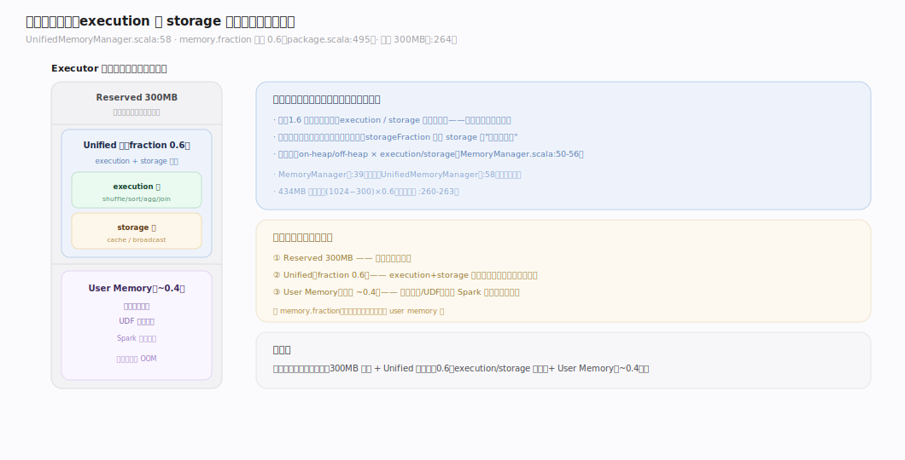
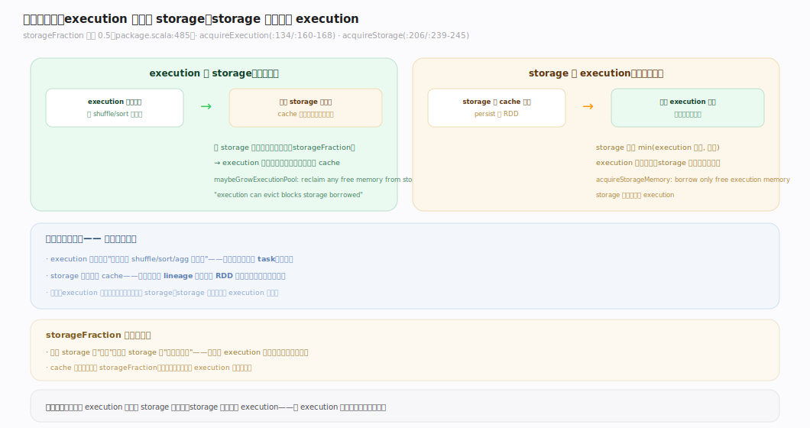
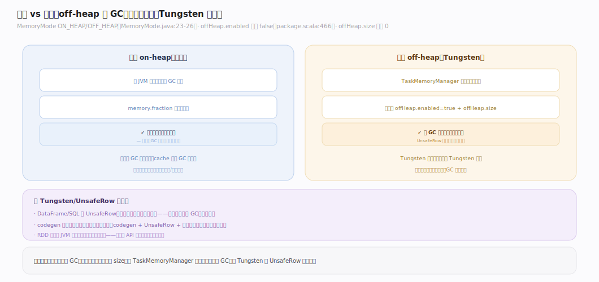
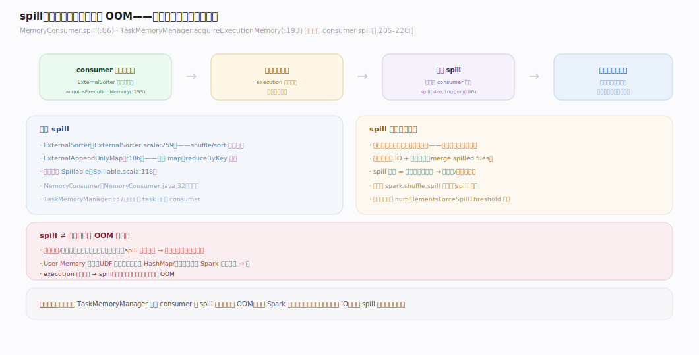

# Spark 原理 · 支撑主线 · 内存管理

> **定位**：内存管理是资源能力域，在 execution（shuffle/join/sort/agg）与 storage（cache/broadcast）间**统一分配、软边界互借**；骨架 = `UnifiedMemoryManager → execution/storage 软边界 → 不够就 spill 落盘`。与 **Tungsten**（堆外精确管字节）、**Shuffle**（spill）、**存储与缓存**（storage 内存）深交叠。核实基准：`~/workdir/spark/core/.../memory`（master，post-4.0）。

## 一、统一内存模型

`UnifiedMemoryManager`（`memory/UnifiedMemoryManager.scala:58`）是默认内存管理器：把 `(堆 − 300MB 预留)` 的一块统一区域按 `spark.memory.fraction`（**默认 0.6**，`internal/config/package.scala:495`）划给 execution+storage **共享**。预留常量 `RESERVED_SYSTEM_MEMORY_BYTES = 300MB`（`UnifiedMemoryManager.scala:264`）留给 Spark 内部对象与用户代码。抽象基类 `MemoryManager`（`memory/MemoryManager.scala:39`）把内存拆成四个池：on/off-heap × execution/storage（`:50-56`）。核心思想：**execution 与 storage 不再静态切分，而是共享一块可互相借用的区域**——谁忙谁多占。

---

## 二、execution vs storage 的软边界借用

统一区域内有一条 `spark.memory.storageFraction`（**默认 0.5**，`package.scala:485`）划定的**软边界**——它不是硬墙，而是"storage 免驱逐"的保底线：

- **execution 可借 storage、且能驱逐借出去的部分**：`acquireExecutionMemory`（`:134`）经 `maybeGrowExecutionPool`（`:160-168`）——若 storage 用量超过其保底区，execution 可**驱逐** storage 借走的内存（cache 块被踢）。
- **storage 只能借 execution 的空闲部分、绝不驱逐 execution**：`acquireStorageMemory`（`:206`，`:239-245`）只 `min(执行池空闲, 需求)`。

**为什么不对称**：execution 内存（正在跑的 shuffle/sort）丢了就得重算整个 task，代价高；storage 内存（cache）丢了顶多重算那个 RDD 分区。所以 **execution 优先级更高**。

---

## 三、堆内 vs 堆外

Spark 支持两种内存模式（`MemoryMode` 枚举 `ON_HEAP/OFF_HEAP`，`common/utils-java/.../MemoryMode.java:23-26`）：

| | 堆内（on-heap，默认） | 堆外（off-heap，Tungsten） |
|---|---|---|
| 管理 | JVM 堆，受 GC | `TaskMemoryManager` 直接管字节，绕 GC |
| 开关 | 默认 | `spark.memory.offHeap.enabled`（**默认 false**，`package.scala:466`） |
| 大小 | `memory.fraction` 切分堆 | `spark.memory.offHeap.size`（**默认 0**，需显式设） |
| 优势 | 简单、对象直用 | 无 GC 停顿、内存可精确控制、UnsafeRow 紧凑 |

堆外是 Tungsten 三支柱之一：结构化数据（UnsafeRow）存堆外，避开 JVM 对象头开销与 GC 压力（详见 [[Tungsten]]）。

---

## 深化 · spill：超内存落盘

内存不够时 Spark **不 OOM 而是 spill（落盘）**：`MemoryConsumer`（`core/.../memory/MemoryConsumer.java:32`）是内存消费者抽象，其 `spill(size, trigger)`（`:86`）把内存数据写盘、释放内存。`TaskMemoryManager`（`TaskMemoryManager.java:57`）在 `acquireExecutionMemory`（`:193`）发现内存紧张时，**触发其他 consumer 的 spill**（`:205-220`）来腾地方。典型 spill 者：`ExternalSorter.spill`（`util/collection/ExternalSorter.scala:259`）、`ExternalAppendOnlyMap.spill`（`:186`），共同经 `Spillable`（`:118`）。spill 让 Spark 能处理**超过内存的数据集**（代价是磁盘 IO），是稳定性的兜底。

> 注：老开关 `spark.shuffle.spill`（启/停 spill）在现版本已移除——**spill 恒开**，只有强制 spill 阈值 `spark.shuffle.spill.numElementsForceSpillThreshold` 等子项可调。

---

## 拓展 · 内存边界

| 类别 | 项 | 说明 |
|---|---|---|
| 内存区 | reserved 300MB | 系统预留，不参与 fraction 划分 |
| 统一区 | execution + storage | `memory.fraction` 共享、软边界互借 |
| user memory | 剩余部分 | 用户数据结构、UDF 对象（不受 Spark 管） |
| 内存模式 | on-heap / off-heap | 后者绕 GC（Tungsten） |
| 溢出 | spill | 内存不足落盘，不 OOM |

---

## 调优要点（关键开关）

- `spark.memory.fraction`：统一区占 `(堆−300MB)` 比例（默认 0.6）——调大给计算更多、调小留更多 user memory。
- `spark.memory.storageFraction`：storage 免驱逐保底（默认 0.5）——cache 重的应用调大。
- `spark.memory.offHeap.enabled` + `.size`：开堆外（默认 false / 0）——降 GC 压力，须显式配 size。
- `spark.executor.memory` / `.memoryOverhead`：executor 堆 / 堆外+native 开销预留。
- `spark.shuffle.spill.numElementsForceSpillThreshold`：强制 spill 的元素数阈值。

---

## 常见误区与工程要点

- **以为 execution/storage 静态切分**：统一内存下二者软边界互借，`storageFraction` 只是 storage 的免驱逐保底，不是硬上限。
- **cache 太多挤垮计算**：cache（storage）占太多，execution 借不回 → 频繁 spill 变慢；cache 重的适当调大 `storageFraction` 或用 `MEMORY_AND_DISK`。
- **以为内存不够就 OOM**：execution 内存不够会 spill 落盘（慢但不崩）；真正 OOM 常是**单条记录/单分区过大**或 user memory（UDF 里攒大对象）爆掉。
- **堆外不配 size**：`offHeap.enabled=true` 但 `offHeap.size=0` 等于没开。

---

## 一句话总纲

**统一内存把 `(堆−300MB)` 的 0.6 划给 execution+storage 共享：软边界（storageFraction 0.5）内二者互借，但 execution 可驱逐 storage 借走的、storage 绝不驱逐 execution（因 execution 丢了代价更高）；内存不够时 MemoryConsumer 触发 spill 落盘而非 OOM；堆外模式（默认关）由 TaskMemoryManager 精确管字节、绕开 GC——这是 Spark 在有限内存上跑超大数据集的资源基座。**
