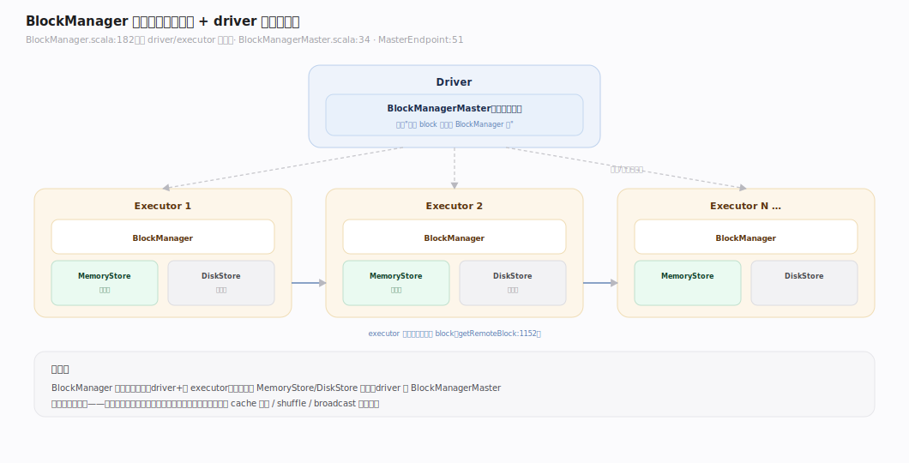
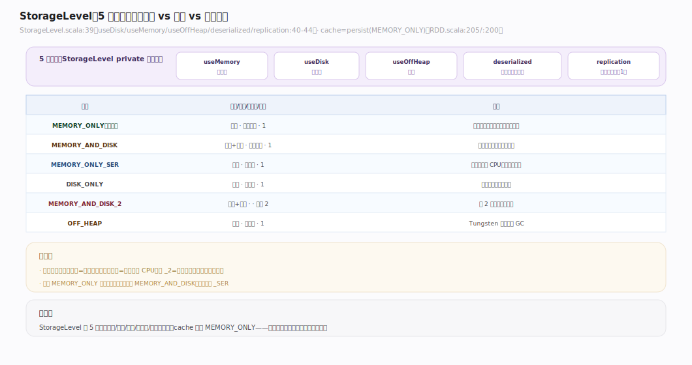
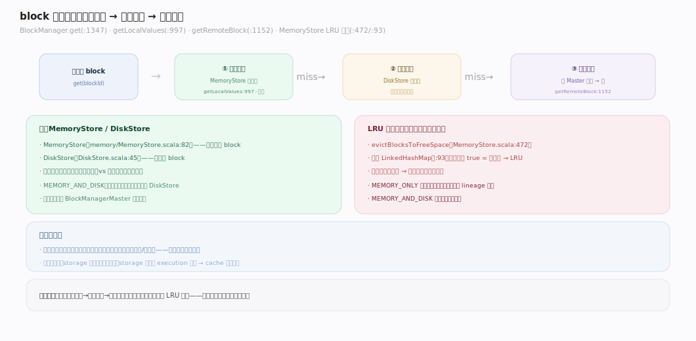
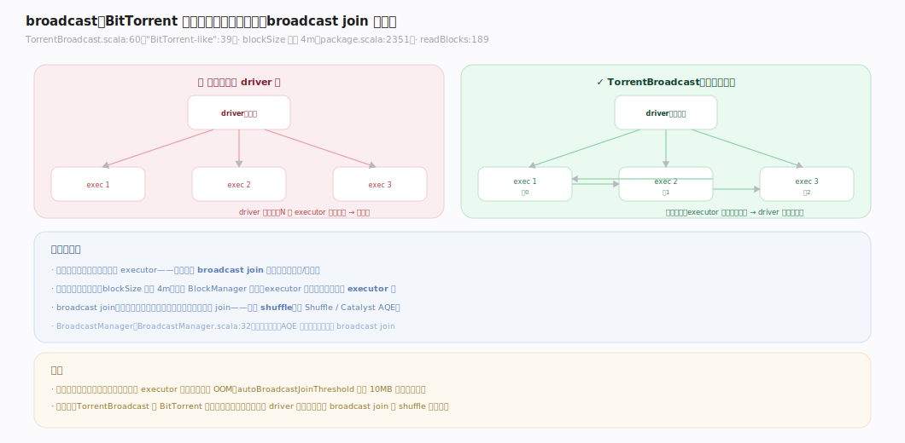

# Spark 原理 · 支撑主线 · 存储与缓存（BlockManager）

> **定位**：存储与缓存是资源能力域，管 executor/driver 上一切"块（block）"——cache 的 RDD 分区、shuffle 数据、broadcast；骨架 = `BlockManager(每节点) + BlockManagerMaster(driver 目录) → 内存/磁盘/堆外多层 → 本地直读/远程拉取`。与 **内存管理**（storage 内存）、**Shuffle**（block 存取）、**容错**（cache 丢失重算）交叠。核实基准：`~/workdir/spark/core/.../storage`（master，post-4.0）。

## 一、BlockManager 架构：每节点一个 + driver 目录

`BlockManager`（`storage/BlockManager.scala:182`）**运行在每个节点（driver 和每个 executor）**，提供块的存取接口——本地和远程（`:175-180`："putting and retrieving blocks both locally and remotely into various stores (memory, disk, and off-heap)"）。它管的"块"包括：cache 的 RDD 分区、shuffle 中间数据、broadcast 变量。driver 侧的 `BlockManagerMaster`（`storage/BlockManagerMaster.scala:34`）+ `BlockManagerMasterEndpoint`（`:51`）是**全局目录**——记录"哪个 block 在哪个 BlockManager 上"，谁要拉数据先问它。这是一个 **master–slave** 结构：Master 记账，各节点 BlockManager 实际存取。

---

## 二、cache / persist：存储级别

`cache()`（`rdd/RDD.scala:205`）就是 `persist(MEMORY_ONLY)`（`persist()` `:200`，默认级别 MEMORY_ONLY）。`StorageLevel`（`common/utils/.../storage/StorageLevel.scala:39`）由 5 个标志组合：**useDisk / useMemory / useOffHeap / deserialized / replication**（`:40-44`，replication 默认 1）。预定义级别（`object StorageLevel` `:148`）：

| 级别 | 内存 | 磁盘 | 序列化 | 说明 |
|---|---|---|---|---|
| `MEMORY_ONLY`（默认） | ✓ | | 反序列化 | 最快，内存不够则丢（重算） |
| `MEMORY_AND_DISK` | ✓ | ✓ | 反序列化 | 内存放不下溢到盘 |
| `MEMORY_ONLY_SER` | ✓ | | 序列化 | 省内存，费 CPU |
| `DISK_ONLY` | | ✓ | 序列化 | 全落盘 |
| `MEMORY_AND_DISK_2` | ✓ | ✓ | | 副本 2 份（`replication=2`） |
| `OFF_HEAP` | 堆外 | | 序列化 | Tungsten 堆外 |

选级别 = 在**速度 vs 内存 vs 容错**间权衡。反序列化最快但占内存；序列化省内存费 CPU；带 `_2` 的多存一份副本抗节点故障。

---

## 三、block 的内存/磁盘/远程多层

一个 block 的存取跨多层。存：`MemoryStore`（`storage/memory/MemoryStore.scala:82`）存内存、`DiskStore`（`storage/DiskStore.scala:45`）存磁盘。取（`BlockManager.get` `:1347`）按**本地内存 → 本地磁盘 → 远程拉取**顺序：`getLocalValues`（`:997`）先查本地，`getRemoteBlock`（`:1152`）/`getRemoteBytes`（`:1327`）向持有该 block 的远程 BlockManager 拉（位置来自 BlockManagerMaster）。内存不够时 `MemoryStore.evictBlocksToFreeSpace`（`:472`）按 **LRU** 驱逐——底层是 access-order 的 `LinkedHashMap`（`:93`，构造参数 `true` = 访问序）。这层多级存储让"内存装得下就快、装不下也不崩"。

---

## 深化 · broadcast 广播变量

broadcast 把一份只读数据高效分发到所有 executor（典型用途：**broadcast join** 的小表、大字典）。`TorrentBroadcast`（`broadcast/TorrentBroadcast.scala:60`）用 **BitTorrent 式**分发（`:39`："A BitTorrent-like implementation"）：数据切成块（`spark.broadcast.blockSize` 默认 **4m**，`package.scala:2351`），executor 之间**点对点互相拉块**（`readBlocks` `:189`），而非全从 driver 拉——避免 driver 成瓶颈（`:41-42`）。`BroadcastManager`（`broadcast/BroadcastManager.scala:32`）管生命周期。broadcast join 正是靠它把小表广播到各节点，**省掉 shuffle**（见 [[Shuffle]]、[[Catalyst]] AQE 动态改 broadcast join）。

---

## 拓展 · 存储边界

| 类别 | 项 | 说明 |
|---|---|---|
| 块类型 | RDD 分区 / shuffle / broadcast | BlockManager 统一管 |
| 存储介质 | 内存 / 磁盘 / 堆外 | StorageLevel 组合 |
| 副本 | replication（默认 1） | `_2` 级别存 2 份抗故障 |
| 驱逐 | LRU | 内存压力下踢最久未用 |
| 目录 | BlockManagerMaster | driver 侧全局块位置目录 |
| ESS | external shuffle service | shuffle 块独立进程存（动态分配必需） |

---

## 调优要点（关键开关）

- `StorageLevel` 选择：`MEMORY_ONLY`（默认，最快）/ `MEMORY_AND_DISK`（大数据集防丢）/ `_SER`（省内存）。
- `spark.broadcast.blockSize`：broadcast 分块大小（默认 4m）。
- `spark.sql.autoBroadcastJoinThreshold`：自动 broadcast join 的表大小阈值（SQL 侧，默认 10MB）。
- `spark.memory.storageFraction`：storage 内存免驱逐保底（见 [[内存管理]]）。
- **external shuffle service**：解耦 shuffle 块与 executor 生命周期。

---

## 常见误区与工程要点

- **无脑 cache 一切**：cache 占 storage 内存，挤压 execution → 反而 spill 变慢；只 cache **多次复用**的 RDD/DataFrame。
- **cache 用 MEMORY_ONLY 但装不下**：超出的分区不缓存、每次重算；大数据集用 `MEMORY_AND_DISK`。
- **大表用 broadcast join**：broadcast 的表要能装进每个 executor 内存；表太大广播会 OOM——只广播小表。
- **cache 后不 unpersist**：长作业里 cache 的 RDD 不再用要 `unpersist()` 释放，否则一直占 storage 内存。

---

## 一句话总纲

**BlockManager 在每个节点（driver+executor）统一管一切"块"（cache 分区/shuffle/broadcast），driver 侧 BlockManagerMaster 是全局位置目录；cache/persist 经 StorageLevel（内存/磁盘/堆外/序列化/副本 5 标志组合）在速度-内存-容错间权衡，取数按本地内存→本地磁盘→远程拉取、内存不足 LRU 驱逐；broadcast 用 BitTorrent 式点对点分发只读数据，是 broadcast join 省 shuffle 的基础。**
