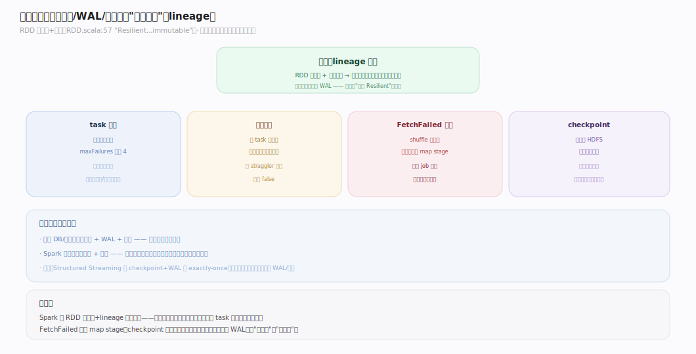
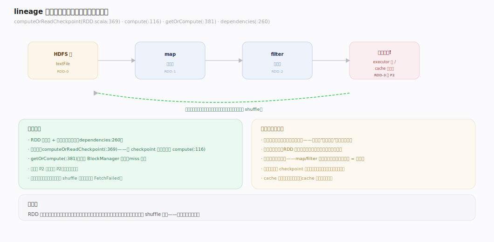
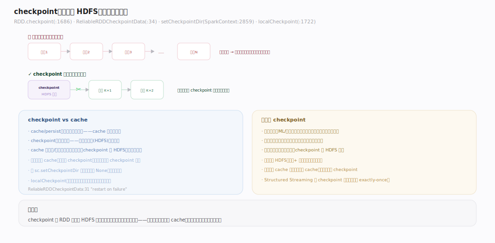
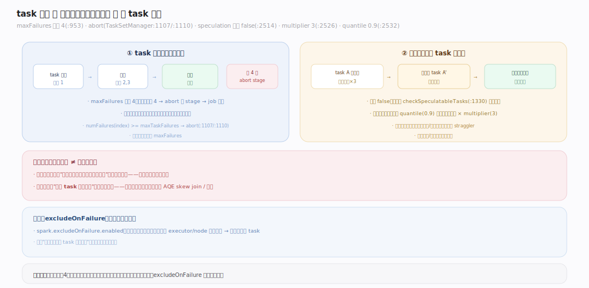
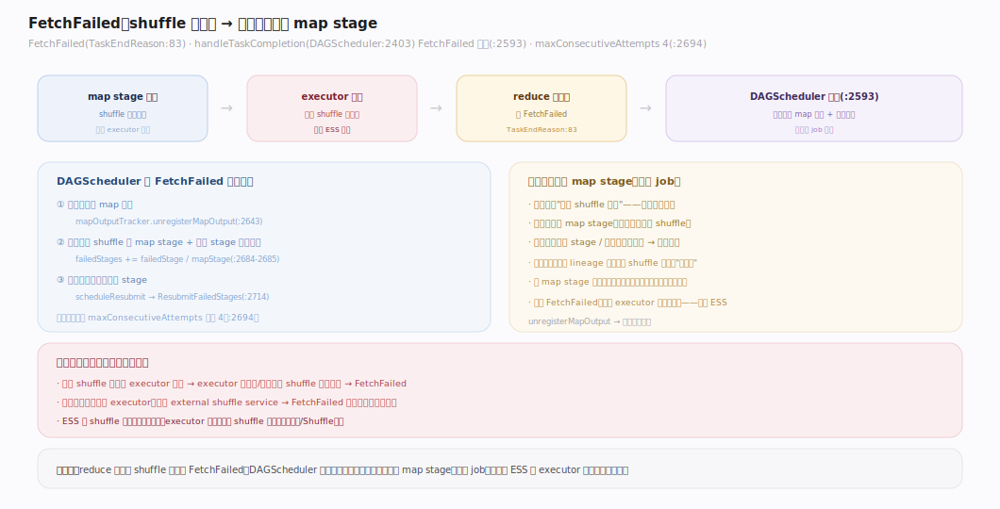

# Spark 原理 · 支撑主线 · 容错

> **定位**：容错是保障能力域，Spark 批处理**不靠副本/事务/WAL，而靠"可重算性"**——RDD 不可变 + lineage 记录来路，丢了按血缘重算；骨架 = `lineage 重算 + checkpoint 截断血缘 + task 重试 + 推测执行 + FetchFailed 重跑 map stage`。深依 **执行模型**（lineage/stage）、**Shuffle**（FetchFailed）、**存储与缓存**（cache 丢失）。核实基准：`~/workdir/spark/core/.../{rdd,scheduler}`（master，post-4.0）。

## 一、容错全景：可重算性

Spark 批处理的容错哲学与传统系统不同：**不复制数据、不写 WAL、不做事务**，而是靠 RDD 的**不可变 + lineage（血缘）**——`RDD.scala:57` 的类注释即 "Resilient Distributed Dataset...immutable, partitioned collection"。每个 RDD 记录了"我从哪些父 RDD、经什么转换算出来"（`dependencies` `:260`）。任何分区丢失（节点挂、cache 被驱逐），都能**沿血缘从源头重算那一个分区**——不用整个作业重跑。多层保障叠加：task 级重试、推测执行治拖后腿、FetchFailed 重跑丢失的 map stage、checkpoint 截断过长血缘。

---

## 二、lineage 重算：丢分区按血缘重建

RDD 是**不可变**的，且每个 RDD 持有对父 RDD 的依赖引用（窄/宽依赖，见 [[执行模型]]）。取一个分区时走 `computeOrReadCheckpoint`（`rdd/RDD.scala:369`）：若已 checkpoint 则从 checkpoint 读，否则 `compute(split, context)`（抽象方法 `:116`）现算。`getOrCompute`（`:381`）先查 BlockManager 缓存、没有再算。**分区丢失时**：Spark 只需对那个分区重跑其 lineage 链——窄依赖只需重算对应父分区；宽依赖需父 stage 的 shuffle 输出还在（否则触发 FetchFailed 重跑，见深化）。这就是"弹性（Resilient）"的来源：**不存副本，靠重算**。

---

## 三、checkpoint：截断血缘

血缘太长（迭代算法几十上百轮）时，重算成本高、栈也深。`RDD.checkpoint()`（`rdd/RDD.scala:1686`）把 RDD **物化到可靠存储（HDFS）并截断血缘**——`ReliableRDDCheckpointData`（`rdd/ReliableRDDCheckpointData.scala:34`，`:31`："writes the RDD data to reliable storage...drivers to be restarted on failure"）。之后重算不再回溯到源头，只从 checkpoint 读。须先 `sc.setCheckpointDir`（`SparkContext.scala:2859`；默认 `checkpointDir=None` `:375`，没设就 `checkpoint()` 报错）。另有 `localCheckpoint()`（`:1722`）——存本地、更快但**牺牲容错**（节点挂了 checkpoint 也没了）。checkpoint vs cache：cache 是加速（血缘还在），checkpoint 是**切断血缘**（更可靠但要写可靠存储）。

---

## 四、task 重试与推测执行

两个 task 级保障：

- **重试**：task 失败自动重试，`spark.task.maxFailures`（**默认 4**，`internal/config/package.scala:953`）。同一 task 累计失败达阈值（`TaskSetManager.scala:1107`）→ `abort` 整个 stage（`:1110`）→ job 失败。应对瞬时故障（网络抖动、节点临时问题）。
- **推测执行（speculation）**：治**拖后腿的慢 task（straggler）**。`spark.speculation`（**默认 false**，`:2514`）开启后，`checkSpeculatableTasks`（`TaskSetManager.scala:1330`）发现某 task 明显慢于同批中位数（`spark.speculation.multiplier` **默认 3**，`:2526`；当已完成比例达 `spark.speculation.quantile` **默认 0.9**，`:2532`）→ 起一个**备份 task**，谁先完成用谁、另一个杀掉。对付某节点变慢（磁盘老化、资源竞争）导致的长尾。

---

## 深化 · FetchFailed：shuffle 丢失重跑 map stage

宽依赖的容错最微妙。reduce task 拉 map 输出时若拉不到（executor 挂了、shuffle 文件丢失），抛 `FetchFailed`（`TaskEndReason.scala:83`）。`DAGScheduler.handleTaskCompletion`（`:2403`）的 FetchFailed 分支（`:2593`）：**注销丢失的 map 输出**（`mapOutputTracker.unregisterMapOutput` `:2643`）→ 把产出该 shuffle 的 **map stage 和当前 stage 都标记重跑**（`failedStages += ...` `:2684-2685`）→ 延迟重新提交（`:2714`）。即**丢了哪部分 shuffle 输出，就重算产生它的那个 map stage**（而非整个 job）。连续失败上限 `spark.stage.maxConsecutiveAttempts`（**默认 4**，`config/package.scala:2694`；FetchFailed 路径引用见 `DAGScheduler.scala:2611`）。这是"动态资源分配必须配 external shuffle service"的根因——否则回收 executor = 丢 shuffle = FetchFailed 连环重算（见 [[调度与集群管理]]、[[Shuffle]]）。

---

## 拓展 · 容错边界

| 类别 | 项 | 说明 |
|---|---|---|
| 基石 | lineage 重算 | 不可变 RDD + 依赖链，丢分区按血缘重建 |
| 血缘截断 | checkpoint | 物化到 HDFS，切断过长血缘（迭代算法） |
| task 级 | 重试（默认 4） | 瞬时故障自愈 |
| 长尾 | 推测执行 | 慢 task 起备份，先到先得 |
| shuffle | FetchFailed | 重跑丢失的 map stage |
| 屏蔽 | excludeOnFailure | 排除频繁失败的 executor/node |
| 流式 | checkpoint+WAL | Structured Streaming 才有（见流式篇） |

---

## 调优要点（关键开关）

- `spark.task.maxFailures`：task 重试上限（默认 4）——不稳环境可调大。
- `spark.speculation`：推测执行（默认 false）——异构/易出 straggler 集群开启。
- `spark.speculation.multiplier` / `.quantile`：慢的判定（默认 3 / 0.9）。
- `spark.stage.maxConsecutiveAttempts`：stage 连续失败上限（默认 4）。
- `spark.excludeOnFailure.enabled`：屏蔽故障节点（**无默认值**，须显式开）。
- `sc.setCheckpointDir` + `rdd.checkpoint()`：迭代算法截断血缘。

---

## 常见误区与工程要点

- **以为 Spark 批处理靠副本/WAL 容错**：不是——批处理纯靠 lineage 重算；副本/WAL/checkpoint 是可选或流式才有。
- **迭代算法不 checkpoint**：血缘越来越长 → 一次故障重算成本巨大、栈溢出；每若干轮 `checkpoint()` 截断。
- **推测执行治数据倾斜**：无效——倾斜是"这个 task 本来就重"，起备份同样慢；倾斜要 AQE skew join 或加盐。
- **动态分配不开 ESS**：executor 回收丢 shuffle → FetchFailed 连环重算（见 Shuffle/调度）。
- **checkpoint 当 cache 用**：checkpoint 要写 HDFS（慢）且触发额外计算；只加速用 cache，要截断血缘/跨作业才 checkpoint。

---

## 一句话总纲

**Spark 批处理不靠副本/事务/WAL，而靠 RDD 的不可变 + lineage：任何分区丢失都能沿血缘只重算那一份；多层叠加——task 重试（默认 4）应对瞬时故障、推测执行起备份治慢 task 长尾、FetchFailed 重跑丢失的 map stage、checkpoint 物化到 HDFS 截断过长血缘。这套"可重算性"是 Spark 弹性（Resilient）的本义；流式的 exactly-once（checkpoint+WAL）是另一套（见流式篇）。**
