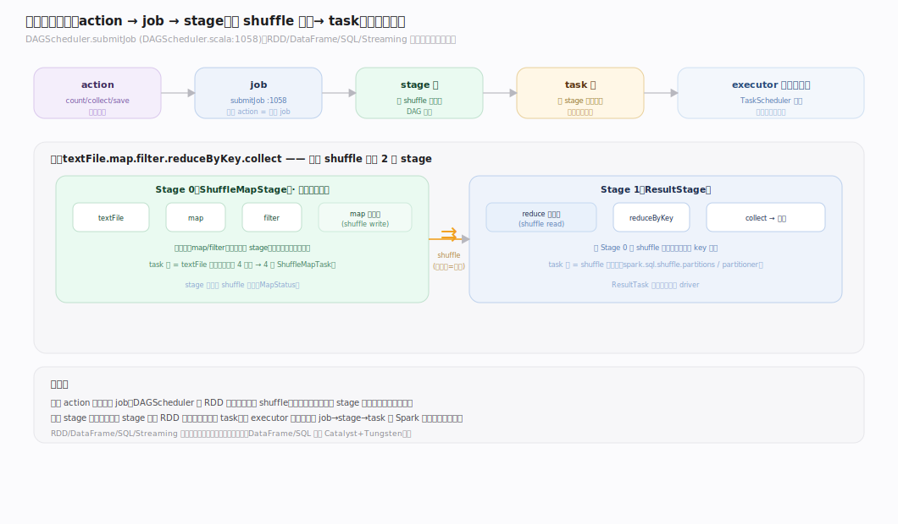
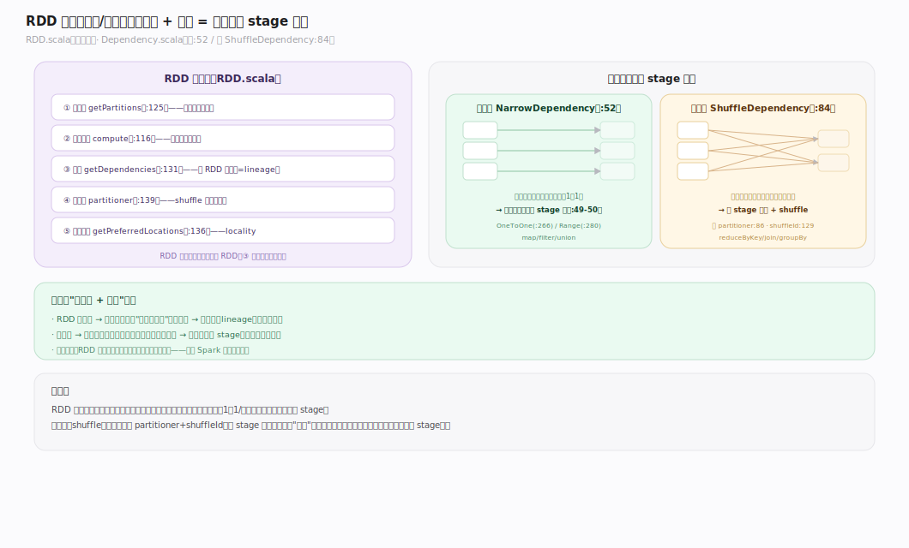
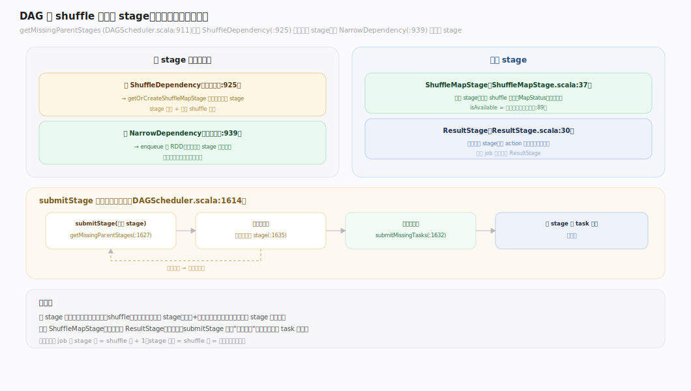
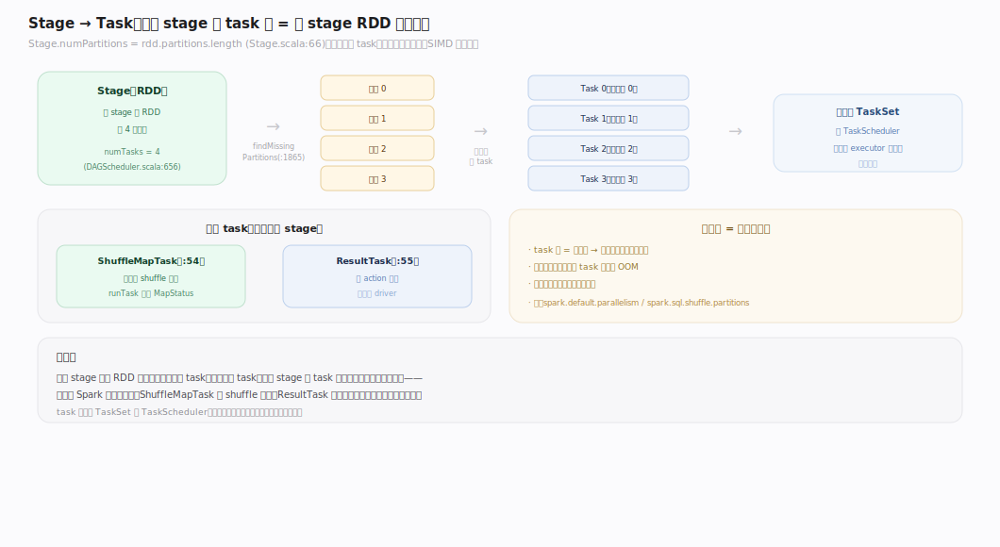
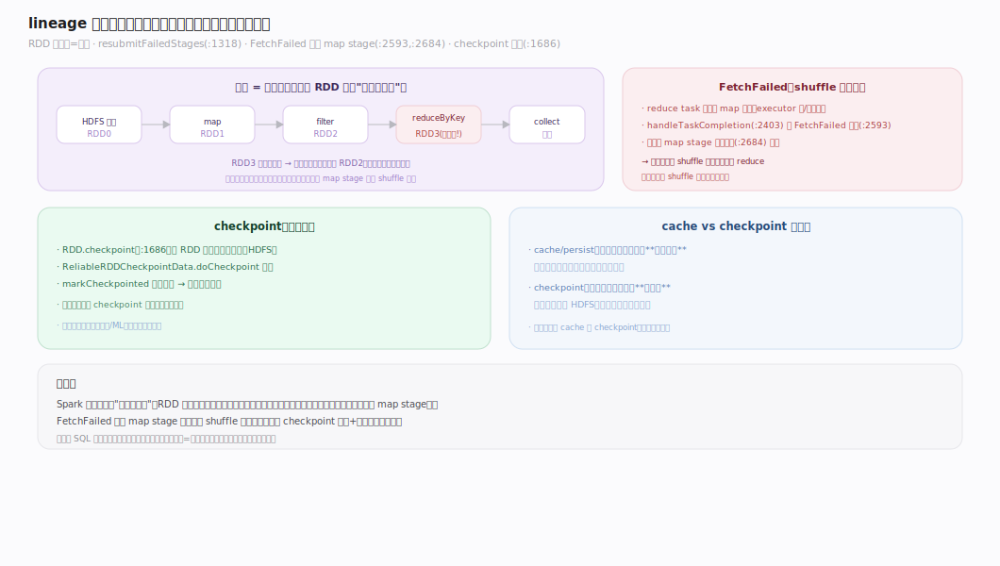
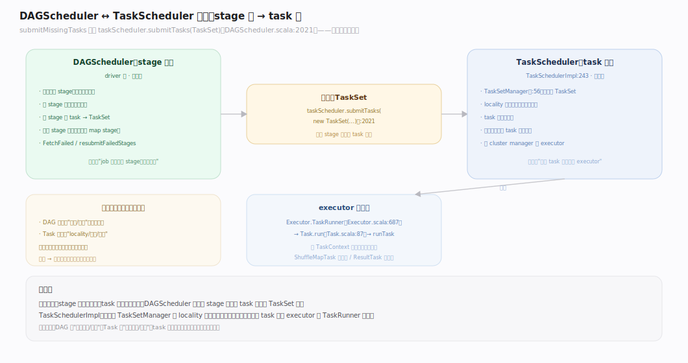

# Spark 原理 · 支撑主线 · 执行模型（DAG / Stage / Task / lineage）

> **定位**：执行模型是计算·执行能力域，Spark 的灵魂主线——把一个 job 按窄/宽依赖切成 stage、每 stage 按分区拆 task；骨架 = `action 触发 job → DAG 按 shuffle 切 stage → task 分区并行 → lineage 容错`。上承所有接口/优化产物，下依 **调度**（TaskScheduler）、**Shuffle**（宽依赖物化）、**容错**（lineage 重算）。核实基准：`~/workdir/spark/core/.../scheduler`（Spark master）。

## 一、执行模型全景：job → stage → task

一个 **action**（如 `count`/`collect`/`save`）触发一个 **job**：`DAGScheduler.submitJob`（`DAGScheduler.scala:1058`）向事件循环投 `JobSubmitted`，`runJob`（`:1117`）提交后等 `JobWaiter` 完成。job 被切成若干 **stage**（按 shuffle 边界），每个 stage 按 RDD 的分区数拆成并行的 **task**。这是 Spark 一切执行的骨架——RDD/DataFrame/SQL/Streaming 最终都落到这套模型上。

---

## 二、RDD 五要素与窄/宽依赖

**RDD**（`RDD.scala`）由五要素定义：分区集（`getPartitions:125`）、计算函数（`compute:116`）、依赖（`getDependencies:131`）、分区器（`partitioner:139`）、优先位置（`getPreferredLocations:136`）。RDD **不可变**，转换产生新 RDD，依赖链即 **lineage**（`dependencies:260`）。

依赖分两类（`Dependency.scala`）：
- **窄依赖**（`NarrowDependency:52`，如 `OneToOneDependency:266`/`RangeDependency:280`）：子分区只依赖父的固定几个分区，**可流水线执行**（源码注释 `:49-50`"allow for pipelined execution"）。
- **宽依赖 / shuffle 依赖**（`ShuffleDependency:84`）：子分区依赖父的所有分区，携带 `partitioner:86`/`serializer:87`、分配 `shuffleId:129`——**它是 stage 的边界**。

---

## 三、DAG 按 shuffle 边界切 stage

切 stage 的规则在 `getMissingParentStages`（`DAGScheduler.scala:911`）：遍历 RDD 依赖——遇 **ShuffleDependency**（`:925`）就 `getOrCreateShuffleMapStage`，切出一个独立父 stage（边界 + 物化 shuffle 输出）；遇 **NarrowDependency**（`:939`）则把该 RDD 折进**同一** stage 继续遍历（流水线，不切）。于是：**宽依赖处切 stage，窄依赖在 stage 内流水线**。

产物两类 stage：`ShuffleMapStage`（`ShuffleMapStage.scala:37`，输出中间 shuffle 数据）与 `ResultStage`（`ResultStage.scala:30`，产最终结果）。`submitStage`（`:1614`）递归：先提交缺失父 stage，父就绪才 `submitMissingTasks`（`:1831`）。

---

## 四、Stage → Task：按分区并行

**一个 stage 的 task 数 = 该 stage RDD 的分区数**（`Stage.numPartitions = rdd.partitions.length`，`Stage.scala:66`；`createShuffleMapStage` 设 `numTasks = rdd.partitions.length`，`DAGScheduler.scala:656`）。`submitMissingTasks` 取 `findMissingPartitions`（`:1865`），对每个待算分区造一个 task：`ShuffleMapTask`（`ShuffleMapTask.scala:54`，`runTask` 返回 `MapStatus`）或 `ResultTask`（`ResultTask.scala:55`）。task 是 Spark 的最小执行/调度/重试单位；同 stage 的 task 逻辑相同、只是分区不同（SIMD 式并行）。

---

## 深化 · lineage 血缘与容错重算

**lineage（血缘）= RDD 的依赖链**，是 Spark 容错的根：某分区数据丢失时，不靠副本，而是**沿血缘重算**。`submitStage` 递归重建缺失父 stage；`resubmitFailedStages`（`:1318`）重提失败 stage。**FetchFailed**（reduce 端拉不到 map 输出，`handleTaskCompletion:2403` 的 `:2593` 分支）会把对应 map stage 重新入队（`:2684`）重跑，再生丢失的 shuffle 输出。

代价：血缘越长、宽依赖越多，重算越贵。**checkpoint**（`RDD.checkpoint:1686`，`ReliableRDDCheckpointData`）把 RDD 物化到可靠存储并**截断血缘**（`markCheckpointed` 清依赖）——长迭代作业该定期 checkpoint。（详见「容错」主线。）

---

## 深化 · DAGScheduler ↔ TaskScheduler 交接

执行模型（stage 级）与调度（task 级）的交接点：`submitMissingTasks` 末尾 `taskScheduler.submitTasks(new TaskSet(...))`（`DAGScheduler.scala:2021`）把一个 stage 的所有 task 打包成 **TaskSet** 交给 `TaskSchedulerImpl`（`:243`），后者用 `TaskSetManager`（`TaskSetManager.scala:56`）做 task 级的 locality 延迟调度与重试。task 最终在 executor 上由 `Executor.TaskRunner`（`Executor.scala:687`）调 `Task.run`（`Task.scala:87`）→ `runTask` 执行。（task 级调度细节见「调度与集群管理」主线。）

---

## 拓展 · 执行边界清单

| 类别 | 项 | 说明 |
|---|---|---|
| stage 类型 | ShuffleMapStage / ResultStage | 中间 shuffle 输出 / 最终结果 |
| task 类型 | ShuffleMapTask / ResultTask | 对应两类 stage |
| stage 复用 | shuffle 输出可跨 job 复用 | 相同 shuffle 依赖不重算（skipped stage） |
| 分区器 | HashPartitioner / RangePartitioner | 决定 shuffle 后数据分布 |
| 优先位置 | preferred locations | 驱动 task 的 locality 调度 |

---

## 调优要点（关键开关）

- `spark.default.parallelism`：RDD 默认分区数（影响 task 数与并行度）。
- `spark.sql.shuffle.partitions`：SQL/DataFrame shuffle 后分区数（默认 200，常需按数据量调）。
- **checkpoint 时机**：长血缘/迭代作业（如图计算）定期 `checkpoint` 截断血缘，防重算爆炸。
- **分区数**：太少并行度不足、单 task 过大易 OOM；太多调度开销大、小文件多。

---

## 常见误区与工程要点

- **以为 stage 是按算子切的**：stage 只在 **shuffle（宽依赖）** 处切；连续的窄依赖算子（map/filter/…）全折进一个 stage 流水线执行。
- **task 数与分区数脱节**：task 数 = stage RDD 分区数；想改并行度要改分区（repartition/coalesce 或 shuffle partitions），不是改别的。
- **长血缘不 checkpoint**：迭代算法血缘无限增长，一旦丢分区重算代价爆炸，也可能 stack overflow——该 checkpoint 截断。
- **混淆 cache 与 checkpoint**：cache 只缓存不断血缘（丢了仍可重算），checkpoint 物化并断血缘（更可靠但要写可靠存储）。

---

## 一句话总纲

**执行模型是 Spark 的灵魂：一个 action 触发 job，DAGScheduler 沿 RDD 血缘按"宽依赖切 stage、窄依赖 stage 内流水线"把 job 切成 stage，每 stage 按分区数拆成并行 task 交 TaskScheduler 分派到 executor；数据丢失不靠副本而沿 lineage 重算（FetchFailed 重跑 map stage），长血缘用 checkpoint 截断——不可变 RDD + 血缘可重算就是 Spark 容错与调度的共同根基。**
