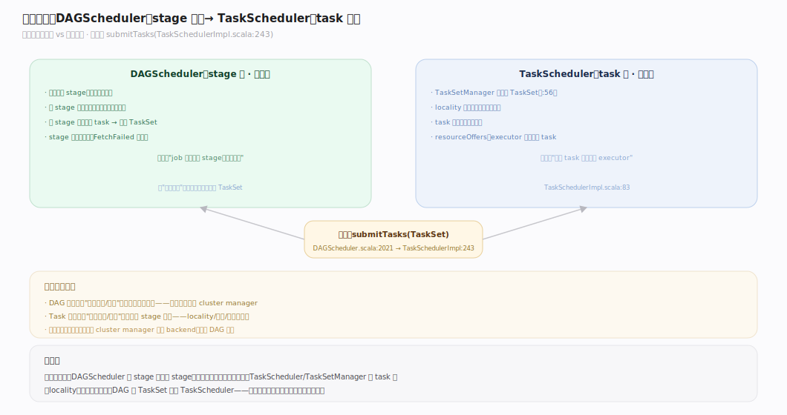
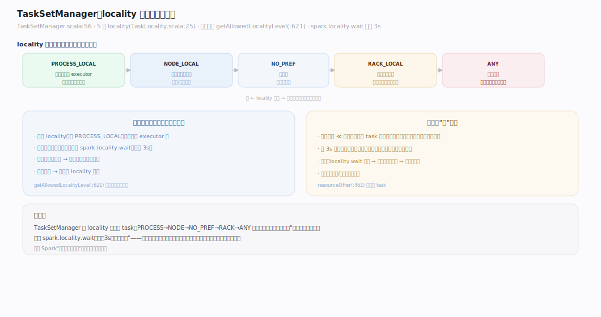
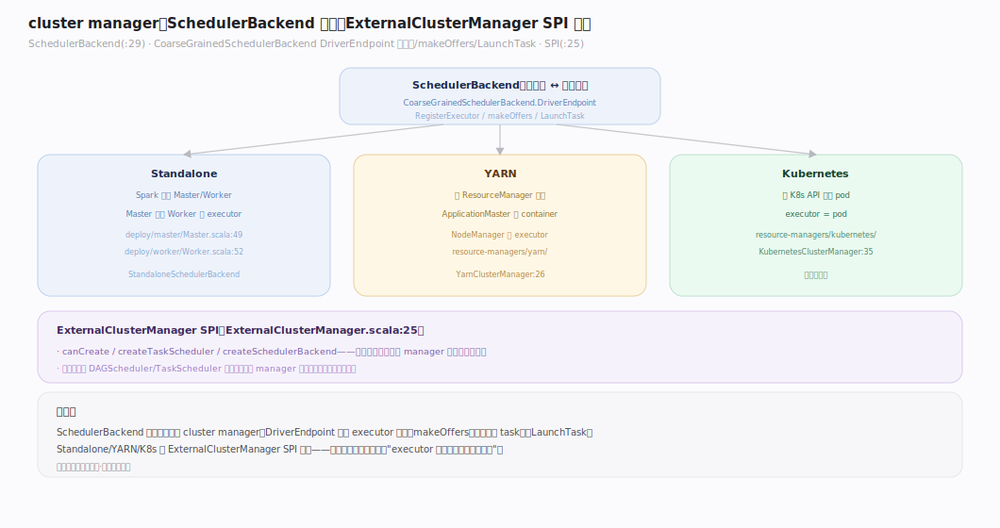
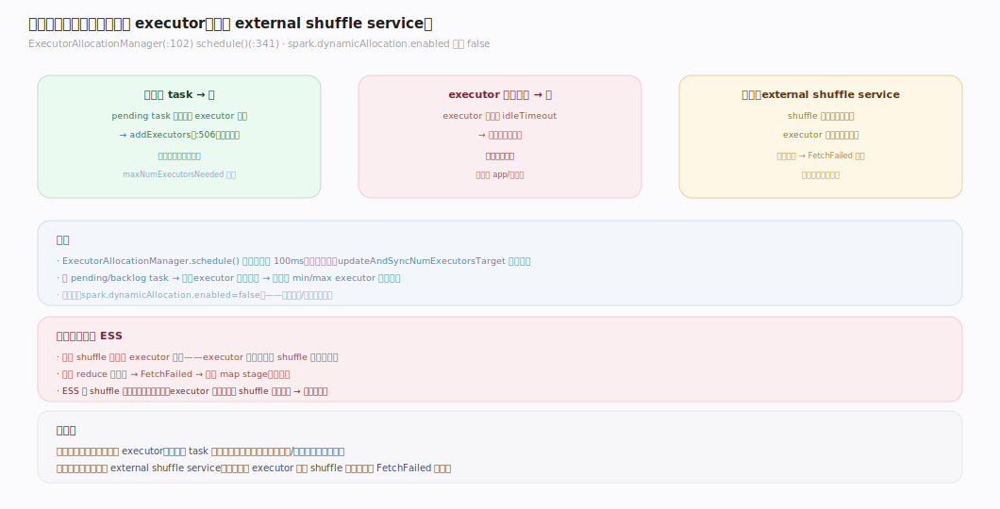
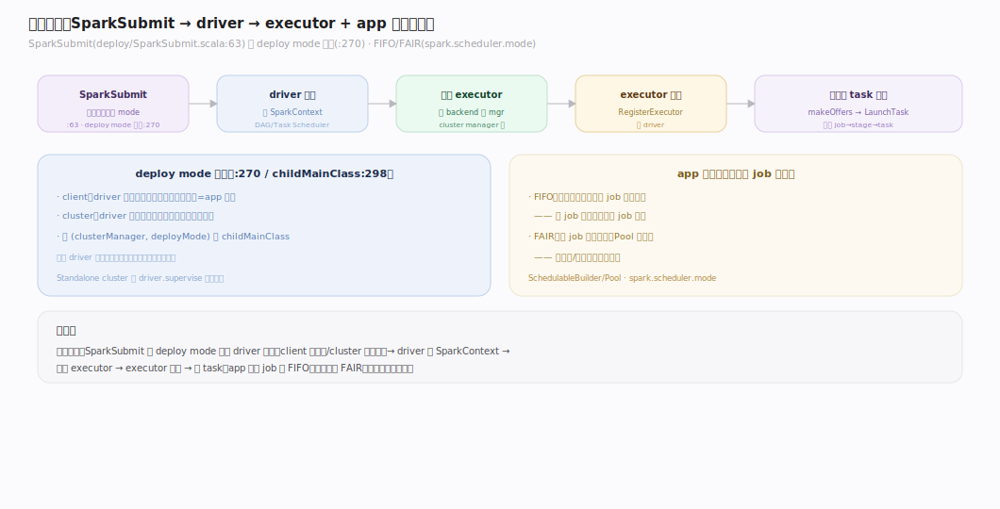

# Spark 原理 · 支撑主线 · 调度与集群管理

> **定位**：调度是资源能力域，把 TaskSet 分派到 executor 并协商集群资源；骨架 = `DAGScheduler(stage 级) → TaskScheduler/TaskSetManager(task 级 locality+重试) → SchedulerBackend ↔ cluster manager(资源)`。上承 **执行模型**，跨 Standalone/YARN/K8s。核实基准：`~/workdir/spark/core/.../scheduler` + `deploy` + `resource-managers`（master，post-4.0）。

## 一、调度两层：DAG 级 vs Task 级

Spark 调度分两层解耦：**DAGScheduler**（stage 级，逻辑）管"job 怎么切 stage、哪个先跑"（见执行模型）；**TaskScheduler**（task 级，物理）管"每个 task 派到哪个 executor"。交接点：DAGScheduler 把一个 stage 的 task 打包成 TaskSet 交 `TaskSchedulerImpl.submitTasks`（`TaskSchedulerImpl.scala:243`），后者为每个 TaskSet 建 `TaskSetManager`（`:294`）做具体调度。这层解耦让"逻辑依赖"与"物理放置"各自演进。

---

## 二、TaskSetManager：locality 与延迟调度

`TaskSetManager`（`TaskSetManager.scala:56`）为一个 TaskSet 做 **locality-aware** 调度：优先把 task 派到数据所在处，locality 级别递减 `PROCESS_LOCAL → NODE_LOCAL → NO_PREF → RACK_LOCAL → ANY`（`TaskLocality.scala:25`）。**延迟调度**（`getAllowedLocalityLevel:621`）：若最优 locality 暂无空闲 executor，宁可**等一小会**（`spark.locality.wait` 默认 3s）也不降级——因为"等一下就近算"常比"立刻远程算"更快（数据不用网络搬）。`resourceOffer`（`:461`）在收到 executor 空闲资源时按此策略挑 task。

---

## 三、cluster manager：Standalone / YARN / K8s

`SchedulerBackend`（`SchedulerBackend.scala:29`）是调度器与 cluster manager 的桥。`CoarseGrainedSchedulerBackend`（`scheduler/cluster/`）的 `DriverEndpoint` 处理 executor 注册（`RegisterExecutor`）、`makeOffers`（把空闲资源交 TaskScheduler 挑 task）、发 `LaunchTask`。不同 cluster manager 经 `ExternalClusterManager` SPI（`ExternalClusterManager.scala:25`）接入：

| Manager | executor 怎么起 | 入口类 |
|---|---|---|
| Standalone | Master 分配 Worker 上的 executor | `deploy/master/Master.scala:49` |
| YARN | AM 向 RM 申请 container | `YarnClusterManager` + `ApplicationMaster` |
| K8s | executor = pod | `KubernetesClusterManager` |

**同一套 job→stage→task 跑在任一 manager 上，只换资源协商方式。**

---

## 四、动态资源分配

`ExecutorAllocationManager`（`ExecutorAllocationManager.scala:102`）按负载动态增减 executor：`schedule`（`:341`）周期检查——有积压 task 就 `addExecutors`（`:506`）申请更多，executor 空闲超时就移除。开关 `spark.dynamicAllocation.enabled`（**默认 false**）。**前提：需 external shuffle service**——否则移除 executor 会丢其 shuffle 数据，下游 FetchFailed。动态分配让集群资源按需伸缩，多租户/波动负载下省资源。

---

## 深化 · 提交流程 SparkSubmit → driver → executor

`SparkSubmit`（`deploy/SparkSubmit.scala:63`）是入口：解析参数、按 **deploy mode 分流**（`:270`，`client` → driver 在提交端；`cluster` → driver 在集群内），按 `(clusterManager, deployMode)` 选 `childMainClass`（`:298`）。driver 启动建 SparkContext → 经 SchedulerBackend 向 cluster manager 申请 executor → executor 注册回 driver → 开始领 task。**app 内调度模式** 可 FIFO（默认）或 FAIR（`spark.scheduler.mode`，`SchedulableBuilder`/`Pool`）——多 job 并发时公平分享资源。

---

## 拓展 · 调度边界

| 类别 | 项 | 说明 |
|---|---|---|
| 调度模式 | FIFO / FAIR | app 内多 job 的资源分配 |
| locality 级别 | 5 级 | PROCESS/NODE/NO_PREF/RACK/ANY |
| 推测执行 | speculation | 慢 task 起备份（见容错） |
| 黑名单 | excludeOnFailure | 屏蔽频繁失败的 executor/node |
| barrier | barrier execution | ML 场景全 task 同时起 |

---

## 调优要点（关键开关）

- `spark.dynamicAllocation.enabled`：动态资源分配（默认 false）——波动负载开，须配 ESS。
- `spark.locality.wait`：延迟调度等待（默认 3s）——数据本地性 vs 启动延迟的权衡。
- `spark.scheduler.mode`：FIFO（默认）/ FAIR——多 job 并发用 FAIR。
- `spark.executor.instances` / `.cores` / `.memory`：静态 executor 规格。
- `spark.task.cpus`：一个 task 占几核（默认 1）。

---

## 常见误区与工程要点

- **动态分配不开 ESS**：executor 被回收后 shuffle 数据丢失 → 下游 FetchFailed 重算；动态分配必须配 external shuffle service。
- **locality.wait 设太大**：等太久反而拖慢；数据均匀时可调小让 task 尽快起。
- **不理解两层调度**：DAGScheduler 管 stage 依赖，TaskScheduler 管 task 放置——性能问题要分清是"stage 切多了"还是"task 放置差"。
- **多 job 用 FIFO 互相饿死**：一个大 job 占满，小 job 排队；交互式/多租户场景用 FAIR。

---

## 一句话总纲

**调度分两层解耦：DAGScheduler 管 stage 级（切 stage、依赖顺序），TaskScheduler/TaskSetManager 管 task 级（locality 延迟调度、重试），经 SchedulerBackend 与 cluster manager（Standalone/YARN/K8s，同模型只换资源协商）交互；SparkSubmit 按 deploy mode 决定 driver 位置，动态资源分配按负载增减 executor（须配 ESS）——一套 job→stage→task 落到任意集群管理器上。**
