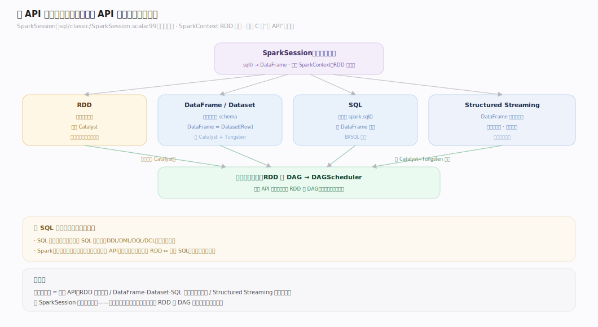
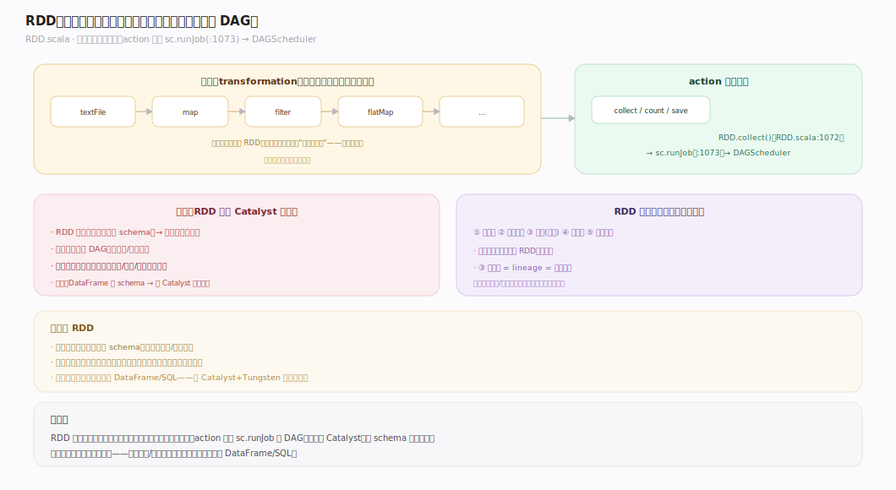
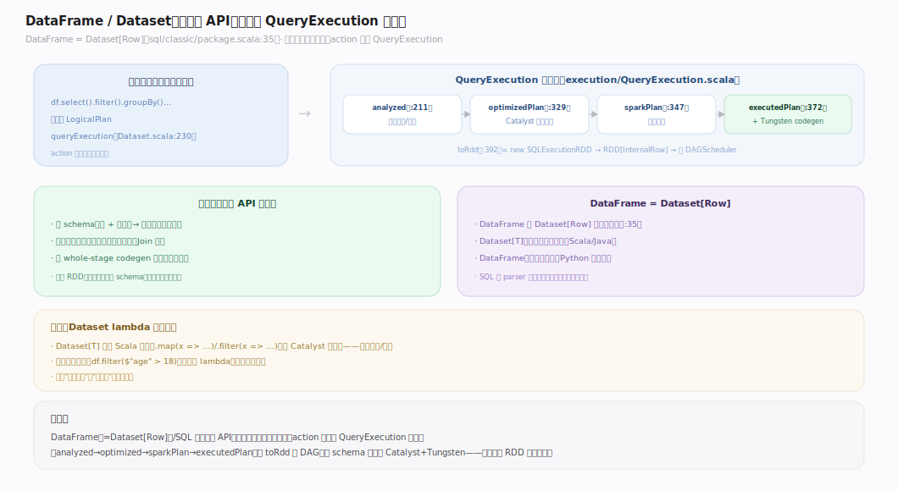
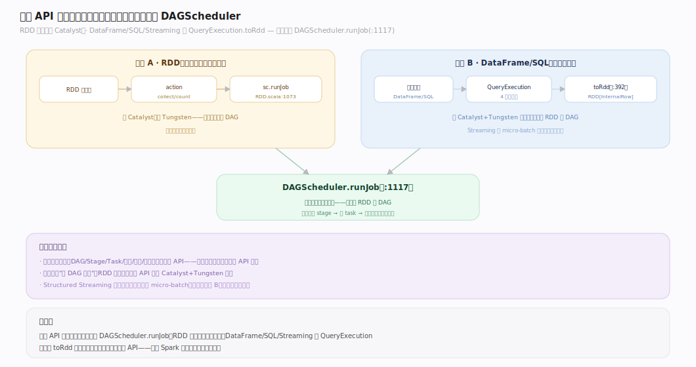

# Spark 原理 · 编程接口层（RDD / DataFrame-Dataset / SQL / Structured Streaming）

> **定位**：编程接口层是接触面主线，是用户与 Spark 交互的多套 API；骨架 = `SparkSession 统一入口 → 四套 API → 汇入统一执行`。DataFrame/SQL 下依 **Catalyst 优化** + **Tungsten codegen**，RDD 直落 **执行模型**；Streaming 是 DataFrame 的流式扩展。核实基准：`~/workdir/spark`（master，post-4.0）。

## 一、多 API 全景与统一入口

Spark 的接触面不是"一种 SQL"，而是**四套 API 汇入同一执行引擎**。`SparkSession`（`sql/classic/SparkSession.scala:99`，post-4.0 拆成抽象 `sql/api` + 具体 `sql/classic`）是统一入口：`sql`（`:707`）把 SQL 文本变成 DataFrame，`SparkContext`（`SparkContext.scala`）是 RDD 入口。**这是原型 C 与 SQL 存算引擎最大的接触面差异**——用户可选不同抽象层级的 API，但底层执行是同一套。

---

## 二、RDD：底层不可变分布式数据集

**RDD** 是最底层的 API：一个不可变、分区的分布式数据集，用户手动写转换（map/filter/reduceByKey）与 action（collect/count）。它由五要素定义（详见「执行模型」），**不过 Catalyst 优化器**——`RDD.collect`（`RDD.scala:1072`）直接 `sc.runJob`（`:1073`）落 DAGScheduler。RDD 给最大控制力，但要自己管性能（无自动优化）。

---

## 三、DataFrame / Dataset：结构化 API（过 Catalyst）

**DataFrame = Dataset[Row]**（类型别名，`sql/classic/package.scala:35`）。Dataset 持有一个逻辑计划（`queryExecution`，`Dataset.scala:230`），**惰性**——转换只累积逻辑计划，action 才触发 `QueryExecution`（`execution/QueryExecution.scala`）的 `analyzed:211 → optimizedPlan:329 → sparkPlan:347 → executedPlan:372`，最后 `toRdd:392` 变成 `RDD[InternalRow]` 执行。**结构化 API 因为有 schema，才能过 Catalyst 优化 + Tungsten codegen**——这是它比 RDD 快的根源。

---

## 四、SQL 接口与 API 对比

`spark.sql("SELECT …")` 经 parser 得逻辑计划、`Dataset.ofRows` 包成 DataFrame（`SparkSession.scala:611`），与 DataFrame 走**完全相同**的 QueryExecution 流程——SQL 和 DataFrame 只是同一优化栈的两种写法。

| 维度 | RDD | DataFrame / Dataset / SQL |
|---|---|---|
| 抽象层级 | 低（手动转换） | 高（声明式/结构化） |
| Catalyst 优化 | ✗ 不过 | ✓ 过（analyzed→optimized→physical） |
| Tungsten codegen | ✗ | ✓ whole-stage codegen |
| schema | 无（任意对象） | 有（列 + 类型） |
| 类型安全 | 编译期（Dataset[T]） | DataFrame 运行期 / Dataset[T] 编译期 |
| 适用 | 非结构化、需精细控制 | 结构化分析（绝大多数场景） |

---

## 深化 · 四套 API 如何汇入同一执行引擎

**两条路径最终都汇到 `DAGScheduler.runJob`**（`DAGScheduler.scala:1117`）：
- **RDD 路径**：`RDD action → sc.runJob`（`RDD.scala:1073`）——直落，跳过 Catalyst。
- **DataFrame/SQL 路径**：`action → QueryExecution.toRdd`（`:392`）→ `executedPlan.execute` 产出 `RDD[InternalRow]` → 落 DAGScheduler。

**Structured Streaming** 是 DataFrame 的流式扩展：每个 micro-batch 是对新数据的一次增量 DataFrame 查询（复用 Catalyst，见流式主线）。所以：**四套 API 都最终编译成 RDD 的 DAG，落到同一执行模型**——理解这一点就理解了 Spark 接触面的统一性。

---

## 拓展 · API 选择

| API | 优化 | 类型安全 | 何时用 |
|---|---|---|---|
| RDD | 无 | 编译期 | 非结构化数据、需底层控制、自定义分区/聚合 |
| DataFrame | Catalyst+Tungsten | 运行期 | 结构化分析主力（Python/Scala/Java/R 通用） |
| Dataset[T] | Catalyst+Tungsten | 编译期 | Scala/Java 需类型安全 + 优化 |
| SQL | Catalyst+Tungsten | 运行期 | 声明式查询、BI 工具、SQL 用户 |
| Structured Streaming | Catalyst+Tungsten | 同 DataFrame | 流式（复用批 API 写流） |

---

## 调优要点（关键开关）

- **优先 DataFrame/SQL 而非 RDD**：结构化 API 过 Catalyst+Tungsten，通常远快于手写 RDD。
- **避免 RDD 与 DataFrame 频繁互转**：`.rdd`/`.toDF` 有序列化开销、且丢失优化机会。
- `spark.sql.execution.arrow.pyspark.enabled`：PySpark 与 pandas 互转用 Arrow 加速。
- **Dataset 的 lambda 破坏优化**：`Dataset[T]` 上用 Scala 闭包（map/filter lambda）会退化为不透明算子、Catalyst 无法优化——能用列表达式就别用 lambda。

---

## 常见误区与工程要点

- **以为 SQL 比 DataFrame 慢/快**：二者走完全相同的 QueryExecution，性能等价，只是写法不同。
- **用 RDD 做结构化分析**：丢掉 Catalyst+Tungsten，通常慢几倍；结构化数据一律用 DataFrame/SQL。
- **在 Dataset 上滥用 lambda**：类型安全的 map/filter 闭包对 Catalyst 是黑盒，无法下推/裁剪——性能不如等价的列 API。
- **混淆 DataFrame 与 Dataset**：DataFrame = Dataset[Row]，Python 只有 DataFrame（无编译期类型），Scala/Java 才有 Dataset[T]。

---

## 一句话总纲

**编程接口层是 Spark 的多 API 接触面：RDD（底层手动、不过优化器、直落 DAG）、DataFrame=Dataset[Row]/SQL（结构化、惰性、过 Catalyst+Tungsten 优化再落 DAG）、Structured Streaming（DataFrame 的流式增量扩展），统一入口 SparkSession——四套 API 抽象层级不同，但最终都编译成 RDD 的 DAG 落到同一执行模型，这是原型 C"多编程 API"与 SQL 存算引擎最根本的接触面差异。**
