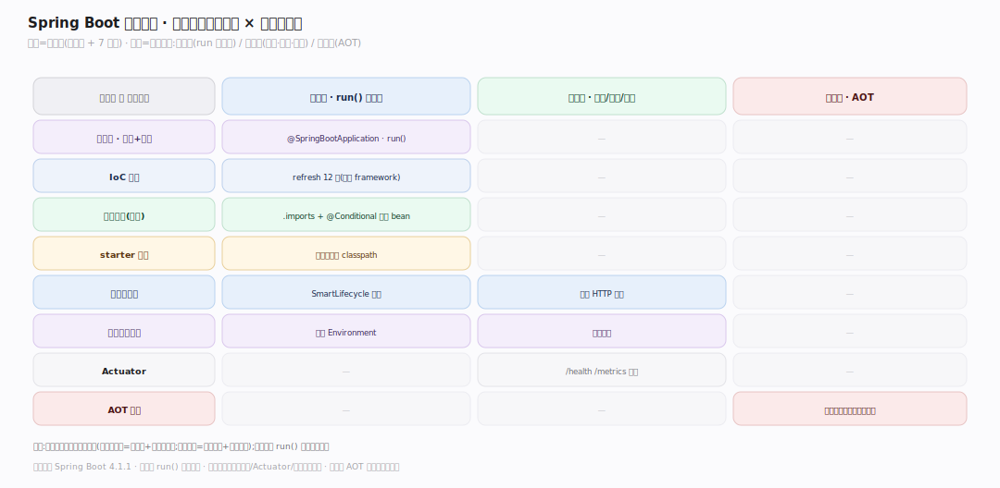
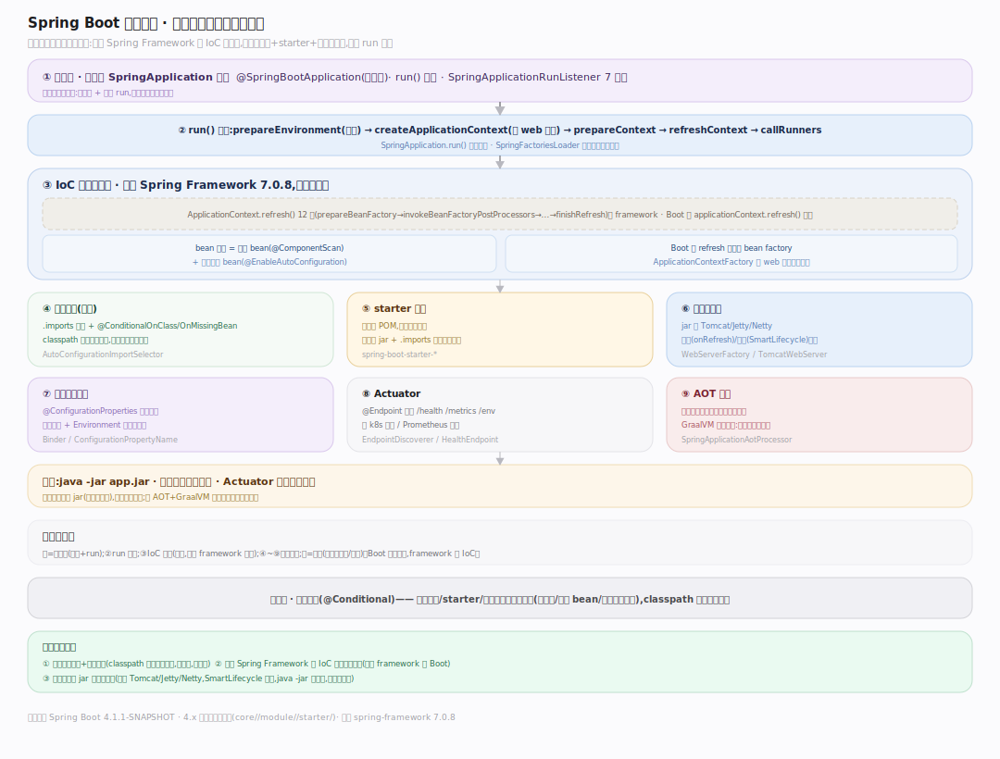
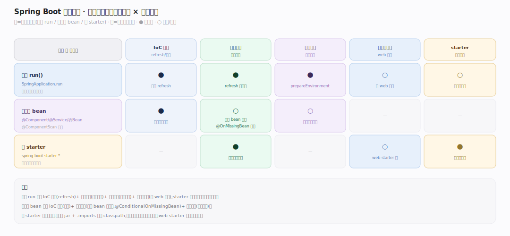
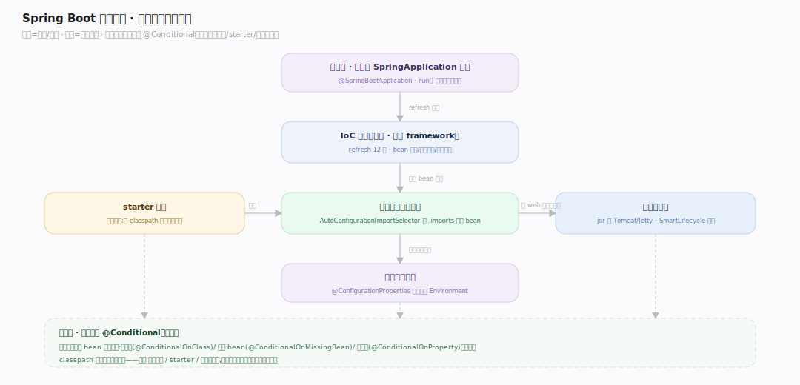

# SpringBoot 原理 · 全景主线框架

> 统领全部原理文档:Spring Boot 是**约定优于配置的应用框架**(新家族:IoC 容器/应用框架——在 Spring Framework 的 IoC 容器之上,用"自动配置 + starter + 内嵌服务器"让 Java 应用零 XML、一个 main 就能跑起来)。源码基准 **Spring Boot 4.1.1-SNAPSHOT**(`~/workdir/spring-boot`,git 7a89c31f;依赖 spring-framework 7.0.8)。

Spring Boot 的世界观:**约定优于配置 + 自动装配**。底层是 Spring Framework 的 IoC 容器(bean 定义/依赖注入/ApplicationContext),Spring Boot 在其上加三件套——**自动配置**(classpath 上有什么就配什么,条件化 bean)、**starter**(一个依赖拉全一套)、**内嵌服务器**(不用外部 Tomcat,jar 内跑)。`SpringApplication.run()` 一行启动全流程。理解"IoC 容器 + 自动配置 + starter"三点,就懂了 Spring Boot。

> **结构提示(写文档必看)**:① 4.x 模块布局**扁平化**(无 spring-boot-project/,改 core//module//starter/);② IoC 容器核心(BeanFactory/refresh 12 步)在 **spring-framework 7.0.8**(外部依赖,非本仓库),Boot 只委托 + 预配;③ 自动配置灵魂——`.imports` 文件(替代旧 spring.factories)+ 条件注解(@ConditionalOnClass/OnMissingBean);④ SpringApplication.run() 启动流程 + SpringApplicationRunListener 阶段;⑤ 内嵌服务器由 SmartLifecycle 启动(非 createWebServer);⑥ @ConfigurationProperties 松散绑定;⑦ AOT/GraalVM 原生镜像。

---

## 一、双维模型:能力域 × 执行时机

- **能力域**:接触面(注解 + SpringApplication 启动)面向应用开发者;支撑侧——IoC 容器、自动配置、starter、内嵌服务器、配置属性、Actuator、AOT 原生。
- **执行时机**:启动期(run() 一次性:环境准备→创建上下文→refresh→内嵌服务器起→跑 Runner)vs 运行期(处理请求、Actuator 端点、配置刷新)vs 构建期(AOT 提前处理生成初始化代码)。

---

## 二、总架构图(位置即语义)

`@SpringBootApplication` 标注的 main 调 **SpringApplication.run()**:准备 Environment(加载配置)→ 由 ApplicationContextFactory 创建 ApplicationContext → prepareContext(注册 bean 源)→ **refresh**(委托 spring-framework 的 12 步:实例化 bean、依赖注入、执行 BeanPostProcessor)→ **自动配置**在此触发(AutoConfigurationImportSelector 读各模块 `.imports`、按 @Conditional 条件装配 bean)→ 内嵌服务器由 SmartLifecycle 启动 → 跑 ApplicationRunner/CommandLineRunner。**starter** 提供 classpath 依赖驱动自动配置,**IoC 容器**(framework)是底座。

---

## 三、主线的分层归位(接触面 + 7 支撑域)

| 层 | 主线 | 一句话职责 |
|---|---|---|
| 接触面 | **注解与 SpringApplication 启动** | @SpringBootApplication + run() 一行启动 |
| 底座 | **IoC 容器(委托 framework)** | BeanFactory/依赖注入/ApplicationContext refresh |
| 灵魂 | **自动配置** | .imports + 条件注解,classpath 有什么配什么 |
| 依赖 | **starter 机制** | 一个 starter 拉全一套依赖+触发自动配置 |
| 服务 | **内嵌服务器** | jar 内跑 Tomcat/Jetty/Netty,SmartLifecycle 启动 |
| 配置 | **配置属性绑定** | @ConfigurationProperties 松散绑定 Environment |
| 运维 | **Actuator + AOT** | 端点/健康/指标 + GraalVM 原生镜像 |

---

## 四、接触面 × 能力域 依赖矩阵

启动(run)依赖 IoC 容器(refresh)+ 自动配置(条件装配)+ 配置属性(环境绑定)+ 内嵌服务器(web 应用);写业务 bean 依赖 IoC 容器(注入)+ 自动配置(默认 bean 可覆盖);starter 是依赖入口触发自动配置。

---

## 五、能力域依赖关系图

实线=调用/装配,虚线=条件约束。贯穿层:**条件装配(@Conditional)** 横切自动配置/starter/内嵌服务器——每个自动配置 bean 都带条件(有某类/无某 bean/某属性才生效),classpath 状态决定装配什么。

---

## 六、三条贯穿声明(Spring Boot 区别于裸 Spring/其它框架)

1. **约定优于配置 + 自动装配**:裸 Spring 要手写大量 XML/JavaConfig 装配 bean;Spring Boot 看 classpath——有 Tomcat 就配 web 服务器、有 DataSource 就配连接池,全条件化(@ConditionalOnClass/OnMissingBean),默认合理、可覆盖。零样板启动。

2. **建在 Spring Framework 的 IoC 容器上,不重造**:核心 IoC(BeanFactory、依赖注入、ApplicationContext.refresh() 12 步生命周期)是 **spring-framework** 的(外部依赖 7.0.8);Spring Boot 只在其上加自动配置/starter/内嵌服务器,并在 refresh 前后预配。理解 Boot 要分清"哪些是 framework 的、哪些是 Boot 加的"。

3. **一个可执行 jar 自带服务器**:传统 Java web 要打 war 部署到外部 Tomcat;Spring Boot 把服务器(Tomcat/Jetty/Netty)内嵌进 jar,`java -jar` 直接跑,由 SmartLifecycle 在 refresh 时启动——自包含、易部署、云原生友好。

---

**一句话定位**:Spring Boot 是约定优于配置的应用框架——建在 Spring Framework 的 IoC 容器(BeanFactory/依赖注入/ApplicationContext.refresh,外部依赖)之上,加三件套:自动配置(灵魂,AutoConfigurationImportSelector 读各模块 .imports、按 @Conditional 条件装配,classpath 有什么配什么)、starter(一个依赖拉全一套+触发自动配置)、内嵌服务器(jar 内跑 Tomcat/Jetty/Netty,SmartLifecycle 启动);SpringApplication.run() 一行走完启动流程,@ConfigurationProperties 松散绑定配置,AOT 支撑 GraalVM 原生镜像。
