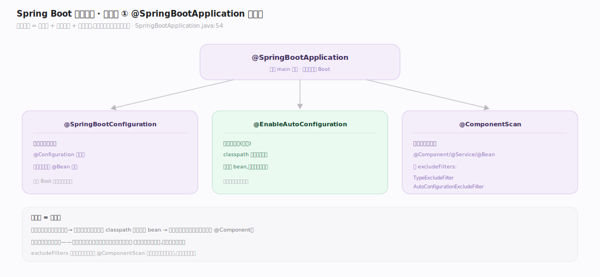
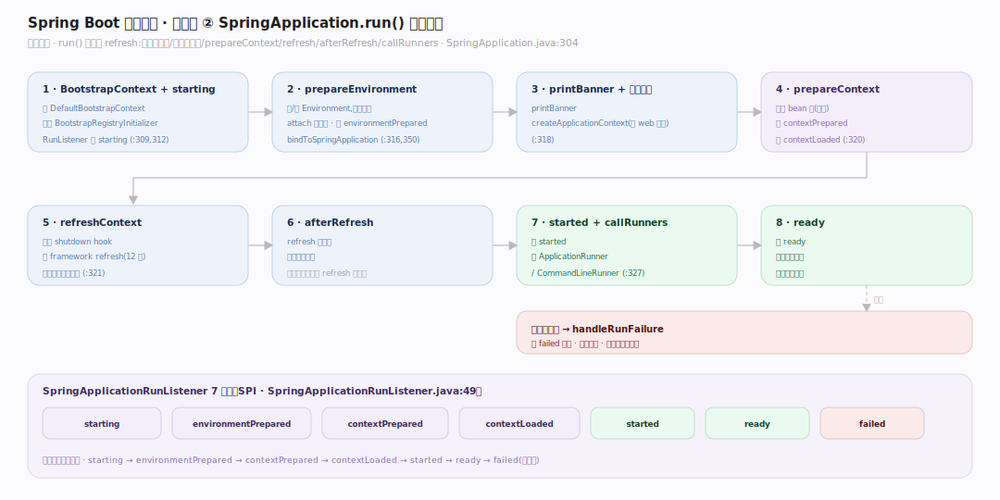
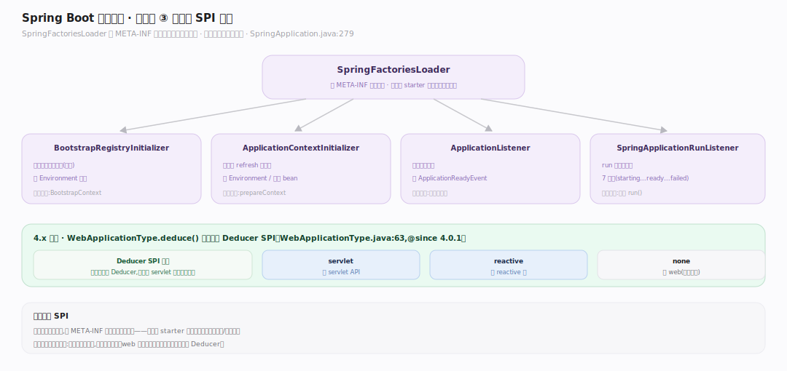

# SpringBoot 原理 · 接触面主线 · 注解与 SpringApplication 启动

> **定位**：属"接触面主线"(应用开发者可见)。Spring Boot 的接触面是**注解 + 启动 API**:@SpringBootApplication 一注解、main 里 SpringApplication.run() 一行,走完整启动流程。是开发者与框架的入口。触发【IoC 容器】refresh、【自动配置】、【内嵌服务器】。源码基准 **Spring Boot 4.1.1**(`core/spring-boot/`)。

开发者怎么用 Spring Boot?**一个注解 + 一行 run**:主类标 `@SpringBootApplication`,main 调 `SpringApplication.run(App.class, args)`——框架自动准备环境、创建容器、自动配置、启动内嵌服务器、跑起来。理解这个注解拆成什么 + run() 走哪些步,就懂了 Spring Boot 的启动接触面。

---

## 一、@SpringBootApplication:三合一注解

`@SpringBootApplication`(`SpringBootApplication.java:54`)= 三个注解合一:

- **@SpringBootConfiguration**:标本类为配置类(@Configuration 变体)。
- **@EnableAutoConfiguration**:开自动配置(灵魂,见自动配置篇)——classpath 有什么配什么。
- **@ComponentScan**(带 excludeFilters:TypeExcludeFilter、AutoConfigurationExcludeFilter):扫描本包及子包的 @Component/@Service/@Bean。

一个注解 = 配置类 + 自动配置 + 组件扫描三件事。这是"约定优于配置"的入口——不用逐个开这些开关。

---

## 二、SpringApplication.run() 启动流程

`SpringApplication.run(String...)`(`SpringApplication.java:304`)有序步骤:

1. **BootstrapContext + starting**:建 DefaultBootstrapContext、应用 BootstrapRegistryInitializer(`:309`),取 SpringApplicationRunListener 发 `starting`(`:312`)。
2. **prepareEnvironment**:建/配 Environment、attach ConfigurationPropertySources、发 `environmentPrepared`、bindToSpringApplication(`:316,350`)。
3. **printBanner** → **createApplicationContext**(按 web 类型,`:318`)→ **prepareContext**(注册 bean 源,发 `contextPrepared`/`contextLoaded`,`:320`)。
4. **refreshContext**(注册 shutdown hook + framework refresh,`:321`)→ **afterRefresh**。
5. 发 `started` → **callRunners**(ApplicationRunner/CommandLineRunner,`:327`)→ 发 `ready`。失败 → `handleRunFailure`。

**SpringApplicationRunListener 阶段**(SPI):starting → environmentPrepared → contextPrepared → contextLoaded → started → ready → failed(`SpringApplicationRunListener.java:49`)——各扩展点可挂钩子。

---

## 三、扩展点:SPI 加载

Spring Boot 高度可扩展,启动时经 **SpringFactoriesLoader** 加载各类扩展(`SpringApplication.java:279`):

- **BootstrapRegistryInitializer**:引导上下文初始化(最早)。
- **ApplicationContextInitializer**:上下文 refresh 前定制。
- **ApplicationListener**:监听应用事件。
- **SpringApplicationRunListener**:run 各阶段回调。
- **4.x 变化**:`WebApplicationType.deduce()` 用可插拔 `Deducer` SPI(`WebApplicationType.java:63`,@since 4.0.1),再退回 servlet 类存在性判断——决定 servlet/reactive/none。

**为什么 SPI**:框架不硬编码扩展,经 META-INF 的工厂配置动态加载——第三方 starter 可注册自己的初始化器/监听器,无侵入扩展启动流程。

---

## 拓展 · 接触面关键结构一览

| 结构 | 定义 | 职责 |
|---|---|---|
| @SpringBootApplication | `autoconfigure/SpringBootApplication.java:54` | Config+AutoConfig+ComponentScan 三合一 |
| SpringApplication.run | `SpringApplication.java:304` | 启动全流程 |
| SpringApplicationRunListener | `SpringApplicationRunListener.java:49` | 7 阶段回调 SPI |
| prepareEnvironment | `SpringApplication.java:350` | 环境准备 + 配置绑定 |
| WebApplicationType.deduce | `WebApplicationType.java:63` | 推断 web 类型(4.x Deducer SPI) |
| SpringFactoriesLoader | (framework) | 加载扩展点 SPI |

## 调优要点（关键开关）

- **懒加载/banner**:`spring.main.lazy-initialization`、`spring.main.banner-mode` 控启动行为。
- **Runner**:实现 ApplicationRunner/CommandLineRunner 做启动后初始化任务(按 @Order 排序)。
- **事件监听**:监听 ApplicationReadyEvent 等做"启动完成后"逻辑,比 Runner 更细粒度。
- **web 类型**:显式 `spring.main.web-application-type=none` 跑非 web 应用(如批处理)。

## 常见误区与工程要点

- **误区:@SpringBootApplication 是单一注解。** 它是三合一(@SpringBootConfiguration + @EnableAutoConfiguration + @ComponentScan);理解 Boot 要拆开看。
- **误区:run() 只是 refresh。** run() 含环境准备、上下文创建、prepareContext、refresh、afterRefresh、callRunners——refresh 只是中间一步。
- **误区:Runner 和监听器一样。** Runner(ApplicationRunner/CommandLineRunner)在 started 后 ready 前跑;事件监听器按事件阶段触发,更灵活。
- **误区:web 类型手动配。** 默认按 classpath 推断(有 servlet API→servlet、有 reactive→reactive);可显式覆盖。
- **归属提醒**:自动配置逻辑在【自动配置】;refresh 委托在【IoC 容器】;内嵌服务器启动在【内嵌服务器】;环境属性绑定在【配置属性】。

## 一句话总纲

**Spring Boot 接触面是注解 + 启动 API:@SpringBootApplication 三合一(@SpringBootConfiguration 配置类 + @EnableAutoConfiguration 自动配置灵魂 + @ComponentScan 组件扫描),main 里 SpringApplication.run() 一行走完启动流程(BootstrapContext→prepareEnvironment 环境准备→createApplicationContext 按 web 类型→prepareContext→refreshContext 委托 framework→callRunners),经 SpringApplicationRunListener 7 阶段(starting→...→ready→failed)回调、SpringFactoriesLoader 加载各类可插拔扩展点(初始化器/监听器)——一个注解一行 run,约定优于配置的入口。**
