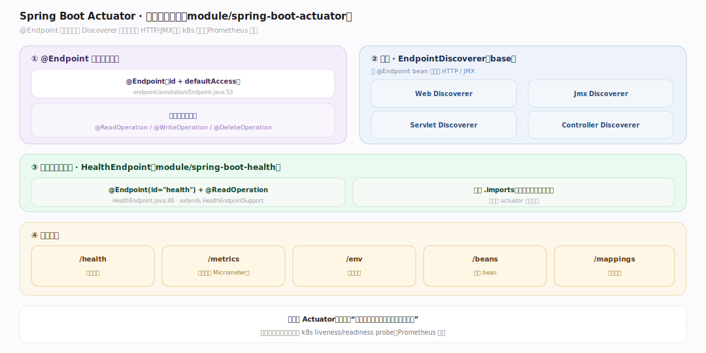
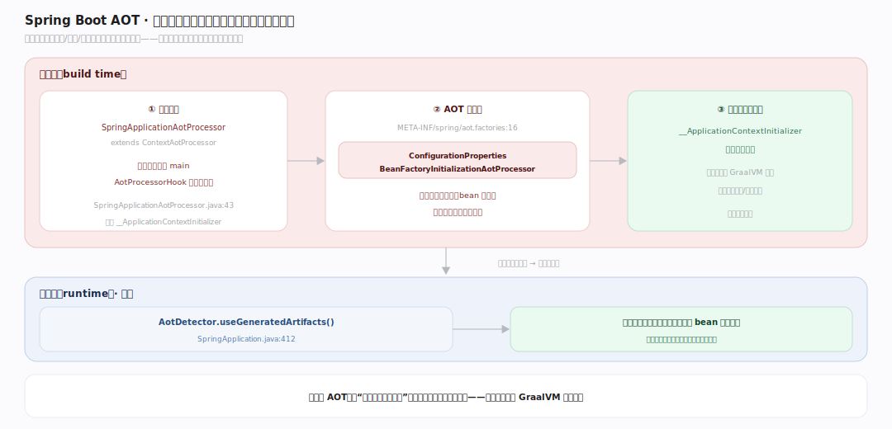
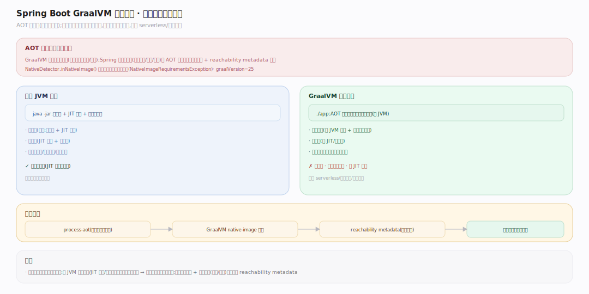

# SpringBoot 原理 · 支撑主线 · Actuator 与 AOT 原生

> **定位**：属"运维/构建能力域"。管生产就绪特性(Actuator:端点/健康/指标)与构建期优化(AOT:提前处理 + GraalVM 原生镜像)。Actuator 靠自动配置装端点,AOT 在构建期生成初始化代码消除运行时反射。源码基准 **Spring Boot 4.1.1**(`module/spring-boot-actuator/`、`core/spring-boot/.../aot`)。

生产运行要可观测(健康、指标、环境)——**Actuator** 暴露端点。云原生要快启动小内存——**AOT/GraalVM 原生镜像**:构建期把 Spring 的动态装配(反射、条件判断)提前算好、生成代码,原生镜像无 JVM 预热、毫秒启动。两者一个管运行期运维、一个管构建期优化。

---

## 一、Actuator:生产就绪端点

Actuator 暴露运维端点(`module/spring-boot-actuator`):

- **@Endpoint 注解**(`endpoint/annotation/Endpoint.java:53`,id + defaultAccess)标一个端点;方法标 @ReadOperation/@WriteOperation/@DeleteOperation。
- **发现**:`EndpointDiscoverer`(base)+ Web/Jmx/Servlet/Controller 各版本 Discoverer——扫 @Endpoint bean 暴露为 HTTP/JMX。
- **健康独立成模块**:`HealthEndpoint`(`module/spring-boot-health/.../HealthEndpoint.java:46`,@Endpoint(id="health") + @ReadOperation,extends HealthEndpointSupport)——自带 `.imports`。
- 常见端点:`/health`(健康)、`/metrics`(指标,桥 Micrometer)、`/env`(环境)、`/beans`(容器 bean)、`/mappings`(路由)。

**为什么 Actuator**:生产要"应用活着吗、指标多少、配置什么"——Actuator 标准化这些端点,配合 k8s liveness/readiness probe、Prometheus 抓取。

---

## 二、AOT 提前处理

Spring 大量用运行时反射/动态代理/条件判断——启动慢、原生镜像不友好。**AOT(ahead-of-time)** 构建期提前算:

- **构建入口**:`SpringApplicationAotProcessor`(`SpringApplicationAotProcessor.java:43`,extends framework ContextAotProcessor)——在构建期跑应用 main(AotProcessorHook 捕获上下文)、生成 `__ApplicationContextInitializer` 等初始化代码。
- **AOT 处理器**(`META-INF/spring/aot.factories:16`):`ConfigurationPropertiesBeanFactoryInitializationAotProcessor` 等——把配置属性绑定、bean 注册的动态逻辑变成生成代码。
- **运行期开关**:`AotDetector.useGeneratedArtifacts()`(`SpringApplication.java:412`)——用生成的初始化代码跳过运行时 bean 定义扫描。

**为什么 AOT**:把"运行时才算的装配"(条件判断、反射、代理)挪到构建期算好、生成代码——运行时直接执行生成代码,无反射开销,启动快、可被 GraalVM 静态分析。

---

## 三、GraalVM 原生镜像

GraalVM native image 把 Java 应用编译成**独立原生可执行文件**(无 JVM):

- **AOT 是前提**:GraalVM 要求闭世界假设(编译期知所有类/反射)——Spring 的动态装配靠 AOT 提前生成代码 + 反射配置(reachability metadata)满足。
- **NativeDetector.inNativeImage()**(`SpringApplication.java:436`)检测原生镜像环境、强制约束(NativeImageRequirementsException)。`graalVersion=25`。
- **收益**:毫秒级启动(无 JVM 预热 + 无运行时装配)、低内存(无 JIT/元数据)——适合 serverless/短命容器/快速扩缩。
- **代价**:构建慢(AOT + 原生编译)、动态特性受限(反射/代理需显式配)、无 JIT 峰值优化。

**为什么原生镜像**:JVM 应用启动慢(类加载 + JIT 预热)、内存大;serverless/云原生要秒起秒缩——原生镜像用构建期换运行时,毫秒启动、小内存。

---

## 拓展 · 运维/AOT 关键结构一览

| 结构 | 定义 | 职责 |
|---|---|---|
| @Endpoint | `actuator/.../endpoint/annotation/Endpoint.java:53` | 定义 Actuator 端点 |
| HealthEndpoint | `module/spring-boot-health/.../HealthEndpoint.java:46` | 健康端点(独立模块) |
| SpringApplicationAotProcessor | `.../SpringApplicationAotProcessor.java:43` | 构建期 AOT 入口 |
| aot.factories | `core/spring-boot/.../META-INF/spring/aot.factories:16` | AOT 处理器注册 |
| AotDetector / NativeDetector | `SpringApplication.java:412,436` | 运行期 AOT/原生检测 |

## 调优要点（关键开关）

- **Actuator 暴露**:`management.endpoints.web.exposure.include` 控暴露哪些端点(默认只 health,生产按需开)。
- **健康探针**:`/health/liveness`、`/health/readiness` 配 k8s 探针;自定义 HealthIndicator 加检查项。
- **AOT 构建**:`spring-boot-maven-plugin` 的 `process-aot` / Gradle AOT task 生成代码;native 用 GraalVM native-image。
- **原生反射配置**:第三方库用反射需提供 reachability metadata 或 @RegisterReflectionForBinding。

## 常见误区与工程要点

- **误区:Actuator 端点全默认暴露。** 默认只暴露 /health(安全);其它端点需显式 include(可能泄露敏感信息)。
- **误区:AOT 就是原生镜像。** AOT 是构建期提前处理(生成初始化代码),可单独用于 JVM 加速启动;原生镜像额外需 GraalVM 编译,AOT 是其前提。
- **误区:原生镜像总是更好。** 毫秒启动/小内存,但构建慢、反射受限、无 JIT 峰值优化;长跑高吞吐服务 JVM 可能更优,serverless/短命更适合原生。
- **误区:AOT 不影响代码。** 反射/动态代理/资源加载需 AOT 提示或 metadata,否则原生镜像运行时报错。
- **归属提醒**:Actuator 端点由【自动配置】装配;AOT 处理 @ConfigurationProperties 绑定关联【配置属性】;AOT 优化的是【IoC 容器】的 bean 注册;端点经【内嵌服务器】暴露 HTTP。

## 一句话总纲

**Spring Boot 的运维+构建优化两条线:Actuator(@Endpoint 注解 + 各 Discoverer 发现,暴露 /health(独立 module)、/metrics(Micrometer)、/env 等端点,配 k8s 探针/Prometheus)管运行期可观测;AOT(SpringApplicationAotProcessor 构建期跑 main 捕获上下文、经 aot.factories 的处理器把动态装配/配置绑定生成初始化代码,AotDetector 运行期用生成代码跳扫描)管构建期优化,是 GraalVM 原生镜像(闭世界、毫秒启动、小内存,NativeDetector 检测)的前提——用构建期换运行时。**
