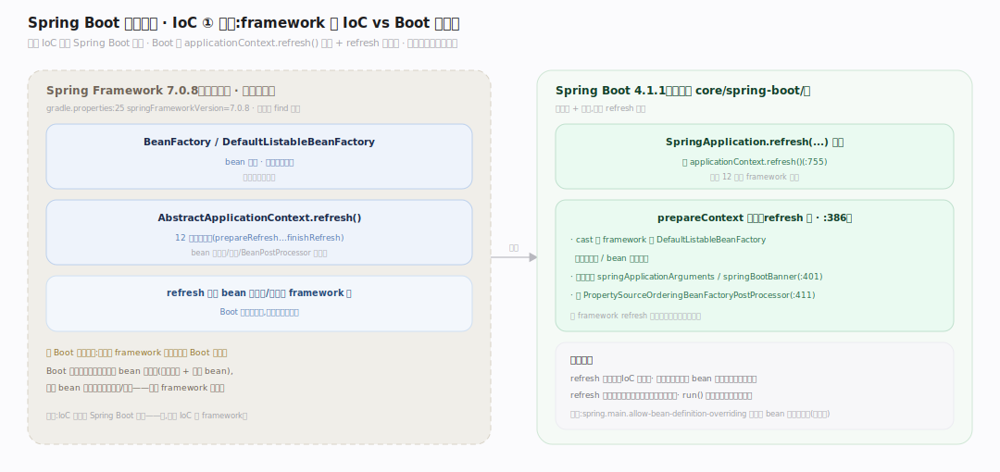
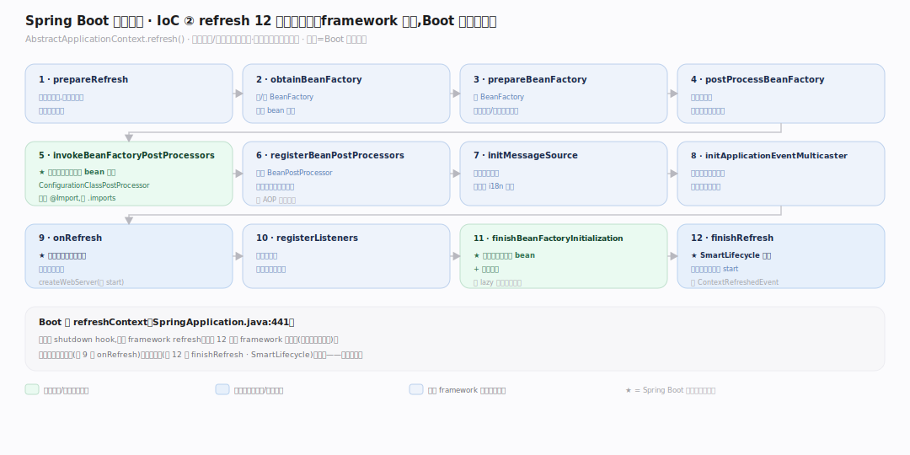
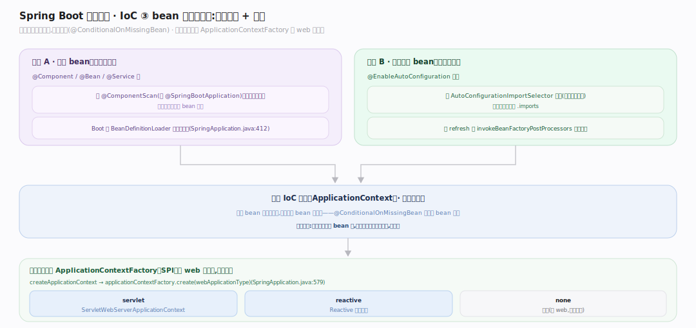

# SpringBoot 原理 · 支撑主线 · IoC 容器（委托 Spring Framework）

> **定位**：属"底座能力域"。管 bean 的定义、依赖注入、生命周期——**核心在 Spring Framework 7.0.8(外部依赖,非本仓库)**,Spring Boot 只委托 refresh + 前后预配。理解 Boot 必分清"framework 的 IoC"与"Boot 加的自动配置"。源码基准 **Spring Boot 4.1.1**(`core/spring-boot/`)+ spring-framework 7.0.8。

Spring Boot 不重造 IoC——它建在 **Spring Framework** 的容器上。IoC(控制反转):不是你 new 对象,而是容器根据 bean 定义创建、注入依赖、管生命周期。核心类 `BeanFactory`/`DefaultListableBeanFactory`/`ApplicationContext.refresh()` 的 12 步生命周期都在 **spring-framework**(本仓库无);Spring Boot 只 `applicationContext.refresh()` 委托 + refresh 前后塞自己的东西。理解这条边界,才不会把 Boot 和 framework 混为一谈。

---

## 一、边界:framework 的 IoC vs Boot 的封装

**关键**:核心 IoC 不在 Spring Boot 仓库:

- `DefaultListableBeanFactory`、`BeanFactory`、`AbstractApplicationContext.refresh()`(12 步)都在 **spring-framework 7.0.8**(`gradle.properties:25 springFrameworkVersion=7.0.8`);本仓库 find 不到。
- Spring Boot 只**委托**:`SpringApplication.refresh(...)` 调 `applicationContext.refresh()`(`SpringApplication.java:755`)——真正的 12 步在 framework 里跑。
- Boot 在 refresh **前**配 bean factory:`prepareContext` 里 cast 成 framework 的 `DefaultListableBeanFactory` 设循环引用/覆盖标志(`SpringApplication.java:386`),注册自己的单例 `springApplicationArguments`/`springBootBanner`(`:401`)、加 `PropertySourceOrderingBeanFactoryPostProcessor`(`:411`)。

读 Boot 源码要记:refresh 里的 bean 实例化/注入是 framework 的;Boot 管的是"给容器喂什么 bean 定义"(自动配置 + 用户 bean)。

---

## 二、refresh 12 步（framework,Boot 委托触发）

`ApplicationContext.refresh()`(framework `AbstractApplicationContext`)的 12 步生命周期(概念,本仓库不含实现):prepareRefresh → obtainBeanFactory → prepareBeanFactory → postProcessBeanFactory → **invokeBeanFactoryPostProcessors**(此时**自动配置**通过 ConfigurationClassPostProcessor 处理 @Import,装配自动配置 bean 定义)→ registerBeanPostProcessors → initMessageSource → initApplicationEventMulticaster → **onRefresh**(内嵌服务器在此创建)→ registerListeners → **finishBeanFactoryInitialization**(实例化所有单例 bean + 依赖注入)→ **finishRefresh**(SmartLifecycle 启动,内嵌服务器真正 start)。

Boot 的 `refreshContext`(`SpringApplication.java:441`)先注册 shutdown hook 再调 framework refresh。自动配置、内嵌服务器创建/启动都嵌在这 12 步的特定阶段。

---

## 三、bean 定义来源:自动配置 + 用户

容器里的 bean 定义两大来源:

- **用户 bean**:`@Component`/`@Bean`/`@Service` 等,经 @ComponentScan(在 @SpringBootApplication)扫描;Boot 经 `BeanDefinitionLoader`(`SpringApplication.java:412`)加载主类源。
- **自动配置 bean**:@EnableAutoConfiguration 通过 AutoConfigurationImportSelector 导入(见自动配置篇),在 refresh 的 invokeBeanFactoryPostProcessors 阶段装配。
- **上下文类型**由 `ApplicationContextFactory`(SPI)选,非硬编码:`createApplicationContext` → `applicationContextFactory.create(webApplicationType)`(`SpringApplication.java:579`)——servlet web 用 ServletWebServerApplicationContext、reactive 用 Reactive 版、非 web 用普通。

**为什么分来源**:用户 bean 是显式意图,自动配置 bean 是默认(@ConditionalOnMissingBean 让用户 bean 覆盖)——两者进同一容器,用户优先。

---

## 拓展 · IoC 关键结构一览

| 结构 | 位置 | 职责 |
|---|---|---|
| BeanFactory / DefaultListableBeanFactory | spring-framework(外部) | bean 定义/注入核心 |
| ApplicationContext.refresh() | spring-framework(外部) | 12 步生命周期 |
| SpringApplication.refresh | `SpringApplication.java:755` | 委托 framework refresh |
| prepareContext | `SpringApplication.java:380` | refresh 前预配 bean factory |
| ApplicationContextFactory | `SpringApplication.java:579` | 按 web 类型选上下文 |
| BeanDefinitionLoader | `core/spring-boot/.../BeanDefinitionLoader.java` | 加载主类 bean 源 |

## 调优要点（关键开关）

- **循环引用**:Boot 默认可配 allow-circular-references;设计上应避免循环依赖。
- **bean 覆盖**:`spring.main.allow-bean-definition-overriding` 控同名 bean 是否可覆盖(默认关,防意外)。
- **lazy 初始化**:`spring.main.lazy-initialization=true` 延迟 bean 创建到首次用,加快启动(代价:首次请求慢)。
- **上下文类型**:web/reactive/none 由 classpath 推断,也可显式设 `spring.main.web-application-type`。

## 常见误区与工程要点

- **误区:IoC 容器是 Spring Boot 写的。** 核心 IoC(BeanFactory/refresh)在 spring-framework;Boot 只委托 + 预配 + 喂 bean 定义。
- **误区:refresh 就是启动。** refresh 是 12 步 bean 生命周期(framework);Boot 的 run() 更大(环境准备/上下文创建/refresh/Runner),refresh 只是其中一步。
- **误区:自动配置 bean 和用户 bean 冲突。** @ConditionalOnMissingBean 让用户 bean 优先,自动配置只在缺省时补——不冲突。
- **误区:所有上下文一样。** servlet/reactive/none 三种上下文类型,由 web 类型推断,决定内嵌服务器等行为。
- **归属提醒**:装配进容器的自动配置 bean 逻辑在【自动配置】;refresh 中创建内嵌服务器在【内嵌服务器】;run() 全流程在【启动流程】;bean 属性注入读【配置属性】。

## 一句话总纲

**Spring Boot 的 IoC 容器核心(BeanFactory/DefaultListableBeanFactory/ApplicationContext.refresh() 12 步生命周期)在 spring-framework 7.0.8(外部依赖,非本仓库),Boot 只 applicationContext.refresh() 委托 + 在 prepareContext 里 refresh 前预配(设循环引用/覆盖标志、注册自己的单例);容器 bean 定义两来源——用户 bean(@ComponentScan)+ 自动配置 bean(@EnableAutoConfiguration 在 invokeBeanFactoryPostProcessors 阶段装配,@ConditionalOnMissingBean 让用户优先);上下文类型由 ApplicationContextFactory 按 web 类型选;读 Boot 源码务必分清 framework 的 IoC 与 Boot 加的封装。**
