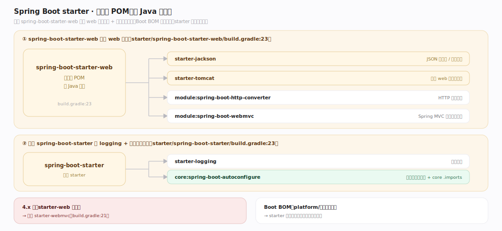
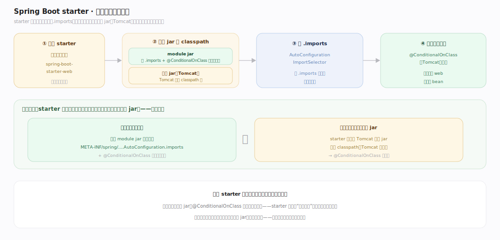
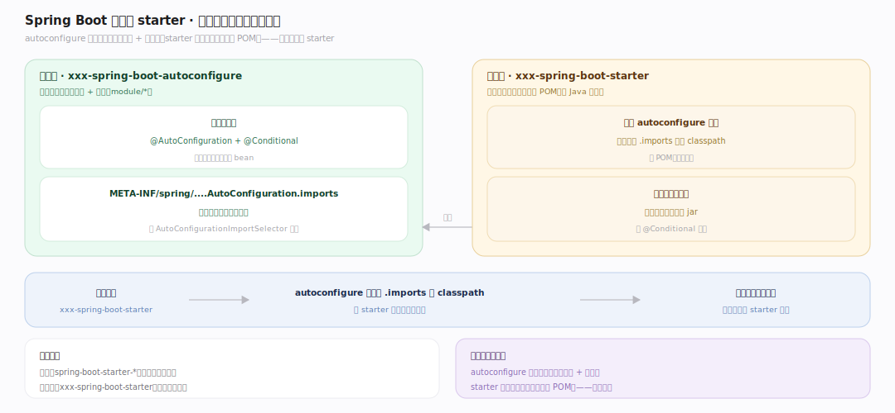

# SpringBoot 原理 · 支撑主线 · starter 机制

> **定位**：属"依赖能力域"。管"一个依赖拉全一套":starter 是纯依赖 POM,把某技术的全部依赖 + 自动配置模块打包,引入即用。是自动配置的"触发器"(带 classpath 依赖)。依赖【自动配置】的 .imports、供开发者一行依赖起一套。源码基准 **Spring Boot 4.1.1**(`starter/`)。

Spring Boot 让你不用逐个找依赖版本——**starter**:一个 `spring-boot-starter-web` 就拉全 web 开发所需(Spring MVC、Tomcat、Jackson…)+ 对应自动配置模块。starter 本身**无代码**,只是精心编排的依赖清单。引入 starter → 技术 jar + 各自的 `.imports` 上 classpath → 自动配置的条件(@ConditionalOnClass)满足 → 自动装配。理解 starter = 依赖编排 + 自动配置触发器。

---

## 一、starter 是纯依赖 POM

starter **无 Java 代码**,只是 build 依赖编排:

- `spring-boot-starter-web`(`starter/spring-boot-starter-web/build.gradle:23`)拉:starter-jackson、starter-tomcat、module:spring-boot-http-converter、module:spring-boot-webmvc。
- 基础 `spring-boot-starter`(`starter/spring-boot-starter/build.gradle:23`)拉:starter-logging + **core:spring-boot-autoconfigure**——这是把自动配置引擎 + core `.imports` 带上 classpath 的关键。
- 4.x 注:`starter-web` 已**弃用**,推荐 `starter-webmvc`(`build.gradle:21`)。

一个 starter 依赖 = 一套技术栈 + 版本对齐(Boot BOM 统一管版本,不用自己填版本号)。

---

## 二、触发链:starter → 依赖 → 自动配置

starter 怎么"引入即用":

1. 应用引入 `spring-boot-starter-web` 依赖。
2. starter 把 module jar(每个带自己的 `META-INF/spring/...AutoConfiguration.imports` + @ConditionalOnClass 的自动配置类)+ 技术 jar(如 Tomcat)放上 classpath。
3. `AutoConfigurationImportSelector` 读这些 .imports 拿候选自动配置类。
4. 条件匹配——因为 starter **同时**带了技术 jar(Tomcat 类在),@ConditionalOnClass(Tomcat) 满足 → 装配默认 web 服务器 bean。

**关键闭环**:starter 既带自动配置类(.imports)**又带**触发其条件的技术 jar——所以引入 starter 后条件自然满足、自动装配生效。缺一不可。

---

## 三、自定义 starter

第三方/公司内部可做自己的 starter,惯例两模块:

- **xxx-spring-boot-autoconfigure**:含自动配置类(@AutoConfiguration + @Conditional)+ `META-INF/spring/...AutoConfiguration.imports` 列出这些类。
- **xxx-spring-boot-starter**:纯依赖 POM,依赖 autoconfigure 模块 + 该技术的库。

用户引入 `xxx-spring-boot-starter` → autoconfigure 模块的 .imports 上 classpath → 条件满足自动装配。命名惯例:官方 `spring-boot-starter-*`,第三方 `xxx-spring-boot-starter`(技术名在前)。

**为什么分两模块**:autoconfigure 放"配什么"(代码 + 条件),starter 放"拉什么依赖"(纯 POM)——职责分离,用户只依赖 starter。

---

## 拓展 · starter 关键结构一览

| 结构 | 位置 | 职责 |
|---|---|---|
| spring-boot-starter-web | `starter/spring-boot-starter-web/build.gradle:23` | 拉 web 全套依赖 |
| spring-boot-starter(基础) | `starter/spring-boot-starter/build.gradle:23` | 拉 logging + autoconfigure |
| autoconfigure 模块 | `module/*` | 自动配置类 + .imports |
| Boot BOM | (platform/) | 统一依赖版本管理 |

## 调优要点（关键开关）

- **只引所需 starter**:每个 starter 拉一套依赖,多余的增加 jar 体积/启动扫描;按需引。
- **排除传递依赖**:starter 拉的某依赖不想要,用 exclude(如换 Tomcat 为 Jetty:排除 starter-tomcat 引 starter-jetty)。
- **版本对齐靠 BOM**:用 Boot 的依赖管理(BOM),starter 内依赖不填版本号,避免冲突。
- **自定义 starter 命名**:第三方用 `xxx-spring-boot-starter`(不占用 spring-boot-starter-* 官方前缀)。

## 常见误区与工程要点

- **误区:starter 含业务代码。** starter 是纯依赖 POM(无 Java 代码);自动配置代码在 autoconfigure 模块。
- **误区:引入 starter 就自动配置了(不管条件)。** starter 带技术 jar 让 @ConditionalOnClass 满足才装配;若手动排除技术 jar,条件不满足则不配。
- **误区:换服务器要改代码。** 排除 starter-tomcat、引 starter-jetty 即可——自动配置按 classpath 上哪个服务器类装配。
- **误区:自定义 starter 要一个模块。** 惯例两模块:autoconfigure(代码)+ starter(依赖 POM),职责分离。
- **归属提醒**:starter 触发的装配逻辑在【自动配置】;拉来的 web 服务器由【内嵌服务器】启动;依赖进 classpath 后 bean 进【IoC 容器】。

## 一句话总纲

**starter 是"一个依赖拉全一套"的编排器:纯依赖 POM(无代码),如 spring-boot-starter-web 拉 webmvc/tomcat/jackson 全套,基础 spring-boot-starter 拉 core:spring-boot-autoconfigure(带自动配置引擎+core .imports);触发闭环——引入 starter 把各 module 的自动配置类(.imports+@ConditionalOnClass)和触发其条件的技术 jar(Tomcat)同时放上 classpath,条件自然满足自动装配;自定义 starter 惯例分两模块(autoconfigure 放代码+条件、starter 放纯依赖),Boot BOM 统一版本免填版本号。**
