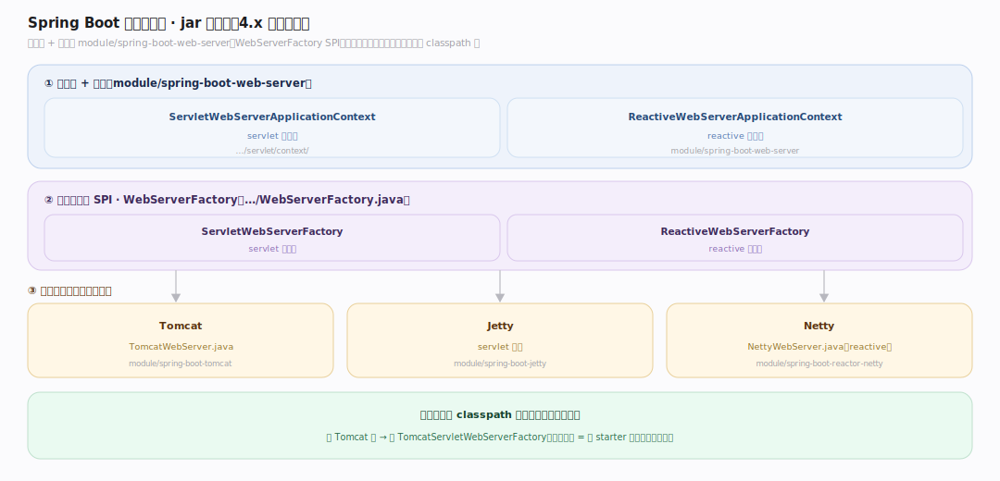
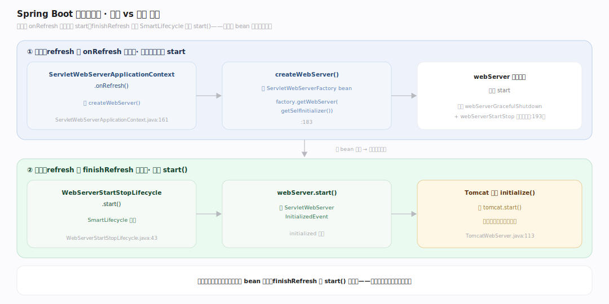
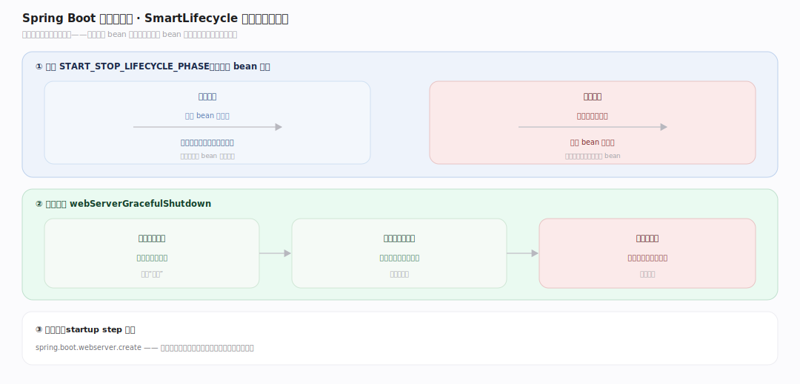

# SpringBoot 原理 · 支撑主线 · 内嵌服务器

> **定位**：属"服务能力域"。管 jar 内自带 web 服务器:Tomcat/Jetty/Netty 内嵌、WebServerFactory、SmartLifecycle 启动时机。让 `java -jar` 直接跑 web 应用,无需外部容器。被【自动配置】按 classpath 装配、在【IoC 容器】refresh 时创建+启动。源码基准 **Spring Boot 4.1.1**(`module/spring-boot-web-server/` + 各服务器模块)。

传统 Java web 打 war 部署到外部 Tomcat;Spring Boot **把服务器内嵌进 jar**——`java -jar app.jar` 直接跑,自包含、易部署。服务器由自动配置按 classpath 选(有 Tomcat 类配 Tomcat…),在 IoC 容器 refresh 的特定阶段创建,真正 `start()` 由 **SmartLifecycle** 触发(不是创建时)。理解内嵌 + 创建/启动分离,就懂了 Boot 的服务器模型。

---

## 一、内嵌服务器:jar 内自带

4.x 模块布局:上下文 + 工厂在 `module/spring-boot-web-server`,各服务器在各自模块:

- **servlet 上下文**:`ServletWebServerApplicationContext`(`module/spring-boot-web-server/.../servlet/context/`);reactive:`ReactiveWebServerApplicationContext`。
- **服务器工厂 SPI**:`WebServerFactory`(`module/spring-boot-web-server/.../WebServerFactory.java`)——`ServletWebServerFactory`(servlet)/ `ReactiveWebServerFactory`(reactive)。
- **实现**:Tomcat(`module/spring-boot-tomcat/.../TomcatWebServer.java`)、Jetty(`module/spring-boot-jetty`)、Netty(`module/spring-boot-reactor-netty/.../NettyWebServer.java`)。

自动配置按 classpath 选:有 Tomcat 类配 TomcatServletWebServerFactory(见自动配置篇的 TomcatServletWebServerAutoConfiguration @ConditionalOnClass)。换服务器 = 换 starter 依赖。

---

## 二、创建 vs 启动:分离

**关键**:服务器**创建**和**启动**在不同阶段:

- **创建**(refresh 的 onRefresh 阶段):`ServletWebServerApplicationContext.onRefresh()` 调 `createWebServer()`(`ServletWebServerApplicationContext.java:161`)——取 `ServletWebServerFactory` bean、`factory.getWebServer(getSelfInitializer())`(`:183`)。此时服务器**对象建好但没 start**。注册 `webServerGracefulShutdown` + `webServerStartStop` 生命周期单例(`:193`)。
- **启动**(refresh 的 finishRefresh 阶段):真正 `start()` 在 `WebServerStartStopLifecycle.start()`(SmartLifecycle,`servlet/context/WebServerStartStopLifecycle.java:43`)→ `webServer.start()` + 发 `ServletWebServerInitializedEvent`。Tomcat 实现 `initialize()` 调 `tomcat.start()`(`TomcatWebServer.java:113`)。

**为什么分离**:服务器要等所有 bean 就绪(finishBeanFactoryInitialization 后)才该接流量;创建早(onRefresh)、启动晚(finishRefresh,SmartLifecycle),保证启动时容器已完整——不会请求打进来时 bean 还没配好。

---

## 三、Graceful shutdown + 生命周期相位

- **SmartLifecycle 相位**:web 服务器的启停在 `WebServerApplicationContext.START_STOP_LIFECYCLE_PHASE`(`WebServerStartStopLifecycle.java:62`)——晚于普通 bean,保证服务器最后启动、最先停止。
- **优雅停机**:`webServerGracefulShutdown` 单例——停机时先停止接新请求、等在途请求处理完再关服务器,不粗暴断连。
- **启动步骤埋点**:createWebServer 包在 startup step `spring.boot.webserver.create`(`:206`)——可观测启动耗时。

**为什么 SmartLifecycle**:它给 bean 生命周期分相位(phase),web 服务器用高相位——比数据源/业务 bean 晚启动、早停止,保证"服务器活着时依赖都在"。

---

## 拓展 · 内嵌服务器关键结构一览

| 结构 | 位置 | 职责 |
|---|---|---|
| ServletWebServerApplicationContext | `module/spring-boot-web-server/.../servlet/context/` | servlet web 上下文 |
| WebServerFactory | `module/spring-boot-web-server/.../WebServerFactory.java` | 服务器工厂 SPI |
| createWebServer | `ServletWebServerApplicationContext.java:161` | onRefresh 创建服务器 |
| WebServerStartStopLifecycle | `.../servlet/context/WebServerStartStopLifecycle.java:43` | SmartLifecycle 启动 |
| TomcatWebServer | `module/spring-boot-tomcat/.../TomcatWebServer.java:113` | Tomcat 实现 tomcat.start() |

## 调优要点（关键开关）

- **换服务器**:排除 starter-tomcat、引 starter-jetty/starter-undertow——自动配置按 classpath 装配对应工厂。
- **端口/线程**:`server.port`、`server.tomcat.threads.max` 等 `server.*` 属性配服务器。
- **优雅停机**:`server.shutdown=graceful` + `spring.lifecycle.timeout-per-shutdown-phase` 控在途请求等待。
- **reactive vs servlet**:有 spring-webflux+Netty 用 reactive 栈(NettyWebServer);有 spring-webmvc+Tomcat 用 servlet 栈。

## 常见误区与工程要点

- **误区:内嵌服务器 createWebServer 时就 start。** 创建在 onRefresh(对象建好没 start),真正 start 在 finishRefresh 的 SmartLifecycle——分离,保证 bean 就绪才接流量。
- **误区:必须外部 Tomcat。** Boot 内嵌服务器进 jar,java -jar 直接跑;也可打 war 部署外部(traditional),但内嵌是默认。
- **误区:换服务器要改代码。** 换 starter 依赖即可,自动配置按 classpath 上的服务器类选工厂。
- **误区:服务器停机粗暴断连。** graceful shutdown 先停接新请求、等在途完再关。
- **归属提醒**:服务器工厂 bean 由【自动配置】装配;创建/启动嵌在【IoC 容器】refresh 的 onRefresh/finishRefresh;端口等配置读【配置属性】;依赖由【starter】拉。

## 一句话总纲

**Spring Boot 把 web 服务器内嵌进 jar(java -jar 直接跑,无需外部容器):4.x 上下文+工厂在 module/spring-boot-web-server,Tomcat/Jetty/Netty 各自模块,自动配置按 classpath 选(有 Tomcat 类配 TomcatServletWebServerFactory);创建与启动分离——onRefresh 阶段 createWebServer 建对象(没 start),finishRefresh 阶段 WebServerStartStopLifecycle(SmartLifecycle 高相位)才 webServer.start()、发 initialized 事件,保证所有 bean 就绪才接流量;优雅停机先停新请求等在途完;换服务器 = 换 starter 依赖。**
