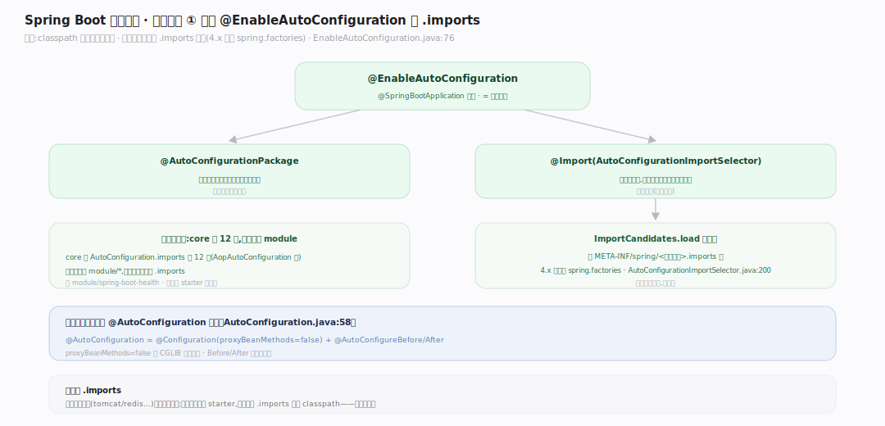
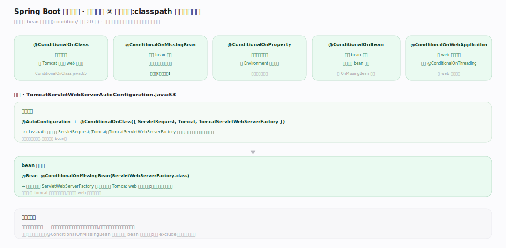
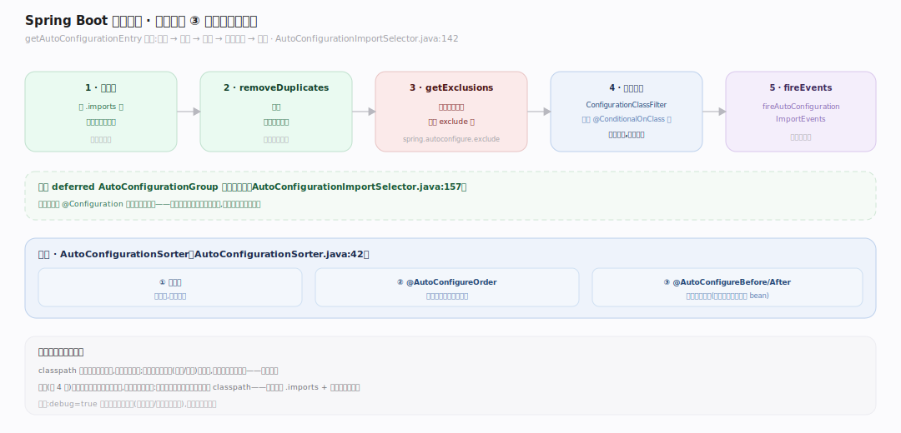

# SpringBoot 原理 · 支撑主线 · 自动配置

> **定位**：属"装配能力域"——Spring Boot 的灵魂。管"classpath 上有什么就自动配什么":@EnableAutoConfiguration、`.imports` 文件、条件注解、AutoConfigurationImportSelector、排序。被【starter】的依赖驱动、在【IoC 容器】refresh 时装配 bean。源码基准 **Spring Boot 4.1.1**(`core/spring-boot-autoconfigure/`)。

Spring Boot 的立身之本:**自动配置**——不用手写装配,框架看 classpath 自动决定配哪些 bean。有 Tomcat 类就配 web 服务器、有 DataSource 就配连接池、已有某 bean 就不重复配。全靠**条件注解**(@ConditionalOnClass/OnMissingBean/OnProperty)+ 各模块的 `.imports` 候选清单。理解 .imports + 条件 + 选择管线,就懂了 Spring Boot 的魔法从何而来。

---

## 一、@EnableAutoConfiguration 与 .imports

`@SpringBootApplication` 含 `@EnableAutoConfiguration` = `@AutoConfigurationPackage` + `@Import(AutoConfigurationImportSelector.class)`(`EnableAutoConfiguration.java:76`)。

- **候选来自 `.imports` 文件**(4.x 替代旧 spring.factories):`ImportCandidates.load` 从 `META-INF/spring/<注解全名>.imports` 读(`AutoConfigurationImportSelector.java:200`)。
- **分布式**:core 的 `AutoConfiguration.imports` 只 12 条(AopAutoConfiguration 等);其余散在各 `module/*`——每个模块带自己的 `.imports`(如 module/spring-boot-health)。
- `@AutoConfiguration` = `@Configuration(proxyBeanMethods=false)` + `@AutoConfigureBefore/After`(`AutoConfiguration.java:58`)。

**为什么 .imports**:每个技术模块(tomcat/redis/…)自带一份自动配置类清单;应用引入哪个 starter,对应模块的 .imports 就上 classpath——按需装配。

---

## 二、条件注解:classpath 有什么配什么

自动配置 bean 全**条件化**(`condition/` 目录 20 个):

- `@ConditionalOnClass`(有某类才配,`ConditionalOnClass.java:65`)→ 有 Tomcat 类才配 web 服务器。
- `@ConditionalOnMissingBean`(无某 bean 才配)→ 用户没自定义才用默认,**可覆盖**。
- `@ConditionalOnProperty`(某配置项开才配)、`@ConditionalOnBean`、`@ConditionalOnWebApplication`、`@ConditionalOnThreading` 等。

实例(`TomcatServletWebServerAutoConfiguration.java:53`):`@AutoConfiguration` + `@ConditionalOnClass({ServletRequest, Tomcat, TomcatServletWebServerFactory})` + `@Bean @ConditionalOnMissingBean(ServletWebServerFactory.class)`——有 Tomcat 且用户没自定义,才配默认 web 服务器工厂。

**为什么条件**:让自动配置"聪明"——只在合适时装配、给合理默认、允许用户覆盖。这是"约定优于配置"的实现。

---

## 三、选择管线与排序

`getAutoConfigurationEntry`(`AutoConfigurationImportSelector.java:142`)管线:

1. 取候选(.imports)→ `removeDuplicates` 去重。
2. `getExclusions` 算排除(用户 exclude 的)→ 移除。
3. `getConfigurationClassFilter().filter(...)` 应用 @ConditionalOnClass 等(读字节码元数据,**不加载类**——快)。
4. `fireAutoConfigurationImportEvents` 发事件。
作为 deferred `AutoConfigurationGroup` 导入组运行(`:157`)。

**排序** `AutoConfigurationSorter`(`:42`):按名字 → `@AutoConfigureOrder` → `@AutoConfigureBefore/After`——从字节码元数据读,不加载类。保证依赖顺序(如数据源先于用它的 bean)。

**为什么不加载类判断**:classpath 可能有几百个候选,逐个加载类慢;读字节码元数据(注解/类名)判条件,只加载真正生效的——启动快。

---

## 拓展 · 自动配置关键结构一览

| 结构 | 定义 | 职责 |
|---|---|---|
| @EnableAutoConfiguration | `autoconfigure/EnableAutoConfiguration.java:76` | @Import AutoConfigurationImportSelector |
| ImportCandidates.load | `AutoConfigurationImportSelector.java:200` | 读 .imports 候选 |
| @ConditionalOnClass | `condition/ConditionalOnClass.java:65` | 有某类才配 |
| getAutoConfigurationEntry | `AutoConfigurationImportSelector.java:142` | 去重→排除→过滤→事件 |
| AutoConfigurationSorter | `AutoConfigurationSorter.java:42` | 按 Order/Before/After 排序 |
| @AutoConfiguration | `autoconfigure/AutoConfiguration.java:58` | @Configuration + Before/After |

## 调优要点（关键开关）

- **spring.autoconfigure.exclude**:排除不想要的自动配置类。
- **@ConditionalOnMissingBean 覆盖**:自定义同类型 bean 即覆盖默认——无需关自动配置。
- **debug=true**:打印自动配置报告(哪些生效/未生效及原因)——排查装配问题。
- **条件顺序**:@AutoConfigureBefore/After 控依赖装配顺序;自定义自动配置需正确标注。

## 常见误区与工程要点

- **误区:自动配置是运行时反射扫描全 classpath。** 读 .imports 候选 + 字节码元数据判条件,只加载生效的类——启动快,非全扫。
- **误区:自动配置不可改。** @ConditionalOnMissingBean 让用户自定义 bean 即覆盖默认;可 exclude、可配属性调整。
- **误区:.imports 和 spring.factories 一样。** 4.x 自动配置用 `.imports`(每注解一文件)替代 spring.factories 的自动配置项;更清晰。
- **误区:所有自动配置在一个大文件。** 分布在各 module,每模块自带 .imports——引入哪个 starter 就带哪份。
- **归属提醒**:装配的 bean 进【IoC 容器】;候选依赖由【starter】带上 classpath;web 服务器自动配置关联【内嵌服务器】;属性驱动的条件读【配置属性】。

## 一句话总纲

**自动配置是 Spring Boot 的灵魂:@EnableAutoConfiguration(@SpringBootApplication 含)@Import AutoConfigurationImportSelector,从各模块 META-INF/spring/*.imports(4.x 替代 spring.factories)读候选自动配置类,经管线(去重→排除→getConfigurationClassFilter 按 @ConditionalOnClass/OnMissingBean 等条件过滤,读字节码元数据不加载类→事件)+ AutoConfigurationSorter 排序,只装配 classpath 匹配且用户没覆盖的 bean——"有 Tomcat 配 web 服务器、有 DataSource 配连接池、已有 bean 不重配",这就是约定优于配置。**
