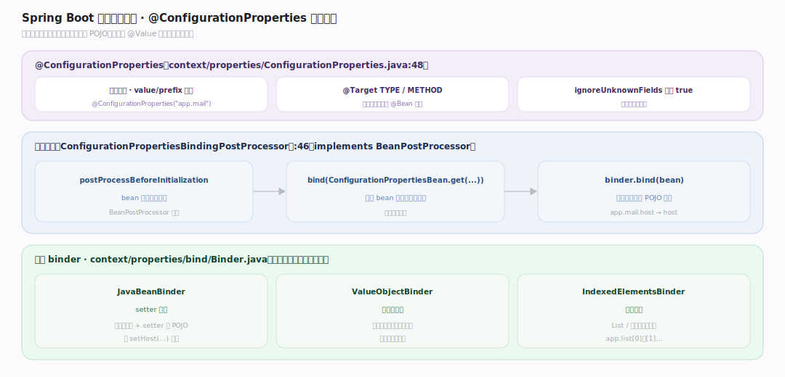
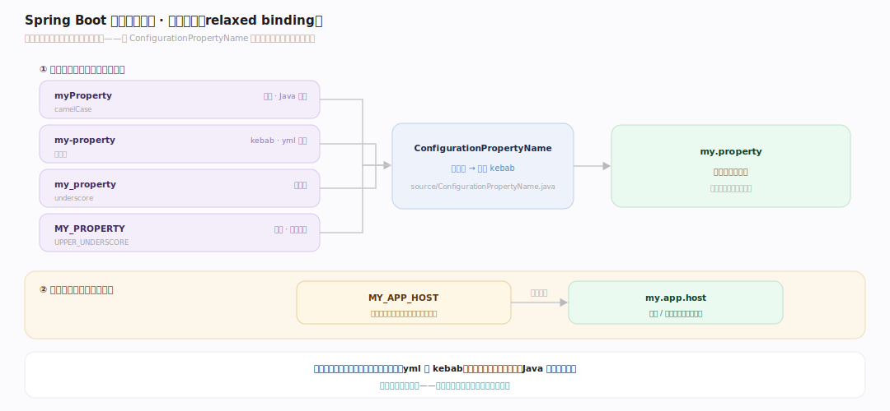
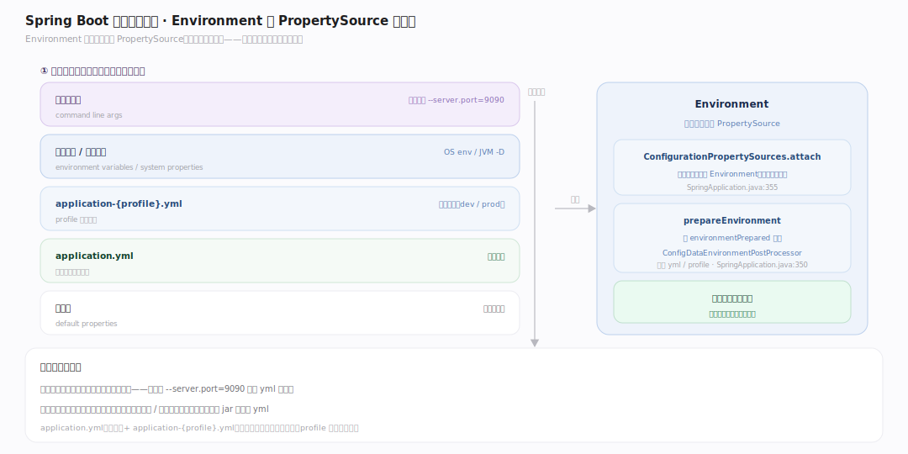

# SpringBoot 原理 · 支撑主线 · 配置属性绑定

> **定位**：属"配置能力域"。管外部配置到 bean 的绑定:@ConfigurationProperties、Environment/PropertySource、松散绑定(relaxed binding)。让 application.yml/properties/环境变量映射到强类型 bean。被【启动流程】prepareEnvironment 准备、驱动【自动配置】的条件。源码基准 **Spring Boot 4.1.1**(`core/spring-boot/.../context/properties/`)。

Spring Boot 应用的配置来自多处(application.yml、环境变量、命令行…),要绑到强类型 bean。**@ConfigurationProperties** 把某前缀的配置项批量绑到一个 POJO;**松散绑定**让 `my-prop`/`my_prop`/`MY_PROP`/`myProp` 都映射到同一字段。Environment 统一多个 PropertySource(按优先级)。理解绑定 + 松散 + 优先级,就懂了 Boot 配置。

---

## 一、@ConfigurationProperties:前缀绑定

`@ConfigurationProperties`(`context/properties/ConfigurationProperties.java:48`,@Target TYPE/METHOD,value/prefix 别名,ignoreUnknownFields 默认 true)把某前缀的配置绑到 POJO。

绑定由 **ConfigurationPropertiesBindingPostProcessor**(`ConfigurationPropertiesBindingPostProcessor.java:46`,implements BeanPostProcessor)驱动:`postProcessBeforeInitialization` → `bind(ConfigurationPropertiesBean.get(...))` → `binder.bind(bean)`。核心 binder `context/properties/bind/Binder.java`(+ JavaBeanBinder setter 绑定、ValueObjectBinder 构造器绑定、IndexedElementsBinder 集合)。

例:`@ConfigurationProperties("app.mail")` 的 POJO,`app.mail.host`/`app.mail.port` 自动绑到 host/port 字段——批量、类型安全,比逐个 @Value 清晰。

---

## 二、松散绑定:一名多写法

**松散绑定(relaxed binding)**:同一属性多种写法都映射到同一字段:

- 靠规范化 `ConfigurationPropertyName`(`context/properties/source/ConfigurationPropertyName.java`)——统一成 kebab(短横)形式。
- `myProperty`(驼峰)/ `my-property`(kebab)/ `my_property`(下划线)/ `MY_PROPERTY`(大写环境变量)都规范化到 `my.property`。
- 特别有用:环境变量只能 `MY_APP_HOST`(大写下划线),松散绑定让它映射到 `my.app.host` 配置项——容器/云环境注入配置无缝。

**为什么松散**:不同来源有不同命名惯例(yml 用 kebab、环境变量用大写下划线、Java 字段用驼峰);松散绑定屏蔽差异,一个逻辑属性名对应所有来源写法。

---

## 三、Environment 与 PropertySource 优先级

**Environment** 统一多个 **PropertySource**(有序,高优先级覆盖低):

- 典型优先级(高→低):命令行参数 > 环境变量/系统属性 > application-{profile}.yml > application.yml > 默认值。
- `ConfigurationPropertySources.attach(environment)`(`SpringApplication.java:355`)把配置源包装进 Environment,供松散绑定用。
- prepareEnvironment(`SpringApplication.java:350`)发 `environmentPrepared` 事件——ConfigDataEnvironmentPostProcessor 等在此加载 application.yml/profile。

**为什么优先级**:同一属性多处定义时,高优先级源覆盖低——命令行 `--server.port=9090` 覆盖 yml 里的值,方便部署时不改代码覆盖配置。

---

## 拓展 · 配置属性关键结构一览

| 结构 | 定义 | 职责 |
|---|---|---|
| @ConfigurationProperties | `context/properties/ConfigurationProperties.java:48` | 前缀批量绑定 POJO |
| ConfigurationPropertiesBindingPostProcessor | `.../ConfigurationPropertiesBindingPostProcessor.java:46` | 绑定驱动(BeanPostProcessor) |
| Binder | `context/properties/bind/Binder.java` | 核心绑定(JavaBean/ValueObject) |
| ConfigurationPropertyName | `context/properties/source/ConfigurationPropertyName.java` | 松散绑定规范化 |
| ConfigurationPropertySources.attach | `SpringApplication.java:355` | 配置源接入 Environment |

## 调优要点（关键开关）

- **@ConfigurationProperties vs @Value**:批量强类型配置用前者(清晰、可校验);单值散用后者。
- **profile**:`spring.profiles.active` 切 application-{profile}.yml,分环境配置(dev/prod)。
- **松散绑定利用**:环境变量注入敏感配置(密码等)靠松散绑定映射,不落 yml。
- **校验**:@ConfigurationProperties + @Validated 做 JSR-303 校验,启动时校验配置合法性。

## 常见误区与工程要点

- **误区:配置项名必须精确匹配。** 松散绑定让 kebab/驼峰/下划线/大写多写法都映射同字段——环境变量注入无缝。
- **误区:@Value 和 @ConfigurationProperties 等价。** 后者批量绑前缀+强类型+可校验+松散绑定;@Value 单值、无松散。
- **误区:配置只从 yml 读。** Environment 统一多源(命令行/环境变量/yml/默认),按优先级覆盖。
- **误区:profile 配置自动合并。** application.yml(公共)+ application-{profile}.yml(环境特定)按优先级叠加,profile 的覆盖公共的。
- **归属提醒**:环境准备在【启动流程】prepareEnvironment;属性驱动的 @ConditionalOnProperty 在【自动配置】;绑定的 bean 进【IoC 容器】。

## 一句话总纲

**Spring Boot 配置属性绑定把外部配置映射到强类型 bean:@ConfigurationProperties(前缀绑定,ConfigurationPropertiesBindingPostProcessor 经 Binder 做 JavaBean/构造器绑定)批量绑某前缀配置项;松散绑定(ConfigurationPropertyName 规范化)让 myProp/my-prop/my_prop/MY_PROP 都映同一字段(环境变量注入无缝);Environment 统一多个 PropertySource 按优先级(命令行>环境变量>profile yml>application.yml>默认)覆盖,prepareEnvironment 阶段加载——比 @Value 更清晰、类型安全、可校验。**
