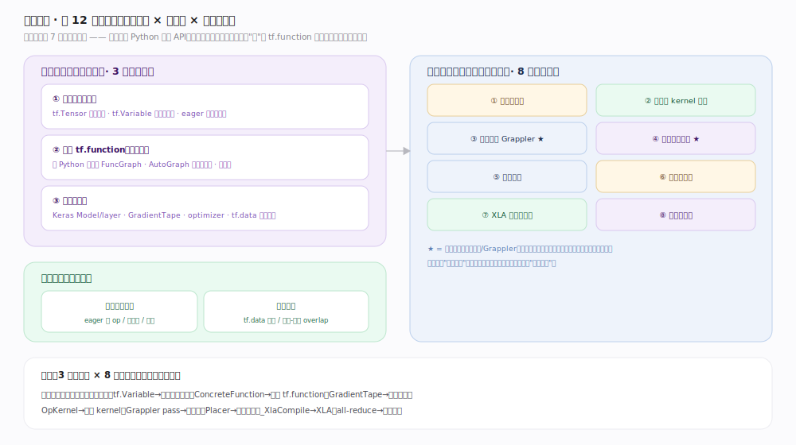
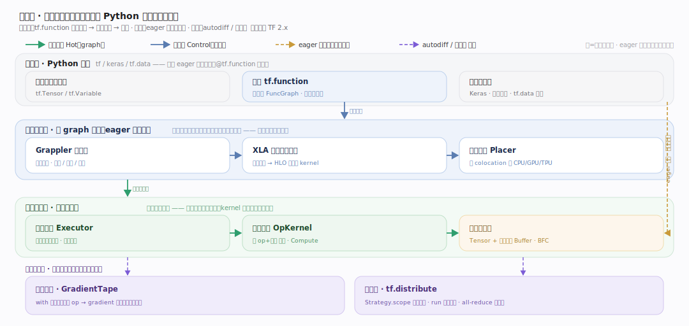
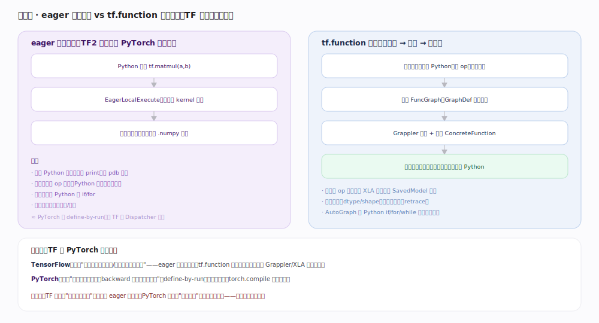
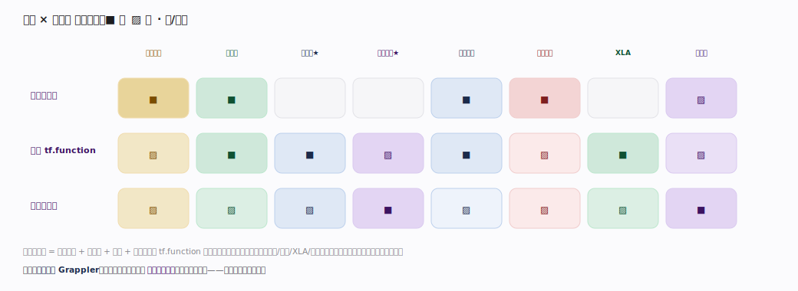

# TensorFlow 核心原理 · 全景主线框架

统领全部原理文档：TensorFlow 的 **3 条接口主线（张量与变量编程 / 图与 tf.function / 建模与训练）+ 8 条支撑能力域**，既无遗漏也无越界。核实基准：官方源码 `tensorflow/tensorflow`（`commit e99b330`）。TensorFlow 属方法论原型库 **家族 7 · 机器学习框架（张量计算 + 自动微分）**，与 PyTorch 同族。灵魂三条：**tf.function 追踪成静态图（偏静态图倾向）**、**Grappler 图级整体优化**、**GradientTape 磁带式自动微分**。

## 〇、与数据库/引擎家族的心智对照（读前必看）

TensorFlow 不是数据系统，先立几条认知：

| 维度 | 数据库/查询引擎 | TensorFlow |
|---|---|---|
| 用户接触面 | SQL / 配置 | **Python 编程 API**（张量 + 变量 + tf.function + Keras） |
| 核心资源 | 表/行/列 | **张量（tf.Tensor 不可变值）+ 变量（tf.Variable 有状态资源句柄）** |
| "执行计划" | 优化器生成静态计划 | **tf.function 追踪出 FuncGraph（GraphDef）**，再由 Grappler/XLA 优化——天然偏静态图 |
| 分发 | 按算子选物理实现 | 按 **op 名 + 设备** 查全局 kernel 注册表选 OpKernel |
| 加速 | 向量化/并行 | Grappler 整图重写 + **XLA 聚类编译融合**（可选） |

## 一、双维模型：接触面 × 能力域 × 执行时机

判型落点：家族 7 机器学习框架。**接触面**是 Python 编程 API（非 SQL/配置/RPC）；**核心资源**是张量（多维数组 + 可微性）与变量（跨调用持久的状态）；**"图"是 tf.function 追踪出的产物**，不是用户预先声明的（TF1 的 `Session`/`placeholder` 显式建图已退居幕后，TF2 默认 eager、按需 tf.function）。三条接口主线是"用户入口"，八条能力域是"框架内部公共机制"，被多条接口共享。第三维执行时机：**前台**（eager 逐算子、图执行、反向）vs **后台异步**（tf.data 预取、通信-计算 overlap）。

## 二、总架构：一次计算从 Python 到设备的分层栈

一次 `@tf.function` 训练步穿过的层：① Python 前端（张量/变量、tf.function、Keras）→ ② **图追踪与构建**（tf.function 把 Python 追踪成 FuncGraph；eager 则旁路直发）→ ③ **Grappler 图优化**（`meta_optimizer.cc` 串十余个 pass 整图重写）→ ④ **XLA 编译**（可选，`mark_for_compilation_pass.cc` 自动聚类）→ ⑤ **设备放置**（`placer.cc` 按 colocation + soft placement 定设备）→ ⑥ **运行时执行**（图模式 `executor.cc` 数据流调度 / eager 模式 `eager/execute.cc` 逐 op）→ ⑦ **算子分发**（按 op 名+设备查 `op_kernel.cc` 的 GlobalKernelRegistry，调 `OpKernel::Compute()`）→ ⑧ **张量与内存**（`tensor.h` Tensor + 引用计数 TensorBuffer + Allocator）。横切两条：⑨ 自动微分 GradientTape、⑩ 分布式 tf.distribute。

## 三、分水岭：eager 即时执行 vs tf.function 追踪成图

TF2 默认 **eager**（`eager/execute.cc` `EagerLocalExecute` 立即执行每个 op，类 PyTorch 动态图），但 **tf.function**（`polymorphic_function.py:453` 的 `class Function`）把 Python 函数**追踪**成一张 `FuncGraph`（`tracing_compilation.py:310` 调 `func_graph_from_py_func`），冻结为可复用、可优化、可部署（SavedModel）的静态图，按输入签名缓存 `ConcreteFunction`、签名变则重追踪（`polymorphic_function.py:123` 的重追踪计数器会在过频时告警）。这就是 TF 与 PyTorch 的分水岭：**TF 把"先成图再执行"当主路、eager 当开发补充；PyTorch 把"边跑边建（define-by-run）"当主路、torch.compile 当补充**——同族、反向侧重。

## 四、接口 × 能力域 依赖矩阵

读矩阵：**张量与变量编程**强依赖张量内存/算子核/执行/设备；**图与 tf.function** 依赖面最广（追踪出的图要经计算图/执行/XLA/设备）；**建模与训练**强依赖自动微分与分布式。两条灵魂能力域——**计算图与 Grappler**、**自动微分引擎**——被多数接口强依赖，漏了任一，TF 文档就散成 API 手册。

## 拓展 · 与 PyTorch 的同族对照（同族，反向侧重）

| 维度 | TensorFlow | PyTorch |
|---|---|---|
| 默认执行 | eager（TF2 起）但 tf.function 是生产态 | eager（define-by-run）为唯一主路 |
| 图哲学 | 追踪冻结的**静态图**，可复用/部署 | 每次前向随手建、backward 后即弃的副产物 |
| 算子分发 | 按 op 名 + 设备查 kernel 注册表（单层查表） | Dispatcher 按 DispatchKeySet **分层**分发 |
| 自动微分 | GradientTape 显式 `with` 上下文录 op | requires_grad 隐式随算子经 Autograd 层建反向图 |
| 图级优化 | Grappler（整图 pass）+ XLA | torch.compile（Dynamo 抓图 + Inductor） |
| 控制流 | AutoGraph 把 Python if/for 改写成图算子 | 直接用 Python 控制流（编译时才特殊处理） |

## 拓展 · 12 条主线与源码锚点

| 类 | 主线 | 关键机制 | 源码锚点 |
|---|---|---|---|
| 接口 | 张量与变量编程 | tf.Tensor / tf.Variable / eager | `tensorflow/python/framework/tensor.py:139`、`resource_variable_ops.py:377` |
| 接口 | 图与 tf.function | 追踪成 FuncGraph / AutoGraph | `polymorphic_function.py:453`、`tracing_compilation.py:310` |
| 接口 | 建模与训练 | GradientTape / tf.data | `backprop.py:705`、`dataset_ops.py:137` |
| 支撑 | 张量与内存 | Tensor + RefCounted TensorBuffer | `tensorflow/core/framework/tensor.h:72` |
| 支撑 | 算子与 kernel | REGISTER_OP / REGISTER_KERNEL_BUILDER | `op.h:318`、`op_kernel.h:1500`、`op_kernel.cc:1334` |
| 支撑 | 计算图与 Grappler | GraphDef / MetaOptimizer | `core/graph/graph.h`、`grappler/optimizers/meta_optimizer.cc:232` |
| 支撑 | 自动微分引擎 | GradientTape / ComputeGradient | `tensorflow/c/eager/tape.h:136`、`:183` |
| 支撑 | 执行引擎 | Executor 数据流 / EagerLocalExecute | `common_runtime/executor.cc:283`、`eager/execute.cc:1734` |
| 支撑 | 设备与后端 | Placer / ColocationGraph | `common_runtime/placer.cc:223`、`colocation_graph.cc` |
| 支撑 | XLA 编译与融合 | 自动聚类 / XlaCompiler | `compiler/jit/mark_for_compilation_pass.cc:95`、`tf2xla/xla_compiler.cc` |
| 支撑 | 分布式训练 | Strategy / collective all-reduce | `python/distribute/distribute_lib.py:2026`、`collective_all_reduce_strategy.py:57` |

## 调优要点

- **训练用 tf.function 包起来**：eager 每行付 Python 开销，`@tf.function` 追踪成图后 Grappler 整体优化、跨 op 融合，通常显著提速；调试时再退回 eager。
- **警惕重追踪（retracing）**：传入 Python 标量/变 shape 会按新签名重新追踪，`polymorphic_function.py` 会在过频时告警；用 `input_signature` 或 `reduce_retracing=True`（`:468`）固定签名。
- **计算密集且形状稳定的图开 `jit_compile=True`**：触发 XLA 聚类编译融合，减少 kernel 启动与中间张量落地。
- **用 tf.data 喂数据**：`prefetch(AUTOTUNE)`（`dataset_ops.py:1241`）把输入预处理与训练在后台 overlap，避免 GPU 等数据。
- **多卡训练用 `MirroredStrategy`，多机用 `MultiWorkerMirroredStrategy`**：在 `strategy.scope()` 内建变量与模型即自动镜像 + all-reduce。

## 常见误区

- **"TF2 没有图了"**：错。图仍是核心，只是从 TF1 显式 `Session`/`placeholder` 变成 tf.function **追踪**出的隐式图；生产/部署仍走图。
- **"eager 和图性能一样"**：错。eager 无跨 op 优化、逐次付 Python 开销；图经 Grappler/XLA 优化，热路径差距明显。
- **"tf.Variable 是一种张量"**：不准确。Variable 是**有状态的资源句柄**（`resource_variable_ops.py:377` `BaseResourceVariable`），读它才产出张量；它能跨调用持久、可被 assign 原地更新，张量则不可变。
- **"GradientTape 会自动追踪所有变量"**：默认追踪被"读"到的 `tf.Variable`，但常量张量需显式 `tape.watch()`；`watch_accessed_variables=False`（`backprop.py:763`）可关掉自动追踪。
- **"Grappler / XLA 总是更快"**：不一定。小图、动态形状、频繁重追踪场景下编译开销可能盖过收益，需按工作负载实测。

## 一句话总纲

**TensorFlow 是"张量 + 变量"上的机器学习框架：eager 默认、tf.function 追踪成可复用的静态图（分水岭），图经 Grappler 整体优化、XLA 可选融合，Placer 定设备、运行时按 op+设备查 kernel 执行，GradientTape 磁带式求梯度、tf.distribute 并行——偏静态图倾向是它区别于 PyTorch 的立身之本。**
