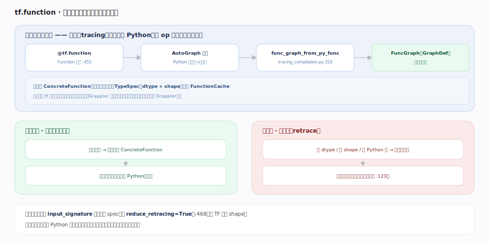
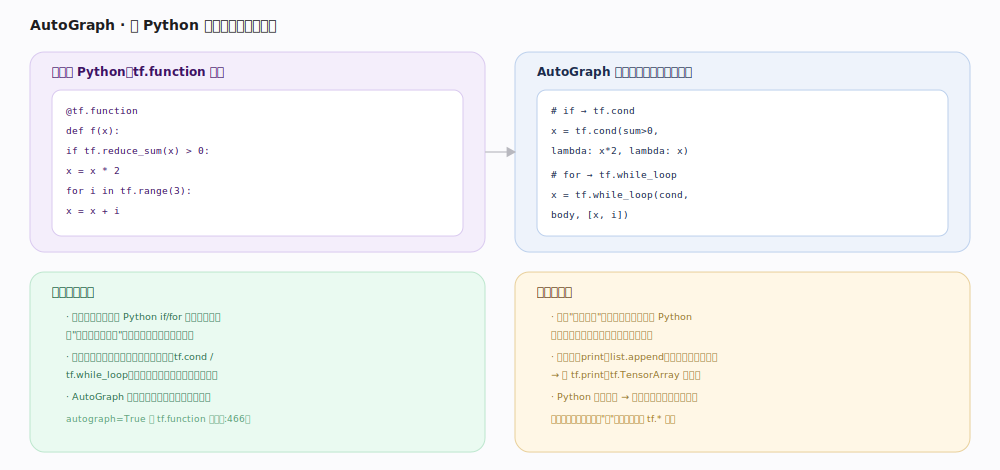

# TensorFlow 核心原理 · 接口主线 · 图与 tf.function

> **定位**：接触面主线之一，也是 TF 与 PyTorch 的**灵魂分水岭**。`tf.function` 把 Python 函数**追踪**成一张可复用、可优化、可部署的静态图（FuncGraph / GraphDef），AutoGraph 负责把 Python 控制流改写成图算子。核实基准：官方源码（`tensorflow/python/eager/polymorphic_function/polymorphic_function.py:453`、`tracing_compilation.py:310`）。

## 一、tf.function：首次追踪成图，之后按签名复用

`@tf.function` 装饰的函数是一个 `Function` 对象（`polymorphic_function.py:453`）。**首次**用某种输入签名调用时触发**追踪（tracing）**：跑一遍 Python，但 tf 算子只往图里**加节点、不真算**，最终 `func_graph_from_py_func`（`tracing_compilation.py:310`）产出一张 `FuncGraph`（可序列化为 GraphDef 的静态图），封装成 `ConcreteFunction` 并按输入签名（TypeSpec：dtype+shape）存入 `FunctionCache`（`tracing_compilation.py:87`）。**后续**同签名调用直接执行缓存的图、不再跑 Python，因此更快，且图可交给 Grappler/XLA 整体优化、导出成 SavedModel 部署。

## 二、AutoGraph：把 Python 控制流改写成图算子

图是静态的，普通 Python `if`/`for` 在追踪期只按"追踪那一刻的值"走固定分支/展开固定次数。若控制流**依赖张量值**，必须变成图算子才能在执行期按真实数据分支——**AutoGraph**（默认 `autograph=True`，`polymorphic_function.py:466`）自动完成源码到源码的转换：`if tensor` → `tf.cond`，`for i in tf.range()` → `tf.while_loop`。副作用（`print`、`list.append`）在追踪期只跑一次，要进图得用 `tf.print`、`tf.TensorArray`。

## 三、重追踪（retracing）：签名变则重来

输入的 dtype/shape 变化、或传入新的 Python 值，都会导致缓存未命中、**重新追踪**一份新图。过频重追踪会拖慢甚至撑爆内存，`polymorphic_function.py:123` 的计数器会在过频时告警。治理：用 `input_signature` 固定输入 spec；或 `reduce_retracing=True`（`:468`）让 TF 泛化 shape；避免把频繁变化的 Python 标量当参数。

## 深化 · eager vs tf.function（分水岭）

| 维度 | eager（默认） | tf.function（图） |
|---|---|---|
| 何时算 | 每行 Python 立即算 | 首次追踪成图，之后跑图 |
| 有无图 | 无 | 有 FuncGraph（GraphDef） |
| 跨 op 优化 | 无 | Grappler 整图重写 + XLA 可选 |
| 控制流 | Python 原生 if/for | AutoGraph 改写成 tf.cond/tf.while_loop |
| 调试 | 可 print/pdb | 追踪期只跑一次 Python |
| 部署 | 不能直接导出 | 可存 SavedModel、可 serving |
| 定位 | 开发/研究态 | 生产/性能态 |

## 拓展 · 追踪的关键机制

| 机制 | 说明 | 源码锚点 |
|---|---|---|
| Function 对象 | 管理多份 ConcreteFunction（多态） | `polymorphic_function.py:453` |
| 追踪入口 | 生成 FuncGraph | `tracing_compilation.py:310` func_graph_from_py_func |
| 签名缓存 | 按 TypeSpec 缓存 ConcreteFunction | `tracing_compilation.py:87` FunctionCache |
| 重追踪告警 | 过频追踪计数并 warn | `polymorphic_function.py:123` |
| 泛化 shape | 减少重追踪 | `reduce_retracing`（`:468`） |
| 控制流转换 | AutoGraph | `autograph=True`（`:466`） |

## 调优要点

- **用 `input_signature` 固定签名**：一次追踪、长期复用，杜绝重追踪。
- **别把 Python 标量当参数**：每个新值一次追踪；改用 tf.Tensor 传入。
- **稳定形状 + `jit_compile=True`**：让追踪出的图进一步走 XLA 融合。
- **train_step / eval_step 都包 tf.function**：批量摊薄追踪成本，图内 op 融合。

## 常见误区

- **"tf.function 会加速一切"**：小函数、频繁重追踪、动态形状时，追踪/编译开销可能盖过收益。
- **"追踪时 Python 副作用会保留"**：`print`、全局计数器只在追踪那一次执行；要运行期生效用 tf 版算子。
- **"Python if 在图里会按数据分支"**：只有被 AutoGraph 转成 tf.cond 的（依赖张量的）才会；依赖 Python 常量的分支追踪期就定死。
- **"每次调用都重新追踪"**：不是。同签名命中缓存直接跑图，只有签名变才重追踪。

## 一句话总纲

**tf.function 是 TF 偏静态图的化身：首次把 Python 追踪冻结成可复用/可优化/可部署的 FuncGraph，AutoGraph 把依赖张量的控制流改写成图算子，签名不变就复用、变了才重追踪——这正是 TF 与 PyTorch「先成图 vs 边跑边建」的分水岭。**
