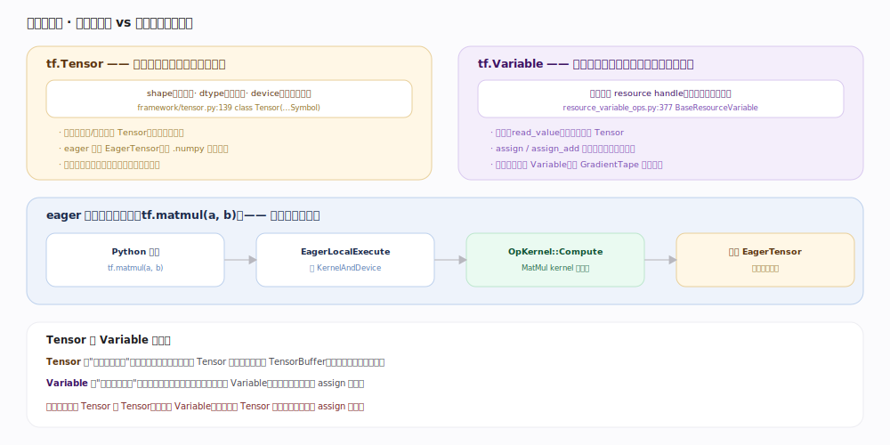

# TensorFlow 核心原理 · 接口主线 · 张量与变量编程

> **定位**：接触面主线之一。用户最基础的编程入口——用 `tf.Tensor`（不可变的值）和 `tf.Variable`（有状态的资源句柄）搭起一切计算。eager 模式下每个算子立即执行。核实基准：官方源码（`tensorflow/python/framework/tensor.py:139`、`tensorflow/python/ops/resource_variable_ops.py:377`）。

## 一、两种核心对象：不可变的值 vs 有状态的句柄

`tf.Tensor`（`tensor.py:139` `class Tensor(internal.NativeObject, core_tf_types.Symbol)`）是一个**不可变的多维数组**：带 `shape`、`dtype`、`device` 三要素，是所有算子的输入/输出，产生后不能改。eager 下它是 `EagerTensor`，持有具体值（`.numpy` 可取）；图内则是**符号张量**（占位符，执行期才有值）。

`tf.Variable`（`resource_variable_ops.py:377` `BaseResourceVariable`，`:1707` `ResourceVariable`）不是张量，而是一个**有状态的资源句柄**：内部持有一个 resource handle 指向设备上的缓冲。**读它**（`read_value`）才产出一个 Tensor 参与计算；它可被 `assign`/`assign_add` **原地更新**、跨调用持久存在。模型权重、优化器动量、全局步数都是 Variable。

## 二、eager：一次算子调用立即执行

TF2 默认 eager。`tf.matmul(a, b)` 的旅程：Python 调用 → `EagerLocalExecute`（`tensorflow/core/common_runtime/eager/execute.cc:1734`）查该 op 在当前设备的 `KernelAndDevice` → 调 `OpKernel::Compute` 真正算 → 立即返回一个 `EagerTensor`。没有图、没有跨算子优化，每行 Python 立刻见结果——直观、可调试，代价是逐次付 Python 解释与 kernel 启动开销（热路径请用 tf.function 包起来，见「图与 tf.function」）。

## 深化 · Tensor 与 Variable 关键差异

| 维度 | tf.Tensor | tf.Variable |
|---|---|---|
| 本质 | 不可变的值（一次计算的结果） | 有状态的资源句柄（指向设备缓冲） |
| 可变性 | 不可改 | assign / assign_add 原地更新 |
| 生命周期 | 用完即弃（可与他 Tensor 共享 buffer） | 跨调用持久 |
| 求值 | 本身就是值 | 读它才产出 Tensor |
| 典型用途 | 算子的输入输出、中间激活 | 模型权重、动量、计数器 |
| 自动微分 | 需 tape.watch 才被追踪 | 被 GradientTape 默认追踪 |
| 源码 | `framework/tensor.py:139` | `resource_variable_ops.py:377` |

## 拓展 · dtype 与设备

| 关注点 | 说明 |
|---|---|
| dtype | float32 默认；混合精度用 float16/bfloat16 + float32 主权重（Grappler 有 auto_mixed_precision pass） |
| 设备放置 | eager 下张量创建在当前默认设备；`with tf.device('/GPU:0')` 显式指定 |
| 跨设备 | 算子输入若在不同设备，运行时自动插 send/recv 拷贝（见「设备与后端」） |
| numpy 互操作 | EagerTensor 与 np.ndarray 零拷贝或浅拷贝互转（CPU 上） |

## 调优要点

- **热路径包 `@tf.function`**：eager 逐算子付 Python 开销，追踪成图后由 Grappler/XLA 整体优化。
- **权重一律用 `tf.Variable`**：只有 Variable 能被 optimizer 更新、被 GradientTape 默认追踪、被 checkpoint 保存。
- **减少 Python↔Tensor 往返**：频繁 `.numpy`、Python 侧循环里逐元素操作会打断加速；尽量用向量化的 tf 算子。
- **混合精度**：大模型在 GPU 上用 `mixed_float16` 策略，显存降、吞吐升，主权重仍保留 float32。

## 常见误区

- **"Variable 是一种 Tensor"**：不对。Variable 是资源句柄，读它才产出 Tensor；它可变、可持久，Tensor 不可变、用完即弃。
- **"eager 下也有图"**：默认没有。只有进入 tf.function 或显式建 Graph 时才有图；eager 是逐算子直接执行。
- **"改 Tensor 的值"**：Tensor 不可变，"修改"其实是产生新 Tensor；要可变状态就用 Variable。
- **"tf.constant 和 tf.Variable 差不多"**：`tf.constant` 产出不可变 Tensor（会被折叠进图），Variable 是可更新的持久状态，二者角色相反。

## 一句话总纲

**张量是不可变的计算之"值"、变量是可更新的持久之"态"：算子吃 Tensor 吐 Tensor，权重是 Variable、读出来变 Tensor 参与算再把新值 assign 回去；eager 默认让每个算子立即执行，热路径再交给 tf.function 成图提速。**
