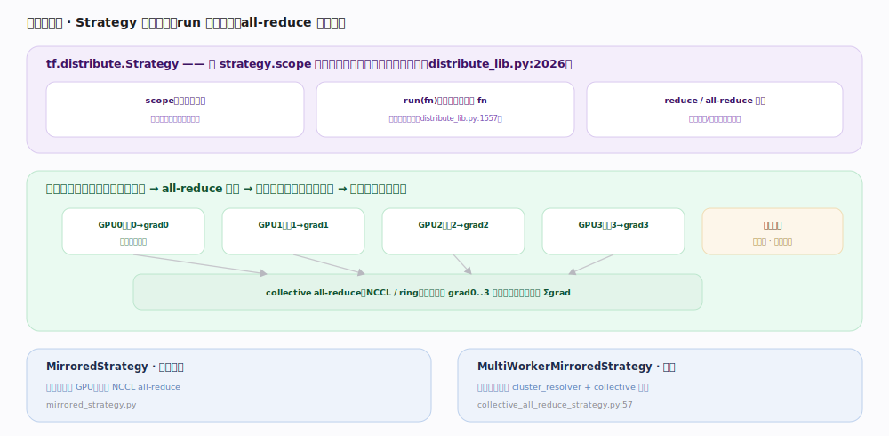

# TensorFlow 核心原理 · 支撑能力域 · 分布式训练

> **定位**：把训练扩展到多卡/多机的能力域。`tf.distribute.Strategy` 在 `scope` 内镜像变量、`run(fn)` 并行副本、`collective all-reduce` 聚合梯度，用户几乎不改模型代码。核实基准：官方源码（`tensorflow/python/distribute/distribute_lib.py:2026`、`collective_all_reduce_strategy.py:57`）。

## 一、Strategy：镜像变量 + 并行副本 + 聚合

`tf.distribute.Strategy`（`distribute_lib.py:2026` `class Strategy`）三个动作：① `scope`（`:1223`）内建模型——变量被**镜像**到各副本，每副本一份、值保持同步；② `run(fn)`（`:1557`）让**每个副本各跑一遍 fn**、各喂一片数据；③ `reduce`（`:2368`）/ all-reduce **聚合**——各副本的梯度求和/平均后同步更新。`ReplicaContext`（`:3670`）是副本内访问跨副本通信的入口。

## 二、数据并行一步：all-reduce 聚合梯度

数据并行（同模型、不同数据分片）的一步：各卡用自己那片数据算出各自梯度 → **collective all-reduce**（NCCL / ring 算法）跨卡把 grad0..N **求和** → 每卡拿到相同的全局 Σgrad → 各自更新镜像变量（因梯度相同、变量本就同步，更新后仍一致）。all-reduce 是数据并行的通信核心，通信与反向计算可 overlap 以隐藏延迟。

## 三、两类策略：单机多卡 vs 多机

**MirroredStrategy**（`mirrored_strategy.py`）：单机多 GPU，卡间 NCCL all-reduce。**MultiWorkerMirroredStrategy**（即 `CollectiveAllReduceStrategy`，`collective_all_reduce_strategy.py:57`）：多机多卡，靠 `cluster_resolver`（读 TF_CONFIG）确定集群拓扑 + collective 通信跨机聚合。此外还有 ParameterServerStrategy（异步、参数服务器）、TPUStrategy 等。

## 深化 · 分布式关键机制

| 机制 | 说明 | 源码锚点 |
|---|---|---|
| Strategy | 分布式入口基类 | `distribute_lib.py:2026` |
| scope | 建镜像变量 | `distribute_lib.py:1223` |
| run | 每副本跑 fn | `distribute_lib.py:1557` |
| reduce | 跨副本聚合 | `distribute_lib.py:2368` |
| ReplicaContext | 副本内通信入口 | `distribute_lib.py:3670` |
| collective all-reduce | 多机梯度聚合 | `collective_all_reduce_strategy.py:57` |

## 拓展 · 策略选型

| 策略 | 场景 | 通信 |
|---|---|---|
| MirroredStrategy | 单机多 GPU | 卡间 NCCL all-reduce |
| MultiWorkerMirrored | 多机多卡（同步） | collective（跨机 all-reduce） |
| ParameterServerStrategy | 大规模异步 | 参数服务器 push/pull |
| TPUStrategy | TPU pod | XLA + 跨核 collective |

## 调优要点

- **在 `strategy.scope` 内建模型和优化器**：否则变量不会镜像，分布式失效。
- **全局 batch = 每副本 batch × 副本数**：学习率常需按副本数线性缩放。
- **通信与计算 overlap**：梯度一算好就 all-reduce，别等全部反向完成，隐藏通信延迟。
- **多机配好 TF_CONFIG**：cluster_resolver 靠它发现各 worker；配错会卡在集合通信初始化。

## 常见误区

- **"分布式要大改模型"**：多数只需把建模与 train_step 放进 strategy.scope + strategy.run。
- **"每卡独立更新会不一致"**：不会。all-reduce 后各卡梯度相同、变量本就镜像同步，更新后仍一致。
- **"MirroredStrategy 能跨机"**：不能，单机多卡；跨机用 MultiWorkerMirroredStrategy。
- **"加卡就线性提速"**：受 all-reduce 通信、数据管线、batch 缩放影响，需实测扩展效率。

## 一句话总纲

**分布式训练靠 Strategy 抽象：scope 镜像变量、run(fn) 并行副本、collective all-reduce 把各卡梯度求和使全局一致——单机多卡用 MirroredStrategy、多机用 MultiWorkerMirrored，用户几乎不改模型代码即从单卡扩到集群。**
