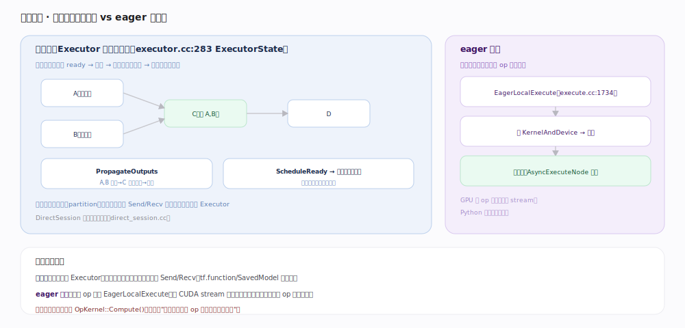

# TensorFlow 核心原理 · 支撑能力域 · 执行引擎

> **定位**：让图/算子真正跑起来的能力域。图模式下 `Executor` 按数据流调度节点（就绪即执行、并行无依赖节点）；eager 模式下逐算子直接下发。核实基准：官方源码（`tensorflow/core/common_runtime/executor.cc:283`、`tensorflow/core/common_runtime/eager/execute.cc:1734`）。

## 一、图模式：Executor 数据流调度

图模式的核心是 `ExecutorState`（`executor.cc:283`，`ExecutorImpl` `:148`）的**数据流调度**：每个节点记录待满足的输入数（pending count），**入度归零即 ready**，被调度执行；执行完 `PropagateOutputs` 把输出传给后继、令其 pending 递减，归零的后继再入 ready 队列（`ScheduleReady`），无依赖的节点被线程池**并行**执行。图先按设备**切分**（partition），跨设备边插入 Send/Recv 节点、每个设备一个 Executor。本地图执行由 `DirectSession`（`direct_session.cc`）驱动。

## 二、eager 模式：逐算子直接下发

eager 无图、无调度器：一个 op 一次 `EagerLocalExecute`（`eager/execute.cc:1734`）——查 `KernelAndDevice` → 执行 → 返回。可异步：`AsyncExecuteNode` 入队（`execute.cc:1688` 附近），GPU 上把 op 异步下发到 CUDA stream，Python 侧不阻塞等结果，靠 stream 拿到并行。区别于图模式在于"**谁编排一批 op 的顺序与并行**"——eager 靠 stream 异步，图模式靠 Executor 数据流调度。

## 深化 · 执行关键机制

| 机制 | 说明 | 源码锚点 |
|---|---|---|
| ExecutorState | 数据流调度状态机 | `executor.cc:283` |
| pending count | 入度归零即 ready | `pending_counts.h` |
| PropagateOutputs | 传播输出、唤醒后继 | `executor.cc`（注释 :266） |
| 图切分 | 按设备 partition + Send/Recv | 跨设备通信 |
| eager 执行 | EagerLocalExecute 逐 op | `eager/execute.cc:1734` |
| 异步节点 | AsyncExecuteNode 入队 | `eager/execute.cc:1688` |

## 拓展 · 图模式 vs eager 模式

| 维度 | 图模式（Executor） | eager 模式 |
|---|---|---|
| 编排者 | Executor 数据流调度 | 无，逐 op 下发 |
| 并行 | 无依赖节点线程池并行 | 靠 CUDA stream 异步 |
| 跨设备 | Send/Recv 节点 | 逐 op 拷贝 |
| 优化 | 配合 Grappler/XLA | 无跨 op 优化 |
| 用于 | tf.function / SavedModel | 开发调试 |

## 调优要点

- **热路径用 tf.function 进图模式**：Executor 能自动并行无依赖分支、配合 Grappler/XLA。
- **减少跨设备 Send/Recv**：把强关联算子 colocate 到同设备（见「设备与后端」）。
- **inter/intra_op_parallelism_threads**：调线程池大小匹配 CPU 核数与 op 粒度。
- **eager 下用异步执行**：GPU op 异步下发、Python 不阻塞，能重叠 Python 开销与 GPU 计算。

## 常见误区

- **"图执行是顺序跑节点"**：不是。是数据流并行——就绪节点并行执行，只受数据依赖约束。
- **"eager 每步都同步等 GPU"**：默认异步下发到 stream，需要值时（如 .numpy）才同步。
- **"一个进程一个 Executor"**：每个设备（分区）一个 Executor，跨设备靠 Send/Recv 协作。
- **"Executor 决定 kernel 怎么算"**：不。Executor 只编排顺序/并行，真正算的是 OpKernel::Compute。

## 一句话总纲

**执行引擎有两条路：图模式 Executor 按数据流调度（入度归零即就绪、PropagateOutputs 唤醒后继、无依赖并行、跨设备 Send/Recv），eager 模式逐 op EagerLocalExecute 下发靠 stream 异步——都落到 OpKernel::Compute，区别在谁编排一批 op。**
