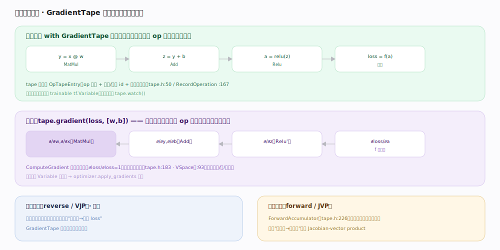

# TensorFlow 核心原理 · 支撑能力域 · 自动微分引擎

> **定位**：灵魂能力域之一，可微性根基。TF 用**磁带（tape）**做自动微分：`GradientTape` 上下文内执行 op 时把操作录到磁带，`gradient()` 沿录制**逆序回放**、逐 op 调反向函数、链式累积梯度。核实基准：官方源码（`tensorflow/c/eager/tape.h:136`、`:183`、`tensorflow/python/eager/backprop.py:705`）。

## 一、前向录制：磁带记下每个 op

在 `with tf.GradientTape() as tape` 上下文内，每执行一个 op 就把它录到磁带：C++ 侧 `GradientTape`（`tape.h:136`）的 `RecordOperation`（`:167`）追加一个 `OpTapeEntry`（`tape.h:50`：op 类型 + 输入/输出 id + 反向函数）。Python 侧 `GradientTape`（`backprop.py:705`）默认**自动追踪被读到的 trainable `tf.Variable`**；常量张量需 `tape.watch()` 显式加入，或用 `watch_accessed_variables=False`（`:763`）关闭自动追踪后手动 watch。前向照常算出真实值，磁带只是"旁录"操作序列。

## 二、反向回放：逆序遍历磁带、链式累积

`tape.gradient(loss, [w, b])` 触发 `ComputeGradient`（`tape.h:183`）：从初始梯度 `∂loss/∂loss = 1` 出发，**逆序**遍历磁带记录，对每个 op 调其反向函数、把梯度沿输入方向传播、在汇合处累加，最终得到每个 Variable 的 `∂loss/∂param`。`VSpace`（`tape.h:93`）抽象梯度空间的"加法/零梯度/一梯度"等原语，使引擎与具体张量类型解耦。所得梯度交给 `optimizer.apply_gradients` 更新权重。

## 三、两种模式：反向（默认）与前向

**反向模式（reverse / VJP）**：一次反向求出全部参数的梯度，适合"多输入 → 标量 loss"，训练用它，`GradientTape` 就是它。**前向模式（forward / JVP）**：`ForwardAccumulator`（`tape.h:226`）随前向同时算方向导数，适合"少输入 → 多输出"，如计算 Jacobian-vector product。

## 深化 · 自动微分关键机制

| 机制 | 说明 | 源码锚点 |
|---|---|---|
| 磁带记录 | RecordOperation 追加 OpTapeEntry | `tape.h:167`、`:50` |
| 反向回放 | ComputeGradient 逆序遍历 | `tape.h:183` |
| 梯度空间抽象 | VSpace（加/零/一梯度） | `tape.h:93` |
| 前向模式 | ForwardAccumulator（JVP） | `tape.h:226` |
| 自动追踪变量 | 默认追 trainable Variable | `backprop.py:705`、`:763` |
| 持久磁带 | 多次求梯度需 persistent | `backprop.py:509` make_vjp |

## 拓展 · 与 PyTorch autograd 对照

| 维度 | TensorFlow GradientTape | PyTorch autograd |
|---|---|---|
| 记录方式 | 显式 `with tape` 上下文录 op | 隐式：requires_grad 张量经算子自动建反向图 |
| 触发范围 | 只录磁带上下文内的 op | 全程只要 requires_grad 就记 |
| 反向 | tape.gradient 逆序回放录制 | loss.backward 遍历动态反向图 |
| 变量追踪 | 默认追 Variable，常量需 watch | 叶子张量 requires_grad=True |
| 相同点 | 都是 define-by-run 式动态求导 | 都随前向记录、反向逆序 |

## 调优要点

- **只把需要求导的计算放进 tape**：磁带外的前向不记录、省内存。
- **`persistent=True` 仅在需多次 gradient 时用**：会保留中间量，用完 `del tape` 及时释放。
- **常量输入求导记得 `tape.watch()`**：只有被 watch 或 trainable Variable 才有梯度。
- **高阶导数嵌套 tape**：外层 tape 追踪内层 gradient 的计算即可求二阶。

## 常见误区

- **"tape 会追踪一切"**：默认只追踪读到的 trainable Variable；常量张量不 watch 就没梯度。
- **"gradient 能调多次"**：默认非持久，调一次即释放；多次需 persistent。
- **"磁带外的操作也会求导"**：不会，只有上下文内录制的 op 参与反向。
- **"TF 的图就是反向图"**：不是。前向图是 tf.function 追踪的；反向来自 GradientTape 的磁带记录，二者不同。

## 一句话总纲

**自动微分靠磁带：GradientTape 在 with 上下文内把每个 op 录成 OpTapeEntry，gradient() 从 ∂loss/∂loss=1 出发逆序回放、逐 op 调反向、链式累积到 Variable 的梯度——默认追踪 trainable 变量、常量需 watch，反向模式训练、前向模式算 JVP。**
