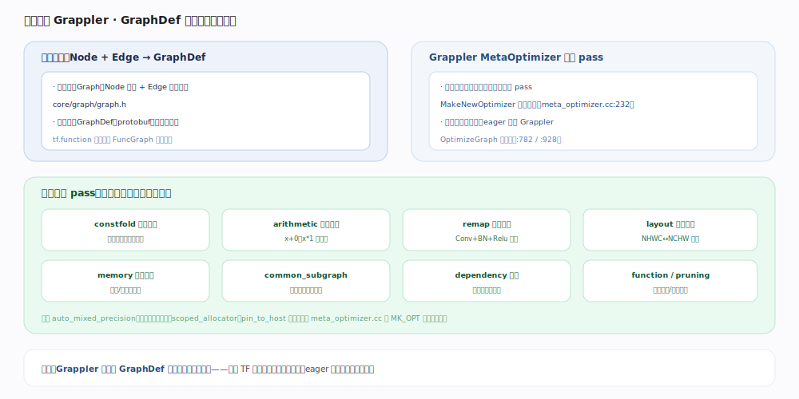

# TensorFlow 核心原理 · 支撑能力域 · 计算图与 Grappler

> **定位**：灵魂能力域之一，TF 静态图倾向的红利来源。计算图（Graph/GraphDef）是 op 的有向数据流图；Grappler 是图级优化器，用 MetaOptimizer 串联十余个 pass 对整张图反复重写。核实基准：官方源码（`tensorflow/core/graph/graph.h`、`tensorflow/core/grappler/optimizers/meta_optimizer.cc:232`）。

## 一、图的表示：Node + Edge → GraphDef

内存态是 `Graph`（`core/graph/graph.h`）：**Node** 是算子实例、**Edge** 是数据流/控制依赖。序列化态是 **GraphDef**（protobuf，可存盘、可传输、可部署）。tf.function 追踪产出的 `FuncGraph` 就是这个结构——因此"追踪成图"后，一切图级工具（Grappler、XLA、SavedModel）都能作用其上。这是 TF 与"无冻结图"框架的根本差异：**有一个可被整体优化的图对象**。

## 二、Grappler：MetaOptimizer 串联 pass 整图重写

`MetaOptimizer`（`meta_optimizer.cc`）对整张图**反复迭代**运行多个优化 pass，每个 pass 由 `MakeNewOptimizer` 按名构造（`:232`），主循环在 `OptimizeGraph`（`:782`/`:928`）。**只在图模式生效，eager 因无图不经 Grappler。** 主要 pass（`meta_optimizer.cc` 的 `MK_OPT` 处按名注册）：

- **constfold**（constant_folding）：编译期算掉常量子图
- **arithmetic**（arithmetic_optimization）：代数化简（x+0、x*1）
- **remap**（remapping）：算子融合，如 Conv+BatchNorm+Relu 合成一个
- **layout**（layout_optimizer）：NHWC↔NCHW 布局择优
- **memory**（memory_optimization）：重算/换出省显存
- **common_subgraph_elimination**：公共子表达式消除
- **dependency**（dependency_optimization）：裁剪冗余控制依赖
- **function**（function_optimization）/ pruning：函数内联、剪除死节点
- 还有 **auto_mixed_precision**、scoped_allocator、pin_to_host 等

## 深化 · Grappler 主要 pass

| pass 名 | 作用 | 注册键 |
|---|---|---|
| constfold | 常量折叠 | constant_folding |
| arithmetic | 代数化简 | arithmetic_optimization |
| remap | 算子融合 | remapping |
| layout | 数据布局转换 | layout_optimizer |
| memory | 内存优化（重算/换出） | memory_optimization |
| common_subgraph_elimination | 公共子表达式消除 | — |
| dependency | 控制依赖裁剪 | dependency_optimization |
| function | 函数内联 | function_optimization |
| auto_mixed_precision | 自动混合精度 | auto_mixed_precision |

## 拓展 · 与 XLA、PyTorch 对照

| 维度 | 说明 |
|---|---|
| Grappler vs XLA | Grappler 是图级 pass 重写（仍是 TF 图）；XLA 进一步把子图编译成融合的 HLO（换执行栈） |
| 顺序 | 通常 Grappler 先整体优化，XLA 再对可编译簇编译 |
| vs PyTorch | PyTorch eager 无此层；torch.compile 的 Inductor 才做类似图级融合 |
| 触发 | 图模式（tf.function/SavedModel）自动跑；eager 不跑 |

## 调优要点

- **想吃到 Grappler 红利就用 tf.function**：eager 无图、无整图优化。
- **让 remap 生效**：用标准的 Conv/BN/Relu 组合，避免奇怪的中间算子打断融合模式。
- **auto_mixed_precision 一键混合精度**：开启后 Grappler 自动插 cast，float16 计算 + float32 累加。
- **按需关某 pass**：个别 pass 在特定图上可能负优化，可通过 RewriterConfig 关掉单个 pass 实测。

## 常见误区

- **"TF2 是纯 eager、没有图优化了"**：错。tf.function 追踪出图后 Grappler 照常整体优化，这是性能主来源。
- **"Grappler 和 XLA 是一回事"**：不是。Grappler 是 TF 图上的 pass 重写；XLA 是把子图编译成 HLO 的独立编译器。
- **"所有 pass 总是开"**：多数默认开，但可配置；某些（如 auto_parallel）需显式启用。
- **"eager 也会常量折叠"**：常量折叠是图 pass，eager 无图不折叠。

## 一句话总纲

**计算图是 TF 的可优化对象、Grappler 是它的整图优化器：Node/Edge 组成 GraphDef，MetaOptimizer 串联 constfold/arithmetic/remap/layout/memory 等十余 pass 反复重写——这份"先成图再整体优化"的红利只属于 tf.function 图模式，是 TF 静态图倾向的核心价值。**
