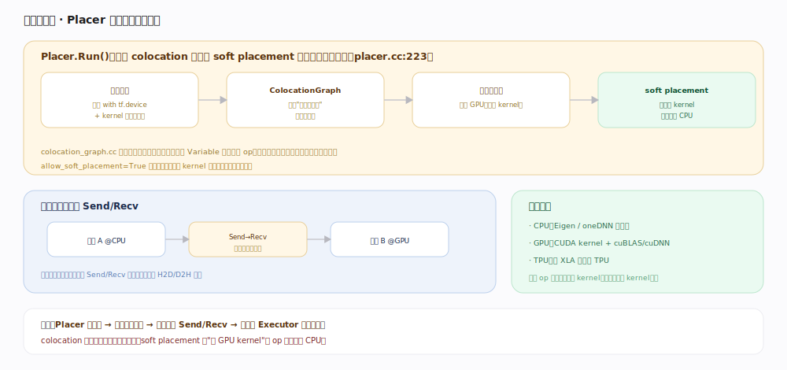

# TensorFlow 核心原理 · 支撑能力域 · 设备与后端

> **定位**：把图节点分配到物理设备的能力域。`Placer` 结合 colocation 约束与 soft placement 给每个节点定 CPU/GPU/TPU；跨设备边自动插 Send/Recv 拷贝张量。核实基准：官方源码（`tensorflow/core/common_runtime/placer.cc:223`、`tensorflow/core/common_runtime/colocation_graph.cc`）。

## 一、Placer：给每个节点定设备

`Placer::Run()`（`placer.cc:223`）分四步：① **收集约束**——用户显式 `with tf.device(...)` + 各节点 kernel 支持的设备集；② **ColocationGraph**（`colocation_graph.cc`）用并查集把"必须同设备"的节点**归并成组**（如 Variable 与其更新 op），保证同组落同一设备、避免无谓跨设备拷贝；③ **按组选设备**——通常优先 GPU（若该 op 有 GPU kernel）；④ **soft placement**——`allow_soft_placement=True` 时，指定了不存在 kernel 的设备不报错、自动**回退 CPU**。

## 二、跨设备：自动插 Send/Recv

放置完成后图按设备切分，跨设备的边被替换成 **Send/Recv 节点对**：运行时由它们负责 H2D/D2H 张量拷贝。因此"减少跨设备来回"就是让强关联算子 colocate 同设备。后端实现：CPU 用 Eigen/oneDNN 向量化，GPU 用 CUDA kernel + cuBLAS/cuDNN，TPU 经 XLA 编译——同一个 op 在各设备各注册一份 kernel（见「算子与 kernel」）。

## 深化 · 放置关键机制

| 机制 | 说明 | 源码锚点 |
|---|---|---|
| Placer.Run | 放置主流程 | `placer.cc:223` |
| ColocationGraph | 并查集归并同设备组 | `colocation_graph.cc` |
| soft placement | 无 kernel 自动回退 CPU | allow_soft_placement |
| Send/Recv | 跨设备拷贝节点对 | 图切分时插入 |
| 后端 kernel | CPU/GPU/TPU 各注册 | 见「算子与 kernel」 |

## 拓展 · 设备相关配置

| 配置 | 作用 |
|---|---|
| with tf.device('/GPU:0') | 显式指定节点/张量设备 |
| allow_soft_placement | 无对应 kernel 时回退而非报错 |
| log_device_placement | 打印每个节点最终落的设备（调试） |
| memory growth | GPU 显存按需增长而非一次占满 |
| CUDA_VISIBLE_DEVICES | 限定进程可见的 GPU |

## 调优要点

- **让 Variable 与其读写 op colocate**：默认 colocation 会处理，自定义放置时别拆散。
- **开 `log_device_placement` 排查回退**：发现关键 op 落 CPU（缺 GPU kernel），针对性换算子或补 kernel。
- **减少跨设备张量传输**：Send/Recv 有拷贝开销，尽量把一条计算链放同设备。
- **多 GPU 用 distribute.Strategy 而非手工放置**：Strategy 帮你镜像变量、做 all-reduce（见「分布式训练」）。

## 常见误区

- **"指定 GPU 就一定在 GPU 跑"**：若该 op 无 GPU kernel 且开了 soft placement，会回退 CPU。
- **"跨设备访问是免费的"**：跨设备边有 Send/Recv 拷贝成本。
- **"colocation 是性能优化"**：更是正确性/一致性约束（Variable 与其更新必须同设备）。
- **"TF 一启动占满显存不合理"**：默认预占减碎片；要按需增长需显式开 memory growth。

## 一句话总纲

**设备与后端的核心是 Placer：按 kernel 可用设备 + 用户约束、用 ColocationGraph 归并"必须同设备"的组、优先 GPU、soft placement 缺 kernel 回退 CPU；图按设备切分、跨设备边插 Send/Recv 拷贝——同一 op 在各设备各有 kernel 真正落地计算。**
