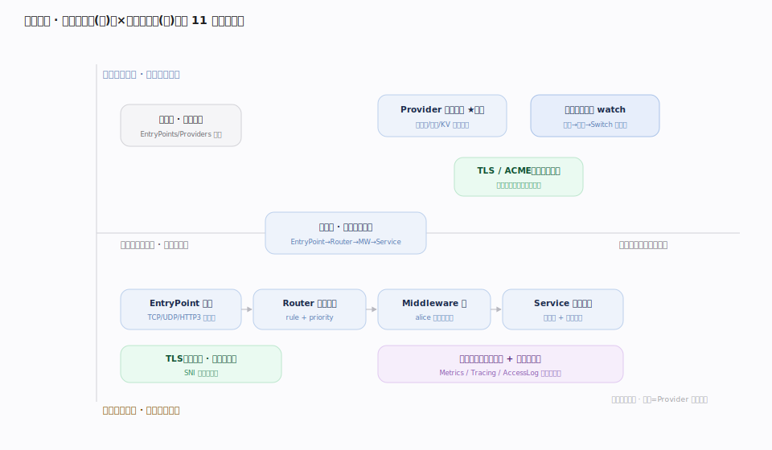
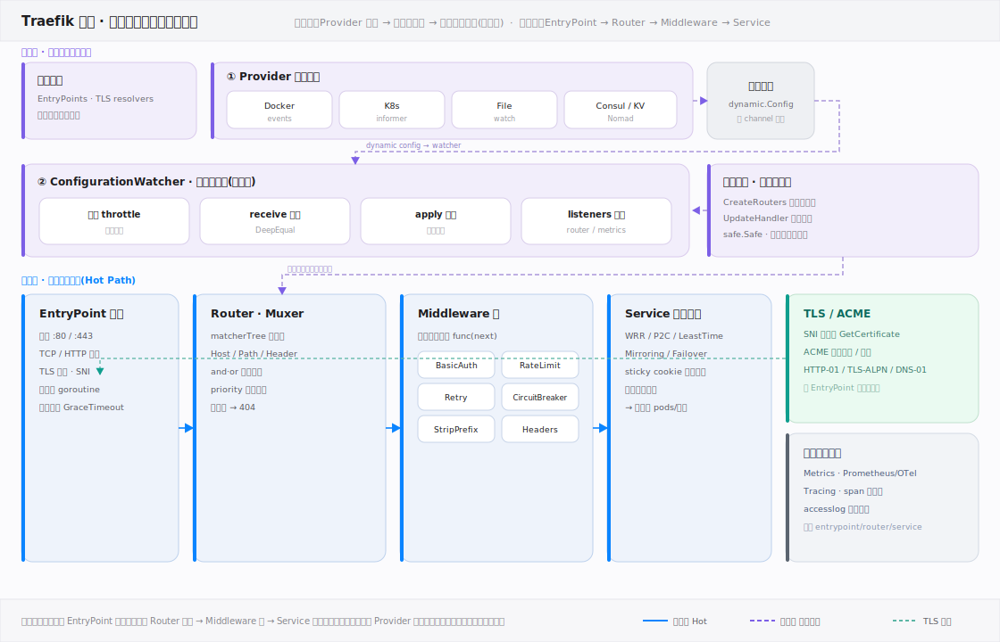
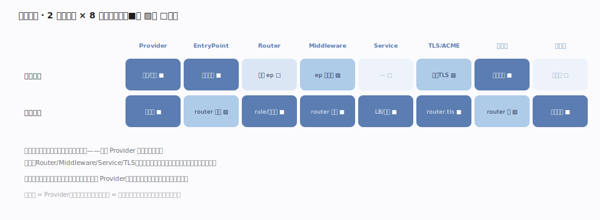

# Traefik 核心原理 · 全景主线框架

> **定位**：统领全部原理文档。Traefik 的 **2 条接触面主线（静态配置 / 动态配置）+ 8 条支撑能力域**，既无遗漏也无越界。核实基准：本地源码 `traefik/v3`（module `github.com/traefik/traefik/v3`，codename cheddar）。Traefik 属**网络服务器 / 反向代理家族**（与 nginx 同家族）——长驻守护、监听端口、事件驱动处理海量连接。但它与 nginx 的**分水岭**是：**配置由 Provider 从 Docker/K8s/文件/KV 动态发现并热加载，无需 reload**。灵魂主线：**Provider 动态配置发现与聚合**。

## 一、双维模型：用「配置态 × 运行平面」给主线归位

Traefik 的主线沿两个正交维度展开：**横轴「配置态」**——静态（`traefik.yml`/CLI/env 声明，启动即固化，改需重启）vs 动态（Provider 运行时产出，热更新）；**纵轴「运行平面」**——控制面（后台 goroutine 发现配置、装配路由）vs 数据面（每个请求前台流经 EntryPoint→Router→Middleware→Service）。灵魂 **Provider** 坐落在「控制面 × 动态」象限，是所有动态配置的产出源；**热加载 watch** 是动态配置生效的唯一通道；数据面四件套（EntryPoint/Router/Middleware/Service）是被这套控制面持续「热替换」的执行体。

## 二、项目总架构：控制面装配 + 数据面转发

一张图看全 Traefik：**上半控制面**——各 Provider 各自 `Provide`（`pkg/provider/provider.go:9`）在独立 goroutine 里把 `dynamic.Message` 推入聚合通道（`pkg/provider/aggregator/aggregator.go:178`），经 `ConfigurationWatcher` 去重、合并（`pkg/server/configurationwatcher.go:94`/`:157`），最终通过 `EntryPoint.Switch` 热替换路由表（`pkg/server/server_entrypoint_tcp.go:163`），全程不重启进程。**下半数据面**——客户端请求进入 `EntryPoint`（监听 :80/:443/:8443，`pkg/server/server_entrypoint_tcp.go:170`），由 `Router` 按 rule 匹配（`pkg/muxer/http/muxer.go:75`），经 `Middleware` 洋葱链加工（`pkg/server/middleware/middlewares.go:65`），最终交给 `Service` 做负载均衡 + 健康检查（`pkg/server/service/loadbalancer/wrr/wrr.go`、`pkg/healthcheck/healthcheck.go`）转发到后端。**TLS/ACME** 与 **可观测性** 横切整条数据面。

## 三、接触面 × 能力域依赖矩阵

矩阵读出两条骨架事实：① **动态配置那一行几乎列列强依赖**——因为 Provider 产出的动态配置正是 Router/Middleware/Service/TLS 的真源，且每次变更都经「热加载」通道生效；② **静态配置只在启动期立骨架**（端口、启用哪些 Provider、全局观测开关），运行期不再改动。灵魂列 = Provider（两行皆强）；灵魂通道 = 热加载（动态配置的唯一生效路径）。

## 四、与 nginx 的心智对照（读前必看）

| 维度 | nginx | Traefik |
|---|---|---|
| 配置来源 | `nginx.conf` **人工静态声明** | Provider 从 **Docker/K8s/文件/Consul/KV 自动发现** |
| 配置变更 | 改文件 → `SIGHUP` **reload**（fork 新 worker） | Provider 推变更 → **热加载 Switch**，**进程不重启、连接不中断** |
| 路由单元 | `server{}` / `location{}` 块 | `EntryPoint → Router(rule) → Middleware → Service` 管线 |
| 匹配方式 | 前缀/正则 location，最长匹配 | `rule` 布尔表达式 `Host && Path`，`priority=len(rule)` 排序 |
| 证书 | 手工配置 `ssl_certificate`（或外部工具续期） | **原生 ACME**：按发现的域名自动签发/续期（Let's Encrypt） |
| 实现 | C · master-worker 多进程 · epoll 事件循环 | Go · 单进程多 goroutine · Go runtime 调度 |
| 扩展 | C 模块（编译期） | 中间件 + Go/Yaegi 插件 + Provider 生态 |

> 一句话：**nginx 是「配置文件驱动、reload 生效」，Traefik 是「服务发现驱动、热加载生效」**。同为反向代理，心智起点不同。

## 五、三条贯穿全库的声明

1. **一切动态行为由 Provider 发现，一切配置变更走热加载通道生效。** 没有人工 reload；Provider 把编排系统/文件/KV 的真实状态翻译成 `dynamic.Configuration`，`ConfigurationWatcher` 去重合并后热替换路由表。
2. **请求处理 = EntryPoint → Router → Middleware → Service 四段管线。** EntryPoint 收连接与终止 TLS，Router 按 rule 定位，Middleware 链加工请求/响应，Service 选后端并做健康检查——这条流水线是理解一切 HTTP/TCP/UDP 行为的骨架。
3. **静态与动态两分：端口与启用项启动固化，路由与中间件运行时热更。** 想加一个端口/启用一个 Provider 要重启；想改一条路由/加一个后端只需 Provider 侧变更、秒级热生效。

## 调优要点

- **`providersThrottleDuration`（默认 2s）** 控制同一 Provider 两次事件的最小间隔，抖动频繁的环境（大集群）适当调大避免过度重建（`pkg/config/static/static_config.go:261`）。
- **`providers.precedence`** 决定多 Provider 同名路由的优先级；用它消解 File 与编排 Provider 的冲突。
- **静态项（EntryPoints、启用的 Provider、日志级别）改动需重启**，规划部署时把这些一次定好，把易变的路由/后端交给动态 Provider。
- **入口默认中间件与默认 TLS** 配在 EntryPoint 上（`entrypoints.<ep>.http.middlewares` / `.tls`），避免每个 Router 重复声明。

## 常见误区

- **以为改配置要 reload/重启**：动态配置（Router/Middleware/Service/TLS）由 Provider 热加载，秒级生效、连接不断；只有静态项才需重启。
- **以为 rule 优先级要手写**：默认 `priority = len(rule)`（规则字符串长度），更"具体"的规则天然优先；只有需要覆盖时才显式设 `priority`。
- **把 EntryPoint 当 Router**：EntryPoint 只是监听端口 + 协议 + TLS 终止；到底走哪条路由由 Router 的 rule 决定，一个 EntryPoint 可承载无数 Router。
- **以为 Traefik 自己管存储/状态**：它是无状态转发层，配置真源在 Provider 背后的编排系统/文件/KV；重启后从 Provider 重新拉齐。

## 一句话总纲

**Traefik = 服务发现驱动的反向代理：Provider 把外部世界的真实状态动态发现进来，经热加载通道装配成「EntryPoint→Router→Middleware→Service」管线，无需 reload 即时生效。**
